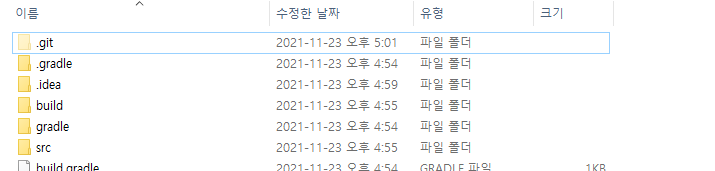

# Repository 생성 및 연결

## Git Repository(원격저장소) 생성
---

[github.com](https://github.com/)에 접속-로그인 후 새로운 리포지토리를 생성한다.

## Terminal에서 로컬 저장소를 생성한다
---

사용중인 OS에서 기본으로 제공하는 Terminal 또는 IDE 내부적으로 제공하는 Terminal을 사용한다.  
개인적으로 IDE 내부에서 제공하는 Terminal을 사용하면 이미 로컬 생성 경로가 설정되어 있기 때문에 **git init** 명령어 하나만 입력하면 되어서 자주 사용한다.  

**github에 올리고자 하는 프로젝트의 로컬 경로**에서 **git init** 커맨드를 입력한다. 그러면 아래 이미지와 같이 프로젝트의 로컬 경로에 **.git** 폴더가 생성된다.

## Repository 연결하기
---

Terminal에 **git remote add origin [Repository 주소]**를 입력한다. origin 이라는 이름으로 원격 저장소 주소를 등록한다는 의미이다. origin 이라는 이름 이외에 본인이 원하는 다른 이름을 사용해도 무방하다.    
Repository 주소는 github.com에서 생성한 리포지토리에서 복사할 수 있다.  

만약 등록한 원격 저장소 이름 origin을 지우고 싶다면 **git remote remove origin** 커맨드를 입력한다. 

## add, commit, push
---

원격 저장소와 연결되었다. 이제 로컬 저장소의 내용을 원격 저장소로 보내는 일만 남았다.  
원격 저장소로 보내기에 앞서 먼저 보낼 파일 및 폴더를 추가하자.  
**git add [폴더명 또는 파일명]** 커맨드를 입력하면 필요한 폴더 또는 파일을 추가할 수 있다. 또는 **git add .** 커맨드를 입력하면 원격 저장소로 올라갈 모든 파일을 일괄 추가한다.  

이후 **git commit -m "커밋 메시지"** 커맨드를 통해 커밋을 수행한다.  

이후 **git push origin master** 커맨드를 통해 원격 저장소로 파일을 보낸다.  origin은 이전에 등록한 원격 저장소의 이름, master는 로컬 저장소의 이름이다.  

# 참고
* [zerocho](https://www.zerocho.com/)