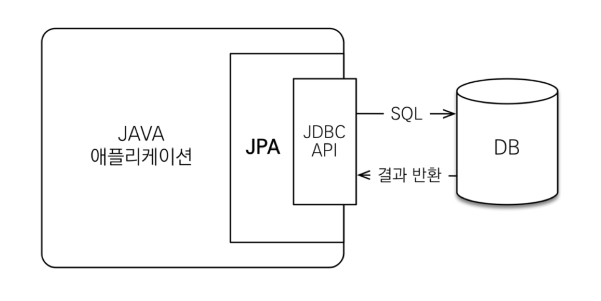

# SQL 중심적인 개발

객체를 관계형 DB에 관리하면 SQL 중심적으로 개발하게 된다.  
이런 환경에서 개발을 하게 되면 SQL 작성에 많은 시간을 할애하게 될 수밖에 없다. 사이트의 탭 하나를 추가해도 기본 CRUD 쿼리문을 작성해야 하는 상황인 것이다. 게다가 요구사항 추가에 따라 DB 컬럼이 하나라도 추가되는 경우에는 관련 기존 쿼리문을 대대적으로 수정해야 한다.  

무엇보다도, 객체 지향적인 개발과 관계형 DB는 서로가 지향하는 목표가 다르다.  
- 객체 지향적인 개발은 객체의 역할과 책임에 따른 효울적 객체 사용에 집중한다.  

- 관계형 DB는 데이터의 정규화를 통한 효율적 데이터 관리를 목표로 한다.

객체를 관계형 DB와 연동해서 사용하려다 보니 SQL 매핑 작업을 해야 되고, 그 과정에서 객체를 SQL 형식에 맞게 변형하고, DB와 연동해서 데이터를 가져올 때는 다시 SQL 결과값을 객체로 변환시키는 과정을 끊임없이 반복한다. 

이 상황에서 객체를 자바 컬렉션에 저장하듯이 DB에 저장할 수 있는 방법을 고민했고, 그 결과가 JPA이다.

# JPA?

JPA는 자바 진영의 객체 관계 매핑(Object-Relational Mapping, ORM) 기술 표준이다.
ORM이란, 그 이름대로 객체와 관계의 중간에서 매핑해주는 프레임워크이다. 객체는 객체지향스럽게 설계하고, 관계형 DB는 그에 맞게 설계를 한다. 그리고 객체와 관계형 DB의 간극을 메우기 위해 ORM 프레임워크가 중간에서 매핑 작업을 한다. 

출처: https://livenow14.tistory.com/70

JPA는 애플리케이션과 JDBC 사이에서 동작한다.  
개발자가 JPA에게 명령을 하면 JPA가 JDBC API를 사용해서 SQL을 호출해서 SQL을 만들고, DB와 상호작용을 한다.

예를 들어 회원가입 기능 시 INSERT 쿼리문을 사용하는데, 이를 위해 먼저 회원 객체를 JPA에게 넘긴다. 그리고 JPA는 회원 객체를 분석해서 적절한 INSERT 쿼리문을 생성한다. 그리고 JDBC API를 사용해서 생성한 INSERT 쿼리문을 DB로 보낸다. MyBatis를 사용하면 개발자가 직접 SQL 쿼리문을 작성해야 했지만, JPA를 사용하면 JPA가 SQL 쿼리문을 만든다.