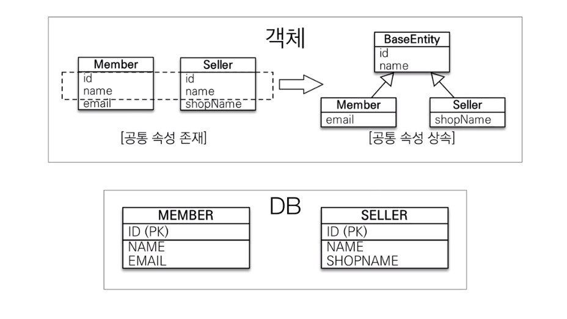

# MappedSuperclass

- 객체의 입장에서 공통 매핑 정보가 필요할 때 사용합니다.

아래 이미지를 통해 설명하겠습니다. DB의 Member, Seller 관계를 객체로 표현하면 엔티티의 id, name 필드가 중복되는 것을 알 수 있습니다.  
객체의 입장에서 만약 이 두 개의 엔티티 이외에 추가되는 엔티티에도 계속 id, name이 공통적으로 사용된다면 같은 업무를 계속 반복하게 됩니다.  

이런 상황을 방지하기 위해 부모 클래스에 속성을 두고 부모 클래스를 상속하는 자식 클래스는 부모 클래스의 속성을 사용하는 방식을 사용하면 좋습니다.  
즉 **공통 매핑 정보를 



@MappedSuperclass 어노테이션은 공통 매핑 정보를 담고 있는 추상 클래스의 클래스 레벨에 선언합니다. 객체 입장에서 공통 매핑을 표현하려면 추상 클래스를 만들고, 이것을 상속받는 방식으로 구한하는 것이 좋기 때문입니다. 

```
@MappedSuperclass
public abstract class BaseEntity {
    private LocalDateTime createDate;
}

@Entity
public class Buyer extends BaseEntity {
    @Id @GeneratedValue
    @Column(name = "MEMBER_ID")
    private Long id;
    private String name;
}

@Entity
public class Seller extends BaseEntity {
    @Id @GeneratedValue
    @Column(name = "SELLER_ID")
    private Long id;
    private String productName;
}
```

결과를 보면 공통 매핑 정보 클래스의 정보가 매핑되어 클래스를 생성하는 것을 확인할 수 있습니다.  
그리고 공통 매핑 정보 클래스는 테이블 매핑 대상이 아니기 때문에 별도의 테이블을 생성하지 않습니다.

```
Hibernate: 
    
    create table Buyer (
       MEMBER_ID bigint not null,
        createDate timestamp,
        name varchar(255),
        primary key (MEMBER_ID)
    )
Hibernate: 
    
    create table Seller (
       SELLER_ID bigint not null,
        createDate timestamp,
        productName varchar(255),
        primary key (SELLER_ID)
    )
```

- @MappedSuperclass는 상속관계 매핑이 아닙니다.

- 엔티티 대상이 아니기 때문에 테이블과 매핑되지 않습니다.(MappedSuperclass 관련 테이블이 생성되지 않는다는 의미)

- 부모 클래스를 상속 받는 자식 클래스에 매핑 정보만 제공합니다.(테이블과 매핑되지 않음)
    - 그래서 부모 클래스를 통한 조회 및 검색이 불가능합니다.

- 테이블을 직접 생성해서 사용할 일이 없기 때문에 추상 클래스를 사용할 것을 권장합니다.

- 계속 언급하지만, 테이블과 관계가 없고, 단순히 엔티티가 공통으로 사용하는 매핑 정보를 모으는 역할입니다.

- 주로 등록일, 수정일, 등록자, 수정자 같은 전체 엔티티에서 공통으로 적용하는 정보를 모을 떄 사용합니다.

- @Entity 클래스는 엔티티나 @MappedSuperclass로 지정한 클래스만 상속 가능합니다.

# 참고 
- https://www.inflearn.com/course/ORM-JPA-Basic/dashboard