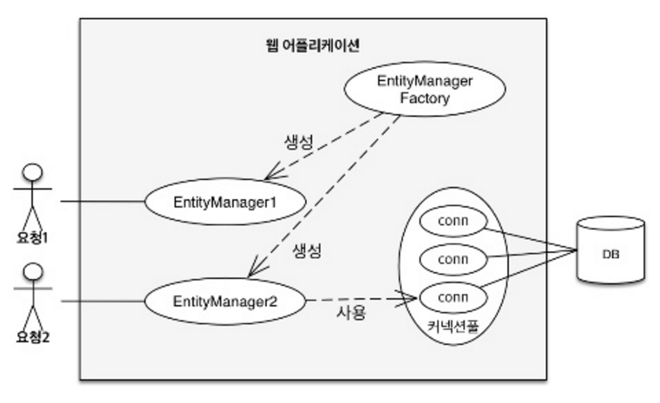
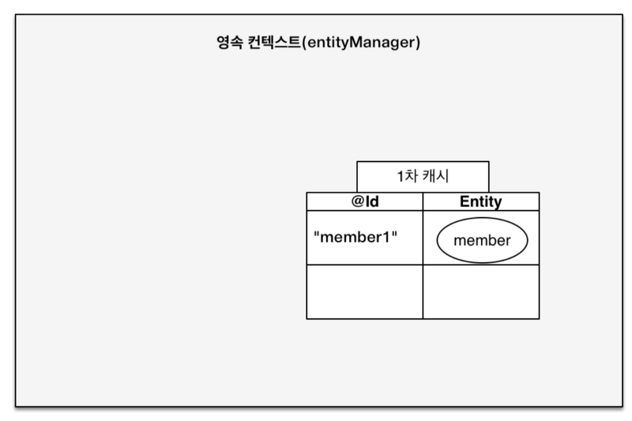
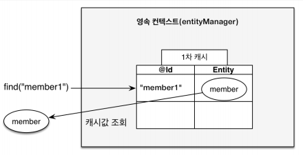
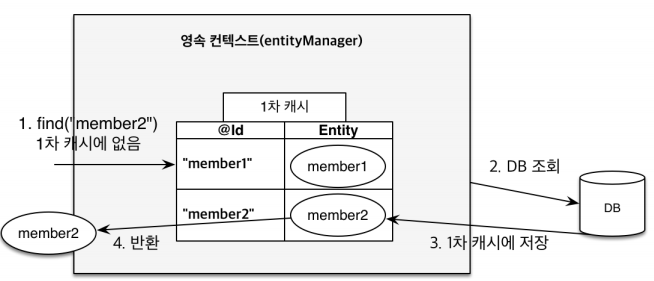
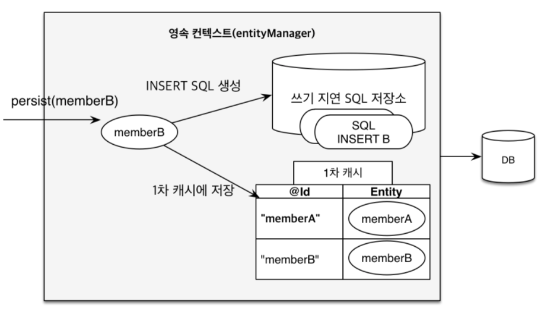
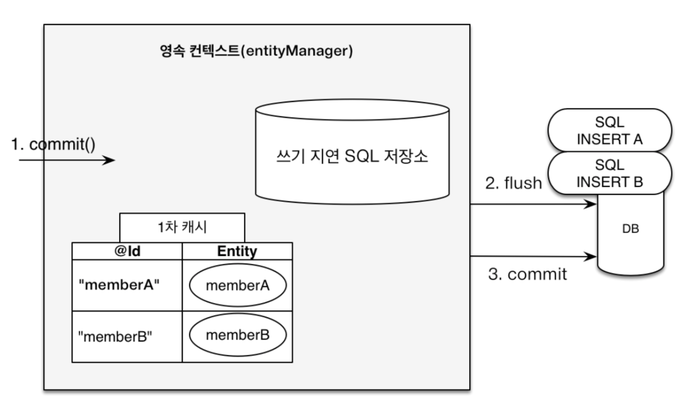
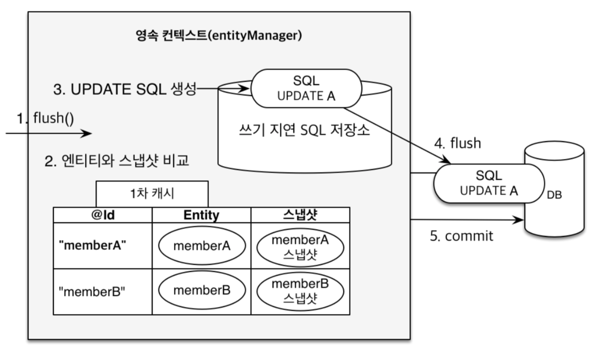

# 영속성 컨텍스트

JPA에서 중요한 두 가지 개념은

- 객체와 관계형 데이터 매핑(Object Relational Mapping)
    - DB와 엔티티를 어떻게 매핑할 것인가에 대한 설계

- 영속성 컨텍스트(Persistence Context)
    - JPA 내부 동작을 제어

### Entity Manager Factory 그리고 Entity Manager



출처: https://ultrakain.gitbooks.io/jpa/content/chapter3/chapter3.1.html

사용자의 요청이 있을 때마다 Entity Manager Factory는 새로운 Entity Manager를 생성하고, Entity Manager는 DB Connection을 사용해서 DB와 통신을 합니다.

Entity Manager는 인터페이스로서 사용자가 영속성 컨텍스트에 접근하여 상호작용 할 수 있도록 하는 역할을 수행합니다. 객체를 생성하고 영속성 컨텍스트에 넣으면 해당 객체는 영속 상태로서 관리됩니다.

### 비영속 상태 그리고 영속 상태

아래 코드를 보겠습니다. 코드는 비영속 그리고 영속 상태의 차이점을 확인하기 위한 것입니다.  

- 비영속 상태의 코드를 보면 Member 객체만 생성하고 Entity Manager에 있는 영속성 컨텍스트를 사용하지 않았습니다. JPA와 상관이 없는 비영속 상태입니다.  

- 영속 상태는 Entity Manager의 영속성 컨텍스트를 사용하는 상태입니다. 코드를 보면 Member객체를 영속성 컨텍스트에 넣어서 영속 상태로 만들어주고 있습니다.

```
// 비영속 상태
Member member = new Member();
member.setId(1L);
member.setName("Kim");

//영속 상태
Member member = new Member();
member.setId(1L);
member.setName("Kim");

EntityManager entityManager = entityManagerFactory.createEntityManager();
entityManager.getTransaction().begin();

// 객체를 저장한 상태(영속)
entityManager.persist(member);
```

### 영속성 컨텍스트의 이점

영속성 컨텍스트는 애플리케이션과 DB 사이의 중간에서 일을 하고 있습니다.  
영속성 컨텍스트가 필요한 이유는 무엇일까요? 왜 애플리케이션과 DB 중간에서 일을 처리해야 할까요?
거기에 대한 이유는 아래와 같은 이점들이 있기 때문입니다.

- 1차 캐시

- 동일성(identity) 보장

- 트랜잭션을 지원하는 쓰기 지연(Transactional write-behind)

- 변경 감지(Dirty Checking)

- 지연 로딩(Lazy Loading)

### 1차 캐시

1차 캐시는 영속성 컨텍스트 내부에 존재하는 캐시 Map입니다. 영속 상태의 엔티티는 모두 이곳에 저장되고, 키는 @Id 어노테이션으로 매핑한 식별자, 값은 엔티티 인스턴스 입니다. 



출처: https://ecsimsw.tistory.com/entry/JPA-%EC%98%81%EC%86%8D%EC%84%B1-%EC%BB%A8%ED%85%8D%EC%8A%A4%ED%8A%B8-1%EC%B0%A8-%EC%BA%90%EC%8B%9C-%EC%93%B0%EA%B8%B0-%EC%A7%80%EC%97%B0

entityManager.find() 메소드를 호출하면 먼저 1차 캐시에서 엔티티를 찾습니다. 

```
Member member = new Member();
member.setId(1L);
member.setName("Kim");

EntityManager entityManager = entityManagerFactory.createEntityManager();
entityManager.getTransaction().begin();

// 1차 캐시에 저장됨
entityManager.persist(member);

// 1차 캐시에서 조회
Member findMember = entityManager.find(Member.class, "member1");
```



출처: https://velog.io/@hyejinjeong9999/%EC%98%81%EC%86%8D%EC%84%B1-%EC%BB%A8%ED%85%8D%EC%8A%A4%ED%8A%B8

만약 찾는 엔티티가 1차 캐시에 없으면 

1. 찾는 내용을 DB에서 조회한 후 
2. DB에 찾는 내용이 있다면 이것을 가져와서 1차 캐시에 저장하고 
3. 영속 상태인 해당 객체를 반환합니다.

이후 다시 해당 엔티티를 조회했을 때는 1차 캐시에 엔티티가 있으므로 1차 캐시에서 해당 엔티티를 반환합니다.

```
// 1차 캐시에서 없는 엔티티 조회
Member findMember2 = entityManager.find(Member.class, "member2");
```



출처: https://velog.io/@hyejinjeong9999/%EC%98%81%EC%86%8D%EC%84%B1-%EC%BB%A8%ED%85%8D%EC%8A%A4%ED%8A%B8

1차 캐시는 하나의 트랜잭션 안에서만 유효합니다. 하나의 트랜잭션이 내부에서 영속성 컨텍스트가 생성되고 제거됩니다. 그러면 영속성 컨텍스트 내부의 1차 캐시도 같이 제거됩니다. 즉 1차 캐시의 활용은 하나의 트랜잭션이 발생하는 짧은 순간에 발생하는 것입니다. 그렇기 때문에 1차 캐시는 여러 사용자의 요청을 처리하는 개념의 캐시라고 생각하면 안됩니다. 여러 사용자 요청을 처리하는 캐시는 2차 캐시라는 것이 존재합니다.

### 동일성(identity) 보장

JPA는 영속 엔티티의 동일성을 보장합니다.  
1차 캐시로 반복 가능한 읽기 등급(REPEATABLE READ)의 트랜잭션 격리 수준을 DB가 아닌 애플리케이션 차원에서 제공합니다.

```
Member findMember1 = entityManager.find(Member.class, "member1");
Member findMember2 = entityManager.find(Member.class, "member1");

System.out.println(findMember1 == findMember2); // true
```

### 트랜잭션을 지원하는 쓰기 지연(Transactional write-behind)

Entity Manager는 트랜잭션 commit 이전까지 DB에 엔티티를 저장하지 않고 영속성 컨텍스트 내부의 SQL 저장소에 생성 쿼리를 저장합니다.  
이후 commit을 하면 저장소에 저장된 쿼리를 DB로 보냅니다. 이것을 트랜잭션을 지원하는 쓰기 지연이라고 합니다.  

```
// 이 단계에서는 객체를 영속성 컨텍스트에 저장하고 SQL 저장소에 쿼리를 저장한다.
entityManager.persist(member);

// 이 단계에서 SQL 저장소의 쿼리를 DB로 보낸다.
tx.commit();
```



출처: https://velog.io/@hyejinjeong9999/%EC%98%81%EC%86%8D%EC%84%B1-%EC%BB%A8%ED%85%8D%EC%8A%A4%ED%8A%B8

쓰기 지연에 대해서 보다 자세하게 설명하면 다음과 같습니다.  
트랜잭션을 commit 하면 Entity Manager는 영속성 컨텍스트의 등록, 수정, 삭제 등의 **영속성 컨텍스트의 변경 내용을 DB에 반영**하는 작업인 flush()를 수행합니다. 



출처: https://velog.io/@hyejinjeong9999/%EC%98%81%EC%86%8D%EC%84%B1-%EC%BB%A8%ED%85%8D%EC%8A%A4%ED%8A%B8

쓰기 지연을 통한 이점은, 요청을 모았다가 한 번에 처리할 수 있다는 것입니다. 

persistence.xml 설정 파일에 아래 설정 내용을 추가하면 value에 지정된 볼륨이 쌓였을 때 JPA는 요청을 한 번에 처리합니다.

```
<property name="hibernate.jdbc.batch_size" value="10"/>
```

### 변경 감지

JPA는 자동으로 엔티티 변경을 감지합니다.

아래 코드는 엔티티를 조회하고 변경하는 코드입니다. 코드를 실행하고 로그를 확인하면 select 쿼리 이후 엔티티 수정에 따른 update 쿼리문이 출력되는 것을 확인할 수 있습니다.  
쿼리문을 통해 객체 수정을 명령하지 않았는데, 단지 객체 수정 작업만 했을 뿐인데 JPA는 이를 감지해서 쿼리까지 던집니다.

```
Member member = entityManager.find(Member.class, 1L);
// 변경
member.setName("Kim");
```

JPA는 변경 감지(Dirty Checking)를 통해 엔티티 변경을 감지합니다.  

JPA는 DB commit 시점에서 내부적으로 flush()를 호출합니다. flush()에 대한 설명은 앞서 말씀드렸습니다.  
flush()를 호출하면 엔티티와 스냅샷을 비교합니다. 스냅샷은 값을 저장했을 최초 시점의 객체 상태를 기억하고 있는 이미지라고 생각하면 됩니다. 만약 엔티티 변경이 발생하면 JPA는 엔티티와 스냅샷을 하나씩 비교하면서 변경을 감지합니다. 만약 변경이 감지되면 쓰기 지연 SQL 저장소에 변경 감지에 따른 쿼리문을 생성해서 저장해 두었다가 DB에 반영합니다. 

이 과정을 통해 **JPA는 객체의 값이 변경되면 트랜잭션 커밋 시점에 이를 파악하고 DB에 반영**합니다.



출처: https://velog.io/@hyejinjeong9999/%EC%98%81%EC%86%8D%EC%84%B1-%EC%BB%A8%ED%85%8D%EC%8A%A4%ED%8A%B8

### 지연 로딩(Lazy Loading)

work in progress