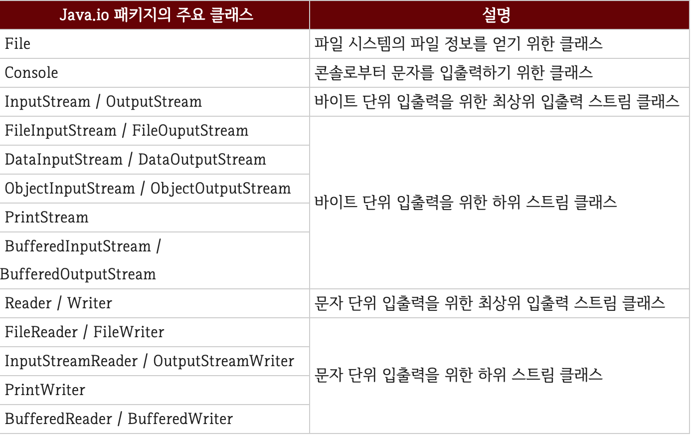

# IO 기반 입출력 및 네트워킹

자바에서 데이터는 스트림(Stream)을 통해 입출력된다. 스트림은 단일 방향으로 연속적으로 흘러가는 것을 말하는데, 물이 높은 곳에서 낮은 곳으로 흐르듯이 데이터는 출발지에서 나와 도착지로 들어간다는 개념이다.

## 입력 스트림과 출력 스트림

프로그램이 출발지 또는 도착지냐에 따라서 스트림의 종류가 결정된다. 프로그램이 데이터를 입력받을 때에는 입력 스트림(InputStream) 이라고 부른다. 입력 스트림의 출발지는 키보드, 파일, 니트워크상의 프로그램이 될 수 있고, 출력 스트림의 도착지는 모니터, 파일, 네트워크상의 프로그램이 될 수 있다.

**프로그램을 기준으로 데이터가 들어오면 입력 스트림, 데이터가 나가면 출력 스트림이다.**
프로그램이 네트워크상의 다른 프로그램과 데이터 교환을 하기 위해서는 양쪽 모두 입력 스트림과 출력 스트림이 따로 필요하다. 스트림의 틀성이 단방향이므로 하나의 스트림으로 입력과 출력을 모두 할 수 없기 때문이다.

자바의 기본 데이터 입출력(IO) API는 [java.io 패키지](https://docs.oracle.com/en/java/javase/13/docs/api/java.base/java/io/package-summary.html)에서 제공한다.

다음은 주요 입출력 스트림 클래스이다.

출력 : https://velog.io/@ljs0429777/Java-IO

스트림 클래스는 크게 **바이트(byte) 기반 스트림, 문자(character) 기반 스트림** 두 종류로 구분된다.
바이트 기반 스트림은 그림, 멀티미디어, 문자 등 모든 종류의 데이터를 받고 보낼 수 있고, 문자 기반 스트림은 오로지 문자만 받고 보내는 작업에 특화되어 있다.
바이트 기반 스트림, 문자 기반 스트림은 최상위 클래스에 따라서 사용 클래스가 다르다.

InputStream은 바이트 기반 입력 스트림의 최상위 클래스이다. OutputStream은 바이트 기반 출력 스트림의 최상위 클래스이다. 이 클래스들을 각각 상속받는 하위 클래스는 접미사로 InputStream 또는 OutputStream이 붙는다. 

Reader는 문자 기반 입력 스트림의 최상위 클래스이고, Writer는 문자 기반 출력 스트림의 최상위 클래스이다. 이 클래스들을 각각 상속받는 하위 클래스는 접미사로 Reader 또는 Writer가 붙는다. 예를 들어 그림, 멀티미디어, 텍스트 등의 파일을 바이트 단위로 읽어들일 때에는 FileInputStream을 사용하고, 바이트 단위로 저장할 때에는 FileOutputStream을 사용한다. 텍스트 파일의 경우 문자 단위로 읽어들일 때에는 FileReader를 사용, 문자 단위로 저장할 때에는 FileWriter를 사용한다.

## InputStream

[InputStream](https://docs.oracle.com/en/java/javase/13/docs/api/java.base/java/io/InputStream.html)은 바이트 기반 입력 스트림의 최상위 클래스로 추상 클래스이다. 모든 바이트 기반 입력 스트림은 이 클래스를 상속받아서 만들어진다.

# 출처
* [이것이 자바다](http://www.kyobobook.co.kr/product/detailViewKor.laf?ejkGb=KOR&mallGb=KOR&barcode=9788968481475&orderClick=LAG&Kc=)