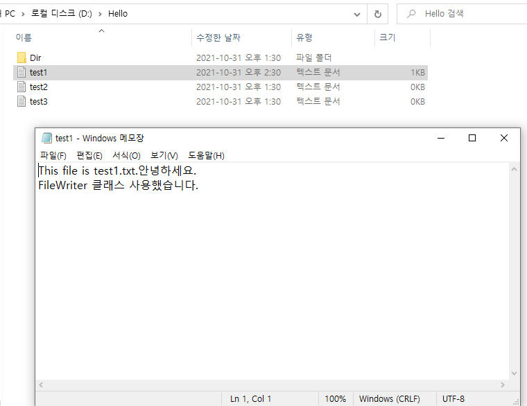
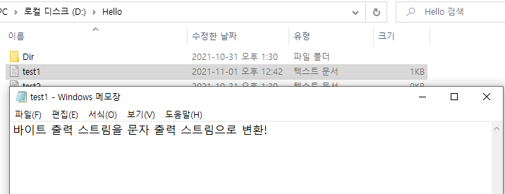
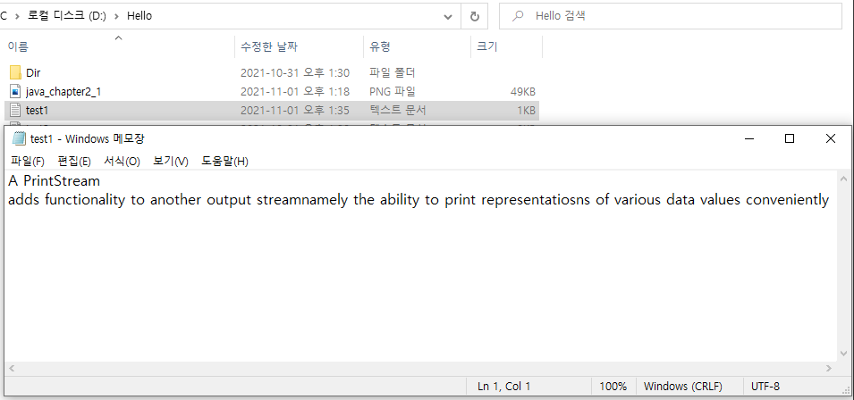

# IO 기반 입출력 및 네트워킹_1

자바에서 데이터는 스트림(Stream)을 통해 입출력된다. 스트림은 단일 방향으로 연속적으로 흘러가는 것을 말하는데, 물이 높은 곳에서 낮은 곳으로 흐르듯이 데이터는 출발지에서 나와 도착지로 들어간다는 개념이다.

## 입력 스트림과 출력 스트림

프로그램이 출발지 또는 도착지냐에 따라서 스트림의 종류가 결정된다. 프로그램이 데이터를 입력받을 때에는 입력 스트림(InputStream) 이라고 부른다. 입력 스트림의 출발지는 키보드, 파일, 니트워크상의 프로그램이 될 수 있고, 출력 스트림의 도착지는 모니터, 파일, 네트워크상의 프로그램이 될 수 있다.

**프로그램을 기준으로 데이터가 들어오면 입력 스트림, 데이터가 나가면 출력 스트림이다.**
프로그램이 네트워크상의 다른 프로그램과 데이터 교환을 하기 위해서는 양쪽 모두 입력 스트림과 출력 스트림이 따로 필요하다. 스트림의 틀성이 단방향이므로 하나의 스트림으로 입력과 출력을 모두 할 수 없기 때문이다.

자바의 기본 데이터 입출력(IO) API는 [java.io 패키지](https://docs.oracle.com/en/java/javase/13/docs/api/java.base/java/io/package-summary.html)에서 제공한다.

다음은 주요 입출력 스트림 클래스이다.

출력 : https://velog.io/@ljs0429777/Java-IO

스트림 클래스는 크게 **바이트(byte) 기반 스트림, 문자(character) 기반 스트림** 두 종류로 구분된다.
바이트 기반 스트림은 그림, 멀티미디어, 문자 등 모든 종류의 데이터를 받고 보낼 수 있고, 문자 기반 스트림은 오로지 문자만 받고 보내는 작업에 특화되어 있다.
바이트 기반 스트림, 문자 기반 스트림은 최상위 클래스에 따라서 사용 클래스가 다르다.

InputStream은 바이트 기반 입력 스트림의 최상위 클래스이다. OutputStream은 바이트 기반 출력 스트림의 최상위 클래스이다. 이 클래스들을 각각 상속받는 하위 클래스는 접미사로 InputStream 또는 OutputStream이 붙는다. 

Reader는 문자 기반 입력 스트림의 최상위 클래스이고, Writer는 문자 기반 출력 스트림의 최상위 클래스이다. 이 클래스들을 각각 상속받는 하위 클래스는 접미사로 Reader 또는 Writer가 붙는다. 예를 들어 그림, 멀티미디어, 텍스트 등의 파일을 바이트 단위로 읽어들일 때에는 FileInputStream을 사용하고, 바이트 단위로 저장할 때에는 FileOutputStream을 사용한다. 텍스트 파일의 경우 문자 단위로 읽어들일 때에는 FileReader를 사용, 문자 단위로 저장할 때에는 FileWriter를 사용한다.

## InputStream

[InputStream](https://docs.oracle.com/en/java/javase/13/docs/api/java.base/java/io/InputStream.html)은 바이트 기반 입력 스트림의 최상위 클래스로 추상 클래스이다. 모든 바이트 기반 **입력** 스트림은 이 클래스를 상속받아서 만들어진다.

InputStream 클래스의 주요 메소드를 알아보자.

### read() 메소드

read() 메소드는 입력 스트림으로부터 1바이트를 읽고 4바이트 int 타입으로 리턴한다. 따라서 리턴된 4바이트 중 끝의 1바이트에만 데이터가 들어 있다. 예를 들어 입력 스트림에서 5개의 바이트가 들어온다면 read() 메소드로 1바이트씩 5번 읽을 수 있다.

더 이상 입력 스트림으로부터 바이트를 읽을 수 없다면 read() 메소드는 -1을 리턴한다. 이것을 이용하면 읽을 수 있는 마지막 바이트까지 루프를 돌며 한 바이트씩 읽을 수 있다.

<pre>
<code>
InputStream is = new FileInputStream("D:/inputdata.txt");
int readByte;
while((readByte=is.read()) != -1) { ... }
</code>
</pre>

### read(byte[] b) 메소드

read(byte[] b) 메소드는 입력 스트림으로부터 매개값으로 주어진 바이트 배열의 길이만큼 바이트를 읽고 배열에 저장한다. 실제로 읽은 바이트 수가 배열의 길이보다 작을 경우 읽은 수만큼 리턴한다. 

입력 스트림으로부터 더 이상 읽을 수 없다면 -1을 리턴한다. 이것을 이용하면 읽을 수 있는 마지막 바이트까지 루프를 돌며 읽을 수 있다.

<pre>
<code>
InputStream is = new FileInputStream("D:/inputdata.txt");
int readByteNo;
byte[] readBytes = new byte[100];
while((readByteNo=is.read(readBytes)) != -1) { ... }
</code>
</pre>

### read(byte[] b, int off, int len)

read(byte[] b, int off, int len) 메소드는 입력 스트림으로부터 len개의 바이트만큼 읽고, 매개값으로 주어진 바이트 배열 b[off]부터 len개까지 저장한다. 그리고 읽은 바이트 수인 len개를 리턴한다. 실제로 읽은 바이트 수가 len개보다 작을 경우 읽은 수만큼 리턴한다. 

입력 스트림으로부터 더 이상 읽을 수 없다면 -1을 리턴한다. read(byte[] b)와의 차이점은 한 번에 읽어들이는 바이트 수를 len 매개값으로 조절할 수 있고, 배열에서 저장이 시작되는 인덱스를 지정할 수 있다는 것이다.

### close() 메소드

InputStream을 더 이상 사용하지 않을 경우 close() 메소드를 호출하여 InputStream에서 사용했던 시스템 자원을 풀어준다.

## OutputStream

[OutputStream](https://docs.oracle.com/javase/7/docs/api/java/io/OutputStream.html)은 바이트 기반 출력 스트림의 최상위 클래스로 추상 클래스이다. 모든 바이트 기반 **출력** 스트림은 이 클래스를 상속받아서 만들어진다.

OutputStream 클래스의 주요 메소드를 알아보자.

### write(int b)

매개 변수로 주어진 int 값에서 끝에 있는 1바이트만 출력 스트림으로 보낸다. 매개 변수가 int 타입이므로 4바이트 모두를 보내는 것으로 오해할 수 있으니 주의하자.

<pre>
<code>
OutputStream os = new FileOutputStream("D:/outputdata.txt");
byte[] data = "ABC".getBytes();
for(int i = 0; i < data.length; i++){
    os.write(data[i]); // "A", "B", "C" 를 하나씩 출력
}
</code>
</pre>

### write(byte[] b)

write(byte[] b)는 매개값으로 주어진 바이트 배열의 모든 바이트를 출력 스트림으로 만든다.

<pre>
<code>
OutputStream os = new FileOutputStream("D:/outputdata.txt");
byte[] data = "ABC".getBytes();
os.write(data[i]); // "ABC" 모두 출력
</code>
</pre>

### write(byte[] b, int off, int len)

write(byte[] b, int off, int len)은 b[off]부터 len개의 바이트를 출력 스트림으로 보낸다.

<pre>
<code>
OutputStream os = new FileOutputStream("D:/outputdata.txt");
byte[] data = "ABC".getBytes();
os.write(data, 1, 2); // "BC" 만 출력
</code>
</pre>

### flush와 close() 메소드

출력 스트림은 내부에 작은 버퍼(buffer)가 있다. 데이터가 출력되기 전에 버퍼에 쌓여있다가 순서대로 출력된다.

- flush() : 버퍼에 잔류하고 있는 데이터를 모두 출력시키고 버퍼를 비우는 역할을 한다. 프로그램에서 더 이상 출력할 데이터가 없다면 flush() 메소드를 마지막으로 호출하여 버퍼에 잔류하는 모든 데이터가 출력되도록 해야 한다.
- close() : OutputStream을 더 이상 사용하지 않을 경우 close() 메소드로 OutputStream에서 사용했던 시스템 자원을 풀어준다.

<pre>
<code>
OutputStream os = new FileOutputStream("D:/outputdata.txt");
byte[] data = "ABC".getBytes();
os.write(data);
os.flush();
os.close();
</code>
</pre>

## Reader

[Reader](https://docs.oracle.com/javase/7/docs/api/java/io/Reader.html)는 문자 기반 입력 스트림의 최상위 클래스로 추상 클래스이다. 모든 문자 기반 **입력** 스트림은 이 클래스를 상속받아서 만들어진다. 

### read() 메소드

입력 스트림으로부터 한 개의 문자(2바이트)를 읽고 4바이트 int 타입으로 리턴한다. 따라서 리터된 4바이트 중 끝에 있는 2바이트에 문자 데이터가 들어 있다. 

read() 메소드가 리턴한 int 값을 char 타입으로 변환하면 읽은 문자를 얻을 수 있다.

> char charData = (char) read();

더 이상 입력 스트림으로부터 문자를 읽을 수 없다면 read() 메소드는 -1을 리턴한다. 이것을 이용하면 읽을 수 있는 마지막 문자까지 루프를 돌며 한 문자씩 읽을 수 있다.

<pre>
<code>
Reader reader = new FileReader("D:/data.txt");
int readData;
while((readData = reader.read()) != -1){
    char charData = (char) readData;
}
</code>
</pre>

### read(char[] cbuf)

read(char[] cbuf) 메소드는 입력 스트림으로부터 매개값으로 주어진 문자 배열의 길이만큼 문자를 읽고 배열에 저장한다. 그리고 읽은 문자 수를 리턴한다. 실제 읽은 문자 수가 배열의 길이보다 작을 경우 읽은 수만큼만 리턴한다. 

더 이상 입력 스트림으로부터 문자를 읽을 수 없다면 -1을 리턴한다. 이것을 이용하면 읽을 수 있는 마지막 문자까지 루프를 돌며 문자를 읽을 수 있다.

<pre>
<code>
Reader reader = new FileReader("D:/data.txt");
int readData;
char[] cbuf = new char[2];
while((readData = reader.read()) != -1) { ... }
</code>
</pre>

입력 스트림으로부터 100개의 문자가 들어온다면 read() 메소드는 100번을 루핑해야 읽어야 한다. 하지만 read(char[] cbuf) 메소드는 한 번 읽을 때 주어진 배열 길이만큼 읽기 때문에 루핑 횟수가 현저히 줄어든다. 그러므로 많은 양의 문자를 읽을 때는 read(char[] cbuf) 메소드를 사용하는 것이 좋다.

### read(char[] cbuf, int off, int len)

read(char[] cbuf, int off, int len) 메소드는 입력 스트림으로부터 len 개의 문자만큼 읽고 매개값으로 주어진 문자 배열 cbuf[off]부터 len개까지 저장한다. 그리고 읽은 문자 수인 len개를 리턴한다. 실제로 읽은 문자 수가 len개보다 작을 경우 읽은 수만큼 리턴한다. 

더 이상 입력 스트림으로부터 문자를 읽을 수 없다면 -1을 리턴한다. read(char[] cbuf)와의 차이점은 한 번에 읽어들이는 문자 수를 len 매개값으로 조절할 수 있고, 배열에서 저장이 시작되는 인덱스를 지정할 수 있다는 것이다. 만약 off를 0, len을 배열의 길이로 준다면 read(char[] cbuf)와 동일하다.

### close()

Reader를 더 이상 사용하지 않을 경우 close() 메소드를 호출해서 Reader에서 사용했던 시스템 자원을 풀어준다.

## Writer

[Writer](https://docs.oracle.com/javase/7/docs/api/java/io/Writer.html)는 문자 기반 출력 스트림의 최상위 클래스로 추상 클래스이다. 모든 문자 기반 출력 스트림 클래스는 이 클래스를 상속받아서 만들어진다.

### write(int c)

매개 변수로 주어진 int 값에서 끝에 있는 2바이트(한 개의 문자)만 출력 스트림으로 보낸다. 매개 변수가 int 타입이므로 4바이트 모두를 보내는 것으로 오해할 수 있다.

<pre>
<code>
Writer writer = new FileWriter("D:/test.txt");
char[] data = "그렉".toCharArray();
for(int i = 0; i < data.length; i++){
    writer.write(data[i]); // "그", "렉"을 하나씩 출력
}
</code>
</pre>

### write(char[] cbuf)

매개값으로 주어진 char[] 배열의 모든 문자를 출력 스트림으로 보낸다.

<pre>
<code>
Writer writer = new FileWriter("D:/test.txt");
char[] data = "그렉".toCharArray();
writer.write(data); // "그렉" 모두 출력
</code>
</pre>

### write(String str, int off, int len)

c[off]부터 len개의 문자를 출력스트림으로 보낸다.

<pre>
<code>
Writer writer = new FileWriter("D:/test.txt");
char[] data = "일개미".toCharArray();
writer.write(data, 1, 2); // "개미" 만 출력
</code>
</pre>

### write(String str)와 write(String str, int off, int len)메소드

Writer는 문자열을 좀 더 쉽게 보내기 위해 write(String str)와 write(String str, int off, int len) 메소드를 제공한다. write(String str)은 문자열 전체를 출력 스트림으로 보내고, write(String str, int off, int len)은 주어진 문자열 off 순번부터 len개까지의 문자를 보낸다.

문자 출력 스트림은 내부에 작은 버퍼(buffer)가 있어서 데이터가 출력되기 전에 버퍼가 쌓여있다가 순서대로 출력된다. flush() 메소드는 버퍼에 잔류한 데이터를 모두 출력하고 버퍼를 비운다. 프로그램에 더 이상 출력할 문자가 없다면 flush() 메소드를 마지막으로 호출하여 모든 문자가 출력되도록 해야 한다. 마지막으로 Writer를 더 이상 사용하지 않을 경우 close() 메소드로 Writer에서 사용했던 시스템 자원을 풀어준다.

<pre>
<code>
Writer writer = new FileWriter("D:/test.txt");
String data = "피카츄";
writer.write(data);
writer.flush();
writer.close();
</code>
</pre>

## 콘솔 입출력

콘솔(Console)은 키보드 입력 내용을 화면에 출력하는 소프트웨어를 말한다. 유닉스나 리눅스는 터미널(terminal), Windows 운영체제는 명령 프롬프트에 해당한다. 
**자바는 콘솔로부터 데이터를 입력받을 때 System.in을 사용하고, 콘솔에 데이터를 출력할 때 System.out을 사용한다. 에러를 출력할 때에는 System.err을 사용한다.**

### System.in

자바는 프로그램이 콘솔로부터 데이터를 입력받을 수 있도록 [System 클래스](https://docs.oracle.com/javase/7/docs/api/java/lang/System.html)의 in 정적 필드를 제공하고 있다. System.in은 InputStream 타입의 필드이므로 InputStream 변수로 참조가 가능하다.

<pre>
<code>
InputStream is = System.in
</code>
</pre>

키보드로부터 어떤 키가 입력되었는지 확인하려면 InputStream의 read() 메소드로 한 바이트를 읽으면 된다. 리턴된 int 값에는 십진수 아스키 코드(Ascii Code)가 들어 있다.

<pre>
<code>
int asciiCode = is.read();
</code>
</pre>

숫자로된 아스키 코드 대신에 키보드에서 입력한 문자를 직접 얻고 싶다면 read() 메소드로 읽은 아스키 코드를 char로 타입 변환하면 된다.

<pre>
<code>
char inputChar = (char) is.read();
</code>
</pre>

아래 코드는 ATM 기기와 비슷하게 사용자에게 메뉴를 제공하고 어떤 번호를 입력했는지 알아내는 코드이다.

<pre>
<code>
import java.io.InputStream;

public class Main {
    public static void main(String[] args) throws Exception {
        System.out.println("== Menu ==");
        System.out.println("1. 조회");
        System.out.println("2. 출금");
        System.out.println("3. 입금");
        System.out.println("4. 종료");
        System.out.println("메뉴 선택: ");

        InputStream is = System.in;

        char inputChar = (char) is.read();

        switch(inputChar){
            case '1':
                System.out.println("조회");
                break;
            case '2':
                System.out.println("출금");
                break;
            case '3':
                System.out.println("입금");
                break;
            case '4':
                System.out.println("종료");
                break;
        }
    }
}
</code>
</pre>

InputStream의 read() 메소드는 1바이트만 읽기 때문에 1바이트의 아스키 코드로 표현되는 숫자, 영어, 특수문자는 읽을 수 있다. 하지만 한글과 같이 2바이트를 필요로 하는 유니코드는 read() 메소드로 읽을 수 없다. 

한글을 얻으려면 read(byte[] b)나 read(byte[] b, int off, int len) 메소드로 전체 입력된 내용을 바이트 배열로 받고, 이 배열을 이용해서 String 객체를 생성한다. read(byte[] b) 메소드 사용 전 우선 키보드에서 입력한 문자를 저장할 바이트 배열을 만들어야 한다. 배열의 길이는 읽어야 할 바이트 수를 고려해서 적절히 주면 된다. 영어 한 문자는 1바이트, 한글 한 문자는 2바이트를 차지하므로 최대 영문자 15자 또는 한글 7자를 저장하려면 다음과 같이 바이트 배열을 선언하면 된다.

<pre>
<code>
byte[] byteData = new byte[15];
</code>
</pre>

다음과 같이 생성된 배열을 read(byte[] b) 메소드의 매개값으로 주면 키보드에서 입력한 문자를 저장할 수 있게 된다.

<pre>
<code>
byte[] byteData = new byte[15];
int readByteNo = System.in.read(byteData);
</code>
</pre>

프로그램에서 바이트 배열에 저장된 아스키 코드를 사용하려면 문자열로 변환해야 한다. 변환할 문자열은 바이트 배열의 0번 인덱스에서 시작해서 읽은 바이트 수 -2만큼이다. 2를 빼는 이유는 **Enter키에 해당하는 마지막 두 바이트(캐리지 리턴(13) + 라인피드(10))를 제외하기 위해서이다.** 바이트 배열을 문자열로 변환할 때에는 String 클래스의 생성자를 이용한다.

<pre>
<code>
String strData = new String(byteData, 0, readByteNo-2);
</code>
</pre>

아래 코드는 이름과 전달하고자 하는 메시지를 입력받아 출력하는 코드이다. 

<pre>
<code>
import java.io.InputStream;

public class Main {
    public static void main(String[] args) throws Exception{
        InputStream is = System.in;

        byte[] datas = new byte[100];

        System.out.print("Name: ");
        int nameBytes = is.read(datas);
        String name = new String(datas, 0, nameBytes-2);

        System.out.print("Message: ");
        int messageBytes = is.read(datas);
        String message = new String(datas, 0, messageBytes-2);

        System.out.println("Name: " + name);
        System.out.println("Message: " + message);
    }
}

결과)
Name: Kim
Message: Hello
Name: Kim
Message: Hello
</code>
</pre>

### System.out

콘솔로 데이터를 출력하려면 System 클래스의 out 정적 필드를 사용한다. out은 PrintStream 타입의 필드이다. PrintStream은 OutputStream의 하위 클래스이므로 out 필드를 OutputStream 타입으로 변환해서 사용할 수 있다.

<pre>
<code>
OutputStream os = System.out;
</code>
</pre>

콘솔로 1개의 바이트를 출력하려면 OutputStream의 write(int b) 메소드를 이용한다. 바이트 값은 아스키 코드인데, write() 메소드는 아스키 코드를 문자로 콘솔에 출력한다. 예를 들어 아스키 코드 65번을 write(int b) 메소드로 출력하면 'A'가 출력된다.

<pre>
<code>
byte b = 65;
os.write(b);
os.flush();
</code>
</pre>

write(int b) 메소드는 1바이트만 보낼 수 있기 때문에 2바이트로 표현되는 한글은 출력할 수 없다. 
한글을 출력하려면 우선 한글을 바이트 배열로 얻은 다음, write(byte[] b, int off, int len) 메소드로 콘솔에 출력하면 된다.

<pre>
<code>
String name = "홍길동";
byte[] nameBytes = name.getBytes();
os.write(nameBytes);
os.flush();
</code>
</pre>

아래 코드는 write(int b) 메소드로 연속된 숫자, 영어를 출력하고 write(byte[] b)메소드로 한글을 출력하는 코드이다.

<pre>
<code>
import java.io.OutputStream;

public class Main {
    public static void main(String[] args) throws Exception {
        OutputStream os = System.out;

        for(byte b=48; b < 58; b++){
            os.write(b); // 아스키 코드 48~57까지의 문자
        }
        os.write(10); // 다음 행으로 넘어가는 라인피드(10) 출력

        for(byte b=97; b < 123; b++){
            os.write(b); // 아스키 코드 97~122까지의 문자
        }
        os.write(10);

        String hanguel = "감사합니다. 사랑합니다.";
        byte[] hanguelBytes = hanguel.getBytes();
        os.write(hanguelBytes);

        os.flush();

    }
}

결과)
0123456789
abcdefghijklmnopqrstuvwxyz
감사합니다. 사랑합니다.
</code>
</pre>

### Console 클래스

Console 클래스는 콘솔에서 입력받은 문자열을 쉽게 읽을 수 있도록 한다.
Console 객체를 얻으려면 System의 정적 메소드인 console()을 다음과 같이 호출하면 된다.

<pre>
<code>
Console console = System.console();
</code>
</pre>

이클립스에서 실행하면 System.console() 메소드는 null을 리턴한다. 따라서 반드시 명령 프롬프트에서 실행해야 한다.

다음은 콘솔로부터 아이디와 패스워드를 입력받아 출력하는 예시이다.

<pre>
<code>
import java.io.Console;

public class Main {
    public static void main(String[] args) {
        Console console = System.console();

        System.out.print("ID: ");
        String id = console.readLine(); // Enter키를 입력하기 전의 모든 문자열을 읽음

        System.out.print("Password: ");
        char[] charPass = console.readPassword(); // 키보드 입력 문자를 콘솔에 보여주지 않고 문자열을 읽음
        String strPassword = new String(charPass);

        System.out.println(id);
        System.out.println(strPassword);
    }
}
</code>
</pre>

### Scanner 클래스

Console 클래스는 콘솔로부터 문자열을 읽을 수 있지만 기본 타입(정수, 실수) 값을 바로 읽을 수는 없다. 이때 java.util 패키지의 [Scanner 클래스](https://docs.oracle.com/javase/8/docs/api/java/util/Scanner.html)를 이용하면 콘솔로부터 기본 타입의 값을 바로 읽을 수 있다. 

Scanner 객체를 생성하려면 생성자에 System.in 매개값을 주면 된다.

<pre>
<code>
Scanner scanner = new Scanner(System.in);
</code>
</pre>

Scanner가 콘솔에서만 사용되지 것은 아니다. 생성자 매개값에는 File, InputStream, Path 등과 같이 다양한 입력 소스를 지정할 수도 있다. 

아래 코드는 콘솔로부터 문자열, 정수, 실수를 직접 읽고 다시 콘솔로 출력한다.

<pre>
<code>
import java.util.Scanner;

public class Main {
    public static void main(String[] args) {
        Scanner scanner = new Scanner(System.in);

        System.out.print("문자열 입력: ");
        String inputString = scanner.nextLine();
        System.out.println(inputString);

        System.out.print("정수 입력: ");
        int inputInt = scanner.nextInt();
        System.out.println(inputInt);

        System.out.print("실수 입력: ");
        double inputDouble = scanner.nextDouble();
        System.out.println(inputDouble);
    }
}
</code>
</pre>

## 파일 입출력

### File 클래스

[FIle 클래스](https://docs.oracle.com/javase/7/docs/api/java/io/File.html)는 IO 패키지에서 제공하며 파일 크게, 파일 속성, 파일 이름 등의 정보를 얻어내는 기능과 파일 생성 및 삭제 기능을 제공하고 있다. 그리고 디렉토리를 생성하고 디렉토리에 존재하는 파일 리스트를 얻어내는 기능도 있다. 하지만 파일의 데이터를 읽고 쓰는 기능은 지원하지 않는다. 파일의 입출력은 스트림을 사용해야 한다.

아래 코드는 'D:/Hello' 디렉토리의 'test.txt' 파일을 File 객체로 생성하는 코드이다.

<pre>
<code>
File file = new File("D:\\Hello\\test.txt");
File file = new File("D:/Hello/test.txt");
</code>
</pre>

디렉토리 구분자는 운영체제마다 조금씩 다르다. Windows에서는 /,\ 둘 다 사용 가능하고, 유닉스에서는 /를 사용한다. File.separator 상수를 출력하면 운영체제에서 사용하는 디렉토리 구분자를 확인할 수 있다. 만약 \를 디렉토리 구분자로 사용한다면 이스케이프 문자(\\)로 기술해야 한다.

생성자 매개값으로 주어진 경로가 유효하지 않더라도 컴파일 에러나 예외가 발생하지 않는다. 따라서 File 객체를 생성했다고 해서 파일이나 디렉토리가 생성되는 것은 아니다. File 객체를 통해 해당 경로에 실제로 파일이나 디렉퇴가 있는지 확인하려면 exists() 메소드를 호출해서 true, false 여부를 확인한다.

<pre>
<code>
boolean isExist = file.exists();
</code>
</pre>

아래 코드는 'D:/Hello' 디렉토리에 'test1.txt','test2.txt','test3.txt' 파일을 생성하고 Hello 디렉토리에 있는 파일 목록을 출력한다.

<pre>
<code>
import java.io.File;
import java.text.SimpleDateFormat;
import java.util.Date;

public class Main {
    public static void main(String[] args) throws Exception {
        File dir = new File("D:/Hello/Dir");
        File file1 = new File("D:/Hello/test1.txt");
        File file2 = new File("D:/Hello/test2.txt");
        File file3 = new File("D:/Hello/test3.txt");

        if(dir.exists() == false) { dir.mkdirs(); }
        if(file1.exists() == false) { file1.createNewFile(); }
        if(file2.exists() == false) { file2.createNewFile(); }
        if(file3.exists() == false) { file3.createNewFile(); }

        File hello = new File("D:/Hello");
        SimpleDateFormat sdf = new SimpleDateFormat("yyyy-MM-dd a HH:mm");
        File[] contents = hello.listFiles();

        System.out.println("날짜 / 시간 / 형태 / 크기 / 이름");
        System.out.println("--------------------------------");
        for(File file : contents){
            System.out.println(sdf.format(new Date(file.lastModified())));
            if(file.isDirectory()){
                System.out.println("\t<DIR>\t\t\t" + file.getName());
            }else{
                System.out.println("\t\t\t" + file.length() + "\t" + file.getName());
            }
            System.out.println();
        }
    }
}

결과)
날짜 / 시간 / 형태 / 크기 / 이름
--------------------------------
2021-10-31 오후 13:30
2021-10-31 오후 13:30
                        0       test1.txt

2021-10-31 오후 13:30
                        0       test2.txt

2021-10-31 오후 13:30
                        0       test3.txt
</code>
</pre>

### FileInputStream

[FileInputStream 클래스](https://docs.oracle.com/javase/7/docs/api/java/io/FileInputStream.html)는 파일로부터 바이트 단위로 읽어들일 때 사용하는 바이트 기반 입력 스트림이다. 바이트 단위로 읽기 때문에 그림, 오디오, 비디오, 텍스트 파일 등 모든 종류의 파일을 읽을 수 있다. 

FileInputStream은 두 가지 생성 방법이 있다.

<pre>
<code>
// 1
FileInputStream fis = new FileInputStream("D:/Hello/image.gif");

// 2
File file = new File("D:/Hello/image.gif");
FileInputStream fis = new FileInputStream(file);
</code>
</pre>

FileInputStream은 InputStream의 하위 클래스이기 때문에 사용 방법이 InputStream과 동일하다. 한 바이트 읽으려면 read(), 읽은 바이트를 바이트 배열에 저장하려면 read(byte[] b) 또는 read(byte[] b, int off, int len), 파일 내용을 모두 읽은 후 close()로 파일을 닫는다.

아래 코드는 소스 파일을 읽고 콘솔에서 보여준다.

<pre>
<code>
import java.io.FileInputStream;

public class Main {
    public static void main(String[] args) {
        try{
            FileInputStream fis = new FileInputStream("D:/Hello/test1.txt");
            int data;
            while( (data = fis.read()) != -1 ){
                System.out.write(data);
            }
            fis.close();
        }catch(Exception e){
            e.printStackTrace();
        }
    }
}
</code>
</pre>

### FileOutputStream

[FileOutputStream 클래스](https://docs.oracle.com/javase/7/docs/api/java/io/FileOutputStream.html)은 바이트 단위로 데이터를 파일에 저장할 때 사용하는 바이트 기반 출력 스트림이다. 

FileOutputStream 두 가지 생성 방법이 있다.

<pre>
<code>
// 1
FileOutputStream fos = new FileOutputStream("D:/Hello/image.gif");

// 2
File file = new File("D:/Hello/image.gif");
FileOutputStream fos = new FileOutputStream(file);
</code>
</pre>

첫 번째 방법은 파일의 경로를 가지고 FileOutputStream을 생성한다. 만약 저장할 파일이 File 객체로 이미 생성되어 있다면 두 번째 방법으로 좀 더 쉽게 FileOutputStream을 생성할 수 있다.

파일이 이미 존재할 경우 데이터를 출력하면 파일을 덮어쓰게 된다. 따라서 기존 파일 내용은 사라지게 되므로 주의해야 한다. 기존의 파일 내용 끝에 데이터를 추가할 경우에는 FileOutputStream 생성자의 두 번째 매개값을 true로 주면 된다.

<pre>
<code>
FileOutputStream fos = new FileOutputStream("D:/Hello/test1.txt", true);
FileOutputStream fos = new FileOutputStream(file, true);
</code>
</pre>

아래 코드는 원본 파일을 타겟 파일로 복사한다. 복사 프로그램의 원리는 원본 파일에서 읽은 바이트를 바로 타겟 파일로 저장하는 것이다. FileInputStream에서 읽은 바이트를 바로 FileOutputStream으로 저장한다.

<pre>
<code>
import java.io.FileInputStream;
import java.io.FileOutputStream;

public class Main {
    public static void main(String[] args) throws Exception {
        String originalFileName = "D:/Rocky.jpg";

        String targetFileName = "‪D:/Temp/temp.png";

        FileInputStream fis = new FileInputStream(originalFileName);
        FileOutputStream fos = new FileOutputStream(targetFileName);

        int readByteNo;
        byte[] readBytes = new byte[100];
        while( (readByteNo = fis.read(readBytes)) != -1 ){
            fos.write(readBytes, 0, readByteNo);
        }

        fos.flush();
        fos.close();
        fis.close();
    }
}
</code>
</pre>

### FileReader

[FileReader 클래스](https://docs.oracle.com/javase/7/docs/api/java/io/FileReader.html)는 텍스트 파일을 프로그램으로 읽어들일 때 사용하는 문자 기반 스트림이다. 

FileReader 두 가지 생성 방법이 있다.

<pre>
<code>
// 1
FileReader fr = new FileReader("D:/Hello/image.gif");

// 2
File file = new File("D:/Hello/image.gif");
FileReader fr = new FileReader(file);
</code>
</pre>

첫 번째 방법은 파일의 경로를 가지고 FileReader을 생성한다. 읽어야 할 파일이 File 객체로 이미 생성되어 있다면 두 번째 방법으로 좀 더 쉽게 FileReader를 생성할 수 있다.

FileReader 객체가 생성될 때 파일과 직접 연결이 되는데, 만약 파일이 존재하지 않으면 FileNotFoundException을 발생시키므로 try-catch문으로 예외 처리를 해야 한다. 

아래 코드는 소스 파일을 읽고 콘솔에 출력한다.

<pre>
<code>
import java.io.FileReader;

public class Main {
    public static void main(String[] args) throws Exception {
        FileReader fr = new FileReader("D:/Hello/test1.txt");

        int readCharNo;
        char[] cbuf = new char[100];
        while( (readCharNo=fr.read(cbuf)) != -1 ) {
            String data = new String(cbuf, 0, readCharNo);
            System.out.println(data);
        }
        fr.close();
    }
}

결과)
This file is test1.txt. // test1.txt 파일 내용이 출력됨
</code>
</pre>

### FileWriter

[FileWriter 클래스](https://docs.oracle.com/javase/7/docs/api/java/io/FileWriter.html)는 텍스트 데이터를 파일에 저장할 때 사용하는 문자 기반 스트림이다. 문자 단위로 저장하기 때문에 텍스트가 아닌 그림, 오디오, 비디오 등의 데이터를 파일로 저장할 수 없다. 

FileWriter는 두 가지 생성 방법이 있다.

<pre>
<code>
// 1
FileWriter fw = new FileWriter("D:/Hello/test1.txt");

// 2
File file = new File("D:/Hello/test1.txt");
FileWriter fw = new FileWriter(file);
</code>
</pre>

첫 번째 방법은 전체 파일의 경로를 가지고 FileWriter를 생성한다. 
저장할 파일이 File 객체로 이미 생성되어 있다면 두 번째 방법으로 좀 더 쉽게 FileWriter를 생성할 수 있다.

기존 저장 파일 내용을 유지하고 싶다면 기존의 파일 내용 끝에 데이터를 추가할 경우 FileWriter 생성자에 두 번째 매개값으로 true를 준다.

<pre>
<code>
// 1
FileWriter fw = new FileWriter("D:/Hello/test1.txt", true);

// 2
File file = new File("D:/Hello/test1.txt");
FileWriter fw = new FileWriter(file, true);
</code>
</pre>

아래 코드는 문자열 데이터를 'D:/Hello/test1.txt'에 저장한다.

<pre>
<code>
import java.io.File;
import java.io.FileWriter;

public class Main {
    public static void main(String[] args) throws Exception{
        File file = new File("D:/Hello/test1.txt");
        FileWriter fw = new FileWriter(file, true);
        fw.write("안녕하세요." + "\r\n");
        fw.write("FileWriter 클래스 사용했습니다.");
        fw.flush();
        fw.close();
        System.out.println("저장 완료");

    }
}

결과)
저장 완료
</code>
</pre>

FileWriter 클래스 메소드를 사용해 내용을 변경한 test1.txt 파일 내부는 다음과 같다.

## 보조 스트림

보조 스트림은 다른 스트림과 연결되어 여러 편리한 기능을 제공하는 스트림을 말한다. 보조 스트림은 자체적으로 입출력을 수행할 수 없기 때문에 입력 소스, 출력 소스와 바로 연결되는 클래스들에 연결해서 입출력을 수행한다. 

보조 스트림 생성 시 자신이 연결될 스트림을 생성자의 매개값으로 받는다.

<pre>
<code>
보조스트림 변수 = new 보조스트림(연결 스트림)
</code>
</pre>

예를 들어 콘솔 입력 스트림을 문자 변환 보조 스트림인 InputStreamReader에 연결하는 코드는 아래와 같다.

<pre>
<code>
InputStream is = System.in;
InputStreamReader reader = new InputStreamReader(is);
</code>
</pre>

보조 스트림은 또 다른 보조 스트림에도 연결되어 스트림 체인을 구성할 수 있다.
아래 코드는 보조 스트림 InputReaderStream에 성능 향상 보조 스트림을 BufferedReader에 연결한 것이다.

<pre>
<code>
InputStream is = System.in;
InputStreamReader reader = new InputStreamReader(is);
BufferedReader br = new BufferedReader(reader);
</code>
</pre>

### 문자 변환 보조 스트림

소스 스트림이 바이트 기반 스트림(InputStream, OutputStream, FileInputStream, FileOutputStream)이면서 입출력 데이터가 문자라면 Reader와 Writer로 변환해서 사용하는 것을 고려해야 한다. Reader, Writer는 문자 단위로 입출력하기 때문에 바이트 기반 스트림보다는 편하고, 문자셋의 종류를 지정할 수 있기 때문에 다양한 문자를 입출력할 수 있다.

### InputStreamReader

바이트 입력 스트림에 연결되어 문자 입력 스트림인 Reader로 변환시키는 보조 스트림이다.

<pre>
<code>
Reader reader = new InputStreamReader(바이트입력스트림);
</code>
</pre>

콘솔 입력을 위한 InputStream을 다음과 같이 Reader 타입으로 변환할 수 있다.

<pre>
<code>
InputStream is = System.in;
Reader reader = new InputStreamReader(is);
</code>
</pre>

파일 입력을 위한 FileInputStream은 다음과 같이 Reader 타입으로 변환할 수 있다.

<pre>
<code>
FileInputStream fis = new FileInputStream("D:/test.txt");
Reader reader = new InputStreamReader(fis);
</code>
</pre>

아래 코드는 콘솔에서 입력한 한글을 Reader를 이용해서 읽은 후 다시 콘솔로 출력한다.

<pre>
<code>
import java.io.InputStream;
import java.io.InputStreamReader;
import java.io.Reader;

public class Main {
    public static void main(String[] args) throws Exception {
        InputStream is = System.in;
        Reader reader = new InputStreamReader(is);

        int readCharNo;
        char[] cbuf = new char[100];
        while( (readCharNo=reader.read(cbuf)) != -1 ){
            String data = new String(cbuf, 0, readCharNo);
            System.out.println(data);
        }

        reader.close();
    }
}
</code>
</pre>

### OutputStreamWriter

바이트 출력 스트림에 연결되어 문자 출력 스트림인 Writer로 변환시키는 보조 스트림이다.

<pre>
<code>
Writer writer = new OutputStreamWriter(바이트출력스트림);
</code>
</pre>

파일 출력을 위한 FileOutputStream을 다음과 같이 Writer 타입으로 변환할 수 있다.

<pre>
<code>
FileOutputStream fos = new FileOutputStream("D:/test.txt");
Writer writer = new OutputStreamWriter(fos);
</code>
</pre>

아래 코드는 FileOutputStream을 Writer로 변환해서 문자열을 파일에 저장한다.

<pre>
<code>
import java.io.FileOutputStream;
import java.io.OutputStreamWriter;
import java.io.Writer;

public class Main {
    public static void main(String[] args) throws Exception{
        FileOutputStream fos = new FileOutputStream("D:/Hello/test1.txt");
        Writer writer = new OutputStreamWriter(fos);

        String data = "바이트 출력 스트림을 문자 출력 스트림으로 변환!";
        writer.write(data);

        writer.flush();
        writer.close();
        System.out.println("종료");
    }
}
</code>
</pre>

위 코드 수행 결과는 아래와 같다.

### 성능 향상 보조 스트림

프로그램의 실행 성능은 입출력이 가장 늦은 장치를 따라간다. CPU가 성능이 좋아도 하드 디스크의 입출력이 느리면 프로그램의 실행 성능은 하드 디스크의 성능을 따라간다. 

프로그램이 입출력 소스와 직접 작업하지 않고 중간에 메모리 버퍼(buffer)와 작업하면 실행 성능을 향상시킬 수 있다. 하드 디스크에 데이터를 보내지 않고 메모리 버퍼에 데이터를 보내면 쓰기 속도가 향상된다. 버퍼는 데이터를 쌓아 두었다가 꽉 차면 데이터를 한꺼번에 하드 디스크로 보내기 때문에 출력 횟수를 줄여준다.

보조 스트림 중 메모리 버퍼를 제공하여 프로그램 성능을 향상시키는 것들이 있다.
바이트 기반 스트림에는 BufferedInputStream, BufferedOutputStream
문자 기반 스트림에는 BufferedReader, BufferedWriter가 있다.

### BufferedInputStream / BufferedReader

BufferedInputStream은 바이트 입력 스트림에 연결되어 버퍼를 제공해주는 보조 스트림이다.
BufferedReader는 문자 입력 스트림에 연결되어 버퍼를 제공해주는 보조 스트림이다.

둘 다 입력 소스로부터 자신의 내부 버퍼 크기만큼 데이터를 미리 읽고 버퍼에 저장해 둔다. 프로그램은 외부의 입력 소스로부터 직접 읽는 대신 버퍼로부터 읽기 때문에 읽기 성능이 향상된다.

BufferedInputStream / BufferedReader 보조 스트림은 생성자의 매개값으로 준 입력 스트림과 연결되어 8192 내부 버퍼 사이즈를 가지게 된다. BufferedInputStream은 최대 8192 바이트, BufferedReader는 최대 8192 문자가 저장될 수 있다.

<pre>
<code>
BufferedInputStream bis = new BufferedInputStream(바이트입력스트림);
BufferedReader br = new BufferedReader(문자입력스트림);
</code>
</pre>

아래 코드는 BufferedInputStream 사용 유무에 따른 성능 차이를 보여준다.

<pre>
<code>
import java.io.BufferedInputStream;
import java.io.FileInputStream;

public class Main {
    public static void main(String[] args) throws Exception {
        long start = 0;
        long end = 0;

        FileInputStream fis1 = new FileInputStream("C:/Users/gon/TIL/Java/image/java_chapter2_1.png");
        start = System.currentTimeMillis();
        while(fis1.read() != -1){}
        end = System.currentTimeMillis();
        System.out.println("Without BufferedInputStream = " + (end-start) + "ms");
        fis1.close();

        FileInputStream fis2 = new FileInputStream("C:/Users/gon/TIL/Java/image/java_chapter2_1.png");
        BufferedInputStream bis = new BufferedInputStream(fis2);
        start = System.currentTimeMillis();
        while(bis.read() != -1){}
        end = System.currentTimeMillis();
        System.out.println("With BufferedInputStream = " + (end-start) + "ms");
        bis.close();
        fis2.close();
    }
}

결과)
Without BufferedInputStream = 125ms
With BufferedInputStream = 10ms
</code>
</pre>

아래 코드는 Enter키를 입력하기 전까지 콘솔에서 입력한 모든 문자열을 한꺼번에 얻는다.

<pre>
<code>
import java.io.BufferedReader;
import java.io.InputStream;
import java.io.InputStreamReader;
import java.io.Reader;

public class Main {
    public static void main(String[] args) throws Exception{
        InputStream is = System.in;
        Reader reader = new InputStreamReader(is);
        BufferedReader br = new BufferedReader(reader);

        System.out.print("Input: ");
        String lineStr = br.readLine();

        System.out.println(lineStr);
    }
}

결과)
Input: Hello
Hello
</code>
</pre>

### BufferedOutputStream / BufferedWriter

BufferedOutputStream은 바이트 출력 스트림에 연결되어 버퍼를 제공해주는 보조 스트림이다.
BufferedWriter는 문자 출력 스트림에 연결되어 버퍼를 제공해주는 보조 스트림이다.

둘 다 프로그램에서 전송한 데이터를 내부 버퍼에 쌓아 두었다가 버퍼가 꽉 차면 버퍼의 모든 데이터를 한꺼번에 보낸다. 프로그램 입장에서는 직접 데이터를 보내지 않고 메모리 버퍼로 데이터를 고속 전송하기 때문에 실행 성능이 향상되는 효과를 얻는다.

BufferedOutputStream / BufferedWriter 보조 스트림은 생성자의 매개값으로 준 출력 스트림과 연결되어 8192 내부 버퍼 사이즈를 가지게 된다. BufferedOutputStream은 최대 8192 바이트, BufferedWriter는 최대 8192 문자가 저장될 수 있다.

<pre>
<code>
BufferedOutputStream bos = new BufferedOutputStream(바이트입력스트림);
BufferedWriter bw = new BufferedWriter(문자입력스트림);
</code>
</pre>

BufferedOutputStream / BufferedWriter는 버퍼가 가득 찼을 때만 출력을 하기 때문에 마지막 자투리 데이터 부분이 목적지로 가지 못하고 버퍼에 남을 수 있다. 그래서 마지막 작업 후 flush() 메소드로 버퍼에 잔류한 데이터를 모두 내보내야 한다. 

아래 코드는 파일 복사를 수행한다. BufferedOutputStream 사용 유무에 따른 차이점을 보여준다.

<pre>
<code>
import java.io.BufferedInputStream;
import java.io.BufferedOutputStream;
import java.io.FileInputStream;
import java.io.FileOutputStream;

public class Main {
    public static void main(String[] args) throws Exception{
        FileInputStream fis = null;
        FileOutputStream fos = null;
        BufferedInputStream bis = null;
        BufferedOutputStream bos = null;

        int data = -1;
        long start, end = 0;

        fis = new FileInputStream("C:/Users/gon/TIL/Java/image/java_chapter2_1.png");
        bis = new BufferedInputStream(fis);
        fos = new FileOutputStream("D:/Hello/java_chapter2_1.png");
        start = System.currentTimeMillis();
        while((data = bis.read()) != -1){
            fos.write(data);
        }
        fos.flush();
        end = System.currentTimeMillis();
        fos.close(); 
        bis.close();
        fis.close();
        System.out.println("Without BufferedOutputStream = " + (end-start) + "ms");

        fis = new FileInputStream("C:/Users/gon/TIL/Java/image/java_chapter2_1.png");
        bis = new BufferedInputStream(fis);
        fos = new FileOutputStream("D:/Hello/java_chapter2_1.png");
        bos = new BufferedOutputStream(fos);
        start = System.currentTimeMillis();
        while((data = bis.read()) != -1){
            bos.write(data);
        }
        bos.flush();
        end = System.currentTimeMillis();
        bos.close(); 
        fos.close();
        bis.close();
        fis.close();
        System.out.println("With BufferedOutputStream = " + (end-start) + "ms");
    }
}

결과)
Without BufferedOutputStream = 150ms
With BufferedOutputStream = 4ms
</code>
</pre>

바이트 스트림은 바이트 단위로 입출력하기 때문에 자바의 기본 데이터 타입인 boolean, char, short, int, long, float, double 단위로 입출력할 수 없다. 하지만 DataInputStream, DataOutputStream 보조 스트림을 연결하면 기본 데이터 타입으로 입출력이 가능하다.

아래 코드는 이름, 성적, 순위 순으로 파일에 출력하고 다시 이름, 성적, 순위 순으로 파일로부터 입력받는다.

<pre>
<code>
import java.io.DataInputStream;
import java.io.DataOutputStream;
import java.io.FileInputStream;
import java.io.FileOutputStream;

public class Main {
    public static void main(String[] args) throws Exception {
         FileOutputStream fos = new FileOutputStream("D:/Hello/test1.txt");
         DataOutputStream dos = new DataOutputStream(fos);

         dos.writeUTF("Park");
         dos.writeDouble(89.7);
         dos.writeInt(2);

         dos.writeUTF("Kim");
         dos.writeDouble(77.7);
         dos.writeInt(5);

         dos.flush();
         dos.close();
         fos.close();

         FileInputStream fis = new FileInputStream("D:/Hello/test1.txt");
         DataInputStream dis = new DataInputStream(fis);

         for(int i = 0; i < 2; i++){
             String name = dis.readUTF();
             double score = dis.readDouble();
             int order = dis.readInt();
             System.out.println(name + " / " + score + " / " + order);
         }
         dis.close();
         fis.close();
    }
}

결과)
Park / 89.7 / 2
Kim / 77.7 / 5
</code>
</pre>

### 프린터 보조 스트림

PrintStream, PrintWriter는 프린터와 유사하게 출력하는 print(), println() 메소드를 가지고 있는 보조 스트림이다. 
콘솔 출력 스트림인 System.out이 PrintStream 타입이기 때문에 print(), println() 메소드를 사용할 수 있다. 

println() 메소드는 출력 시 데이터 끝에 개행 문자일 '\n'를 추가하기 때문에 콘솔이나 파일에서 줄 바꿈이 일어난다. 
print() 메소드는 개행 없이 문자를 출력한다.

아래 코드는 FileOutputStream에 보조 스트림으로 printStream을 연결한다.

<pre>
<code>
import java.io.FileOutputStream;
import java.io.PrintStream;

public class Main {
    public static void main(String[] args) throws Exception {
        FileOutputStream fos = new FileOutputStream("D:/Hello/test1.txt");
        PrintStream ps = new PrintStream(fos);

        ps.println("A PrintStream");
        ps.print("adds functionality to another output stream");
        ps.println("namely the ability to print representatiosns of various data values conveniently");

        ps.flush();
        ps.close();
        fos.close();
    }
}
</code>
</pre>

위 코드의 실행 결과는 아래와 같다.

;

PrintStream, PrintWriter는 printf() 메소드도 제공한다. 이 메소드는 형식화된 문자열(format string)을 출력할 수 있도록 하기 위해 자바5부터 추가된 메소드이다. 
첫 번째 매개값으로 형식화된 문자열 지정, 두 번째 매개값부터 형식화된 문자열에 들어갈 값을 나열한다.

<pre>
<code>
printf(형식화된 문자열 지정, 형식화된 문자열에 들어갈 값);
</code>
</pre>

아래 코드는 printf() 메소드를 사용해서 다양한 형식으로 출력한다.

<pre>
<code>
import java.sql.Date;
import java.time.LocalDateTime;

import javax.xml.crypto.Data;

public class Main {
    public static void main(String[] args) {
        System.out.printf("Price = %d원\n", 123);
        System.out.printf("Price = %6d원\n", 123);
        System.out.printf("Price = %-6d원\n", 123);
        System.out.printf("Price = %06d원\n", 123);

        System.out.printf("%6d | %-10s | %10s\n", 7, "Park", "Hello");

        System.out.printf("오늘은 %tY년 %tm월 %td일 입니다.", LocalDateTime.now(), LocalDateTime.now(), LocalDateTime.now());    
    }
}

결과)
Price = 123원
Price =    123원
Price = 123   원
Price = 000123원
     7 | Park       |      Hello
오늘은 2021년 11월 01일 입니다.
</code>
</pre>

### 객체 입출력 보조 스트림

자바는 메모리에 생성된 객체를 파일 또는 네트워크로 출력할 수가 있다. 객체는 문자가 아니기 때문에 바이트 기반 스트림으로 출력해야 한다. 
객체 출력은 직렬화 기법을 사용한다.
- 직렬화(serialization): 객체의 데이터(필드값)를 일렬로 늘어선 연속적인 바이트로 변경하는 것.

반대로 파일에 저장되어 있거나 네트워크에서 전송된 객체를 읽을때는 역직렬화를 한다.
- 역직렬화(deserialization): 입력 스트림으로부터 읽어들인 연속적인 바이트를 객체로 복원하는 것.

### ObjectInputStream, ObjectOutputStream

- ObjectInputStream : 바이트 출력 스트림과 연결되어 객체를 직렬화
- ObjectOutputStream : 바이트 입력 스트림과 연결되어 객체로 역직렬화

아래 코드는 객체를 파일에 저장하고 다시 파일로부터 읽어 객체로 복원한다. 복수의 객체를 저장할 경우 출력된 객체 순서와 동일한 순서로 객체를 읽는다.

<pre>
<code>
import java.io.FileInputStream;
import java.io.FileOutputStream;
import java.io.ObjectInputStream;
import java.io.ObjectOutputStream;

public class Main {
    public static void main(String[] args) throws Exception {
        FileOutputStream fos = new FileOutputStream("D:/Hello/test1.txt");
        ObjectOutputStream oos = new ObjectOutputStream(fos);

        oos.writeObject(Integer.valueOf(10));
        oos.writeObject(Double.valueOf(3.14));
        oos.writeObject(new int[]{3,2,1});
        oos.writeObject(new String("Park"));
        
        oos.flush();
        oos.close();
        fos.close();

        FileInputStream fis = new FileInputStream("D:/Hello/test1.txt");
        ObjectInputStream ois = new ObjectInputStream(fis);

        Integer obj1 = (Integer)ois.readObject();
        Double obj2 = (Double)ois.readObject();
        int[] obj3 = (int[])ois.readObject();
        String obj4 = (String)ois.readObject();
        ois.close();
        fis.close();

        System.out.println(obj1);
        System.out.println(obj2);
        System.out.println(obj3[0]);
        System.out.println(obj4);
    }
}

결과)
10
3.14
3
Park
</code>
</pre>

### 직렬화가 가능한 클래스(Serializable)

자바는 Serializable 인터페이스를 구현한 클래스만 직렬화할 수 있도록 제한한다.
Serializable 인터페이스는 필드가 메소드가 없는 빈 인터페이스이다. 객체를 직렬화할 때 private 필드를 포함한 모든 필드를 바이트로 변환해도 좋다는 표시 역할을 한다.

<pre>
<code>
public class XXX implements Serializable { ... }
</code>
</pre>

객체를 직렬화하면서 바이트로 변환되는 것은 필드들이고, 생성자 및 메소드는 직렬화에 포함되지 않는다. 역직렬화할 때에는 필드의 값만 복원된다. 하지만 모든 필드가 직렬화 대상이 되는 것은 아니다. 필드 선언에 static 또는 transient가 붙어 있을 경우에는 직렬화가 되지 않는다.

아래 코드는 직렬화되는 핃드와 그렇지 못한 필드를 구분한다.

<pre>
<code>
import java.io.Serializable;

public class ClassA implements Serializable{
    int field1;
    ClassB field2 = new ClassB();
    static int field3;
    transient int field4;
}

import java.io.Serializable;

public class ClassB implements Serializable {
    int field1;
}

import java.io.FileOutputStream;
import java.io.ObjectOutputStream;

public class SerializableWriter {
    public static void main(String[] args) throws Exception{
        FileOutputStream fos = new FileOutputStream("D:/Hello/test1.txt");
        ObjectOutputStream oos = new ObjectOutputStream(fos);
        ClassA classA = new ClassA();
        classA.field1 = 1;
        classA.field2.field1 = 2;
        classA.field3 = 3;
        classA.field4 = 4;
        oos.writeObject(classA);
        oos.flush();
        oos.close();
        fos.close();
    }
}

import java.io.FileInputStream;
import java.io.ObjectInputStream;

public class SerializableReader {
    public static void main(String[] args) throws Exception{
        FileInputStream fis = new FileInputStream("D:/Hello/test1.txt");
        ObjectInputStream ois = new ObjectInputStream(fis);

        ClassA v = (ClassA)ois.readObject();
        System.out.println(v.field1);
        System.out.println(v.field2.field1);
        System.out.println(v.field3);
        System.out.println(v.field4);
    }
}

결과)
1
2
0
0
</code>
</pre>

SerializableWriter 클래스를 실행하면 ClassA 객체를 직렬화해서 test1.txt 파일에 저장한다.
그리고 SerializableReader 클래스를 실행하면 test1.txt 파일에 저장된 데이터를 읽고 ClassA 객체로 역직렬화한다. 
실행 결과는 field1, field2는 값이 복원되지만, static 필드인 field3, transient 필드인 field4는 값이 복원되지 않는다. test1.txt 파일에는 field1, field2의 데이터만 저장되어 있기 때문이다.

### writeObject(), readObject() 메소드

두 클래스가 상속 관계에 있을 때, 부모 클래스가 Serializable 인터페이스를 구현하고 있으면 자식 클래스는 Serializable 인터페이스를 구현하지 않아도 자식 객체를 직렬화하면 부모 필드 및 자식 필드가 모두 직렬화된다. 

반대로 부모 클래스가 Serializable 인터페이스를 구현하지 않고 자식 클래스만 Serializable 인터페이스를 구현하고 있다면 자식 객체를 직렬화할 때 부모의 필드는 직렬화에서 제외된다. 이 경우 부모 클래스의 필드를 직렬화하고 싶다면 두 가지 방법이 있다.

- 부모 클래스가 Serializable 인터페이스를 구현하도록 수정
- 자식 클래스에서 writeObject(), readObject() 메소드를 선언해서 부모 객체의 필드를 직접 출력

부모 클래스 소스 수정이 불가능하다면 두 번째 방법을 사용해야 한다. 
writeObject() 메소드는 직렬화될 때 자동으로 호출되고, readObject() 메소드는 역직렬화될 때 자동적으로 호출된다. 

두 메소드 사용 시 접근 제한자가 private이 아니면 자동 호출되지 않기 때문에 반드시 private를 붙여야 한다. 

아래 코드는 Serializable을 구현하지 않은 부모 클래스의 필드를 writeObject(), readObject() 메소드로 직렬화한다.

<pre>
<code>
// Serializable을 구현하지 않은 부모 클래스
public class Parent {
    public String field1;
}

// 직렬화되지 않은 부모 클래스의 필드 처리
import java.io.IOException;
import java.io.ObjectInputStream;
import java.io.ObjectOutputStream;
import java.io.Serializable;

public class Child extends Parent implements Serializable{
    public String field2;

    private void writeObject(ObjectOutputStream out) throws IOException{
        out.writeUTF(field1);
        out.defaultWriteObject();
    }

    private void readObject(ObjectInputStream in) throws IOException, ClassNotFoundException{
        field1 = in.readUTF();
        in.defaultReadObject();
    }
}

// 직렬화 및 역직렬화
import java.io.FileInputStream;
import java.io.FileOutputStream;
import java.io.ObjectInput;
import java.io.ObjectInputStream;
import java.io.ObjectOutputStream;

public class NonSerializableParentExample {
    public static void main(String[] args) throws Exception{
        FileOutputStream fos = new FileOutputStream("D:/Hello/test1.txt");
        ObjectOutputStream oos = new ObjectOutputStream(fos);
        Child child = new Child();
        child.field1 = "Park";
        child.field2 = "Kim";
        oos.writeObject(child);
        oos.flush();
        oos.close();
        fos.close();

        FileInputStream fis = new FileInputStream("D:/Hello/test1.txt");
        ObjectInputStream ois = new ObjectInputStream(fis);
        Child v = (Child) ois.readObject();
        System.out.println(v.field1);
        System.out.println(v.field2);
        ois.close();
        fis.close();
    }
}

결과)
Park
Kim
</code>
</pre>

# 출처
* [이것이 자바다](http://www.kyobobook.co.kr/product/detailViewKor.laf?ejkGb=KOR&mallGb=KOR&barcode=9788968481475&orderClick=LAG&Kc=)