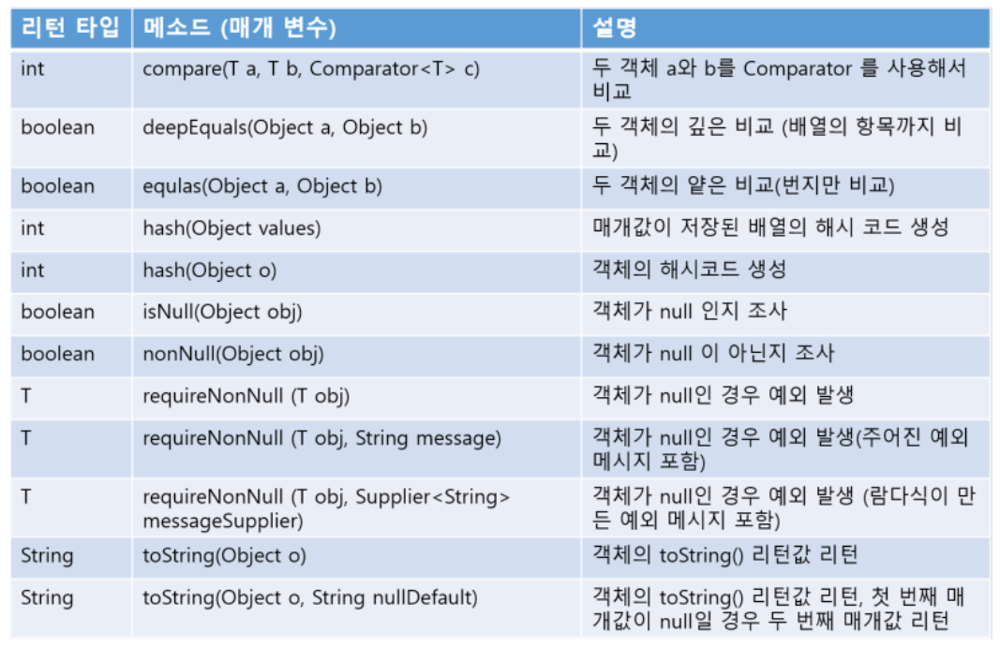

# 기본 API 클래스 part.1

API는 라이브러리(library)라고 부르기도 하는데, 프로그램 개발에 자주 사용되는 클래스 및 인터페이스의 모음을 말한다. 

## java.lang과 java.util 패키지
자바 애플리케이션 개발에서 자주 사용되는 패키지인 java.lang, java.util 패키지를 알아본다.

### java.lang 패키지
자바 프로그램의 기본적인 클래스를 담고 있는 패키지이다. 그렇기 때문에 java.lang 패키지에 있는 클래스, 인터페이스는 import 없이 사용할 수 있다. 

출처 : https://palpit.tistory.com/entry/Java-%EC%9E%90%EB%B0%94-%EA%B8%B0%EB%B3%B8-API-Intro

### java.util 패키지
java.util 클래스는 자바 프로그램 개발의 조미료 역할을 담당한다. 이 패키지는 컬렉션 클래스들이 대부분을 차지하고 있다. 
자주 사용되는 java.util 패키지 클래스들은 다음과 같다. 

출처 : https://palpit.tistory.com/entry/Java-%EC%9E%90%EB%B0%94-%EA%B8%B0%EB%B3%B8-API-Intro

## Object 클래스
자바의 모든 클래스는 Object 클래스의 자식 또는 자손 클래스이다. 클래스 생성 시 extends 키워드로 다른 클래스를 상속하지 않으면 java.lang.Object 클래스를 상속하게 된다. Object는 자바의 최상위 부모 클래스에 해당한다.

보다 자세한 내용은 API docs에서 확인 가능하다.(https://docs.oracle.com/javase/7/docs/api/java/lang/Object.html)

Object 클래스는 필드가 없고 메소드들로 구성되어 있다. 이 메소드들은 모든 클래스가 Object를 상속하기 때문에 모든 클래스에서 사용이 가능하다.
Object의 메소드를 알아보자.

### 객체 비교(equals())
> public boolean equals(Object obj) { ... }

equals 메소드의 매개타입이 Object인 이유는, 모든 객체가 매개값으로 대입될 수 있음을 뜻하기 때문이다. Object가 최상위 타입이므로 모든 객체는 Object 타입으로 자동 타입 변환될 수 있다. equals() 메소드는 비교 연산자인 ==과 동일한 결과를 리턴한다. 두 객체가 동일하면 true, 그렇지 않다면 false를 리턴한다. 

<pre>
<code>
public class MemberExample {
    public static void main(String[] args) {
        Member m1 = new Member("blue");
        Member m2 = new Member("blue");
        Member m3 = new Member("red");

        if(m1.equals(m2)){
            System.out.println("m1과 m2는 동등합니다.");
        }else{
            System.out.println("m1과 m2는 동등하지 않습니다.");
        }

        if(m1.equals(m3)){
            System.out.println("m1과 m3는 동등합니다.");
        }else{
            System.out.println("m1과 m3는 동등하지 않습니다.");
        }
    }
}

결과)
m1과 m2는 동등합니다.
m1과 m3는 동등하지 않습니다.
</code>
</pre>

### 객체 해시코드(hashCode())
객체 해시코드는 객체를 식별할 하나의 정수값을 말한다. Object의 hashCode() 메소드는 객체의 메모리 번지를 이용해서 해시코드를 만들어 리턴하기 때문에 객체마다 다른 값을 가지고 있다. 

### 객체 문자 정보(toString())
객체의 문자 정보란 객체를 문자열로 표현한 값을 말한다. 기본적으로 Object 클래스의 toString() 메소드는 "클래스명@16진수해시코드"로 구성된 문자 정보를 리턴한다. 

<pre>
<code>
Object obj = new Object();
System.out.println(obj.toString()); // java.lang.Object@7960847b(@뒤의 16진수 해시코드는 실행환경에 따라 다른 것 같다)
</code>
</pre>

본인이 만드는 클래스에 toString() 메소드를 재정의해서 좀 더 유용한 정보를 리턴하도록 할 수 있다.
<pre>
<code>
public class SmartPhone {
    private String company;
    private String os;

    public SmartPhone(String company, String os) {
        this.company = company;
        this.os = os;
    }

    // toString() 재정의
    @Override
    public String toString() {
        return company + " , " + os;
    }
}

public class Main {
    public static void main(String[] args) {
        SmartPhone smp = new SmartPhone("삼성", "안드로이드");

        String strObj = smp.toString();
        System.out.println(strObj);
        System.out.println(smp); // smp.toString()을 자동 호출해서 리턴값을 얻은 후 출력
    }
}
</code>
</pre>

### 객체 복제(clone())
객체 복제는 원본 객체의 필드값과 동일한 값을 가지는 새로운 객체를 생성하는 것이다. 객체 복제의 이유는 원본 객체를 안전하게 보호하기 위해서이다. 신뢰하지 않는 영역으로 원본 객체를 넘겨 작업할 경우 원본 객체의 데이터가 훼손될 수 있기 때문에 복제된 객체를 만들어 신뢰하지 않는 영역으로 넘기는 것이 좋다. 객체 복제의 방법은 얕은 복제와 깊은 복제가 있다.

### 얕은 복제(thin clone)
단순히 필드값을 복사해서 객체를 복제하는 것이다. 필드값만 복제하기 때문에 필드가 기본 타입일 경우 값 복사가 일어나고, 필드가 참조 타입일 경우 객체의 번지가 복사된다. 

Object의 clone() 메소드는 자신과 동일한 필드값을 가진 얕은 복제된 객체를 리턴한다. 이 메소드로 객체를 복제하려면 원본 객체는 반드시 java.lang.Cloneable 인터페이스를 구현하고 있어야 한다. 메소드 선언이 없음에도 불구하고 Cloneable 인터페이스를 명시적으로 구현하는 이유는 클래스 설계자가 복제를 허용한다는 의도적인 표시를 하기 위해서이다. 보제를 허용하지 않는다면 Cloneable 인터페이슬르 구현하지 않으면 된다. 그렇게 하면 clone() 메소드를 호출할 때 CloneNotSupportedException 예외가 발생하여 복제가 실패한다. clone()은 CloneNotSupportedException 예외 처리가 필요한 메소드이기 때문에 try-catch 구문이 필요하다. 

<pre>
<code>
try{
    Object obj = clone();
}catch(CloneNotSupportedException e){}
</code>
</pre>

<pre>
<code>
public class Member implements Cloneable {
    public String id;
    public String name;
    public String password;
    public int age;
    public boolean adult;

    public Member(String id, String name, String password, int age, boolean adult) {
        this.id = id;
        this.name = name;
        this.password = password;
        this.age = age;
        this.adult = adult;
    }

    public Member getMember() {
        Member cloned = null;
        try{
         cloned = (Member) clone();   
        }catch(CloneNotSupportedException e){}
        return cloned;
        }
    }
}
</code>
</pre>

다음 예제는 원본 Member를 복제한 후, 복제 Member와 password 필드값을 변경하더라도 원본 Member의 password 필드값은 변경되지 않음을 보여준다.
<pre>
<code>
public class Main {
    public static void main(String[] args) {
        // 원본 객체 생성
        Member original = new Member("blue", "Park", "12345", 25, true);

        // 복제 객체를 얻은 후에 패스워드 변경
        Member cloned = original.getMember();
        cloned.password = "6789"; 

        System.out.println("복제 객체 필드값");
        System.out.println(cloned.id + ", " + cloned.name + ", " + cloned.password + ", " + cloned.age + ", " + cloned.adult);

        System.out.println("원본 객체 필드값");
        System.out.println(original.id + ", " + original.name + ", " + original.password + ", " + original.age + ", " + original.adult);
    }
}
</code>
</pre>

### 깊은 복제(deep clone)
얕은 복제는 참조 타입 필드는 번지만 복제되기 때문에 원본 객체의 필드와 복제 객체의 필드는 같은 객체를 참조하게 된다. 만약 복제 객체에서 참조 객체를 변경하면 원본 객체도 변경된 객체를 가지게 된다. 이것이 얕은 복제의 단점이다. 

깊은 복제는 참조하고 있는 객체도 복제하는 것을 말한다. 깊은 복제를 하려면 Object의 clone() 메소드를 재정의해서 참조 객체를 복제하는 코드를 직접 작성해야 한다. 

### 객체 소멸자(finalize())
참조하지 않는 배열이나 객체는 Garbage Collector가 힙 영역에서 자동으로 소멸시킨다. Garbage Collector는 객체를 소멸하기 직전에 마지막으로 객체의 소멸자(finalize())를 실행시킨다. 소멸자는 Object의 finalize() 메소드를 말한다. 객체가 소멸되기 전에 마지막으로 사용했던 자원을 닫고 싶거나, 중요한 데이터를 저장하고 싶다면 Object의 finalize() 메소드를 재정의할 수 있다.

<pre>
<code>
public class Counter {
    private int no;

    public Counter(int no) {
        this.no = no;
    }

    @Override
    protected void finalize() throws Throwable {
        System.out.println(no + "번 객체의 finalize()가 실행");
    }
}

public class Main {
    public static void main(String[] args) {
        Counter counter = null;
        for(int i = 1; i<=50; i++) {
            counter = new Counter(i);

            counter = null; // Counter 객체를 쓰레기로 만듬
            System.gc(); // Garbage Collector 실행 요청
        }
    }
}
</code>
</pre>

## Object 클래스
java.util.Objects 클래스는 객체 비교, 해시코드 생성, null 여부, 객체 문자열 리턴 등의 연산을 수행하는 정적 메소드들로 구성된 Object의 유틸리티 클래스이다. 

출처 : https://m.blog.naver.com/PostView.naver?isHttpsRedirect=true&blogId=mals93&logNo=220722541094

### 객체 비교(compare(T a, T b, Comparator<? super T> c))
두 객체를 비교자(Comparator)로 비교해서 int 값을 리턴한다. java.util.Comparator<T>는 제네릭 인터페이스 타입으로 두 객체를 비교하는 compare(T a, T b)메소드가 정의되어 있다. T가 비교할 객체 타입이라는 뜻이다. compare() 메소드의 리턴 타입은 int인데, a가 b보다 작으면 음수, 같으면 0, 크면 양수를 리턴하도록 구현 클래스를 만들어야 한다. 

<pre>
<code>
public interface Comparator<T> {
    int compare(T a ,T b);
}
</code>
</pre>

다음은 학생 객체에서 학생 번호로 비교하는 StudentCompartor 구현 클래스이다. a의 sno가 작으면 -1, 같으면 0, 크면 1을 리턴한다.
<pre>
<code>
class StudentComparator implements Comparator<Student> {
    @Override
    public int compare(Student a, Student b) {
        int(a.sno < b.sno) return -1;
        else if(a.sno == b.sno) return 0;
        else return 1;
    }
}

// 위 내용을 아래와 같이 간단하게대체할 수 있다.
class StudentComparator implements Comparator<Student> {
    @Override
    public int compare(Student a, Student b) {
        return Integer.compare(a.sno, b.sno); // 대체한 코드
    }
}
</code>
</pre>

<pre>
<code>
public class Main {
    public static void main(String[] args) {
        Student s1 = new Student(1);
        Student s2 = new Student(2);
        Student s3 = new Student(3);

        int result = Objects.compare(s1, s2, new StudentComparator());
        System.out.println(result);
        result = Objects.compare(s1, s3, new StudentComparator());
        System.out.println(result);
    }

    static class Student {
        int sno;
        Student(int sno) {
            this.sno = sno;
        }
    }

    static class StudentComparator implements Comparator<Student> {
        @Override
        public int compare(Student o1, Student o2) {
            return Integer.compare(o1.sno, o2.sno);
        }
    }
}
</code>
</pre>

### 동등 비교(equals()와 deepEquals())

Objects.equals(Object a, Object b)는 두 객체의 동등을 비교한다. 두 객체가 null인 경우 true를 리턴하고, 둘 중 하나만 null이면 false를 리턴한다. 일반적으로 두 객체가 같으면 true, 다르면 false를 리턴한다.

Objects.deepEquals(Object a, Object b) 또한 두 객체의 동등을 비교한다. a,b 서로 다른 배열일 경우, 항목 값이 모두 같다면 true를 리턴한다. 이것은 Arrays.deepEquals(Object[], Object[]), equals(Object, Object)와 동일하다.

<pre>
<code>
public class Main {
    public static void main(String[] args) {
        Integer o1 = 1000;
        Integer o2 = 1000;

        System.out.println(Objects.equals(o1, o2)); // true
        System.out.println(Objects.equals(o1, null)); // false
        System.out.println(Objects.equals(null, o2)); // false
        System.out.println(Objects.equals(null, null)); // true
        System.out.println(Objects.deepEquals(o1, o2)); // true

        Integer[] arr1 = {1,2};
        Integer[] arr2 = {1,2};
        System.out.println(Objects.equals(arr1, arr2)); // false
        System.out.println(Objects.deepEquals(arr1, arr2)); // true
        System.out.println(Arrays.deepEquals(arr1, arr2)); // true
        System.out.println(Objects.deepEquals(null, arr2)); // false
        System.out.println(Objects.deepEquals(arr1, null)); // false
        System.out.println(Objects.deepEquals(null, null)); // true    

    }
}
</code>
</pre>

### 해시코드 생성(hash(), hashCode())
Objects.hash(Object... values) 메소드는 매개값으로 주어진 값들을 이용해서 해시 코드를 생성하는 역할을 하는데, 주어진 매개값들로 배열을 생성하고 Arrays.hashCode(Object[])를 호출해서 해시코드를 얻고 이 값을 리턴한다. 이 메소드는 클래스가 hashCode()를 재정의할 때 리턴값을 생성하기 위해 사용하면 좋다. 클래스가 여러 가지 필드를 가지고 있을 때 이 필드들로부터 해시코드를 생성하게 되면 동일한 필드값을 가지는 객체는 동일한 해시코드를 가질 수 있다.

<pre>
<code>
 @Override 
 public int hashCode() {
    return Objects.hash(x, y, z);
 }
</code>
</pre>

Objects.hashCode(Object o)는 매개값으로 주어진 객체의 해시코드를 리턴하기 때문에 o.hashCode()의 리턴값과 동일하다. 차이점은 매개값이 null이면 0을 리턴한다. 

Student 객체의 해시코드를 생성하기 위해 Student의 필드인 sno(학생 번호)와 name(학생 이름)을 매개값으로 해서 Objects.hash() 메소드를 호출했다. 학생 번호와 이름이 동일하다면 같은 해시 코드를 얻을 수 있다.
<pre>
<code>
public class Main {
    public static void main(String[] args) {
        Student s1 = new Student(1, "Brad Pitt");
        Student s2 = new Student(1, "Brad Pitt");

        System.out.println(s1.hashCode);
        System.out.println(Objects.hashCode(s2));
    }

    static class Student {
        int sno;
        String name;
        Student(int sno, String name) {
            this.sno = sno;
            this.name = name;
        }

        @Override
        public int hashCode() {
            return Objects.hash(sno, name);
        }
    }
}
</code>
</pre>

### 널 여부 조사(isNull(), nonNull(), requireNonNull())
Objects.isNull(Object obj)은 매개값이 null이면 true, 그렇지 않으면 false를 리턴한다.
nonNull(Object obj)는 매개값이 null이 아니면(non-null) true, 그렇지 않으면 false를 리턴한다.
requireNonNull()은 객체값의 null 여부를 체크하고 사용자 정의 NullPointerException 예외 처리를 할 수 있는 메소드이다. 이 메소드는 메소드 혹은 생성자 파라미터값 유효성 확인 용도로 주로 사용된다.

다음은 Foo 클래스 생성자 선언 시 requireNonNull() 메소드를 사용한 예시이다.
<pre>
<code>
// requireNonNull(T obj)
public Foo(Bar bar) {
     this.bar = Objects.requireNonNull(bar);
 }

// requireNonNull(T obj, String message)
public Foo(Bar bar, Baz baz) {
    this.bar = Objects.requireNonNull(bar, "bar must not be null");
    this.baz = Objects.requireNonNull(baz, "baz must not be null");
}
</code>
</pre>

### 객체 문자 정보(toString())
Objects.toString()은 객체의 문자 정보를 리턴하는데, 다음 두 가지로 오버로딩되어 있따.

| 리턴 타입 | 메소드(매개 변수) | 설명 |
| --- | --- | --- |
| String | toString(Object o) | not null -> o.toString() / null -> "null" |
| String | toString(Object o, String nullDefault) | not null -> o.toString() / null -> "nullDefault" |

<pre>
<code>
public class Main {
    public static void main(String[] args) {
        String str1 = "Brad Pitt";
        String str2 = null;

        System.out.println(Objects.toString(str1)); // Brad Pitt
        System.out.println(Objects.toString(str2)); // null
        System.out.println(Objects.toString(str2, "이름이 없습니다.")); // 이름이 없습니다.
    }
}
</code>
</pre>

## System 클래스
자바 프로그램은 운영체제상에서 바로 실행되지 않고 JVM 위에서 실행된다. 따라서 운영체제의 모든 기능을 자바 코드로 직접 접근하기 어렵다. 하지만 java.lang 패키지에 속하는 System 클래스를 이용하면 운영체제의 일부 기능을 이용할 수 있다. 예를 들어 프로그램 종료, 키보드로 입력, 모니터로 출력, 메모리 정리, 현재 시간 읽기, 시스템 프로퍼티 읽기, 환경 변수 읽기 등이 가능하다. System 클래스의 모든 필드와 메소드는 정적(static) 필드와 메소드로 구성되어 있다.

### 프로그램 종료(exit())
exit() 메소드는 현재 실행중인 JVM을 종료시킨다. 이 메소드는 Runtiime 클래스의 exit 메소드를 호출한다. 
exit() 메소드는 int 매개값을 지정하도록 되어 있는데, 이 값을 종료 상태값이라고 한다. 일반적으로 정상 종료인 경우 0으로 지정하고 비정상 종료일 경우 0 이외의 다른 값을 준다.

어떤 값을 주더라도 종료된다. 만약 특정 값이 입력될 때만 종료되게 하고 싶다면 자바의 보안 관리자를 직접 설정해서 종료 상태값을 확인해야 한다. Systyem.exit()가 실행되면 보안 관리자의 checkExit() 메소드가 자동 호출되는데, 이 메소드에서 종료 상태값을 조사해서 특정 값이 입력되지 않으면 SecurityException을 발생시켜 System.exit()를 호출한 곳에서 예외 처리를 할 수 있도록 해준다. checkExit()가 정상적으로 실행되면 JVM은 종료된다. 

다음은 숫자 4가 입력되면 JVM을 종료하도록 보안 관리자를 설정하는 모습이다.
<pre>
<code>
System.setSecurityManager(new SecurityManager(){
    @Override
    public void checkExit(int status) {
        if(status != 4) {

            // 특정 상태값(status)에 checkExit() 메소드가 JVM을 종료시키지 않도록 설정(종료 대신 SecurityException 예외 전달)
            throw new SecurityException(); 
        }
    }
});
</code>
</pre>

다음 예제는 숫자 4가 되면 JVM을 종료하도록 보안 관리자를 설정한 후에 for문을 통해 상태값이 4가 되면 JVM이 종료되도록 설정한다.
<pre>
<code>

public class Main {
    public static void main(String[] args) {

    System.setSecurityManager(new SecurityManager(){
        @Override
        public void checkExit(int status) {
            if(status != 4) {

                // 특정 상태값(status)에 checkExit() 메소드가 JVM을 종료시키지 않도록 설정(종료 대신 SecurityException 예외 전달)
                throw new SecurityException(); 
            }
        }
    });

    for(int i = 0; i<10; i++) {
        try{
            // JVM 종료 요청
            System.exit(i);
        }catch(SecurityException e){}
    }
    }
}
</code>
</pre>

### Garbage Collector 실행(gc())
자바는 메모리 관리를 개발자가 하지 않고 JVM이 자동으로 관리한다. JVM은 메모리가 부족할 때와 CPU가 한가할 때에 Garbage Collector를 실행시켜 사용하지 않는 객체를 자동으로 제거한다. 

다음과 같이 new 연산자로 Bike 객체를 생성하고 변수 myBike에 객체 번지를 대입하면

<pre>
<code>
Bike myBike = new Bike();
</code>
</pre>

만약 변수 myBike에 null을 대입하면 myBike는 객체의 번지를 잃게 된다. 객체 번지를 모르니 더 이상 Bike 객체는 사용할 수 없으므로 쓰레기 객체가 된다.

<pre>
<code>
Bike myBike = new Bike();
myBike = null;
</code>
</pre>

변수 myBike가 다른 Bike 객체를 참조하는 경우도 동일하다. 이전 객체의 번지를 잃어버리기 때문에 이전 객체는 쓰레기 객체가 된다.

<pre>
<code>
Bike myBike = new Bike();
myBike = new Bike();
</code>
</pre>

Garbage Collector는 개발자가 직접 코드로 실행시킬 수 없다. 대신 JVM에게 가능한한 빨리 실행해 달라고 요청할 수는 있다. 그것이 System.gc() 메소드이다.
개발자가 개발 도중 불필요한(사용하지 않는) 객체들이 메모리를 과하게 점유하고 있다고 생각되면 gc() 메소드를 통해 JVM에게 가능한 빨리 Garbage Collector를 통해 쓰레기 객체의 정리를 요청한다.

Garbage Collector가 자주 실행된다고 해서 좋은것은 아니다. 오히려 프로그램 속도가 떨어질 수 있다. 따라서 메모리가 열약하지 않은 환경이라면 굳이 gc() 메소드를 통해 정리할 필요가 없다. 스마트폰 이전 시대에 게임을 실행했을 경우 휴대폰 메모리 크기가 작기 때문에 System.gc() 메소드 호출을 통해 수시로 메모리 공간을 확보할 필요가 있지만 현 시대의 메모리 공간이 충분한 스마트폰 환경에서는 반드시 필요한 경우가 아니면 자주 사용되지 않는다.

<pre>
<code>
public class Main {
    public static void main(String[] args) {
        Bike bike;

        bike = new Bike("BMW"); // 쓰레기 객체가 되었다.
        bike = null;
        bike = new Bike("Honda"); // 쓰레기 객체가 되었다.
        bike = new Bike("Triumph");

        System.out.println("최종적으로 결정한 바이크는 이거야");
        System.out.println(bike.bikeNo);
        System.gc(); // Garbage Collector 실행 요청
    }
}

class Bike {
    public String bikeNo;

    public Bike(String bikeNo) {
        this.bikeNo = bikeNo;
    }

    // Garbage Collector가 객체를 삭제하는지 확인하는 용도(Garbage Collector는 객체를 삭제하기 전에 마지막으로 객체의 소멸자를 실행한다.)
    public void finalize() {
        System.out.println(bikeNo + " 바이크가 메모리에서 제거됨.");
    }
}

결과)
BMW 바이크가 메모리에 생성됨.
Honda 바이크가 메모리에 생성됨.  
Triumph 바이크가 메모리에 생성됨.
최종적으로 결정한 바이크는 이거야
Triumph
BMW 바이크가 메모리에서 제거됨.
Honda 바이크가 메모리에서 제거됨.
</code>
</pre>

잠시 쉬어가는 시간.

Triumph Scrambler 모델을 가지고 싶습니다. 좀 더 노력하겠습니다.

### 현재 시각 읽기(currentTimeMillis(), nanoTime())
컴퓨터의 시계로부터 현재 시간을 읽어서 밀리세컨드(1/1000초) 단위와 나노세컨드(십억 분의 1초) 단위의 long값을 리턴한다.

<pre>
<code>
long time = System.currentTimeMillis();
long time = System.nanoTime();
</code>
</pre>

주로 프로그램의 실행 소요 시간 측정에 사용된다(프로그램 시작 시 시간과 프로그램이 끝날 때의 시간의 차이)

다음은 1부터 1000000 까지의 합을 구하는데 걸리는 시간을 측정한다.
<pre>
<code>
public class Main {
    public static void main(String[] args) {
        long start = System.currentTimeMillis();
        long end = System.nanoTime();

        int sum = 0;
        for(int i = 1; i<=1000000; i++){
            sum += i;
        }

        System.out.println("1부터 1000000까지의 합: " + sum);
        System.out.println("소요시간: " + (start - end) + "나노초"); 
    }
}
결과)
1부터 1000000까지의 합: 1784293664
소요시간: 17221157982917나노초
</code>
</pre>

### 시스템 프로퍼티 읽기(getProperty())
시스템 프로퍼티는(System Property) JVM이 시작할 때 자동 설정되는 시스템의 속성값을 말한다. 운영체제의 종류, 자바 프로그램을 실행시킨 사용자 아이디, JVM 버전, 운영체제에서 사용되는 파일 경로 구분자 등이 있다. 시스템 프로퍼티는 key-value 형식으로 구성되어 있다. 
대표적인 키와 값에 대한 설명은 아래와 같다.

출처 : https://m.blog.naver.com/PostView.naver?isHttpsRedirect=true&blogId=mals93&logNo=220722613149

시스템 프로퍼티를 읽어오기 위해 System.getProperty() 메소드를 이용하면 된다. 이 메소드는 시스템 프로퍼티의 키 이름을 매개값으로 받고, 해당 키에 대한 값을 문자열로 리턴한다. 

<pre>
<code>
String value = System.getProperty();
</code>
</pre>

다음은 운영체제 이름, 사용자 이름, 사용자 홈 디렉토리를 알아내는 예제이다.
<pre>
<code>
public class Main {
    public static void main(String[] args) {
        String osName = System.getProperty("os.name");
        String userName = System.getProperty("user.name");
        String userHome = System.getProperty("user.home");

        System.out.println("운영체제 이름: " + osName);
        System.out.println("사용자 이름: " + userName);
        System.out.println("사용자 홈디렉토리: " + userHome);
    }
}
결과)
본인의 운영체제, 설정한 사용자 이름 및 홈디렉토리가 출력된다.
</code>
</pre>

### 환경 변수 읽기(getenv())
대부분의 운영체제는 실행되는 프로그램들에게 유용한 정보를 제공할 목적으로 환경 변수(Environment Variable)를 제공한다. 환경 변수는 프로그램상의 변수가 아니라 운영체제에서 이름(Name)과 값(Value)으로 관리되는 문자열 정보다. 

자바 프로그램에서는 환경 변수의 값이 필요할 경우 System.getenv() 메소드를 사용한다. 매개값으로 환경 변수 이름을 주면 해당 값을 리턴한다. 

다음 예제는 JAVA_HOME 환경 변수의 값을 얻어와서 출력한다.
<pre>
<code>
public class Main {
    public static void main(String[] args) {
        String javaHome = System.getenv("JAVA_HOME");
        System.out.println(javaHome);
    }
}
결과)
C:\Program Files\Java\jdk1.8.0_301 // 본인의 경우 이렇게 출력됨. 개개인마다 다를 수 있음.
</code>
</pre>

# 출처
* [이것이 자바다](http://www.kyobobook.co.kr/product/detailViewKor.laf?ejkGb=KOR&mallGb=KOR&barcode=9788968481475&orderClick=LAG&Kc=)
* [java.util.Objects](https://docs.oracle.com/javase/8/docs/api/java/util/Objects.html#hash-java.lang.Object...-)
* [java.lang.System](https://docs.oracle.com/javase/7/docs/api/java/lang/System.html)