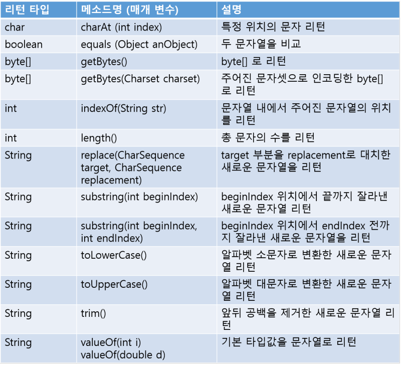
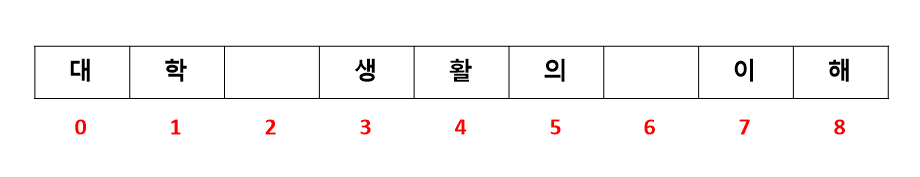
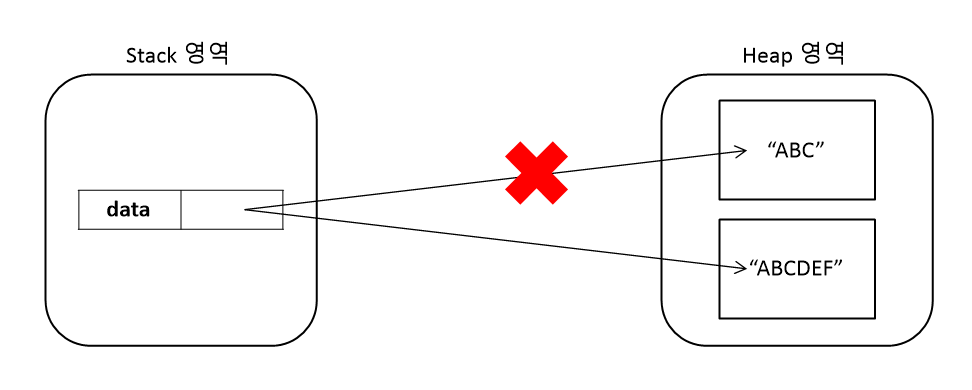
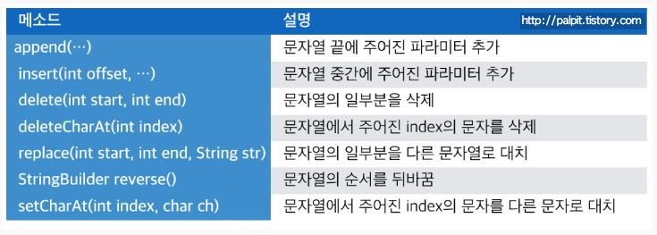
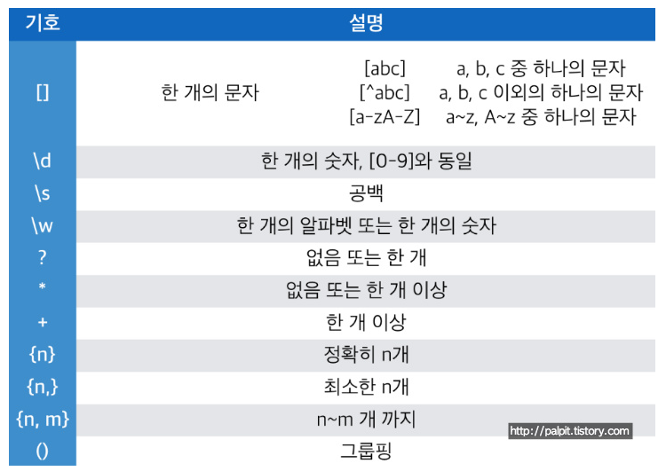

# 기본 API 클래스 part.2

## Class 클래스
자바는 클래스와 인터페이스의 메타 데이터를 java.lang 패키지에 소속된 Class 클래스로 관리한다. 메타 데이터란 클래스의 이름, 생성자 정보, 필드 정보, 메소드 정보를 말한다.

### Clsas 객체 얻기(getClass(), forName())

프로그램에서 Class 객체를 얻기 위해서는 Object 클래스가 가지고 있는 Object.getClass() 메소드를 이용하면 된다. Object는 모든 클래스의 최상위 클래스이므로 모든 클래스에서 getClass() 메소드를 호출할 수 있다.

getClass() 메소드는 해당 클래스로 객체를 생성했을 때만 사용할 수 있는데, 객체를 생성하기 전에 직접 Class 객체를 얻을 수도 있다. Class는 생성자를 감추고 있기 때문에 new 연산자로 객체를 만들 수 없고, 정적 메소드인 forName()을 이용해야 한다. forName() 메소드는 클래스 전체 이름(패키지가 포함된 이름)을 매개값으로 받고 Class 객체를 리턴한다.

Class.forName() 메소드는 매개값으로 주어진 클래스를 찾지 못하면 ClassNotFoundException 예외를 발생시키기 때문에 예외 처리가 필요하다. 

다음은 두 가지 방법으로 Bike 클래스의 Class 객체를 얻고, Class의 메소드를 이용해 클래스의 전체 이름과 간단한 이름 그리고 패키지 이름을 얻어 출력한다.

<pre>
<code>
public class Main {
    public static void main(String[] args) {
        Bike bike = new Bike();
        Class clazz1 = bike.getClass();

        try{
            Class clazz2 = Class.forName("sec06.exam01_class.Bike");
        }catch(ClassNotFoundException e){
            e.printStackTrace();
        }
    }
}
</code>
</pre>

### 리플렉션(getDeclaredConstructors(), getDeclaredFields(), getDeclaredMethods())
Class 객체를 이용하면 클래스의 생성자, 필드, 메소드 정보를 알아낼 수 있다. 이것을 리플렉션(Reflection)이라고 한다. Class 객체는 리플렉션을 위해 getDeclaredConstructors(), getDeclaredFields(), getDeclaredMethods()를 제공한다.

<pre>
<code>
public Constructor<?>[] getDeclaredConstructors()
public Field[] getDeclaredFields()
public Method[] getDeclaredMethods()
</code>
</pre>

세 메소드는 각 Constructor 배열, Field 배열, Method 배열을 리턴한다. Constructor, Field, Method 클래스는 모두 java.lang.reflect 패키지에 소속되어 있따. getDeclaredFields(), getDeclaredMethods()는 클래스에 선언된 멤버만 가져오고 상속된 멤버는 가져오지 않는다. 만약 상속된 멤버도 얻고 싶다면 getFields(), getMethods()를 이용해야 한다. 단 getFields(), getMethods()는 public 멤버만 가져온다. 

## String 클래스

### String 생성자
자바의 문자열은 java.lang 패키지의 String 클래스의 인스턴스로 관리된다. 소스상에서 문자열 리터럴은 String 객체로 자동 생성되지만, String 클래스의 다양한 생성자를 이용해서 직접 String 객체를 생성할 수도 있다. 

### String 메소드

### 문자 추출(charAt())
charAt() 메소드는 매개값으로 주어진 인덱스의 문자를 리턴한다. 여기서 인덱스란 0에서부터 "문자열 길이-1" 까지의 번호를 말한다.
<pre>
<code>
String subject = "대학 생활의 이해";
char charValue = subject.charAt(3);
</code>
</pre>

"대학 생활의 이해" 문자열은 다음과 같이 인덱스를 매길 수 있다.

charAt(3)은 3인덱스 위치에 있는 문자를 말한다. 즉 '생' 문자가 해당된다. 

다음 예제는 주민등록번호에서 인덱스 7번 문자를 읽어 남자/여자를 구분한다.
<pre>
<code>
public class Main {
    public static void main(String[] args) {
        String ssn = "010624-1230123";
        char sex = ssn.charAt(7);

        switch(sex) {
            case '1':
            case '3':
                System.out.println("Male");
                break;
            case '2':
            case '4':
                System.out.println("Female");
                break; 
        }
    }
}
</code>
</pre>

### 문자열 비교(equals())
기본 타입(byte, char, short, int, long, float, double, boolean) 변수의 값을 비교할 때에는 == 연산자를 사용한다. 그러나 문자열을 비교할 때에는 == 연산자를 사용하면 의도하지 않은 결과가 나올 수 있다. 

<pre>
<code>
String str1 = new String("대한민국");
String str2 = "대한민국";
String str3 = "대한민국";

str1 == str2 // false
str2 == str3 // true
</code>
</pre>

자바는 문자열 리터럴이 동일하면 동일한 String 객체를 참조하도록 되어 있다. 그래서 str2, str3은 동일한 String 객체를 참조한다. 그러나 str1은 new 연산자로 생성된 다른 String 객체를 참조한다. 

만약 두 String 객체의 문자열만 비교하고 싶다면 == 연산자 대신에 equals() 메소드를 사용해야 한다.

<pre>
<code>
String str1 = new String("대한민국");
String str2 = "대한민국";
String str3 = "대한민국";

str1.equals(str2) // true
str2.equals(str3) // true
</code>
</pre>

### 바이트 배열로 변환(getBytes())
네트워크로 문자열을 전송하거나, 문자열을 암호화할 때 문자열을 바이트 배열로 변환한다. 

<pre>
<code>
byte[] bytes = "문자열".getBytes();
byte[] bytes = "문자열".getBytes(Charset charset);
</code>
</pre>

getBytes() 메소드는 시스템의 기본 문자셋으로 인코딩된 바이트 배열을 리턴한다. 만약 특정 문자셋으로 인코딩된 바이트 배열을 얻으려면 두 번째 메소드를 사용하면 된다.

어떤 문자셋으로 인코딩하느냐에 따라 바이트 배열의 크기가 달라진다. EUC-KR은 getBytes()와 마찬가지로 알파벳은 1바이트, 한글은 2바이트로 변환하고, UTF-8은 알파벳은 1바이트, 한글은 3바이트로 변환한다. getBytes(Charset charset) 메소드는 잘못된 문자셋을 매개값으로 줄 경우, java.io.UnsupportedEncodingException 예외가 발생하므로 예외 처리가 필요하다.

바이트 배열을 다시 문자열로 변환(디코딩)할 때에는 어떤 문자셋으로 인코딩된 바이트 배열이냐에 따라서 디코딩 방법이 다르다. 단순하게 String(byte[] bytes) 생성자를 이용해서 디코딩하면 시스템의 기본 문자셋을 이용한다. 시스템 기본 문자셋과 다른 문자셋으로 인코딩된 바이트 배열일 경우 다음 String 생성자를 이용해서 디코딩해야 한다.

<pre>
<code>
String str = new String(byte[] bytes, String charsetName);
</code>
</pre>

다음 예제는 문자열을 바이트 배열로 인코딩하고 길이를 출력한다. 그리고 다시 String 생성자를 이용해서 문자열로 디코딩한다.
<pre>
<code>
public class Main {
    public static void main(String[] args) {
        String str = "hello";

        byte[] bytes1 = str.getBytes();
        System.out.println("길이: " + bytes1.length);
        String str1 = new String(bytes1);
        System.out.println("bytes->String: " + str1);

        try{
            byte[] bytes2 = str.getBytes("EUC-KR");
            System.out.println("bytes2.length: " + bytes2.length);
            String str2 = new String(bytes2, "EUC-KR");
            System.out.println("bytes2->String: " + str2);

            byte[] bytes3 = str.getBytes("UTF-8");
            System.out.println("bytes3.length: " + bytes3.length);
            String str3 = new String(bytes3, "UTF-8");
            System.out.println("bytes3->String: " + str3);

        }catch(UnsupportedEncodingException e){
            e.printStackTrace();
        }
    }
}
</code>
</pre>

### 문자열 찾기(indexOf())
indexOf() 메소드는 매개값으로 주어진 문자열이 시작되는 인덱스를 리턴한다. 만약 주어진 문자열이 포함되어 있지 않으면 -1을 리턴한다. 

<pre>
<code>
String subject = "대학 생활의 이해";
int index = subject.indexOf("대학");
</code>
</pre>

index 변수에 0이 저장되는데, "대학 생활의 이해"에서 "대학"문자열의 인덱스 위치가 0이기 때문이다.

indexOf() 메소드는 if문의 조건식에서 특정 문자열이 포함되어 있는지 여부에 따라 실행 코드를 달리할 때 자주 사용된다. -1값을 리턴하면 특정 문자열이 포함되어 있지 않다는 뜻이다.

<pre>
<code>
if(문자열.indexOf("찾는 문자열") != -1) {
    // 포함되어 있을 때
} else {
    // 포함되어 있지 않을 때
}
</code>
</pre>

<pre>
<code>
public class Main {
    public static void main(String[] args) {
        String subject = "대학 생활의 이해";
        
        int location = subject.indexOf("이해");
        System.out.println(location);

        if(subject.indexOf("대학") != -1) {
            System.out.println("제가 원하는 강의가 맞네요.");
        } else {
            System.out.println("수강 정정이 필요하군요.");
        }
    }
}
</code>
</pre>

### 문자열 길이(length())
length() 메소드는 문자열의 길이(문자의 수)를 리턴한다. 

<pre>
<code>
String subject = "대학 생활의 이해";
int length = subject.length();
</code>
</pre>

length 변수에는 9가 저장된다. subject 객체의 문자열 길이는 공백을 포함해서 8개이기 때문이다.

### 문자열 대치(replace())
replace() 메소드는 첫 번째 매개값인 문자열을 찾아 두 번째 매개값인 문자열로 대치한 새로운 문자열을 생성하고 리턴한다.

<pre>
<code>
String oldStr = "대학 생활의 이해";
String newStr = oldStr.replace("대학", "사회");
</code>
</pre>

String 객체의 문자열은 변경 불가한 특성을 갖기 때문에 replace() 메소드가 리턴하는 문자열은 원래 문자열의 수정본이 아니라 완전히 새로운 문자열이다. 따라서 newStr 변수는 새로 생성된 "사회 생활의 이해" 문자열을 참조한다.

### 문자열 잘라내기(substring())
substring() 메소드는 주어진 인덱스에서 문자열을 추출한다. 매개값의 수에 따라 두 가지 형태로 사용된다. substring(int beginIndex, int endIndex)는 주어진 시작과 끝 인덱스 사이의 문자열을 추출하고, substring(int beginIndex)는 주어진 인덱스부터 끝까지 문자열을 추출한다.

<pre>
<code>
String ssn = "880515-1234567";
String firstNum = ssn.substring(0,6);
String secondNum = ssn.substring(7);
</code>
</pre>

firstNum은 "880815", secondNum은 "1234567"이다.
ssn.substring(0,6)은 인덱스 0(포함) ~ 6(제외) 사이의 문자열을 추출하고, ssn.substring(7)은 인덱스 7부터의 문자열을 추출한다.

### 알파벳의 소/대문자 변경(toLowerCase(), toUpperCase())
toLowerCase() 메소드는 문자열을 모두 소문자로 바꾼 새로운 문자열을 생성한 후 리턴한다.
toUpperCase() 메소드는 문자열을 모두 대문자로 바꾼 새로운 문자열을 생성한 후 리턴한다.

<pre>
<code>
String original = "Java Programming";
String lowerCase = original.toLowerCase();
String upperCase = original.toUpperCase();
</code>
</pre>

lowerCase 변수는 새로 생성된 "java programming" 문자열을 참조하고, upperCase 변수는 새로 생성된 "JAVA PROGRAMMING" 문자열을 참조한다. 원래 "Java Programming" 문자열이 변경된 것은 아니다.(String 객체의 문자열은 변경 불가한 특성을 갖기 때문이다.)

toLowerCase(), toUpperCase() 두 메소드는 영어로 된 두 문자열을 대소문자와 관계없이 비교할 때 주로 이용된다. 두 문자열을 비교하려면 사전에 toLowerCase(), toUpperCase()로 대소문자를 맞추어야 하지만 equalsIgnoreCase() 메소드를 사용하면 이 작업이 생략된다.

<pre>
<code>
public class Main {
    public static void main(String[] args) {
        String str1 = "Java Programming";
        String str2 = "java programming";

        System.out.println(str1.equals(str2)); // false

        System.out.println(str1.equalsIgnoreCase(str2)); // true
    }
}
</code>
</pre>

### 문자열 앞뒤 공백 잘라내기(trim())
trim() 메소드는 문자열의 앞뒤 공백을 제거한 새로운 문자열을 생성하고 리턴한다. 

<pre>
<code>
String oldStr = "   자바 프로그래밍   ";
String newStr = oldStr.trim();
</code>
</pre>

newStr 변수는 앞뒤 공백이 제거된 새로 생성된 "자바 프로그래밍" 문자열을 참조한다. trim() 메소드는 앞뒤의 공백만 제거할 뿐 중간의 공백은 제거하지 않는다. 
trim() 메소드를 사용한다고 해서 원래 문자열의 공백이 제거되는 것은 아니라 공백이 제거된 새로운 객체가 생성되는 것이다.

### 문자열 변환(valueOf())
valueOf() 메소드는 기본 타입의 값을 문자열로 변환하는 기능을 가지고 있다. String 클래스에는 매개 변수의 타입별로 valueOf() 메소드가 다음과 같이 오버로딩되어 있다. 

<pre>
<code>
static String valueOf(boolean b)
static String valueOf(char c)
static String valueOf(int i)
static String valueOf(long i)
static String valueOf(double d)
static String valueOf(float f)
</code>
</pre>

<pre>
<code>
public class Main {
    public static void main(String[] args) {
        String str1 = String.valueOf(10);
        String str2 = String.valueOf(10.5);
        String str3 = String.valueOf(true);

        System.out.println(str1); // 10
        System.out.println(str2); // 10.5
        System.out.println(str3); // true
    }
}
</code>
</pre>

## StringTokenizer 클래스
문자열이 특정 구분자(delimiter)로 연결되어 있는 경우, 구분자를 기준으로 부분 문자열을 분리하기 위해서는 String의 split() 메소드를 이용하거나, java.util 패키지의 StringTokenizer 클래스를 이용할 수 있다. split()은 정규 표현식으로 구분하고, StringTokenizer는 문자로 구분한다는 차이점이 있다.

### split() 메소드
String 클래스의 split() 메소드는 정규 표현식을 구분자로 해서 문자열을 분리한 후, 배열에 저장하고 리턴한다.
<pre>
<code>
String[] result = "문자열".split("정규표현식");
</code>
</pre>

split() 메소드를 사용해 &, 쉼표(,), - 를ㄹ 제외하고 순수 문자열만 뽑아내고 싶은 경우 다음과 같이 사용하면 된다.
<pre>
<code>
public class Main {
    public static void main(String[] args) {
        String text = "트라이엄프&혼다,가와사키,야마하-스즈키";

        String[] names = text.split("&|,|-");

        for(String name : names) {
            System.out.println(name);
        }
    }
}
결과)
트라이엄프
혼다
가와사키
야마하
스즈키
</code>
</pre>

### StringTokenizer 클래스
문자열이 한 종류의 구분자로 연결되어 있을 경우 StringTokenizer 클래스로 손쉽게 문자열(토큰_token)을 분리해 낼 수 있다. StringTokenizer 객체를 생성할 때 첫 번째 매개값으로 전체 문자열을 주고, 두 번째 매개값으로 구분자를 주면 된다.

<pre>
<code>
StringTokenizer st = new StringTokenizer("문자열", "구분자");
</code>
</pre>

구분자를 생략하면 공백(Space)이 기본 구분자가 된다. 예를 들어 문자열이 "/"로 구분되어 있을 경우 다음과 같이 StringTokenizer 객체를 생성한다.
<pre>
<code>
Stirng text = "가/나/다/라";
StringTokenizer st = new StringTokenizer(text, "/");
</code>
</pre> 

StringTokenizer 객체가 생성되면 부분 문자열을 분리해 낼 수 있는데, 다음 메소드들을 이용해서 전체 토큰 수, 남아 있는 토큰 여부를 확인한 다음 토큰을 읽는다.

| 메소드 | 설명 |
| --- | --- |
| int / countTokens() | 꺼내지 않고 남아 있는 토큰의 수 |
| boolean / hasMoreTokens() | 남아 있는 토큰이 있는지 여부 |
| String / nextToken() | 토큰을 하나씩 꺼내옴 | 

nextToken() 메소드로 토큰을 하나씩 꺼내오면 StringTokenizer 객체에는 토큰이 하나씩 없어진다. StringTokenizer 객체에서 더 이상 가져올 토큰이 없다면 nextToken() 메소드는 java.util.NoSuchElementException 예외를 발생시킨다. 따라서 nextToken() 메소드 이전에 hasMoreTokens() 메소드로 꺼내올 토큰이 있는지 확인 후 nextToken() 메소드로 토큰을 가져오도록 조건을 설정하는게 좋다. 

<pre>
<code>
public class Main {
    public static void main(String[] args) {
        String text = "가/나/다";

        // 전체 토큰 수를 얻어 for 문으로 리턴
        StringTokenizer st = new StringTokenizer(text, "/");
        int countTokens = st.countTokens();
        for(int i = 0; i<countTokens; i++) {
            String token = st.nextToken();
            System.out.println(token);
        }

        // 남아 있는 토큰을 확인하고 while문으로 루핑
        st = new StringTokenizer(text, "/");
        while(st.hasMoreTokens()) {
            String token = st.nextToken();
            System.out.println(token);
        }
    }
}
</code>
</pre> 

## StrinBuffer, StringBuilder 클래스
문자열을 저장하는 String은 내부의 문자열을 수정할 수 없다. String의 replace() 메소드는 내부의 문자를 변경하는 것이 아니라, 변경된 새로운 문자열을 리턴한다. String 객체를 + 연산할 경우에도 마찬가지다.

<pre>
<code>
String data = "ABC";
data += "DEF";
</code>
</pre>
위 예제에서 "ABC"에 "DEF"가 추가되었기 때문에 "ABCDEF"라는 하나의 String 객체로 변경되었다고 생각할 수 있지만, **String 객체는 내부 데이터를 수정할 수 없으므로** "ABC"에 "DEF"가 추가된 "ABCDEF"라는 새로운 String 객체가 생성된다. 그리고 data 변수는 새로 생성된 String 객체를 참조하게 된다.

문자열을 결합하는 + 연산자를 남용하면 그만큼 string 객체의 수가 늘어나기 때문에 프로그램 성능 저하의 원인이 될 수 있다. 문자열 변경 작업이 잦을 경우 String 클래스 사용 보다는 java.lang 패키지의 StringBuffer 또는 StringBuilder 클래스를 사용하는 것이 좋다. 이 두 클래스는 내부 버퍼(buffer_데이터를 임시로 저장하는 메모리)에 문자열을 저장해 두고 그 안에서 추가, 수정, 삭제 작업을 할 수 있도록 설게되어 있다. String처럼 새로운 객체를 만들지 않고도 문자열을 조작할 수 있는 것이다.

StringBuffer와 StringBuilder의 사용법은 동일하지만 차이점은 StringBuffer는 멀티 스레드 환경에서 사용할 수 있도록 동기화가 적용되어 있어 스레드에 안전하다. 반면 StringBuilder는 단일 스레드 환경에서만 사용하도록 설계되어 있다. 

StringBuilder 클래스의 기본 생성자인 StringBuilder()는 16개의 문자들을 저장할 수 있는 초기 버퍼를 만들고, StringBuilder(int capacity) 생성자는 capacity로 주어진 개수만큼 문자들을 저장할 수 있는 초기 버퍼를 만든다. StringBuilder는 버퍼가 부족할 경우 자동으로 버퍼 크기를 늘리기 때문에 초기 버퍼의 크기는 그다지 중요하지 않다. 
StringBuilder(String str) 생성자는 str로 주어진 매개값을 버퍼의 초기값으로 저장한다.

<pre>
<code>
StringBuilder sb = new StringBuilder();
StringBuilder sb = new StringBuilder(16);
StringBuilder sb = new StringBuilder("Java");
</code>
</pre>

StringBuilder 클래스의 주요 메소드는 다음과 같다.

출처 : https://palpit.tistory.com/879

append(), insert() 메소드는 매개 변수가 다양한 타입으로 오버로딩되어 있기 때문에 대부분의 값을 문자로 추가 또는 삽입할 수 있다. 자세한 내용은 에서 확인 가능하다.

<pre>
<code>
public class Main {
    public static void main(String[] args) {
        StringBuilder sb = new StringBuilder();

        sb.append("대학 ");
        sb.append("생활의 ");
        sb.append("이해");
        System.out.println(sb.toString());

        sb.insert(3, "1학년 "); // (공백포함)index 3의 위치 뒤에 문자 삽입
        System.out.println(sb.toString()); // 대학 1학년 생활의 이해

        sb.replace(0, 6, "사회 1년차"); // sb.replace(시작 인덱스, 마지막 인덱스, 대치할 문자)
        System.out.println(sb.toString()); // 사회 1년차 생활의 이해(시작 인덱스 ~ 마지막 인덱스 이전 까지의 문자열 대치)

        int length = sb.length();
        System.out.println("총문자수: " + length); // 13

        String result = sb.toString(); // 버퍼에 있는 것을 String 타입으로 리턴
        System.out.println(result); // 사회 1년차 생활의 이해
    }
}
</code>
</pre>

## 정규 표현식과 Pattern 클래스
문자열이 정해져 있는 형식(정규 표현식_Regular Expression)으로 구성되어 있는 검증해야 하는 경우가 있다. 예를 들어 이메일, 전화번호를 사용자가 제대로 입력했는지 검증해야 할 때 정규 표현식과 비교한다. 

### 정규 표현식 작성 방법
정규 표현식 작성 방법은 java.util.regex.Pattern 클래스를 찾아 을 참조하면 되는데, 한눈에 정보가 들어오지 않는다.(보기 난해하다)
간단히 말해서 정규 표현식은 문자 또는 숫자 기호와 반복 기호가 결합된 문자열이다. 

출처 : https://palpit.tistory.com

다음은 02-123-1234 또는 010-1234-5678과 같은 전화번호를 위한 정규 표현식이다.
<pre>
<code>
(02|010)-\d{3,4}-\d{4}
</code>
</pre>
위 코드에 대한 설명이다.

| 기호 | 설명 |
| --- | --- |
| (02|010) | 02 또는 010 |
| - | - 포함 |
| \d{3,4} | 3자리 또는 4자리 숫자 |
| - | - 포함 |
| \d{4} | 4자리 숫자 |

다음은 triumph@naver.com과 같은 이메일을 위한 정규 표현식이다.
<pre>
<code>
\w+@\w+\.\w+(\.\w+)?
</code>
</pre>

| 기호 | 설명 |
| --- | --- |
| \w+ | 한 개 이상의 알파벳 또는 숫자 |
| @ | @ |
| \w+ | 한 개 이상의 알파벳 또는 숫자 |
| \. | . |
| \w+ | 한 개 이상의 알파벳 또는 숫자 |
| (\.\w+)? | \.\w+ 이 없거나 한 번 더 올 수 있음 |

주의점은 \.과 .은 다르다는 것이다. \.은 문자로서의 점(.)을 말하지만 .은 모든 문자 중에서 한 개의 문자를 뜻한다.

### Pattern 클래스
문자열을 정규 표현식으로 검증하는 기능은 java.util.regex.Pattern 클래스의 정적 메소드인 matches() 메소드가 제공한다.
<pre>
<code>
boolean result = Pattern.matches("정규식", "검증할 문자역");
</code>
</pre>
첫번째 매개값은 정규 표현식(regex)이고, 두 번째 매개값은 검증할 문자열(CharSequence)이다. 검증 후 결과가 boolean 타입으로 리턴된다.
다음 예제는 전화번호와 이메일을 검증하는 코드이다.
<pre>
<code>
public class Main {
    public static void main(String[] args) {
        String regExp = "(02|010)-\\d{3,4}-\\d{4}";
        String data = "010-123-4567";
        boolean result = Pattern.matches(regExp, data);
        if(result) {
            System.out.println("정규식과 일치");
        } else {
            System.out.println("정규식화 불일치");
        }

        regExp = "\\w+@\\w+\\.\\w+(\\.\\w+)?";
        data = "triumph@navercom";
        result = Pattern.matches(regExp, data);
        if(result) {
            System.out.println("정규식과 일치");
        } else {
            System.out.println("정규식화 불일치");
        }
    }
}
결과)
정규식과 일치
정규식화 불일치
</code>
</pre>
이메일 검증에서 '정규식화 불일치' 메시지가 출력되는 이유는, navercom이라고 되어 있기 때문이다. 반드시 점(.)과 한 개 이상의 알파벳 또는 숫자가 포함되어야 하므로 naver.com이라고 해야 정규식에 맞게 된다.

# 출처
* [이것이 자바다](http://www.kyobobook.co.kr/product/detailViewKor.laf?ejkGb=KOR&mallGb=KOR&barcode=9788968481475&orderClick=LAG&Kc=)
* [java.lang.Object](https://docs.oracle.com/javase/7/docs/api/java/lang/Object.html)
* [java.lang.Class](https://docs.oracle.com/javase/8/docs/api/java/lang/Class.html)
* [java.lang.String](https://docs.oracle.com/javase/7/docs/api/java/lang/String.html)
* [java.util.StringTokenizer](https://docs.oracle.com/javase/7/docs/api/java/util/StringTokenizer.html)
* [Package java.lang](https://docs.oracle.com/javase/7/docs/api/java/lang/package-summary.html)