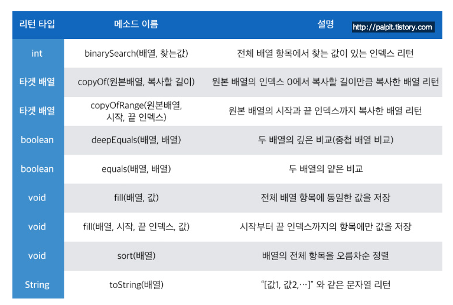
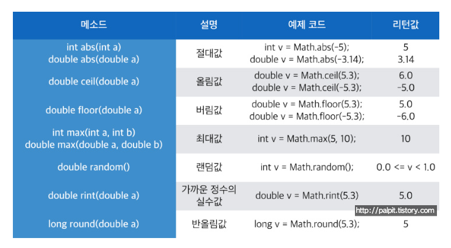
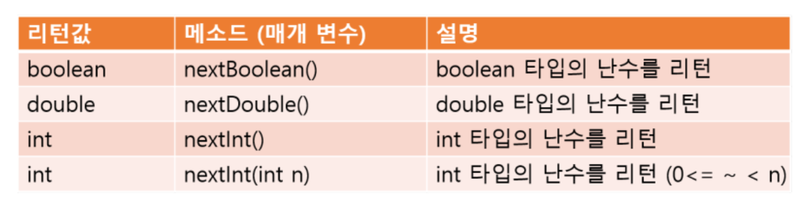
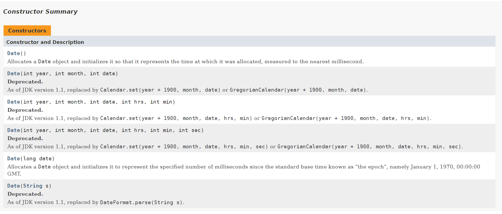
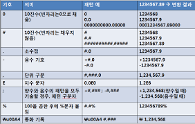
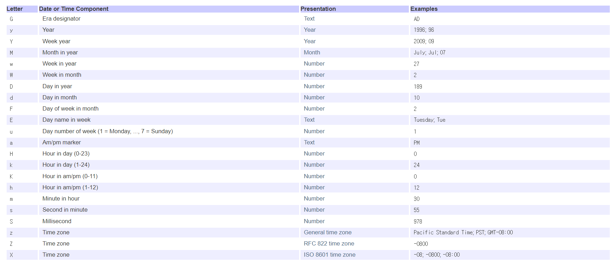
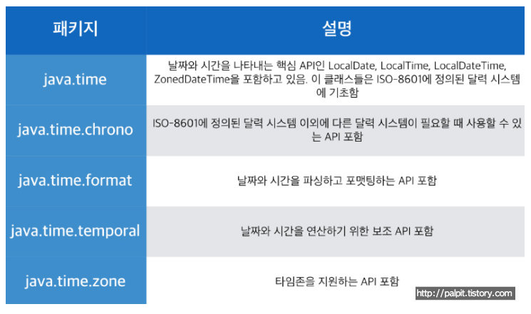
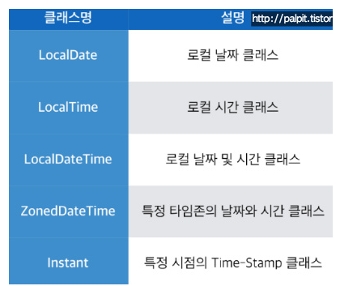

# 기본 API 클래스 part.3

## Arrays 클래스
Arrays 클래스는 배열 조작(manipulating arrays) 기능을 가지고 있다. 배열 조작이란 배열의 복사, 항목 정렬, 항목 검색과 같은 기능을 말한다. 단순한 배열 복사는 System.arraycopy() 메소드를 사용할 수 있으나, Arrays는 추가적으로 항목 정렬, 항목 검색, 항목 비교와 같은 기능을 제공한다. 
Arrays 클래스의 모든 메소드는 정적(static) 이므로 Arrays 클래스로 바로 사용이 가능하다.

 
출처 : https://palpit.tistory.com/entry/Java-%EC%9E%90%EB%B0%94-%EA%B8%B0%EB%B3%B8-API-Arrays-Class

### 배열 복사
배열 복사를 위해 copyOf(원본배열, 복사할길이), copyOfRange(원본배열, 시작인덱스, 끝인덱스)이다. copyOf() 메소드는 원본 배열의 0번 인덱스에서 복사할 길이만큼 복사한 타겟 배열을 리턴하는데, 복사할 길이는 원본 배열의 길이보다 커도 되며, 타겟 배열의 길이가 된다. 다음은 arr1[] 배열의 전체 항목을 복사해서 arr2[] 배열을 생성한다.

<pre>
<code>
char[] arr1 = {'A','B','C','D'};
char[] arr2 = Arrays.copyOf(arr1, arr1.length);
</code>
</pre>

copyOfRange(원본배열, 시작인덱스, 끝인덱스)는 원본 배열의 시작 인덱스에서 끝 인덱스까지 복사한 배열을 리턴한다. 시작 인덱스는 포함되지만, 끝 인덱스는 포함되지 않는다. 다음은 arr1[] 배열 항목 중 1번,2번 인덱스 항목을 arr2[] 배열의 0번, 1번 인덱스 항목으로 복사한다.
<pre>
<code>
char[] arr1 = {'A','B','C','D'};
char[] arr2 = Arrays.copyOfRange(arr1, 1, 3); // 시작 인덱스는 포함, 끝인덱스는 포함하지 않으므로 arr1[] 배열의 1번, 2번 인덱스만 복사된다.
</code>
</pre>

단순 배열 복사만이 목적이라면 Arrays 클래스를 사용하지 않고 System.arraycopy() 메소드를 이용할 수 있다. 
System.arraycopy() 메소드는 5개의 매개값이 필요하다.
<pre>
<code>
System.arraycopy(Object src, int srcPos, Object dest, int destPos, int length)
System.arraycopy(원본배열, 원본시작인덱스, 타겟배열, 타겟시작인덱스, 복사개수)
</code>
</pre>

다음은 Arrays와 System.arraycopy()를 이용해 배열을 복사한다.
<pre>
<code>
public class Main {
    public static void main(String[] args) {
        char[] arr1 = {'A','B','C','D'};

        // 방법 1
        char[] arr2 = Arrays.copyOf(arr1, arr1.length); // arr1 전체를 복사

        // 방법 2
        char[] arr3 = Arrays.copyOfRange(arr1, 1, 3); // 부분 복사

        // 방법 3
        char[] arr4 = new char[arr1.length];
        System.arraycopy(arr1, 0, arr4, 0, arr1.length); // arr1 전체를 arr4로 복사
    }
}
</code>
</pre>

### 배열 항목 비교
Arrays의 equals() 와 deepEquals()는 배열 항목을 비교한다. equals()는 1차 항목의 값만 비교하고, deepEquals()는 1차 항목이 서로 다른 배열을 참조할 경우 중첩된 배열의 항목까지 비교한다.

<pre>
<code>
public class Main {
    public static void main(String[] args) {
        int[][] original = {{1,2}, {3,4}};
        
        // 얕은 복사후 비교
        int[][] cloned1 = ArrayscopyOf(original, original.length);
        System.out.println(original.equals(cloned1)); // 배열 번지 비교 = false
        System.out.println(Arrays.equals(original, cloned1)); // 1차 배열 항목값 비교 = true
        System.out.println(Arrays.deepEquals(original, cloned1)); // 중첩 배열 항목값 비교 = true

        // 깊은 복사후 비교
        int[][] cloned2 = Arrays.copyOf(original, original.length);
        cloned2[0] = Arrays.copyOf(original[0], original[0].length);
        cloned2[1] = Arrays.copyOf(original[1], original[1].length);
        System.out.println(original.equals(cloned2)); // 배열 번지 비교 = false
        System.out.println(Arrays.equals(original, cloned2)); // 1차 배열 항목값 비교 = false
        System.out.println(Arrays.deepEquals(original, cloned2)); // 중첩 배열 항목값 비교 = true
    }
}
</code>
</pre>

### 배열 항목 정렬
기본 타입 또는 String 배열은 Arrays.sort() 메소드의 매개값으로 지정하면 자동으로 오름차순 정렬이 된다. 사용자 정의 클래스 타입일 경우 클래스가 Comparable 인터페이스를 구현하고 있어야 정렬이 된다.

Member 배열에서 Member 객체들을 name 필드값으로 정렬하고 싶다면 다음과 같이 클래스를 작성하면 된다.
<pre>
<code>
public class Member implements Comparable<Member> {
    String name;
    Member(String name) {
        this.name = name;
    }

    @Override
    public int compareTo(Member o) {
        return name.compareTo(o.name);
    }
}
</code>
</pre>
Comparable<Member>는 Member 타입만 비교하기 위해 제네릭 <>을 사용하였고, comapreTO() 메소드는 비교값을 리턴하도록 오버라이딩했다. compareTo() 메소드의 리턴값은 오름차순일 때 자신의 매개값보다 낮을 경우 음수, 같을 경우 0, 높을 경우 양수를 리턴한다. 반대로 내림차순일 때 자신이 매개값보다 낮을 경우 양수, 같은 경우 0, 높을 경우 음수를 리턴한다. name 필드값으로 정렬하기 위해 유니코드로 비교를 해야 하므로 String의 compareTo() 리턴값을 사용한다. 

<pre>
<code>
public class Main {
    public static void main(String[] args) {
        int[] scores = {99,98,97};
        Arrays.sort(scores); // {97,98,99}
        
        String[] names = {"홍길동", "박동수", "김민수"};
        Arrays.sort(names); // 김민수, 박동수, 홍길동

        Member m1 = new Member("홍길동");
        Member m2 = new Member("박동수");
        Member m3 = new Member("김민수");
        Member[] members = {m1, m2, m3};
        Arrays.sort(members); // 김민수, 박동수, 홍길동
    }
}
</code>
</pre>

### 배열 항목 검색
배열 항목에서 특정 값이 위치한 인덱스를 얻는 것을 배열 검색이라고 한다. 배열 항목을 검색하려면 반드시 Arrays.sort() 메소드로 항목들을 오름차순으로 정렬한 후, Arrays.binarySearch() 메소드로 항목을 찾아야 한다.
<pre>
<code>
public class Main {
    public static void main(String[] args) {
        // 기본 타입값 검색
        int[] scores = {99,98,97};
        Arrays.sort(scores); // {97,98,99}
        int index = Arrays.binarySearch(scores, 99);
        System.out.println("99의 인덱스: " + index); // 2

        // 문자열 검색
        String[] names = {"홍길동", "박동수", "김민수"};
        Arrays.sort(names); // 김민수, 박동수, 홍길동
        index = Arrays.binarySearch(names, "홍길동");
        System.out.println("홍길동의 인덱스: " + index); // 2

        // 객체 검색
        Member m1 = new Member("홍길동");
        Member m2 = new Member("박동수");
        Member m3 = new Member("김민수");
        Member[] members = {m1, m2, m3};
        Arrays.sort(members); // 김민수, 박동수, 홍길동
        index = Arrays.binarySearch(members, m1);
        System.out.println("홍길동의 인덱스: " + index); // 2
    }
}
</code>
</pre>

## Math, Random 클래스
java.lang.Math 클래스는 수학 계산에 사용할 수 있는 메소들르 제공한다. Math 클래스가 제공하는 메소드는 모두 정적(static) 이므로 Math 클래스로 바로 사용이 가능하다. 

출처 : https://palpit.tistory.com/entry/Java-%EC%9E%90%EB%B0%94-%EA%B8%B0%EB%B3%B8-API-Math-Random-Class

<pre>
<code>
public class Main {
    public static void main(String[] args) {
        int v1 = Math.abs(-5);
        double v2 = Math.abs(-3.14);
        System.out.println(v1); // 5
        System.out.println(v2); // 3.14

        double v3 = Math.ceil(5.3);
        double v4 = Math.ceil(-5.3);
        System.out.println(v3); // 6.0
        System.out.println(v4); // 5.0

        double v5 = Math.floor(5.3);
        double v6 = Math.floor(-5.3);
        System.out.println(v5); // 5.0
        System.out.println(v6); // 6.0

        int v7 = Math.max(5,9);
        double v8 = Math.max(5.3, 2.5);
        System.out.println(v7); // 9
        System.out.println(v8); // 5.3

        int v9 = Math.min(5,9);
        double v10 = Math.min(5.3, 2.5);
        System.out.println(v7); // 5
        System.out.println(v8); // 2.5

        // Math.random() 메소드는 0.0과 1.0 사이의 범위에 속하는 하나의 double 타입의 값을 리턴한다. 0.0은 범위에 포함되고, 1.0은 포함되지 않는다.
        double v11 = Math.random();
        System.out.println(v11); //0.7318080259075397(랜덤)

        // Math.random() 메소드로 1부터 10까지의 난수를 얻으려면
        int num = (int)(Math.random()*10) + 1;
        System.out.println(num);

        long v12 = Math.round(5.3);
        long v13 = Math.round(5.7);
        System.out.println(v12); // 5
        System.out.println(v13); // 6

        // 소수 셋째자리에서 반올림하는 코드
        // round() 메소드는 항상 소수점 첫째 자리에서 반올림해서 정수값을 리턴한다.
        // 원하는 소수 자릿수에서 반올림된 값을 얻기 위해서는 반올림할 자릿수가 소수점 첫째 자리가 되도록 10n을 곱한 후, round() 메소드의 리턴값을 얻는다. 그리고 나서 다시 10n.0을 나눠주면 된다.
        
        double value = 12.3456;
        double temp1 = value * 100;
        long temp2 = Math.round(temp1);
        double v14 = temp2 / 100.0; 
        System.out.println(v14); // 12.35
    }
}
</code>
</pre>

Math.random() 메소드로 임의의 주사위 눈 얻기
<pre>
<code>
public class Main {
    public static void main(String[] args) {
       int num = (int)(Math.random()*6)+1;
       System.out.println(num);
    }
}
</code>
</pre>

## Random 클래스
java.util.Random 클래스는 난수를 얻어내기 위해 다양한 메소드를 제공한다. Math.random() 메소드는 0.0에서 1 사이의 double 난수를 얻는 데만 사용한다면, Random 클래스는 boolean, int, long, float, double 난수를 얻을 수 있다. 또 다른 차이점은 Random 클래스는 종자값(seed)을 설정할 수 있다. 종자값은 난수를 만드는 알고리즘에 사용되는 값으로 종자값이 같으면 같은 난수를 얻는다. Random 클래스로부터 Random 객체를 생성하는 방법은 다음 두 가지가 있다.

| 생성자 | 설명 |
| --- | --- |
| Rnadom() | 호출 시마다 다른 종자값(현재시간 이용)이 자동 설정된다. |
| Random(long seed) | 매개값으로 주어진 종자값이 설정된다. |

다음은 Random 클래스가 제공하는 메소드이다.

출처 : https://m.blog.naver.com/PostView.naver?isHttpsRedirect=true&blogId=mals93&logNo=220727857479

다음은 로또 여섯 숫자를 얻는 방법이다.
<pre>
<code>
public class Main {
    public static void main(String[] args) {
       
       // 선택번호
       int[] selectedNumber = new int[6];
       Random random = new Random(3);
       for(int i = 0; i<6; i++) {
           selectedNumber[i] = random.nextInt(45)+1;
           System.out.println(selectedNumber[i] + " ");
       }

       // 당첨번호
       int[] winningNumber = new int[6];
       random = new Random(5);
       for(int i = 0; i<6; i++) {
           winningNumber[i] = random.nextInt(45)+1;
           System.out.println(winningNumber[i] + " ");
       }

       // 당첨여부
       Arrays.sort(selectedNumber);
       Arrays.sort(winningNumber);
       boolean result = Arrays.equals(selectedNumber, winningNumber);
       if(result) {
           System.out.println("당첨");
       }else{
           System.out.println("낙첨");
       }
    }
}
</code>
</pre>
선택 번호 6개를 얻기 위해 Random 객체를 생성할 때 종자값으롤 3을 주었고, 당첨 번호 6개를 얻기 위해 Random 객체를 생성할 때 종자값으로 5를 주었다. 서로 다른 종자값을 주었기 때문에 선택 번호와 당첨 번호는 다를 수밖에 없다. 만약 종자값이 같으면 같은 난수를 얻기 때문에 선택 번호와 당첨 번호가 동일하게 된다.
종자값을 매개값으로 설정하지 않아도 자동으로 설정되지만, 로또 번호는 선택 번호와 당첨 번호가 같도록 할 확률을 낮추어야 하기 때문에 의도적으로 매개값을 설정했다.

## Date, Calendar 클래스
Date, Calendar 클래스는 시스템의 날짜 및 시각을 읽을 수 있다. 두 클래스 모두 java.util 패키지에 포함되어 있다.

### Date 클래스
Date는 날짜를 표현한다. Date 클래스는 객체 간에 날짜 정보를 주고 받을 때 주로 사용된다. Date 클래스에는 여러 개의 생성자가 선언되어 있지만 대부분 Deprecated(비권장)되어 현재는 Date() 생성자만 주로 사용한다. 

Date() 생성자는 컴퓨터의 현재 날짜를 읽어 Date 객체로 만든다.

> Date now = new Date();

현재 날짜를 문자열로 얻고 싶으면 toString() 메소드를 사용한다. 이 메소드는 영문으로 된 날짜를 리턴하는데 만약 특정 문자열 포맷으로 얻고 싶다면 java.text.SimpleDateFormat 클래스를 이용한다. 

<pre>
<code>
public class Main {
    public static void main(String[] args) {

        Date now = new Date();
        String strNow1 = now.toString();
        System.out.println(strNow1); // Sun Oct 03 19:56:20 KST 2021

        SimpleDateFormat sdf = new SimpleDateFormat("오늘은 yyyy년의 w주차이며 D번째 날입니다.");
        String strNow2 = sdf.format(now);
        System.out.println(strNo2); // 오늘은 2021년의 41주차이며 276번째 날입니다.
    
    }
}
</code>
</pre>

### Calendar 클래스
Calendar 클래스는 달력을 표현한다. 이 클래스는 추상(abstract) 클래스이므로 new 연산자를 사용해서 인스턴스를 생성할 수 없다. 그 이유는 날짜와 시간을 계산하는 방법이 지역과 문화, 나라에 따라 다르기 때문이다. Calendar 클래스에는 날짜와 시간을 계산하는데 꼭 필요한 메소드들만 선언되어 있고 특정한 역법(날짜와 시간을 매기는 방법)을 따르는 계산 로직은 하위 클래스에서 구현하도록 되어 있다. 특별한 역법을 사용하는 경우가 아니라면 직접 하위 클래스를 만들 필요는 없고 Calendar 클래스의 정적 메소드인 getInstance() 메소드를 이용하면 현재 운영체제에 설정된 시간대를 기준으로 Calendar 하위 객체를 얻을 수 있다.

> Calendar now = Calendar.getInstance();

Calendar 객체를 얻었다면 get() 메소드를 이용해서 날짜와 시간에 대한 정보를 얻을 수 있다.

<pre>
<code>
int year = now.get(Calendar.YEAR);
int month = now.get(Calendar.MONTH) + 1;
int day = now.get(Calendar.DAY_OF_MONTH);
int week = now.get(Calendar.DAY_OF_WEEK);
int amPm = now.get(Calendar.AM_PM);
int hour = now.get(Calendar.HOUR);
int minute = now.get(Calendar.MINUTE);
int second = now.get(Calendar.SECOND);
</code>
</pre>

get() 메소드를 호출할 때 사용한 매개값은 모두 Calendar 클래스에 선언되어 있는 상수들이다.

다른 시간대에 해당하는 날짜와 시간을 출력하려면 Calendar 클래스의 오버로딩된 다른 getInstance() 메소드를 이용한다. 알고 싶은 시간대의 java.util.TimeZone 객체를 얻고, Calendar.getInstance() 메소드의 매개값으로 넘겨주면 된다.

<pre>
<code>
TimeZone timeZone = TimeZone.getTimeZone("America/Los_Angeles");
Calendar now = Calendar.getInstance(timeZone);
</code>
</pre>

TimeZone.getTimeZone()의 매개값은 TimeZone 클래스의 정적 메소드인 를 호출하여 얻은 시간대 문자열 중 하나를 사용하면 된다. getAvailableIDs() 메소드의 리턴 타입은 String 배열이기 때문에 다음 프로그램을 이용해서 시간대 문자열 목록을 볼 수 있다.
<pre>
<code>
public class Main {
    public static void main(String[] args) {

        String[] id_arr = TimeZone.getAvailableIDs();
        for(String id : id_arr) {
            System.out.println(id);
        }
    
    }
}
결과)
Africa/Abidjan
Africa/Accra      
Africa/Addis_Ababa
Africa/Algiers    
Africa/Asmara     
...
</code>
</pre>

## Format 클래스
Format 클래스는 다양한 데이터 타입을 개발자가 원하는 방식으로 출력할 수 있도록 돕는다. 

### 숫자 형식 클래스(DecimalFormat)
숫자 데이터를 원하는 형식으로 표현하기 위해서 패턴을 사용하는데 다음 표는 패턴의 예를 보여준다.

출처 : https://m.blog.naver.com/PostView.naver?isHttpsRedirect=true&blogId=rain483&logNo=220590976463

적용할 패턴을 선택한 후 DecimalFormat 생성자 매개값으로 지정해서 객체를 생성한다. 그리고 format() 메소드를 호출해서 패턴이 적용된 문자열을 얻으면 된다.

### 날짜 형식 클래스(SimpleDateFormat)
Date 클래스의 toString() 메소드는 영문으로된 날짜를 리턴하는데 만약 특정 문자열 포맷으로 얻고 싶다면 java.text.SimpleDateFormat 클래스를 이용한다. SimpleDateFormat 클래슨느 날짜를 원하는 형식으로 표현하기 위해 패턴을 사용한다. 아래 표는 SimpleDateFormat의 패턴 작성에 사용되는 기호들이다.

패턴은 자릿수에 맞게 기호를 반복해서 작성 가능하다. 예를 들어 yyyy는 년도를 4자리로 표시한다. MM, dd는 각각 달과 일을 2자리로 표시한다. 
적용 패턴을 작성했다면 이 패턴을 SimpleDateFormat의 생성자 매개값으로 지정해서 객체를 생성하면 된다. 그리고 나서 format() 메소드를 호출해서 패턴이 적용된 문자열을 얻으면 된다.

<pre>
<code>
SimpleDateFormat sdf = new SimpleDateFormat("yyyy-MM-dd");
String strDate = sdf.format(new Date());
</code>
</pre>

<pre>
<code>
public class Main {
    public static void main(String[] args) {
        Date now = new Date();

        SimpleDateFormat sdf = new SimpleDateFormat("yyyy-MM-dd");
        System.out.println(sdf.format(now));

    }
}
</code>
</pre>

### 문자열 형식 클래스(MessageFormat)
MessageFormat 클래스는 문자열에 데이터가 들어갈 자리를 표시해 두고 프로그램이 실행하면서 동적으로 데이터를 삽입해 문자열을 완성시킬 수 있다.
MessageFormat은 정적 format() 메소드를 호출해서 완성된 문자열을 리턴한다. format() 메소드의 첫 번째 매개값은 매개 변수화된 문자열을 지정하고, 두 번째 이후의 매개값은 인덱스 순서에 맞게 값을 나열하면 된다.

<pre>
<code>
public class Main {
    public static void main(String[] args) {
        
        String id = "good";
        String name = "Park";
        String tel = "010-123-4567";

        String text = "회원 ID:{0} \n회원 이름:{1} \n회원 전화:{2}";
        String result1 = MessageFormat.format(text, id, name, tel);
        
        String sql = "insert into member values( {0}, {1}, {2} )";
        Object[] arguments = { "'good'", "'Park'", "'010-123-4567'" };
        String result2 = MessageFormat.format(sql, arguments);

    }
}
</code>
</pre>

## java.time 패키지
Date 클래스는 단순히 특정 시점의 날짜 정보를 저장하고, Calendar 클래스는 날짜와 시간 정보를 얻는다. 하지만 날짜와 시간을 조작하거나 비교하는 기능이 불충분하다. 그래서 자바 8부터 날짜와 시간을 나타내는 여러 가지 API를 새롭게 추가했다. 이 API는 java.util 패키지에 없고 별도로 java.time 패키지와 하위 패키지로 제공된다.

출처 : https://palpit.tistory.com/entry/Java-%EC%9E%90%EB%B0%94-%EA%B8%B0%EB%B3%B8-API-javatime-Package

### 날짜와 시간 객체 생성
java.time 패키지에는 날짜와 시간을 표현하는 클래스가 있다. 대표적으로 다음과 같다.

출처 : https://palpit.tistory.com/entry/Java-%EC%9E%90%EB%B0%94-%EA%B8%B0%EB%B3%B8-API-javatime-Package

### LocalDate
로컬 날짜 클래스는 날짜 정보만을 저장할 수 있다. LocalDate 객체는 두 가지 정적 메소드로 얻을 수 있는데, now()는 컴퓨터의 현재 날짜 정보를 저장한 LocalDate 객체를 리턴하고 of()는 매개값으로 주어진 날짜 정보를 저장한 LocalDate 객체를 리턴한다. 

<pre>
<code>
LocalDate currDate = LocalDate.now();
LocalDate targetDate = LocalDate.of(int year, int month, int dayOfMonth);
</code>
</pre>

### LocalTime
로컬 시간 클래스는 시간 정보만을 저장할 수 있다. LocalTime 객체도 마찬가지로 두 가지 정적 메소드로 얻을 수 있다. now()는 컴퓨터의 현재 시간 정보를 저장한 LocalTime 객체를 리턴하고 of()는 매개값으로 주어진 시간 정보를 저장한 LocalTime 객체를 리턴한다.

<pre>
<code>
LocalTime currTime = LocalTime.now();
LocalTime targetTime = LocalTime.of(int hour, int minute, int second, int nanoOfSecond);
</code>
</pre>

### LocalDateTime
LocalDate와 LocalTime을 결합한 클래스. 날짜와 시간 정보를 모두 저장할 수 있다. 두 가지 정적 메소드로 얻을 수 있다. now()는 컴퓨터의 현재 날짜와 시간 정보를 저장한 LocalDateTime 객체를 리턴하고 of()는 매개값으로 주어진 날짜와 시간 정보를 저장한 LocalDateTime 객체를 리턴한다.

<pre>
<code>
LocalDateTime currDateTime = LocalDateTime.now();
LocalDateTime targetTime = LocalDateTime.of(int year, int month, int dayOfMonth, int hour, int minute, int second, int nanoOfSecond);
</code>
</pre>

### ZonedDateTime
ISO-8601 달력 시스템에서 정의하고 있는 타임전의 날짜와 시간을 저장하는 클래스이다. 저장 형태는 2021-10-04T07:50:24.017+09:00[Asia/Seoul]와 같이 맨 뒤에 타임존에 대한 정보가 추가적으로 붙는다. 존오프셋(ZoneOffset)은 협정세계시(UTC_Universal Time Coordinated)와 차이 나는 시간(시차)을 말한다. now() 정적 메소드에 ZoneId를 매개값으로 주고 얻을 수 있다. ZoneId는 of() 메소드로 얻을 수 있는데, of()의 매개값은 java.util.TimeZone의 getAvailableIDs() 메소드가 리턴하는 유효한 값 중 하나이다.

<pre>
<code>
ZonedDateTime utcDateTime = ZonedDateTime.now(ZoneId.of("UTC"));
ZonedDateTime londonDateTime = ZonedDateTime.now(ZoneId.of("Europe/London"));
</code>
</pre>

### Instant
날짜와 시간의 정보를 얻거나 조작하는데 사용되지 않고 특정 시점의 타임스탬프(Time-Stamp)로 사용된다. 주로 특정한 두 시점 간의 시간적 우선순위를 따질 때 사용한다. java.util.Date와 가장 유사한 클래스이지만, 차이점은 Date는 로컬 컴퓨터의 현재 날짜와 시간 정보를 기준으로 하지만 Instant는 협정세계시(UTC)를 기준으로 한다.

다음은 상기 클래스들을 활용해 날짜와 시간을 출력하는 예제이다.
<pre>
<code>
public class Main {
    public static void main(String[] args) {
        // 현재 날짜 
        LocalDate currDate = LocalDate.now();

        // 특정 날짜 
        LocalDate targetDate = LocalDate.of(2022, 7, 13);

        // 현재 시간
        LocalTime currTime = LocalTime.now();

        // 특정 시간
        LocalTime targetTime = LocalTime.of(6, 30, 0, 0);

        // 날짜와 시간
        LocalDateTime currDateTime = LocalDateTime.now();

        // 특정 날짜와 시간
        LocalDateTime targetDateTime = LocalDateTime.of(2022, 7, 13, 6, 30, 0, 0);

        // 협정 세계시와 시간존(TimeZone)
        ZonedDateTime utcDateTime = ZonedDateTime.now(ZoneId.of("UTC"));

        // 특정 지역 시간존
        ZonedDateTime seoulDateTime = ZonedDateTime.now(ZoneId.of("Asia/Seoul"));
    }
}
</code>
</pre>

# 출처
* [이것이 자바다](http://www.kyobobook.co.kr/product/detailViewKor.laf?ejkGb=KOR&mallGb=KOR&barcode=9788968481475&orderClick=LAG&Kc=)
* [java.util.Arrays](https://docs.oracle.com/en/java/javase/11/docs/api/java.base/java/util/Arrays.html)
* [java.lang.Math](https://docs.oracle.com/javase/8/docs/api/java/lang/Math.html)
* [java.util.Date](https://docs.oracle.com/javase/8/docs/api/java/util/Date.html)
* [java.util.Calendar](https://docs.oracle.com/javase/7/docs/api/java/util/Calendar.html)
* [java.time](https://docs.oracle.com/javase/8/docs/api/java/time/package-summary.html)