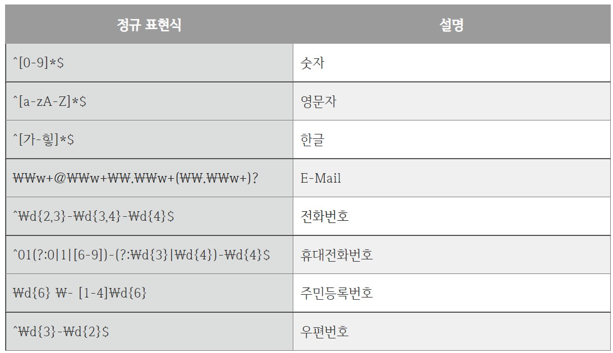

# Pattern,Matcher 클래스

## 자바 정규 표현식

정규 표현식(Regular expression)은 줄여서 Regex라고 한다.
정규 표현식은 문자열에 어떤 패턴의 문자들이 있는지 찾는데 도움을 준다.

## 자주 사용하는 정규 표현식

자바에서 정규 표현식을 사용하려면 [java.util.regex](https://docs.oracle.com/javase/8/docs/api/index.html?java/util/regex/package-summary.html) 패키지의 Pattern, Matcher 클래스를 사용한다.

## [Pattern](https://docs.oracle.com/javase/8/docs/api/index.html?java/util/regex/package-summary.html)

주어진 표현식과 입력값을 검증하기 위해서는 Pattern 클래스의 matches() 메소드를 사용한다. 
matches() 메소드는 검증 후 주어진 문자열이 정규 표현식과 일치하면 true, 그렇지 않으면 false를 리턴한다.

<pre>
<code>
public static boolean matches(String regex,
                              CharSequence input)
</code>
</pre>

- regex : 정규 표현식
- input : 정규 표현식과 교차 검증될 문자열

아래 코드는 matches() 메소드를 활용하여 입력 문자열이 영문 대/소문자인지 아닌지의 여부를 확인한다.

<pre>
<code>
public class Main {
    public static void main(String[] args) {

        String regexPattern = "^[a-zA-Z]*$"; // 영문자
        String str = "가나다라";

        boolean regex = Pattern.matches(regexPattern, str);
        System.out.println(regex); // false
    }
}
</code>
</pre>

## [Matcher](https://docs.oracle.com/javase/8/docs/api/index.html?java/util/regex/package-summary.html)

Matcher 클래스는 Pattern 클래스에서 생성된 패턴을 해석하여 주어진 패턴과 일치하는지 판별한다.

Matcher의 주요 메소드는 다음과 같다.

| 메소드명 | 리턴 타입 | 설명 |
| --- | --- | --- |
| find() | boolean | 패턴과 일치하는 다음 입력값이 있다면 true 리턴 |
| group() | String | 매치와 매치되는 문자열 반환 |
| pattern() | Pattern | matcher에 의해 해석된 패턴을 리턴 |
| replaceFirst(String replacement) | String | 패턴과 일치하는 입력값을 주어진 문자열로 대체한다 |

아래 코드는 문자열 리스트에서 숫자를 가져온다.

<pre>
<code>
public class Main {
    public static void main(String[] args) {

        List<String> numbers = Arrays.asList("7", "123", "B3", "A676A1");

        Pattern pattern = Pattern.compile("\\d+");

        for(String num : numbers) {
            
            Matcher matcher = pattern.matcher(number);
            while(matcher.find()) {
                System.out.println(matcher.group());
            }
        }
    }
}

결과)
7
123
3  
676
1  
</code>
</pre>

# 참고
* [코딩팩토리](https://coding-factory.tistory.com/529)
* [codechacha](https://codechacha.com/ko/java-regex/)
* [Mkyong](https://mkyong.com/java/java-regular-expression-examples/)
