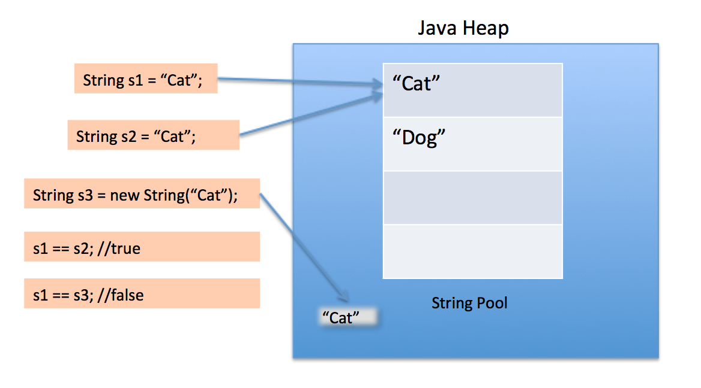

# String Pool

String Pool은 JVM에서 관리되는 String 저장 전용 메모리 영역이다.

String은 불변성(immutability)을 가지기 때문에 String Pool에 오직 하나의 문자열만 저장되는데, 이 과정을 interning이라고 한다.(interning은 '내부에 추가하다'의 의미를 가지는 것 같다.) 

String 변수를 생성하고 원하는 값으로 초기화 후 해당 변수를 다시 호출하면 JVM에서 String Pool에 해당 String 변수와 동일한 값이 있는지 검색한다.

동일한 값이 있으면 추가로 메모리를 할당할 필요가 없다. 기존에 String Pool에 저장된 메모리 주소를 참조(reference)하면 되기 때문이다. 

동일한 값이 없으면 String Pool에 메모리를 추가(interned) 한 후 메모리 주소 참조값을 리턴한다.

그런데 위와 같이 String Pool에 저장된 값의 메모리 주소를 참조하는 방식은 String Literal로 값이 저장되었을 경우에만 해당된다. 

## String literal vs String object

new() 연산자를 사용해 생성자 형태로 만들어진 String 객체는 Heap 영역에 저장되며, 생성될 때마다 서로 다른 고유의 메모리 영역(주소)을 가진다.  
즉 값이 같더라도 다른 주소를 가지기 때문에 서로 같다(equal)고 할 수 없다.

*Spring Pool의 위치는 Java7부터 Heap 영역으로 옮겨졌다.*



```
String first = "java"; 
String second = "java"; 
System.out.println(first == second); // True

String third = new String("java");
String fourth = new String("java"); 
System.out.println(third == fourth); // False
```
String literal과 String object를 비교하면 둘은 서로 다른 메모리 주소를 참조하기 때문에 같다고 할 수 없다.
```
String fifth = "java";
String sixth = new String("java");
System.out.println(fifth == sixth); // False
```

## Intern() 메서드

Intern() 메서드의 기본 형태는 다음과 같다.
```
String 객체.intern();
```
- 만약 String Pool에 동일한 String 객체의 값이 있다면 해당 객체의 메모리 주소를 참조하여 값을 리턴한다.
- 만약 동일한 String 객체의 값이 없다면 해당 String 객체를 String Pool에 추가하고, 추가된 String 객체의 메모리 주소를 참조하여 값을 리턴한다.

```
String constantString = "interned";
String newString = new String("interned");

assertThat(constantString).isNotSameAs(newString);

String internedString = newString.intern();

assertThat(constantString)
  .isSameAs(internedString);
```

## 참고

* [www.baeldung.com](https://www.baeldung.com/java-string-pool)