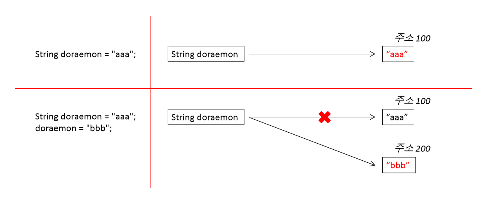

# String 객체의 불변성

## String 객체의 불변성(Immutability)

String 객체는 불변성(Immutability)을 가진다. 즉 String 객체가 한 번 생성되면 생성된 값은 변하지 않는다. 

아래 코드는 doraemon 이라는 String 객체를 생성한 후, 해당 객체에 다른 값을 할당했다.  
처음 생성된 String 객체의 값 "aaa"가 "bbb"로 변경되었으니 doraemon 객체의 값은 "bbb"라고 생각할 수 있지만, 틀렸다.

**String 객체의 값이 변경된것이 아닌 새로운 String 객체가 생성되어 그 참조가 doraemon 변수에 할당된 것이다.**

```
String doraemon = "aaa";
doraemon = "bbb";
```

처음 생성한 "aaa"와 이후 새롭게 생성된 "bbb" 두 개의 인스턴스가 Heap 영역에 저장된 것이다.

아래 그림과 같이 변수 doraemon은 "aaa"를 참조하다가 "bbb를 참조하도록 재할당 되었다.  
더이상 참조되지 않는 값 "aaa"는 Garbage Collection의 제거 대상이 된다.



## 보안상의 이점

Java에서 String은 파라미터 형태로 자주 사용된다.

- 네트워크 연결을 위한 호스트 이름과 포트 이름
- DB 연결을 위한 URL
- Java에서 파일 실행을 위해 File I/O 클래스의 인자로서 전달되는 파일 이름

위와 같은 작업 시 String이 Immutable 하다는 것이 보안상의 이점이 된다.   
String이 Immutable하지 않다면, 객체의 값이 변경될 수 있다면 악의를 가진 누군가에 의해 파일 이름 및 접근 경로가 변경될 위험이 있다. 

## 멀티스레딩에서의 이점

String 객체는 Thread Safe 하다. 여러 스레드에서 동시에 특정 String 객체를 참조하더라도 안전하다.  

String 객체의 참조값이 바뀌면 바뀐 참조값을 가진 새로운 객체가 생성된다.   
따라서 최초에 생성된 String 객체에는 변동이 없다.   
이는 최초에 생성된 String 객체의 참조값이 다른 객체의 참조값과 동기화될 염려가 없다는 것이다.

## Spring Pool을 활용한 메모리 절약

[Spring Pool 글 참고](https://github.com/chan-gon/TIL/blob/master/Java/%EA%B8%B0%ED%83%80/String%20Pool.md)

# 출처
* [stackoverflow](https://stackoverflow.com/questions/2068804/why-is-the-string-class-declared-final-in-java)
* [javarevisited.blogspot.com](https://javarevisited.blogspot.com/2010/10/why-string-is-immutable-or-final-in-java.html#axzz7Ejq54HlW)
* [www.java67.com](https://www.java67.com/2014/01/why-string-class-has-made-immutable-or-final-java.html)
* [www.netjstech.com](https://www.netjstech.com/2016/08/string-and-thread-safety-in-java.html)