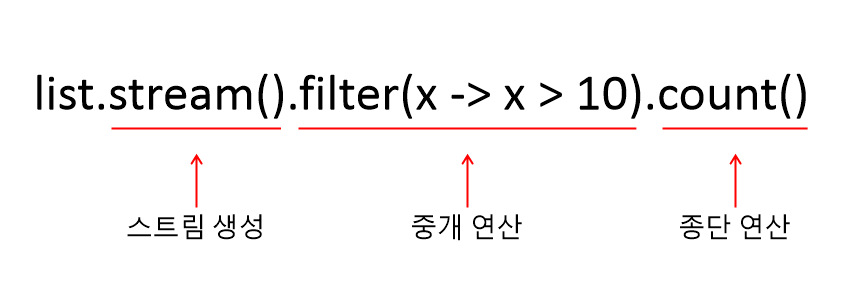

# stream

Java8에 추가된 stream은 **연속된 정보를 처리**하는데 사용된다. 여기서 '연속된 정보'라는 것은 주로 컬렉션을 말한다.  

stream은 다음과 같은 구조를 가진다.  


  

- 스트림 생성 : 컬렉션의 목록을 스트림 객체로 변환한다. 스트림 객체는 [java.util.stream](https://docs.oracle.com/javase/8/docs/api/java/util/stream/Stream.html) 패키지의 Stream 인터페이스를 말한다. stream() 메소드는 Collection 인터페이스에 선언되어 있다.
- 중개 연산 : 생성된 스트림 객체를 사용하여 중개 연산 부분에서 처리한다. 이 부분에서는 아무런 결과를 리턴하지 못한다. 그래서 중개 연산(intermediate operation) 이라고 한다.
- 종단 연산 : 마지막으로 중개 연산에서 작업된 내용을 바탕으로 결과를 리턴한다. 그래서 이 부분을 종단 연산(terminal operation) 이라고 한다.

중개 연산이 반드시 필요한 것은 아니며 필요에 따라 생략 가능하다.  
stream()은 순차적으로 데이터를 처리하는데, 0번째 인덱스부터 순차적으로 처리한다.  

스트림에서 제공하는 연산의 종류는 다음과 같다.  

| 연산자 | 설명 |
| --- | --- |
| filter(pred) | 데이터를 조건으로 거를 때 사용 |
| map(mapper) | 데이터를 특정 데이터로 변환 |
| forEach(block) | for 루프를 수행하는 것처럼 각각의 항목을 꺼냄 |
| flatMap(flat-mapper) | 스트림의 데이터를 잘게 쪼개서 새로운 스트림 제공 |
| sorted(comparator) | 데이터 정렬 |
| toArray(array-factory) | 배열로 변환 |
| any / all / noneMatch(pred) | 일치하는 것을 찾음 |
| findFirst / Any(pred) | 맨 처음이나 순서와 상관없는 것을 찾음 |
| reduce(binop) / reduce(base, binop) | 결과를 취합 |
| collect(collector) | 원하는 타입으로 데이터를 리턴 |

## stream 주요 메소드 사용 예시
---

다음 코드는 예제가 되는 정보를 담은 Student 클래스이다.
```
public class Student {
    String name;
    int age;
    int scoreMath;

    public Student(String name, int age, int scoreMath) {
        this.name = name;
        this.age = age;
        this.scoreMath = scoreMath;
    }

    public String getName() {
        return name;
    }

    public void setName(String name) {
        this.name = name;
    }

    public int getAge() {
        return age;
    }

    public void setAge(int age) {
        this.age = age;
    }

    public int getScoreMath() {
        return scoreMath;
    }

    public void setScoreMath(int scoreMath) {
        this.scoreMath = scoreMath;
    }
}
```

### forEach
---

생성한 Student 클래스를 바탕으로 forEach 메소드를 사용해서 이름만 출력했다.  
```
import java.util.ArrayList;
import java.util.List;

public class Main {
    public static void main(String[] args) {
        List<Student> studentList = new ArrayList<>();
        studentList.add(new Student("Kim", 24, 88));
        studentList.add(new Student("Park", 33, 65));
        studentList.add(new Student("Hong", 54, 55));
        studentList.add(new Student("Lee", 27, 68));

        studentList.stream().forEach(student -> System.out.println(student.getName()));
    } 
}

결과)
Kim
Park
Hong
Lee
```

위 코드에서 forEach 메소드 내부에 사용된 **student**는 studentList에 담긴 List 컬렉션 객체이다.   
위 코드에서 사용된 forEach 구문은 아래와 같이 사용해도 결과는 동일하다.
```
for (Student student : studentList) {
            System.out.println(student.getName());
        }
```

### map
---

아래 코드는 map을 사용해서 먼저 특정 데이터로 데이터를 한정시킨 후 forEach 메소드로 출력했다. 이렇게 map()을 사용하면 **스트림에서 처리하는 값들을 중간에 변경할 수 있다.**
map이나 forEach 메소드에 사용되는 student, age와 같은 이름은 특정 이름으로 강제되지 않기 때문에 사용자 마음대로 바꿀 수 있다.  

```
import java.util.ArrayList;
import java.util.List;

public class Main {
    public static void main(String[] args) {
        List<Student> studentList = new ArrayList<>();
        studentList.add(new Student("Kim", 24, 88));
        studentList.add(new Student("Park", 33, 65));
        studentList.add(new Student("Hong", 54, 55));
        studentList.add(new Student("Lee", 27, 68));

        studentList.stream().map(student -> student.getAge()).forEach(age -> System.out.println(age));
    }
    
}

결과)
24
33
54
27
```

앞서 사용된 forEach의 출력 문장은 다음과 같이 처리할 수도 있다.  
```
studentList.stream().map(student -> student.getAge()).forEach(System.out::println);
```

더블 콜론(::)은 메소드 참조(Method Reference)를 의미한다.

| 종류 | 예시 |
| --- | --- |
| static 메소드 참조 | ContainingClass::staticMethodName |
| 특정 객체의 인스턴스 메소드 참조 | containingObject::instanceMethodName |
| 특정 유형의 임의의 객체에 대한 인스턴스 메소드 참조 | ContainingType::methodName |
| 생성자 참조 | ClassName::new |

### filter
---

filter()는 특정 데이터나 요청을 걸러낼 때 사용한다.

만약 수학 점수가 80점 이상인 사람만 걸러내고 싶다면 다음과 같이 코드를 작성한다.
참고로 아래 코드에서 생성된 인스턴스의 세 번째 값이 수학 점수를 나타낸다.

```
import java.util.ArrayList;
import java.util.List;

public class Main {
    public static void main(String[] args) {
        List<Student> studentList = new ArrayList<>();
        studentList.add(new Student("Kim", 24, 88));
        studentList.add(new Student("Park", 33, 65));
        studentList.add(new Student("Hong", 54, 55));
        studentList.add(new Student("Lee", 27, 68));

        studentList.stream().filter(student -> student.getScoreMath() > 80).forEach(name -> System.out.println(name.getName()));
    }
    
}

결과)
Kim
```

위 코드에서 사용된 filter()는 일반 for 문을 사용하면 아래와 같이 표현될 수 있다.
```
for (Student student : studentList) {
   if(student.getScoreMath() > 80) {
      System.out.println(student.getName());
   }
}
```

# 출처
* [자바의 신](http://www.yes24.com/Product/Goods/42643850)