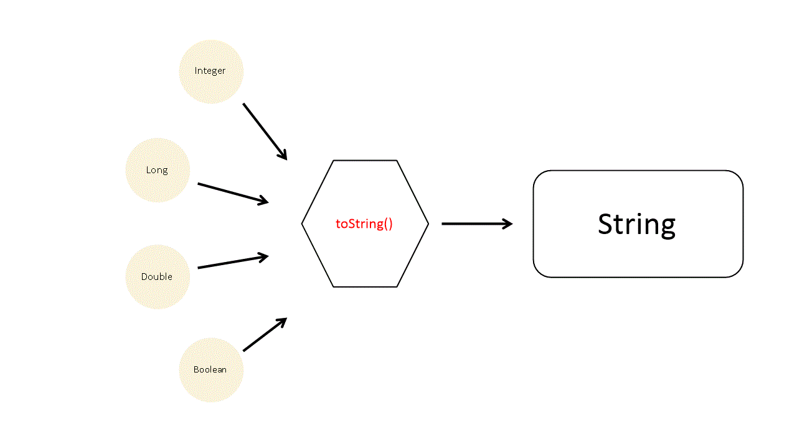

# toString 메소드

## toString() 메소드는 왜 사용할까?

다른 사람이 구현한 코드를 보면 클래스에 toString() 메소드를 재정의한 형태를 볼 수 있다. 이는 다음과 같은 궁금증을 유발한다.  

- 왜 저렇게 했을까? 

- 저렇게 하는것이 규칙인가? 
- 잘 모르겠고 그냥 저렇게 하는가보다 생각하자!

첫 번째와 두 번째는 갱생의 여지가 있지만, 세 번째의 경우 갱생의 여지(발전의 기회)가 거의 없는 상황이다. 앎의 과정은 고통스럽다. 하지만 알아야 한다는 사실을 알고도 이를 무시하고 시간을 보낸다면 언젠가 게으름에 대한 대가를 치르게 된다. 무지의 고통에서 벗어나야 한다. 제발.(=> 본인에게 하는 말입니다.)

### 이런 삶에서 벗어나야 한다..


## toString() 메소드 소개

Object는 모든 클래스의 부모 클래스이다. 개발자가 생성한 어떤 클래스도 Object 클래스를 자동으로 상속하기 때문에 Object 클래스의 메소드를 사용할 수 있다.  

그 중에서 toString() 메소드는 객체를 문자열로 리턴하는 메소드이다. 그리고 가장 많이 사용되는 메소드이다.



먼저 toString() 메소드가 어떻게 출력되는지 알아보자.  

예시로 사용할 Member 클래스를 간단하게 정의했다. name, age를 인자로 가지는 생성자를 구현할 수 있도록 했다.  
그리고 main 메소드에 Member 클래스의 인스턴스를 생성한 후 System.out.println() 메소드를 통해 객체만 출력했을 경우와 객체에 toString() 메소드를 적용했을 경우 출력값의 차이점이 있는지 알아본다. 

```
public class Member {

    private String name;
    private int age;

    public Member(String name, int age) {
        this.name = name;
        this.age = age;
    }  

}

public class Main {
    public static void main(String[] args) {
        Member member = new Member("Brad", 16);
        System.out.println(member);
        System.out.println(member.toString());
    }
}

결과)
Member@123772c4
Member@123772c4
```

## System.out.println(member); => 자바 컴파일러가 자동으로 toString() 메소드를 호출

위 예제를 통해 객체만 출력한 경우, 그리고 객체에 toString() 메소드를 적용했을 때의 출력값이 같다.  

```
System.out.println(member);
System.out.println(member.toString());
```

그렇다면 객체만 출력한 것과 객체에 toString() 메소드를 적용한 것이 동일하다는 것일까? 그렇다. 동일하다.  
기본적으로 PrintStream 클래스의 출력 관련 메소드(print, println 등)를 통해 객체를 출력하도록 명령하면 자바 컴파일러가 내부적으로 toString() 메소드를 호출한다. 굳이 **객체.toString** 형태를 가질 필요가 없다. 

## toString()의 결과값을 원하는대로 재정의하자

위 예제의 결과값으로 @를 기준으로 클래스명과 해시코드값이 출력되었다.  
Object 클래스의 toString() 메소드 형태는 아래의 형태로 출력된다.  

```
getClass().getName() + '@' + Integer.toHexString(hashCode())
```

위의 공식에 따라 toString() 메소드가 출력되기 때문에 예제를 통해 출력한 결과값인 **Member@123772c4**의 형태를 이해할 수 있다.  

만약 해시코드값이 아니라 내가 인스턴스 생성 시 설정한 객체의 값을 출력하고 싶다. 어떻게 해야 할까? toString 메소드를 Overriding(재정의) 하면 된다.  

초반에 정의했던 Member 클래스에 toString() 메소드를 재정의하자.  
리턴값은 개발자가 원하는 값으로 마음대로 설정할 수 있다.  

IDE를 사용한다면 기본적으로 메소드 오버라이딩 기능을 지원하기 때문에 쉽게 메소드 재정의 작업을 할 수 있다.  

아래와 같이 Member 클래스에 toString() 메소드를 원하는 방향으로 재정의했다.  
그리고 main 메소드에 Member 클래스 인스턴스 생성 후 출력하도록 구현했다. 자바는 객체 출력 시 자동으로 toString 메소드를 호출한다는 사실을 알았기 때문에 **객체.toString**과 같은 형태를 더이상 사용하지 않았다.  

```
public class Member {

    private String name;
    private int age;

    public Member(String name, int age) {
        this.name = name;
        this.age = age;
    }  

    @Override
    public String toString() {
        return "Name: " + name + " Age: " + age; 
    }
}

public class main {
    public static void main(String[] args) {
        Member member = new Member("Brad", 16);
        System.out.println(member);
    }
}

결과)
Name: Brad Age: 16
```

결과값이 toString() 메소드를 재정의한 형태로 출력되었다. 기분이 좋다.  

