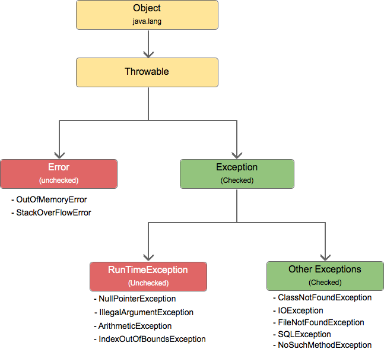

# 예외

## try-catch
---

아래 코드를 실행시켜본다.

```
public class Exception {
    public static void main(String[] args) {
        Exception excpt = new Exception();
        excpt.arrayOutOfBounds();

    }

    public void arrayOutOfBounds(){
        int[] intArr = new int[5];
        System.out.println(intArr[5]);
    }
    
}
```

결과는 다음과 같다.

```
Exception in thread "main" java.lang.ArrayIndexOutOfBoundsException: Index 5 out of bounds for length 5
        at Exception.arrayOutOfBounds(Exception.java:10)
        at Exception.main(Exception.java:4)
```
맨 윗줄에는 예외가 발생한 클래스의 메소드 이름 및 관련 정보가 표시된다.
그 다음으로 at으로 시작하는 스택 호출 추적(call stack trace 또는 스택 트레이스) 문장들이 출력된다.

위의 코드를 try-catch 블록으로 구성해본다. 예외가 발생한 메소드 arrayOutOfBounds에 try-catch 블록을 사용한다.
- try 뒤에 예외가 발생하는 문장들을 묶는다.
- cach 안에 예외가 발생했을 때의 로직을 구현한다.

```
public class ExceptionTryCatch {
    public static void main(String[] args) {
        ExceptionTryCatch excpt = new ExceptionTryCatch();
        excpt.arrayOutOfBounds();

    }

    public void arrayOutOfBounds(){
        int[] intArr = new int[5];
        try {
            System.out.println(intArr[5]);
        } catch (Exception e) {
            
        }
    }
}
```

위 코드를 실행하면 **아무것도 출력되지 않는다.** 그 이유는 try 블록 안에서 예외가 발생하면 바로 catch 블록으로 넘어가기 때문이다.

코드를 아래와 같이 수정한다. catch 블록 안에 에러가 발생했을 경우 어떤 메시지를 출력하도록 했다.

```
public class ExceptionTryCatch {
    public static void main(String[] args) {
        ExceptionTryCatch excpt = new ExceptionTryCatch();
        excpt.arrayOutOfBounds();

    }

    public void arrayOutOfBounds(){
        int[] intArr = new int[5];
        try {
            System.out.println(intArr[5]);
        } catch (Exception e) {
          System.err.println("에러 발생");  
        }
    }
}
```

위 코드를 실행하면 catch 블록 안의 "에러 발생" 메시지가 출력된다.

## try-catch 변수 선언 위치 주의사항
---

try-catch 각 블록 내에서 선언된 변수는 다른 블록에서 사용할 수 없다. try 블록에서 선언된 변수는 catch 블록에서 사용될 수 없다.

```
public class ExceptionTryCatch {
    public static void main(String[] args) {
        ExceptionTryCatch excpt = new ExceptionTryCatch();
        excpt.arrayOutOfBounds();

    }

    public void arrayOutOfBounds(){
        int[] intArr = new int[5];
        try {
            String hello = "hello";
            System.out.println(intArr[5]);
        } catch (Exception e) {
            System.err.println(hello);
        }
    }
}
```
위 코드에서 try 블록 안에 hello 문자열 변수를 선언했다. 그리고 catch 블록에서 hello 변수를 호출하도록 코드를 작성했다.
결과는 hello 변수를 찾을 수 없다는 에러 메시지가 출력된다. 즉 try 블록에서 선언된 변수는 catch 블록에서 사용될 수 없다는 것을 확인할 수 있다.

try-catch 두 블록에서 공통으로 사용될 수 있는 변수는 try 앞에 미리 선언해 놓도록 한다.

## finally
---

try-catch 블록 이후 finally 블록이 추가되기도 한다. finally는 **어떠한 경우에도 반드시 실행하는** 코드를 작성할 때 사용된다.

아래 코드는 finally 블록을 추가했다.

```
public class ExceptionTryCatch {
    public static void main(String[] args) {
        ExceptionTryCatch excpt = new ExceptionTryCatch();
        excpt.arrayOutOfBounds();

    }

    public void arrayOutOfBounds(){
        int[] intArr = new int[5];
        try {
            System.out.println(intArr[5]);
        } catch (Exception e) {
            System.out.println("Error occured");
        }finally {
            System.out.println("finally area");
        }
        System.out.println("end");
    }
}

결과)
Error occured
finally area
end
```

finally 블록은 일반적으로 코드의 중복을 피하기 위해 사용된다.

## 두 개 이상의 catch 블록 사용하기
---

catch 블록 작성 시 중괄호( {} ) 전의 소괄호( () )에는 **예외의 종류**를 명시한다. 

아래 코드는 두 개의 catch 블록을 사용했다.

```
public class ExceptionTryCatch {
    public static void main(String[] args) {
        ExceptionTryCatch excpt = new ExceptionTryCatch();
        excpt.arrayOutOfBounds();

    }

    public void arrayOutOfBounds(){
        int[] intArr = new int[5];
        try {
            System.out.println(intArr[5]);
        } catch (ArrayIndexOutOfBoundsException e) {
            System.out.println("ArrayIndexOutOfBoundsException occured");
        } catch(Exception e) {
            System.out.println("Error occured");
        }
    }
}

결과)
ArrayIndexOutOfBoundsException occured
```

위 코드를 실행하면 두 개의 catch 블록 중에서 ArrayIndexOutOfBoundsException 예외가 명시된 catch 블록이 실행된다.
여기까지만 보면 단순하게 ArrayIndexOutOfBoundsException 예외가 명시된 catch 블록이 Exception 예외가 명시된 catch 블록보다 정확(또는 명확)하게 예외를 명시했기 때문에 해당 catch 블록을 실행했거나, ArrayIndexOutOfBoundsException 예외가 명시된 catch 블록의 순서가 앞에 있었기 때문에 먼저 실행된 것이라고 생각할 수 있다.

**catch 블록은 순서를 따지고, catch 블록의 순서는 매우 중요하다.**

catch 문의 순서를 다음과 같이 바꾸어 보자.

```
public class ExceptionTryCatch {
    public static void main(String[] args) {
        ExceptionTryCatch excpt = new ExceptionTryCatch();
        excpt.arrayOutOfBounds();

    }

    public void arrayOutOfBounds(){
        int[] intArr = new int[5];
        try {
            System.out.println(intArr[5]);
        } catch (Exception e) {
            System.out.println("Exception occured");
        } catch(ArrayIndexOutOfBoundsException e) {
            System.out.println("ArrayIndexOutOfBoundsException occured");
        }
    }
}

결과)
Unreachable catch block for ArrayIndexOutOfBoundsException. It is already handled by the catch block for Exception
```

에러가 발생한다. 
Exception 예외가 명시된 catch 블록에서 이미 예외 처리를 담당하고 있기 때문에 굳이 ArrayIndexOutOfBoundsException 예외 처리가 필요 없다는 메시지로 해석된다.

## 모든 예외의 부모 클래스는 java.lang.Exception 클래스
---

위의 코드에서 에러가 발생한 이유는 다음과 같다.
- 모든 예외의 **부모 클래스**인 Exception 클래스에서 이미 catch 하여 예외 처리를 했다.
- 그 다음 catch 문에 선언된 **자식 클래스** ArrayIndexOutOfBoundsException가 예외를 처리할 기회가 없다.

일반적으로 catch문을 사용할 때에는 Exception 클래스로 catch 하는 것을 가장 아래에 추가할 것을 권장한다. 가장 마지막 catch 블록을 Exception 클래스로 선언하면 예상치 못한 예외가 발생하여도 예외가 빠져 나가지 않게 막아주기 때문이다.

## 모든 예외의 공통 부모 클래스 Throwable

Object 클래스 이외에 Exception과 Error의 공통 부모 클래스는 Throwable이 있다.



출처 : https://whereishq.blogspot.com/2021/01/9.html

Exception, Error 클래스는 Throwable 클래스를 상속받아 처리하도록 되어있다. 따라서 Exception, Error로 처리할 때 Throwable로 처리해도 무관하다.  
Throwable 클래스에 선언되어 있고 Exception 클래스에서 Overriding한 메소드 중 자주 사용되는 메소드들은 다음과 같다.

- getMessage()
예외 메시지를 String 형태로 리턴한다. 예외가 출력되었을 때 **어떤 예외가 발생되었는지를 확인할 때** 유용하다.
개발자가 별도의 예외 메시지를 사용자에게 보여주려고 할 때 활용된다.

- toString()
에외 메시지를 String 형태로 리턴한다. getMessage() 메소드보다는 약간 더 자세하게(예외 클래스 이름 포함) 리턴한다.

- printStackTrace()
가장 첫 줄에는 예외 메시지를 출력, 두 번째 줄부터는 예외가 발생하게 된 메소드들의 호출 관계(스택 트레이스)를 출력한다.

아래 코드는 getMessage()와 toString() 메소드의 출력 결과를 비교한다.

### getMessage()
```
public class ExceptionTryCatch {
    public static void main(String[] args) {
        ExceptionTryCatch excpt = new ExceptionTryCatch();
        excpt.arrayOutOfBounds();

    }

    public void arrayOutOfBounds(){
        int[] intArr = new int[5];
        try {
            System.out.println(intArr[5]);
        } catch (Throwable t) {
            System.out.println(t.getMessage());
        } 
    }
}

결과)
Index 5 out of bounds for length 5
```

### toString()
```
public class ExceptionTryCatch {
    public static void main(String[] args) {
        ExceptionTryCatch excpt = new ExceptionTryCatch();
        excpt.arrayOutOfBounds();

    }

    public void arrayOutOfBounds(){
        int[] intArr = new int[5];
        try {
            System.out.println(intArr[5]);
        } catch (Throwable t) {
            System.out.println(t.toString());
        } 
    }
}

결과)
java.lang.ArrayIndexOutOfBoundsException: Index 5 out of bounds for length 5
```

getMessage()와 toString() 메소드보다 좀 더 자세한 결과를 얻고 싶다면 printStackTrace() 메소드를 사용한다.

### printStackTrace()
```
public class ExceptionTryCatch {
    public static void main(String[] args) {
        ExceptionTryCatch excpt = new ExceptionTryCatch();
        excpt.arrayOutOfBounds();

    }

    public void arrayOutOfBounds(){
        int[] intArr = new int[5];
        try {
            System.out.println(intArr[5]);
        } catch (Throwable t) {
            t.printStackTrace();
        } 
    }
}

결과)
java.lang.ArrayIndexOutOfBoundsException: Index 5 out of bounds for length 5
        at ExceptionTryCatch.arrayOutOfBounds(ExceptionTryCatch.java:11)
        at ExceptionTryCatch.main(ExceptionTryCatch.java:4)
```

# 출처
* [자바의 신](http://www.yes24.com/Product/Goods/42643850)


