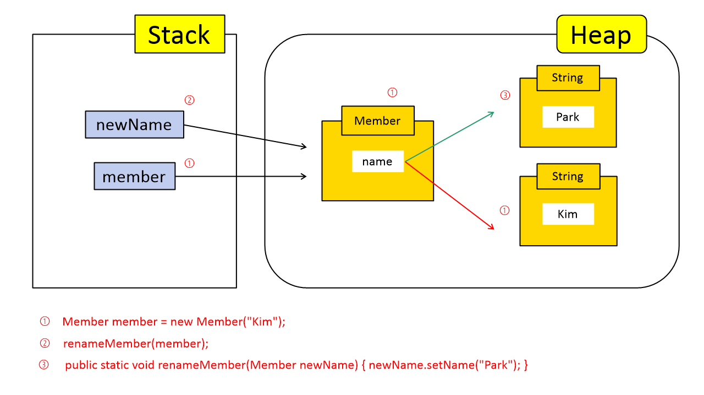

# 자바 메모리 Heap 그리고 Stack

Heap과 Stack이 구체적으로 코드에서 어떻게 관리되는지 알아본다.  

## Stack은 무엇인가요?

- Stack 영역은 Thread 당 하나씩 할당이 된다. Thread가 새롭게 생성되면 해당 Thread에 해당하는 Stack 영역도 새로 생성이 된다. 다른 Thread의 Stack 영역에는 접근 할 수 없다.  

- Stack의 데이터는 LIFO(Last In First Out) 형태로 관리된다. 

- 스코프(scope) 범위를 벗어나면 Stack 메모리에서 사라진다.

- 원시 타입의 데이터가 값과 함께 할당(int, boolan, double 등의 실제 값이 스택에 할당) 

- 지역 변수, 파라미터, 리턴 값, 연산에 사용되는 임시 값등이 생성되는 영역이다. 메소드를 호출할 때마다 스택 영역이 생성되고, 기본 타입 변수나 참조 타입 변수가 쌓이고 사라지고 반복한다.

- 객체 생성 시 객체를 참조하는 변수가 저장됨. Member member = new Member()로 객체를 생성하면 객체를 참조하는 변수 member는 Stack에, 변수 member가 참조하는 객체 주소를 가지고 있는 객체는 Heap에 저장된다.

## Heap은 무엇인가요?

- 모든 스레드가 공유하는 영역(스레드 개수에 상관없이 단 하나의 Heap 영역만 존재한다)

- Object 타입의 데이터가 저장 (String, Interger, ArrayList 등의 Object 타입)  

- Stack처럼 LIFO 형식으로 관리되지 않고 랜덤하게 할당한다. 

## 코드로 보는 Stack과 Heap의 동작 방식

다음과 같은 Member 클래스를 바탕으로 Main 클래스의 main 메소드를 작성했다.  

```
public class Member {
    String name;

    public Member(String name) {
        this.name = name;
    }

    public String getName() {
        return name;
    }

    public void setName(String name) {
        this.name = name;
    }
}

public class Main {
    public static void main(String[] args) {
        Member member = new Member("Kim"); // 1
        renameMember(member); // 2
        System.out.println(member.getName());
    }

    public static void renameMember(Member newName) { // 3 
        newName.setName("Park");
    }
}
```

main 메소드의 구성을 위에서 아래로 하나씩 살펴보자.  

- **Member member = new Member("Kim");** : Kim 이라는 값을 가지는 Member 클래스 객체 생성.

- **renameMember(member);** : Member 클래스 객체를 매개변수로 가지는 renameMember() 메소드 호출.

- **public static void renameMember(Member newName) { newName.setName("Park"); }** : 최초에 생성한 객체 member의 값을 Kim 에서 Park으로 변경.

코드에 따른 Stack, Heap 동작 방식을 그림으로 표현하면 아래와 같다.



먼저 Member 클래스에 정의된 대로 Member 클래스의 name 필드가 포함된 객체가 생성되었다. 그리고 그 객체는 Member 클래스 객체 생성 시 함께 생성된 String 객체의 값을 참조한다. 참고로 String은 객체이기 때문에 위 이미지와 같이 Heap 영역에서 Member 객체와 붙어있지 않고 따로 생성된다.  

혹시 왜 String이 Member 클래스 객체와 붙어있지 않고 따로 생성되는지 명확히 이해가 되지 않는다면 **Member member = new Member("Kim");** 코드를 조금 다르게 작성해보자. 이 코드는 아래와 같이 작성할수도 있다. 이렇게 보면 왜 String 객체가 Member 클래스 객체와 붙어있지 않고 독립적으로 Heap 영역에 생성되었는지 조금은 이해할 수 있지 않을까 생각한다.  

```
Member member = new Member(new String("Kim"));
```

이후 renameMember() 메소드를 호출하는데, renameMember() 메소드는 newName 이라는 매개변수를 가지고 있고 Member 객체를 참조한다. newName 변수는 Stack에 저장되고 Heap에 저장된 Member 객체를 참조한다. 또한 이 단계에서 setName() 메소드로 이름이 변경된다. 이름이 변경된다는 것은 새로운 String 객체를 생성했다는 의미와 같다. 따라서 Member 객체는 새로 생성된 String 객체값 Park를 참조한다.  

위 이미지에서 Kim 객체값은 빨간색 화살표, Park 객체값은 초록색 화살표로 표시되어 있는데, Member 객체가 참조하는 참조값이 빨간색 화살표에서 초록색 화살표로 변경되었다는 의미로 생각하면 된다. 참조값이 변경되었으니 Kim 객체값은 더이상 사용되지 않는다. 따라서 이후에 가비지 컬렉터에 의해 제거된다.  

renameMember() 메소드를 호출해서 이름을 변경했고, Member 객체가 새롭게 생성된 Park 객체를 참조하는 단계까지 완료되었다. 이제 코드 실행 방향이 renameMember() 메소드를 벗어나 main 메소드의 System.out.println(member.getName()); 으로 이동했다. 즉 renameMember() 메소드의 newName 변수의 역할은 끝났다.(스코프를 벗어났다) 따라서 LIFO 형식으로 관리되는 Stack의 특성에 따라 Stack에서 newName 변수가 제거되고(pop), 초반에 생성된 member 변수가 Heap 영역의 Member 객체를 참조한다.   

System.out.println(member.getName()); 코드는 Member 객체의 name 필드값을 출력하는 getName() 메소드를 호출한다. 현재 Member 객체의 name 필드는 Park이라는 값을 가지고 있는 String 객체를 참조하고 있기 때문에 Park이라는 값을 출력한다.

# 참고
* [Virtual Pair Programmer](https://www.youtube.com/watch?v=ckYwv4_Qtmo)
* [Virtual Pair Programmer](https://www.youtube.com/watch?v=7IkpIQc8OCw)
* [weekyear](https://week-year.tistory.com/141)
* [원시타입-참조타입](https://velog.io/@gillog/%EC%9B%90%EC%8B%9C%ED%83%80%EC%9E%85-%EC%B0%B8%EC%A1%B0%ED%83%80%EC%9E%85Primitive-Type-Reference-Type)
* [10분 테코톡🎅무민의 JVM Stack & Heap](https://www.youtube.com/watch?v=UzaGOXKVhwU)
* [JVM Internal](https://d2.naver.com/helloworld/1230)