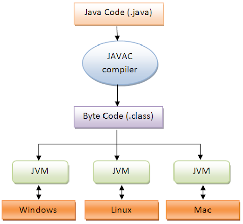
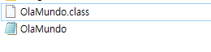
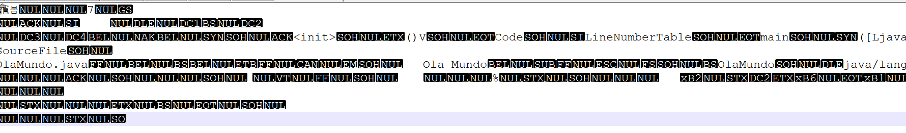

# 자바 클래스 파일(.class)

자바 소스 코드로 작성된 .java 파일이 컴파일러에 의해 컴파일 되면 .class 확장자를 가지고 있는 자바 클래스 파일이 생성된다.   
자바 클래스 파일은 .java 파일에 정의된 클래스 개수에 따라 하나 혹은 여러 개가 생성될 수 있다.  

자바 클래스 파일은 바이트 코드로 구성되어 있다. 이 바이트 코드는 JVM이 이해할 수 있는 명령어이다.  
그리고 바이트 코드 안에는 Windows 또는 Mac과 같은 특정 구현 환경에 맞는 머신 레벨 명령어로 변환하는 코드가 포함되어 있다.  

자바 바이트 코드는 JVM이 이해할 수 있도록 설계되었다. 그리고 플랫폼 의존적인 코드가 없다.  
따라서 JVM이 설치된 장비라면 CPU나 운영체제가 다르더라도 자바 프로그램을 실행할 수 있다. JVM을 중간에 두고 JVM을 통해 실행하도록 만들면 된다.  

## 자바 클래스 파일은 어떤 모습일까?



간단한 클래스를 작성하고 컴파일 해보자.  
OlaMundo.java 파일을 생성하고 코드를 작성했다.  

```
public class OlaMundo {
    public static void main(String[] args) {
        System.out.println("Ola Mundo");
    }
}
```

해당 클래스를 명령어를 통해 컴파일한다. 컴파일 시 해당 클래스가 있는 경로로 이동해서 명령어를 작성해야 한다.  

```
javac [클래스 이름].java
```

```
javac OlaMundo.java
```

명령어 작성 이후 별다른 메시지 없다면 성공이다. 이제 해당 클래스가 있는 경로로 이동해서 .class 파일 생성 여부를 확인해본다.  



생성된 자바 클래스 파일에 어떤 내용이 포함되어 있는지 확인해본다.  
이것이 JVM이 이해할 수 있는 바이트 코드인가? 뭔가 검정 마커로 엄청나게 검열당한 문서를 보는 느낌이다.  



# 참고
* [what is class file in Java](https://www.java67.com/2012/08/what-is-class-file-in-java-how-to-create-class.html)
* [JVM Internal](https://d2.naver.com/helloworld/1230)