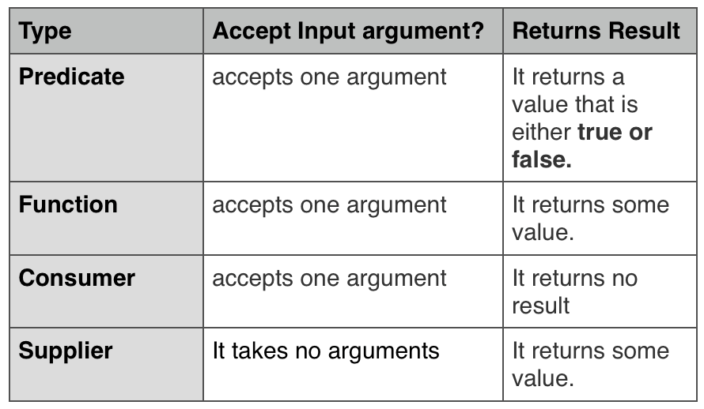

# 람다식

람다식(Lambda Expressions)은 익명 함수(anonymous function)를 생성하기 위한 식으로 객체 지향 언어보다는 함수 지향 언어에 가깝다.
람다식의 형태는 매개 변수를 가진 코드 블록이지만, 런타임 시에는 익명 구현 객체를 생성한다.

> 람다식 -> 매개 변수를 가진 코드 블록 -> 익명 구현 객체

예를 들어 Runnable 인터페이스의 익명 구현 객체를 생성하는 전형적인 코드는 아래와 같다.

<pre>
<code>
Runnable runnable = new Runnable() {
    public void run() {
        ...
    }
};
</code>
</pre>

위 코드에서 익명 구현 객체를 람다식으로 표현하면 다음과 같다.

<pre>
<code>
Runnable runnable = () -> { ... };
</code>
</pre>

람다식은 "(매개변수) -> {실행코드}" 형태로 작성된다. 함수 정의 형태를 띠고 있지만 런타임 시 인터페이스의 익명 구현 객체로 생성된다. 어떤 인터페이스를 구현할 것인가는 대입되는 인터페이스에 달려있다. 위 코드는 Runnable 변수에 대입되므로 람다식은 Runnable의 익명 구현 객체를 생성하게 된다.

## 람다식 기본 문법

<pre>
<code>
(타입 매개변수, ...) -> {실행문; ...}
</code>
</pre>

(타입 매개변수, ...)는 오른쪽 중괄호 {} 블록을 실행하기 위해 필요한 값을 제공한다. 매개 변수의 이름은 자유롭게 설정할 수 있다. -> 기호는 매개 변수를 이용해서 중괄호 {}를 실행한다는 뜻이다. 예를 들어 int 매개 변수 ace의 값을 콘솔에 출력하기 위해 다음과 같이 람다식을 작성한다.

<pre>
<code>
(int ace) -> { System.out.println(ace); }
</code>
</pre>

매개 변수 타입은 런타임 시 대입되는 값에 따라 자동으로 인식될 수 있기 때문에 람다식에서는 매개 변수의 타입을 일반적으로 언급하지 않는다. 따라서 위 코드는 다음과 같이 작성할 수 있다.

<pre>
<code>
(ace) -> { System.out.println(ace); }
</code>
</pre>

하나의 매개 변수만 있다면 괄호 ()를 생략할 수 있고, 하나의 실행문만 있다면 중괄호 {}도 생략할 수 있다. 따라서 위 코드는 다음과 같이 작성할 수 있다.

<pre>
<code>
ace -> System.out.println(ace)
</code>
</pre>

만약 매개 변수가 없다면 람다식에서 매개 변수 자리가 없어지므로 다음과 같이 빈 괄호 ()를 반드시 사용해야 한다.

<pre>
<code>
() -> { 실행문; ... }
</code>
</pre>

중괄호 {}를 실행하고 결과값을 리턴해야 한다면 다음과 같이 return문으로 결과값을 지정할 수 있다.

<pre>
<code>
(x, y) -> { return x * y; };
</code>
</pre>

중괄호 {}에 return문만 있을 경우 람다식에서는 return문을 사용하지 않고 다음과 같이 작성하는 것이 일반적이다.

<pre>
<code>
(x, y) -> return x * y
</code>
</pre>

## 타겟 타입과 함수적 인터페이스

자바의 메소드는 단독으로 선언될 수 없고 항상 클래스의 구성 멤버로 선언되어야 하기 때문에 람다식은 단순히 메소드를 선언하는 것이 아니라 이 메소드를 가지고 있는 객체를 생성해 낸다.

> 인터페이스 변수 = 람다식;

람다식은 인터페이스 변수에 대입되는데, 이는 람다식은 인터페이스의 익명 구현 객체를 생성한다는 뜻이다. 인터페이스는 직접 객체화할 수 없기 때문에 구현 클래스가 필요한데, 람다식은 익명 구현 클래스를 생성하고 객체화한다. 람다식은 대입될 인터페이스의 종류에 따라 작성 방법이 달라지기 때문에 람다식이 대입될 인터페이스를 람다식의 타겟 타입(target type)이라고 한다.

### 함수적 인터페이스(@FunctionalInterface)

모든 인터페이스를 람다식의 타겟 타입으로 사용할 수는 없다. 람다식이 하나의 메소드를 정의하기 때문에 두 개 이상의 추상 메소드가 선언된 인터페이스는 람다식을 이용해서 구현 객체를 생성할 수 없다. 하나의 추상 메소드가 선언된 인터페이스만이 람다식의 타겟 타입이 될 수 있다. 이러한 인터페이스를 함수적 인터페이스(functional interface)라고 한다. 함수적 인터페이스 작성 시 두 개 이상의 추상 메소드가 선언되지 않도록 컴파일러가 체킹해주는 기능이 있는데, 인터페이스 선언 시 @FunctionalInterface 어노테이션을 사용하면 된다. 이 어노테이션은 두 개 이상의 추상 메소드 작성 시 컴파일 오류를 발생시킨다.

<pre>
<code>
@FunctionalInterface
public interface MyFunctionalInterface {
    public void method1();
    public void method2(); // 컴파일 오류 발생
}
</code>
</pre>

@FunctionalInterface 어노테이션은 선택사항이다.(Optional) 이 어노테이션이 없어도 하나의 추상 메소드만 있다면 모두 함수적 인터페이스이다. 
람다식은 타겟 타입인 함수적 인터페이스가 가지고 있는 추상 메소드 선언 형태에 따라 작성 방법이 달라진다.

### 매개 변수와 리턴값이 없는 람다식

아래에 매개 변수와 리턴값이 없는 추상 메소드를 가진 함수적 인터페이스가 있다.

<pre>
<code>
@FunctionalInterface
public interface MyFunctionalInterface {
    public void method();
}
</code>
</pre>

이 인터페이스를 타겟 타입으로 갖는 람다식은 아래와 같다. 람다식에서 매개 변수가 없는 이유는 method()가 매개 변수를 가지지 않기 때문이다.

<pre>
<code>
MyFunctionalInterface fi = () -> { ... }
</code>
</pre>

람다식이 대입된 인터페이스의 참조 변수는 다음과 같이 method()를 호출할 수 있다. method() 호출은 람다식의 중괄호 {}를 실행시킨다.

<pre>
<code>
public class Main {
    public static void main(String[] args) {
        MyFunctionalInterface fi;

        fi = () -> {
            String str = "method call1";
            System.out.println(str);
        };
        fi.method();

        fi = () -> { System.out.println("method call2"); };
        fi.method();

        fi = () -> System.out.println("method call3"); // 실행문이 하나라면 중괄호 {}는 생략 가능
        fi.method();
    }
}

결과)
method call1
method call2
method call3
</code>
</pre>

### 매개 변수가 있는 람다식

<pre>
<code>
@FunctionalInterface
public interface MyFunctionalInterface {
    public void method(int x);
}
</code>
</pre>

위 코드와 같이 매개 변수가 있는 함수적 인터페이스의 람다식은 다음과 같은 형태로 작성해야 한다.
매개 변수 개수에 맞추어 람다식 매개 변수를 설정한다.

<pre>
<code>
MyFunctionalInterface fi = (x) -> { ... }
또는
MyFunctionalInterface fi = x -> { ... }
</code>
</pre>

<pre>
<code>
public class Main {
    public static void main(String[] args) {
        MyFunctionalInterface fi;

        fi = (x) -> {
            int result = x * 2;
            System.out.println(result);
        };
        fi.method(2);

        fi = x -> System.out.println( x * 2 );
        fi.method(3);
    }
}

결과)
4
6
</code>
</pre>

### 리턴값이 있는 람다식

<pre>
<code>
@FunctionalInterface
public interface MyFunctionalInterface {
    public int method(int x, int y);
}
</code>
</pre>

매개 변수와 리턴 타입이 있는 함수적 인터페이스의 람다식은 아래와 같이 작성한다.

<pre>
<code>
MyFunctionalInterface fi = (x, y) -> { ...; return 값; }
</code>
</pre>

<pre>
<code>
public class Main {
    public static void main(String[] args) {
        MyFunctionalInterface fi;

        fi = (x, y) -> {
            int result = x * y;
            return result;
        };
        System.out.println(fi.method(2,5));

        fi = (x, y) -> { return x * y; };
        System.out.println(fi.method(2,6));

        fi = (x, y) -> x * y;
        System.out.println(fi.method(2,7));

    }
}

결과)
10
12
14
</code>
</pre>

## 클래스 멤버와 로컬 변수 사용

람다식의 실행 블록에는 클래스의 멤버(필드와 메소드) 및 로컬 변수를 사용할 수 있다. 클래스의 멤버는 제약 사항 없이 사용 가능하지만, 로컬 변수는 제약 사항이 따른다.

### 클래스의 멤버 사용

람다식 실행 블록에는 클래스의 멤버인 필드와 메소드를 제약 사항 없이 사용할 수 있다. 하지만 this 키워드 사용 시 주의가 필요하다. 일반적으로 익명 객체 내부에서 this는 익명 객체의 참조이지만, 람다식에서 this는 내부적으로 생성되는 익명 객체의 참조가 아니라 람다식을 실행한 객체의 참조이다. 

<pre>
<code>
public interface MyFunctionalInterface {
    public void method();
}

public class UsingThis {
    public int outterField = 10;

    class Inner {
        int innerField = 20;

        void method() {
            // 람다식
            MyFunctionalInterface fi = () -> {
                System.out.println(outterField);
                System.out.println(UsingThis.this.outterField);

                System.out.println(innerField);
                System.out.println(this.innerField);
            };
            fi.method();
        }
    }
}

public class Main {
    public static void main(String[] args) {
        UsingThis usingThis = new UsingThis();
        UsingThis.Inner inner = usingThis.new Inner();
        inner.method();
    }
}

결과)
10
10
20
20
</code>
</pre>

### 로컬 변수 사용

람다식은 메소드 내부에서 주로 작성되기 때문에 로컬 익명 구현 객체를 생성시킨다고 봐야 한다. 람다식에서 바깥 클래스의 필드나 메소드는 제한 없이 사용할 수 있으나, 메소드의 매개 변수 또는 로컬 변수를 사용하면 이 두 변수는 final 특성을 가져야 한다. 따라서 매개 변수 또는 로컬 변수를 람다식에서 읽는 것은 허용되지만 람다식 내부 또는 외부에서 변경할 수 없다.

<pre>
<code>
public interface MyFunctionalInterface {
    public void method();
}

public class UsingLocalVariable {
    void method(int arg) {
        int localVar = 40;

        // final 특성 때문에 수정 불가
        arg = 30;
        localVar = 41;

        // 람다식
        MyFunctionalInterface fi = () -> {
            // 로컬 변수 읽기
            System.out.println(arg);
            System.out.println(localVar);
        };
        fi.method();
    }
}

public class Main {
    public static void main(String[] args) {
        UsingLocalVariable uiv = new UsingLocalVariable();
        uiv.method(20);
    }
}
</code>
</pre>

## 표준 API의 함수적 인터페이스

자바에서 제공되는 표준 API에서 한 개의 추상 메소드를 가지는 인터페이스들은 모두 람다식을 이용해서 익명 구현 객체로 표현이 가능하다. 예를 들어 스레드의 작업을 정의하는 Runnable 인터페이스는 매개 변수와 리턴값이 없는 run() 메소드만 존재하기 때문에 다음과 같이 람다식을 이용해서 Runnable 인스턴스를 생성시킬 수 있다.

<pre>
<code>
public class Main {
    public static void main(String[] args) {
        Runnable runnable = () -> {
            for(int i = 0; i<10; i++) {
                System.out.println(i);
            }
        };

        Thread thread = new Thread(runnable);
        thread.start();
    }
}

결과)
0
1
2
3
4
5
6
7
8
9
</code>
</pre>

Thread 생성자를 호출할 때 다음과 같이 람다식을 매개값으로 대입해도 된다.

<pre>
<code>
Thread thread = new Thread(() -> {
    for(int i = 0; i<10; i++) {
        System.out.println(i);
    }
});
</code>
</pre>

함수적 인터페이스(functional interface)는 java.util.function 표준 API 패키지로 제공한다. 이 패키지에서 제공하는 함수적 인터페이스의 목적은 메소드 또는 생성자의 매개 타입으로 사용되어 람다식을 대입할 수 있도록 하기 위함이다. java.util.function 패키지의 함수적 인터페이스는 크게 Consumer, Supplier, Function, Operator, Predicate로 구분된다. 구분 기준은 인터페이스에 선언된 추상 메소드의 매개값과 리턴값의 유무이다.

출처 : https://javagyansite.com/2018/12/27/functional-interfaces-predicate-consumer-function-and-supplier/

- Predicate: 매개값은 있고, 리턴 타입은 boolean. 매개값을 조사해서 true/false를 리턴.
- Function: 매개값도 있고, 리턴값도 있다. 주로 매개값을 리턴값으로 매핑(타입 변환)
- Consumer: 매개값은 있고, 리턴값은 없다.
- Supplier: 매개값은 없고, 리턴값은 있다.
- Operator: 매개값도 있고, 리턴값도 있음. 주로 매개값을 연산하고 결과를 리턴.

### Consumer 함수적 인터페이스

[Consumer 함수적 인터페이스](https://docs.oracle.com/javase/8/docs/api/java/util/function/Consumer.html)는 리턴값이 없는 accept() 메소드를 가지고 있다. accept() 메소드는 단지 매개값을 소비하는 역할만 한다.(사용할 뿐 리턴값은 없다)

매개 변수의 타입과 수에 따라서 아래와 같은 Consumer들이 있다.

| 인터페이스명 | 추상 메소드 | 설명 |
| --- | --- | --- |
| [Consumer<T>](https://docs.oracle.com/javase/8/docs/api/java/util/function/Consumer.html) | void accept(T t) | 객체 T를 받아 소비 |
| [BiConsumer<T,U>](https://docs.oracle.com/javase/8/docs/api/java/util/function/BiConsumer.html) | void accept(T t, U u) | 객체 T와 U를 받아 소비 |
| [DoubleConsumer](https://docs.oracle.com/javase/8/docs/api/java/util/function/DoubleConsumer.html) | void accept(double value) | double 값을 받아 소비 |
| [IntConsumer](https://docs.oracle.com/javase/8/docs/api/java/util/function/IntConsumer.html) | void accept(int value) | int 값을 받아 소비 |
| [LongConsumer](https://docs.oracle.com/javase/8/docs/api/java/util/function/LongConsumer.html) | void accept(long value) | long 값을 받아 소비 |
| [ObjDoubleConsumer<T>](https://docs.oracle.com/javase/8/docs/api/java/util/function/ObjDoubleConsumer.html) | void accept(T t, double value) | 객체 T와 double 값을 받아 소비 |
| [ObjIntConsumer<T>](https://docs.oracle.com/javase/8/docs/api/java/util/function/ObjIntConsumer.html) | void accept(T t, int value) | 객체 T와 int 값을 받아 소비 |
| [ObjLongConsumer<T>](https://docs.oracle.com/javase/8/docs/api/java/util/function/ObjLongConsumer.html) | void accept(T t, long value) | 객체 T와 long 값을 받아 소비 |

Consumer<T> 인터페이스를 타겟 타입으로 하는 람다식은 다음과 같이 작성할 수 있다.
accept() 메소드는 매개값으로 T 객체 하나를 가지므로 람다식도 한 개의 매개 변수를 사용한다. 타입 파라미터 T에 String이 대입되었기 때문에 람다식의 t 매개 변수 타입은 String이 된다.

<pre>
<code>
Consumer<String> consumer = t -> { t를 소비하는 실행문; };
</code>
</pre>

BiConsumer<T,U> 인터페이스를 타겟 타입으로 하는 람다식은 다음과 같이 작성할 수 있다.
accept() 메소드는 매개값이 T, U 두 개의 객체를 가지므로 람다식도 두 개의 매개 변수를 사용한다. 타입 파라미터 T, U에 String이 대입되었기 때문에 람다식의 t, u 매개 변수 타입은 각각 String이 된다.

<pre>
<code>
BiConsumer<String, String> consumer = (t, u) -> { t, u를 소비하는 실행문; };
</code>
</pre>

DoubleConsumer 인터페이스를 타겟 타입으로 하는 람다식은 다음과 같이 작성할 수 있다.
accept() 메소드는 매개값으로 double 하나를 가지므로 람다식도 한 개의 매개 변수를 사용한다. d는 고정적으로 double 타입이 된다. 

<pre>
<code>
DoubleConsumer consumer = d -> { d를 소비하는 실행문; };
</code>
</pre>

ObjIntConsumer<T> 인터페이스를 타겟 타입으로 하는 람다식은 다음과 같이 작성할 수 있다.
accept() 메소드는 매개값으로 T 객체와 int 값 두 개를 가지기 때문에 람다식도 두 개의 매개 변수를 사용한다. T가 String 타입이므로 람다식의 t 매개 변수 타입은 String, i느느 고정적으로 int 타입이 된다.

<pre>
<code>
ObjIntConsumer<String> consumer = (t, i) -> { t, i를 소비하는 실행문; };
</code>
</pre>

<pre>
<code>
import.java.util.function.BiConsumer;
import.java.util.function.Consumer;
import.java.util.function.DoubleConsumer;
import.java.util.function.ObjIntConsumer;

public class Main {
    public static void main(String[] args) {
        Consumer<String> consumer = t -> System.out.println(t + "21");
        consumer.accept("Galaxy");

        BiConsumer<String, String> bigConsumer = (t, u) -> System.out.println(t + u);
        bigConsumer.accept("Galaxy" + "21");

        DoubleConsumer doubleConsumer = d -> System.out.println("Galaxy" + d);
        doubleConsumer.accept(21.0);

        ObjIntConsumer<String> objIntConsumer = (t, i) -> System.out.println(t + i);
        objIntConsumer.accept("Galaxy" + 21)
    }
}

결과)
Galaxy21
Galaxy21
Galaxy21.0
Galaxy21
</code>
</pre>

### Supplier 함수적 인터페이스

Supplier 함수적 인터페이스의 특징은 매개 변수가 없고 리턴값이 있는 getXXX() 메소드를 가지고 있다. 이 메소드들은 실행 후 호출한 곳으로 데이터를 리턴하는 역할을 한다.

| 인터페이스명 | 추상 메소드 | 설명 |
| --- | --- | --- |
| [Supplier<T>](https://docs.oracle.com/javase/8/docs/api/java/util/function/Supplier.html) | T get() | T 객체를 리턴 |
| [BooleanSupplier](https://docs.oracle.com/javase/8/docs/api/java/util/function/BooleanSupplier.html) | boolean getAsBoolean() | boolean 값을 리턴 |
| [DoubleSupplier](https://docs.oracle.com/javase/8/docs/api/java/util/function/DoubleSupplier.html) | double getAsDouble() | double 값을 리턴 |
| [IntSupplier](https://docs.oracle.com/javase/8/docs/api/java/util/function/IntSupplier.html) | int getAsInt() | int 값을 리턴 |
| [LongSupplier](https://docs.oracle.com/javase/8/docs/api/java/util/function/LongSupplier.html) | long getAsLong() | long 값을 리턴 |

Supplier<T> 인터페이스를 타겟 타입으로 하는 람다식은 다음과 같이 작성할 수 있다.
get() 메소드가 매개값을 가지지 않으므로 람다식도 ()를 사용한다. 람다식의 중괄호 {}는 반드시 한 개의 T 객체를 리턴하도록 해야 한다. T가 String 타입이므로 람다식의 중괄호 {}는 문자열을 리턴하도록 해야 한다.

<pre>
<code>
Supplier<String> supplier = () -> { ...; return "문자열"; };
</code>
</pre>

IntSupplier 인터페이스를 타겟 타입으로 하는 람다식은 다음과 같이 작성할 수 있다.
getAsInt() 메소드가 매개값을 가지지 않으므로 람다식도 ()를 사용한다. 람다식의 중괄호 {}는 반드시 int 값을 리턴하도록 해야 한다.

<pre>
<code>
IntSupplier supplier = () -> { ...; return int값; };
</code>
</pre>

아래 코드는 주사위의 숫자를 랜덤하게 공급하는 intSupplier 인터페이스를 타겟 타입으로 하는 람다식이다.

<pre>
<code>
public class Main {
    public static void main(String[] args) {
        IntSupplier intSupplier = () -> {
            int num = (int)(Math.random() * 6) + 1;
            return num;
        };

        int num = intSupplier.getAsInt();
        System.out.println(num);
    }
}
</code>
</pre>

### Function 함수적 인터페이스

Function 함수적 인터페이스의 특징은 매개값과 리턴값이 있는 applyXXX() 메소드를 가지고 있다. 이 메소드들은 매개값을 리턴값으로 매핑(타입 변환)하는 역할을 한다.

| 인터페이스명 | 추상 메소드 | 설명 |
| --- | --- | --- |
| [Function<T,R>](https://docs.oracle.com/javase/8/docs/api/java/util/function/Function.html) | R apply(T t)  |  객체 T를 객체 R로 매핑 |
| [BiFunction<T,U,R>](https://docs.oracle.com/javase/8/docs/api/java/util/function/BiFunction.html) | R apply(T t, U u) | 객체 T, U를 객체 R로 매핑 |
| [DoubleFunction<R>](https://docs.oracle.com/javase/8/docs/api/java/util/function/DoubleFunction.html) | R apply(double value) | double을 객체 R로 매핑 |
| [IntFunction<R>](https://docs.oracle.com/javase/8/docs/api/java/util/function/IntFunction.html) | R apply(int value) | int를 객체 R로 매핑 |
| [IntToDoubleFunction](https://docs.oracle.com/javase/8/docs/api/java/util/function/IntToDoubleFunction.html) | double applyAsDouble(int value) | int를 double로 매핑 |
| [IntToLongFunction](https://docs.oracle.com/javase/8/docs/api/java/util/function/IntToLongFunction.html) | long applyAsLong(int value) | int를 long으로 매핑 |
| [LongToDoubleFunction](https://docs.oracle.com/javase/8/docs/api/java/util/function/LongToDoubleFunction.html) | double applyAsDouble(long value) | long을 double로 매핑 |
| [LongToIntFunction](https://docs.oracle.com/javase/8/docs/api/java/util/function/LongToIntFunction.html) | int applyAsInt(long value) | long을 int로 매핑 |
| [ToDoubleBiFunction<T,U>](https://docs.oracle.com/javase/8/docs/api/java/util/function/ToDoubleBiFunction.html) | double applyAsDouble(T t, U u) | 객체 T, U를 double로 리턴 |
| [ToDoubleFunction<T>](https://docs.oracle.com/javase/8/docs/api/java/util/function/ToDoubleFunction.html) | double applyAsDouble(T value) | 객체 T를 double로 매핑 |
| [ToIntBiFunction<T,U>](https://docs.oracle.com/javase/8/docs/api/java/util/function/ToIntBiFunction.html) | int applyAsInt(T t, U u) | 객체 T,U를 int로 매핑 |
| [ToIntFunction<T>](https://docs.oracle.com/javase/8/docs/api/java/util/function/ToIntFunction.html) | int applyAsInt(T value) | 객체 T를 int로 매핑 |
| [ToLongBiFunction<T,U>](https://docs.oracle.com/javase/8/docs/api/java/util/function/ToLongBiFunction.html) | long applyAsLong(T t, U u) | 객체 T,U를 long으로 매핑 |
| [ToLongFunction<T>](https://docs.oracle.com/javase/8/docs/api/java/util/function/ToLongFunction.html) | long applyAsLong(T value) | 객체 T를 long으로 매핑 |

Function<T,R> 인터페이스를 타겟 타입으로 하는 람다식은 다음과 같이 작성할 수 있다. apply() 메소드는 매개값으로 T 객체 하나를 가지므로 람다식도 한 개의 매개 변수를 사용한다. 그리고 apply() 메소드의 리턴 타입이 R 이므로 람다식 중괄호 {}의 리턴값은 R 객체가 된다. T가 Student 타입이고 R이 String 타입이므로 t 매개 변수 타입은 Student가 되고, 람다식의 중괄호 {}는 String을 리턴한다. t.getName()은 Student 객체의 getName() 메소드를 호출해서 학생 이름(String)을 얻는다. return문만 있을 경우 중괄호 {}와 return 문은 생략할 수 있다. 아래 코드는 Student 객체를 학생 이름(String)으로 매핑하는 것이다.

<pre>
<code>
Function<Student, String> function = t -> { return t.getName(); }
또는
Function<Student, String> function = t -> t.getName();
</code>
</pre>

ToIntFunction<T> 인터페이스를 타겟 타입으로 하는 람다식은 다음과 같이 작성할 수 있다. applyAsInt() 메소드는 매개값으로 T 객체 하나를 가지므로 람다식도 하나의 매개 변수를 사용한다. 그리고 applyAsInt() 메소드의 리턴 타입이 int이므로 람다식 중괄호 {}의 리턴값은 int가 된다. T가 Student 타입이므로 t 매개 변수 타입은 Student가 된다. t.getScore()는 Student 객체의 getScore() 메소드를 호출해서 학생 점수(int)를 얻는다. 

<pre>
<code>
ToIntFunction<Student> function = t -> { return t.getScore(); }
또는
ToIntFunction<Student> function = t -> t.getScore();
</code>
</pre>

아래 코드는 List에 저장된 학생 객체를 하나씩 꺼내서 이름, 점수를 출력한다. Main 클래스의 printString() 메소드는 Function<Student,String> 매개 변수를 가지고 있고, printInt() 메소드는 ToIntFunction<Student> 매개 변수를 가지고 있으므로 이 메소드들을 호출할 때 매개값으로 람다식을 사용할 수 있다.

<pre>
<code>
import java.util.Arrays;
import java.util.List;
import java.util.function.Function;
import java.util.function.ToIntFunction;

public class Main {
    public static List<Student> list = Arrays.asList(
        new Student("Park", 90, 95);
        new Student("Hong", 91, 93);
    );

    public static void printString( Function<Student, String> function ) {
        for(Student student : list) {
            System.out.println(function.apply(student) + " ");
        }
        System.out.println();
    }

    public static void printInt( ToIntFunction<Student> function ) {
        for(Student student : list) {
            System.out.println(function.applyAsInt(student) + " ");
        }
        System.out.println();
    }

    public static void main(String[] args) {
        System.out.println("Student Name");
        printString( t -> t.getName() ); // Function<Student, String> function 호출

        System.out.println("English Score");
        printInt( t -> t.getEnglishScore() ); // ToIntFunction<Student> function 호출

        System.out.println("Math Score");
        printInt( t -> t.getMathScore() ); // ToIntFunction<Student> function 호출  
    }
}

// Student 클래스
public class Student {
    privaet String name;
    private int englishScore;
    private int mathScore;

    public Student(String name, int englishScore, int mathScore) {
        this.name = name;
        this.englishScore = englishScore;
        this.mathScore = mathScore;
    }

    public String getName() { return name; }
    public int getEnglishScore() { return englishScore; }
    public int getMathScore() { return mathScore; }
}
</code>
</pre>

아래 코드는 List에 저장된 학생 객체를 하나씩 꺼내서 영어 점수와 수학 점수의 평균값을 산출한다.
avg() 메소드는 ToIntFuntion<Student> 매개 변수를 가지고 있다. 따라서 avg() 메소드를 호출할 때 매개값으로 람다식을 사용할 수 있다. 람다식은 getEnglishScore()와 getMathScore()를 호출해서 영어 점수, 수학 점수로 Student 객체를 매핑(변환) 시킨다.

<pre>
<code>
import java.util.Arrays;
import java.util.List;
import java.util.function.ToIntFunction;

public clsas Main {
    public static List<Student> list = Arrays.asList(
        new Student("Park", 90, 95);
        new Student("Hong", 91, 93);
    );

    public static double avg( ToIntFunction<Student> function ) {
        int sum = 0;
        for(Student student : list) {
            sum += function.applyAsInt(student); // 람다식 실행
        }
        double avg = (double) sum / list.size();
        return avg;
    }

    public static void main(String[] args) {
        double englishAvg = avg( s -> s.getEnglishScore() );
        System.out.println("avg english score = " + englishAvg); // ToIntFunction<Student> 인스턴스 대입

        double mathAvg = avg( s -> s.getMathScore() );
        System.out.println("avg math score = " + mathAvg); // ToIntFunction<Student> 인스턴스 대입
    }
}
</code>
</pre>

### Operator 함수적 인터페이스

Operator 함수적 인터페이스는 Function과 동일하게 매개 변수와 리턴값이 있는 applyXXX() 메소드를 가지고 있다. 하지만 이 메소드들은 리터낪으로 매핑(타입 변환)하는 역할보다는 매개값을 이용해서 연산을 수행한 후 동일한 타입으로 리턴값을 제공하는 역할을 한다.

| 인터페이스명 | 추상 메소드 | 설명 |
| --- | --- | --- |
| [BinaryOperator<T>](https://docs.oracle.com/javase/8/docs/api/java/util/function/BinaryOperator.html) | T apply(T t, T t) | T와 T를 연산한 후 T를 리턴 |
| [UnaryOperator<T>](https://docs.oracle.com/javase/8/docs/api/java/util/function/UnaryOperator.html) | T apply(T t) | T를 연산한 후 T 리턴 |
| [DoubleBinaryOperator](https://docs.oracle.com/javase/8/docs/api/java/util/function/DoubleBinaryOperator.html) | double applyAsDouble(double left, double right) | 두 개의 double 연산 |
| [DoubleUnaryOperator](https://docs.oracle.com/javase/8/docs/api/java/util/function/DoubleUnaryOperator.html) | double applyAsDouble(double operand) | 하나의 double 연산 |
| [IntBinaryOperator](https://docs.oracle.com/javase/8/docs/api/java/util/function/IntBinaryOperator.html) | int applyAsInt(int left, int right) | 두 개의 int 연산 |
| [IntUnaryOperator](https://docs.oracle.com/javase/8/docs/api/java/util/function/IntUnaryOperator.html) | int applyAsInt(int operand) | 하나의 int 연산 |
| [LongBinaryOperator](https://docs.oracle.com/javase/8/docs/api/java/util/function/LongBinaryOperator.html) | long applyAsLong(long left, long right) | 두 개의 long 연산 |
| [LongUnaryOperator](https://docs.oracle.com/javase/8/docs/api/java/util/function/LongUnaryOperator.html) | long applyAsLong(long operand) | 하나의 long 연산 |

IntBinaryOperator 인터페이스를 타겟 타입으로 하는 람다식은 다음과 같다. applyAsInt() 메소드는 매개값으로 두 개의 int를 가지므로 람다식도 두 개의 int 매개 변수를 사용한다. 그리고 applyAsInt() 메소드의 리턴 타입이 int 이므로 람다식의 중괄호 {}의 리턴값은 int가 된다. 다음 코드는 두 개의 int를 연산해 결과값으로 int를 리턴한다.

<pre>
<code>
IntBinaryOperator operator = (a, b) -> { ...; return int값; }
</code>
</pre>

아래 코드는 int 배열에서 최대,최소값을 얻는다. maxOrMin() 메소드는 IntBinaryOperator 매개 변수를 가지고 있다. 따라서 maxOrMin(), 메소드를 호출할 때 람다식을 사용할 수 있다.

<pre>
<code>
import java.util.function.IntBinaryOperator;

public class Main {
    private static int[] scores = { 10, 20, 30 };

    public static int maxOrMin( IntBinaryOperator operator ) {
        int result = scores[0];
        for(int score : scores) {
            result = operator.applyAsInt(result, score); // 람다식 실행
        }
        return result;
    }

    public static void main(String[] args) {
        // max value
        int max = maxOrMin(
            (a, b) -> {
                if(a>=b) return a;
                else return b;
            }
        );
        System.out.println("max value = " + max);

        // min value
        int min = maxOrMin(
            int min = maxOrMin(
                (a, b) -> {
                    if(a<=b) return a;
                    else return b;
                }
            );
            System.out.println("min value = " + min);
        )
    }
}
</code>
</pre>

### Predicate 함수적 인터페이스

[Predicate 함수적 인터페이스](https://docs.oracle.com/javase/8/docs/api/java/util/function/Predicate.html)는 매개 변수와 boolean 리턴값이 있는 testXXX() 메소드를 가지고 있다. 이 메소드들은 매개값을 조사해서 true, false를 리턴한다.

| 인터페이스명 | 추상 메소드 | 설명 |
| --- | --- | --- |
| [Predicate<T>](https://docs.oracle.com/javase/8/docs/api/java/util/function/Predicate.html) | boolean test(T t) | 객체 T를 조사 |
| [BiPredicate<T,U>](https://docs.oracle.com/javase/8/docs/api/java/util/function/BiPredicate.html) | boolean test(T t, U u) | 객체 T, U를 비교 조사 |
| [DoublePredicate](https://docs.oracle.com/javase/8/docs/api/java/util/function/DoublePredicate.html) | boolean test(double value) | double 값을 조사|
| [IntPredicate](https://docs.oracle.com/javase/8/docs/api/java/util/function/IntPredicate.html) | boolean test(int value) | int 값을 조사 |
| [LongPredicate](https://docs.oracle.com/javase/8/docs/api/java/util/function/LongPredicate.html) | boolean test(long value) | long 값을 조사 |

Predicate<T> 인터페이스를 타겟 타입으로 하는 람다식은 다음과 같다. test() 메소드는 매개값으로 T 객체 하나를 가지므로 람다식도 하나의 매개 변수를 사용한다. test() 메소드의 리턴 타입이 boolean이므로 람다식 중괄호 {}의 리턴값은 boolean이 된다. T가 Student 타입이므로 t 매개 변수 타입은 Student가 된다. t.getSex()는 Student 객체의 getSex() 메소드를 호출해서 "남자", "여자"를 얻는다. 아래 코드는 String의 equals() 메소드를 이용해서 남자만 true를 리턴한다.

<pre>
<code>
Predicate<String> predicate = t -> { return t.getSex().equals("남자"); }
또는
Predicate<String> predicate = t -> t.getSex().equals("남자");
</code>
</pre>

아래 코드는 List에 저장된 남여 학생들의 평균 점수를 구한다. avg() 메소드는 Predicate<String> 매개 변수를 가지고 있다. 따라서 avg() 메소드를 호출할 때 매개값으로 람다식을 사용할 수 있다.

<pre>
<code>
import java.util.Arrays;
import java.util.List;
import java.util.function.Predicate;

public class Main {
    private static List<Student> list = Arrays.asList(
        new Student("Park", "남자", 80);
        new Student("Kim", "여자", 89);
        new Student("Choo", "남자", 68);
        new Student("Hong", "여자", 55);
    );

    public static double avg( Predicate<Student> predicate ) {
        int count = 0, sum = 0;
        for(Student student : list) {
            if(predicate.test(student)) {
                count++;
                sum += student.getScore();
            }
        }
        return (double)sum/count;
    }

    public static void main(String[] args) {
        double maleAvg = avg( t -> t.getSex().equals("남자") );
        System.out.println("male avg score = " + maleAvg);

        double femaleAvg = avg( t -> t.getSex().equals("여자") );
        System.out.println("female avg score = " + femaleAvg);
    }
}

public class Student {
    private String name;
    private String sex;
    private int score;

    public Student(String name, String sex, int score){
        this.name = name;
        this.sex = sex;
        this.score = score;
    }

    public String getSex() { return sex; }
    public int getScore() { return score; }
}
</code>
</pre>

### andThen()과 compose() 디폴트 메소드

java.util.function 패키지의 함수적 인터페이스는 하나 이상의 디폴트 및 정적 메소드를 가지고 있다.

Consumer, Function, Operator 종류의 함수적 인터페이스는 andThen()과 compose() 디폴트 메소드를 가지고 있다. 이 두 메소드는 두 개의 함수적 인터페이스를 순차적으로 연결하고, 첫 번째 처리 결과를 두 번째 매개값으로 제공해서 최종 결과값을 얻을 때 사용한다. 두 메소드의 차이점은 어떤 함수적 인터페이스부터 먼저 처리하느냐이다. 

아래 코드는 andThen() 메소드에 관한 설명이다.
<pre>
<code>
인터페이스AB = 인터페이스A.andThen(인터페이스B);
최종결과 = 인터페이스AB.method();
</code>
</pre>

인터페이스AB의 method()를 호출하면 우선 인터페이스A부터 처리하고 그 결과를 인터페이스B의 매개값으로 제공한다. 인터페이스B는 제공받은 매개값을 가지고 처리한 후 최종 결과를 리턴한다.

아래 코드는 compose() 메소드에 관한 설명이다.
<pre>
<code>
인터페이스AB = 인터페이스A.compose(인터페이스B);
최종결과 = 인터페이스AB.method();
</code>
</pre>

인터페이스AB의 method()를 호출하면 우선 인터페이스B부터 처리하고 그 결과를 인터페이스A의 매개값으로 제공한다. 인터페이스A는 제공받은 매개값을 가지고 처리한 후 최종 결과를 리턴한다.

다음은 andThen()과 compose() 디폴트 메소드를 제공하는 java.util.function 패키지의 함수적 인터페이스들이다.

Consumer
- Consumer<T> : andThen()
- BiConsumer<T,U> : andThen()
- DoubleConsumer : andThen()
- IntConsumer : andThen()
- LongConsumer : andThen()

Function
- Function<T,R> : andThen(), compose()
- BiFunction<T,U,R> : andThen()

Operator
- BinaryOperator<T> : andThen()
- DoubleUnaryOperator : andThen(), compose()
- IntUnaryOperator : andThen(), compose()
- LongUnaryOperator : andThen(), compose()

### Consumer의 순차적 연결

Consumer 종류의 함수적 인터페이스는 결과를 리턴하지 않기 때문에 여기서 사용되는 andThen() 디폴트 메소드는 함수적 인터페이스의 호출 순서만 정한다.
아래 코드는 Consumer<Member> 인터페이스 두 개를 순차적으로 연결해서 실행한다. 첫 번째 Consumer<Member>는 이름을 출력, 두 번째 Consumer<Member>는 아이디를 출력한다.

<pre>
<code>
import java.util.function.Consumer;

public class Main {
    public static void main(String[] args) {
        Consumer<Member> consumerA = (m) -> {
            System.out.println("name = " + m.getName());
        };

        Consumer<Member> consumerB = (m) -> {
            System.out.println("id = " + m.getId());
        };

        Consumer<Member> consumerAB = consumerA.andThen(consumerB);
        consumerAB.accept(new Member("Park", "park", null));
    }
}

public class Member {
    private String name;
    private String id;
    private Address address;

    public Member(String name, String id, Address address) {
        this.name = name;
        this.id = id;
        this.address = address;
    }

    public String getName() { return name; }
    public String getId() { return id; }
    public Address getAddress() { return address; }
}

public class Address {
    private String country;
    private String city;

    public Address(String country, String city) {
        this.country = country;
        this.city = city;
    }

    public String getCountry() { return country; }
    public String getCity() { return city; }
}
</code>
</pre>

### Function의 순차적 연결

Function, Operator 종류의 함수적 인터페이스는 먼저 실행한 함수적 인터페이스의 결과를 다음 함수적 인터페이스의 매개값으로 넘겨주고, 최종 처리 결과를 리턴한다. 

<pre>
<code>
import java.util.function.Function;

public class Main {
    public static void main(String[] args) {
        Function<Member, Address> functionA;
        Function<Address, String> functionB;
        Function<Member, String> functionC;
        String city;

        functionA = (m) -> m.getAddress();
        functionB = (a) -> a.getCity();

        functionAB = functionA.andThen(functionB);
        city = functionAB.apply(
            new Member("Park", "park", new Address("Korea", "Seoul"))
        );
        System.out.println("the city I live = " + city);

        functionAB = functionB.compose(functionA);
        city = functionAB.apply(
            new Member("Park", "park", new Address("Korea", "Seoul"))
        );
        System.out.println("the city I live = " + city);
    }
}

public class Member {
    private String name;
    private String id;
    private Address address;

    public Member(String name, String id, Address address) {
        this.name = name;
        this.id = id;
        this.address = address;
    }

    public String getName() { return name; }
    public String getId() { return id; }
    public Address getAddress() { return address; }
}

public class Address {
    private String country;
    private String city;

    public Address(String country, String city) {
        this.country = country;
        this.city = city;
    }

    public String getCountry() { return country; }
    public String getCity() { return city; }
}
</code>
</pre>

Function<Member, Address>는 매개값으로 제공되는 Member로부터 Address를 리턴한다. Function<Address, String>은 매개값으로 제공되는 Address로부터 String을 리턴한다. 이 둘을 andThen()이나 compose()로 연결하면 Function<Member, Address>에서 리턴한 Address를 Function<Address, String>의 매개값으로 넘겨서 최종적으로 String 타입을 리턴하는 Function<Member, String>을 생성한다. 

Address는 두 함수적 인터페이스 간의 전달 데이터이다. 내부적으로 전달되기 때문에 최종 함수적 인터페이스의 형태는 입력 데이터가 Member, 출력 데이터가 String이 되는 Function<Member, String>이 된다. 

### and(), or(), negate() 디폴트 메소드와 isEqual() 정적 메소드

Predicate 종류의 함수적 인터페이스는 and(), isEqual(), negate(), or() 디폴트 메소드를 가지고 있다. 이 메소드들은 각각 논리 연산자 &&, ==, !, ||과 대응된다고 볼 수 있다. 
and() 메소드는 두 Predicate가 모두 true면 true, 둘 중 하나라도 true가 아니면 false를 리턴한다.
or() 메소드는 두 Predicate 중 하나만 true라면 true를 리턴한다.
negate() 메소드는 Predicate의 결과가 true면 false, false면 true 형식으로 결과에 반대되는 값을 리턴한다.
isEqual() 메소드는 두 인자값이 동일한 경우 true를 리턴한다.

아래 코드는 2의 배수와 3의 배수를 조사하는 두 Predicate를 논리 연산한 새로운 Predicate를 생성한다.

<pre>
<code>
import java.util.function.IntPredicate;

public class Main {
    public static void main(String[] args) {
        // 2의 배수 검사
        IntPredicate predicateA  = a -> a%2 == 0;

        // 3의 배수 검사
        IntPredicate predicateB = (a) -> a%3 == 0;

        IntPredicate predicateAB;
        boolean result;

        // and()
        predicateAB = predicateA.and(predicateB);
        result = predicateAB.test(10);
        System.out.println("10은 2와 3의 배수가 맞나요? = " + result); // false

        // or()
        predicateAB = predicateA.or(predicateB);
        result = predicateAB.test(10);
        System.out.println("10은 2 또는 3의 배수가 맞나요? = " + result); // true

        // negate()
        predicateAB = predicateA.negate();
        result = predicateAB.test(10);
        System.out.println("10은 짝수인가요? = " + result); // true
    }
}
</code>
</pre>

isEqual() 메소드는 test() 매개값인 sourceObject와 isEqual()의 매개값인 targetObject를 java.util.Objects 클래스의 equals()의 매개값으로 제공하고 [Objects.equals(Object, Object)](https://docs.oracle.com/javase/8/docs/api/java/util/Objects.html#equals-java.lang.Object-java.lang.Object-)의 리턴값을 얻어 새로운 Predicate<T>를 생성한다.

두 인자값이 동일하다면 true, 동일하지 않다면 false, 두 인자값이 null이라면 true, 둘 중 하나만 null 이라면 false를 리턴한다.

isEqual()의 기본적인 사용 형태는 다음과 같다.
<pre>
<code>
Predicate<Object> predicate = Predicate.isEqual(비교 객체A);
boolean result = predicate.test(비교 객체B); // 비교 객체A와 비교 객체B의 isEqual() 메소드 수행 결과를 boolean 타입의 result 변수에 담는다.
</code>
</pre>

아래 코드는 두 문자열을 비교하기 위해 Predicate의 isEqual() 메소드를 사용했다.

<pre>
<code>
import java.util.function.Predicate;

public class Main {
    public static void main(String[] args) {
        Predicate<String> predicate;

        predicate = Predicate.isEqual(null);
        System.out.println("null, null의 비교 결과는 = " + predicate.test(null)); // true

        predicate = Predicate.isEqual("Hello");
        System.out.println("null, Hello의 비교 결과는 = " + predicate.test(null)); // false

        predicate = Predicate.isEqual("Hello");
        System.out.println("null, Hello의 비교 결과는 = " + predicate.test("Hello")); // true

        predicate = Predicate.isEqual("Hello");
        System.out.println("null, Hello의 비교 결과는 = " + predicate.test("Au Revoir Shoshanna!")); // false
    }
}
</code>
</pre>

# 출처
* [이것이 자바다](http://www.kyobobook.co.kr/product/detailViewKor.laf?ejkGb=KOR&mallGb=KOR&barcode=9788968481475&orderClick=LAG&Kc=)
