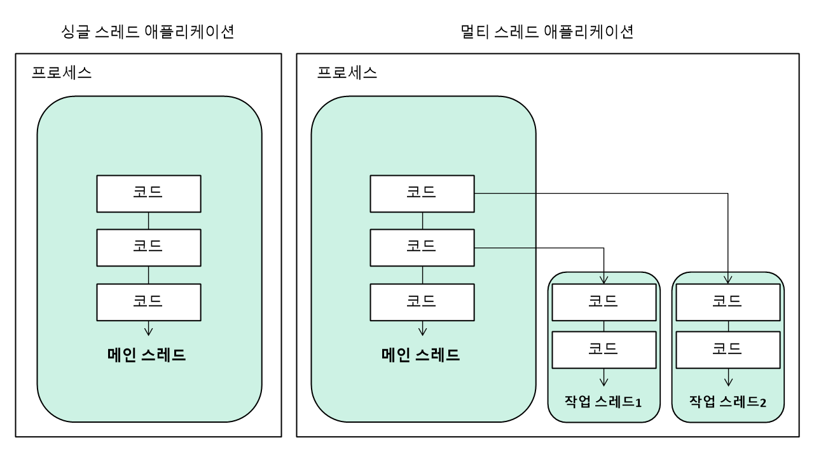

# 멀티 스레드

## 멀티 스레드 개념

운영체제에서는 실행 중인 하나의 애플리케이션을 프로세스(process)라고 부른다. 사용자가 애플리케이션을 실행하면 운영체제로부터 실행에 필요한 메모리를 할당받아 애플리케이션의 코드를 실행하는데 이것이 프로세스다. 하나의 애플리케이션은 다중 프로세스를 만들기도 한다.

두 가지 이상의 작업을 동시에 처리하는 것을 멀티 태스킹(multi tasking)이라고 한다. 운영체제는 멀티 태스킹을 할 수 있도록 CPU 및 메모리 자원을 프로세스마다 적절히 할당하고, 병렬로 실행시킨다. 예를 들면 워드로 문서 작업을 하면서 동시에 미디어 플레이어로 음악을 듣는 것이 있다.

하나의 프로세스 내에서 멀티 태스킹을 하는 경우도 있다. 대표적으로 메신저가 있다. 하나의 프로세스가 두 가지 이상의 작업을 처리할 수 있는 이유는 멀티 스레드(multi thread)에 있다.

스레드(thread)는 한 가지 작업을 실행하기 위해 순차적으로 실행할 코드를 실(thread)처럼 이어 놓았다고 해서 유래된 이름이다. 하나의 스레드는 하나의 코드 실행 흐름이기 때문에 한 프로세스 내에 스레드가 두 개라면 두 개의 코드 실행 흐름이 생긴다는 의미이다. 멀티 프로세스가 애플리케이션 단위의 멀티 태스킹이라면 멀티 스레드는 애플리케이션 내부에서의 멀티 태스킹이라고 볼 수 있다. 

멀티 프로세스들은 운영체제에서 할당받은 자신의 메모리를 가지고 실행하기 때문에 서로 독립적이다. 따라서 하나의 프로세스에서 오류가 발생해도 다른 프로세스에게 영향을 미치지 않는다. 예를 들어 워드와 엑셀을 동시에 사용하는 멀티 프로세스 환경의 경우 워드에 오류가 생겨 종료되더라도 엑셀은 여전히 사용 가능하다.

하지만 멀티 스레드는 하나의 프로세스 내부에 생성되기 때문에 하나의 스레드가 예외를 발생시키면 프로세스 자체가 종료될 수 있어 다른 스레드에게 영향을 미치게 된다. 예를 들어 멀티 스레드로 동작하는 메신저의 경우 파일을 전송하는 스레드에서 에외가 발생되면 메신저 프로세스 자체가 종료되기 때문에 채팅 스레드도 같이 종료된다. 그렇기 때문에 멀티 스레드에서는 예외 처리에 만전을 기해야 한다.

멀티 스레드는 다양한 곳에서 사용된다. 다용량 데이터의 처리 시간을 줄이기 위해 데이터를 분할해서 병렬로 처리하는 곳에서 사용되기도 하고, UI를 가지고 있는 애플리케이션에서 네트워크 통신을 하기 위해 사용되기도 한다. 또한 다수 클라이언트의 요청을 처리하는 서버를 개발할 때에도 사용된다.

### 메인 스레드
자바 애플리케이션은 메인 스레드(main thread)가 main() 메소드를 실행하면서 시작된다. 메인 스레드는 main() 메소드의 첫 코드부터 아래로 순차적으로 실행하고, main() 메소드의 마지막 코드를 실행하거나 return문을 만나면 실행이 종료된다.

<pre>
<code>
public static void main(String[] args) {

    ...

}
</code>
</pre>

메인 스레드는 필요에 따라 작업 스레드들을 만들어서 병렬로 코드를 실행할 수 있다. 즉 멀티 스레드를 생성해서 멀티 태스킹을 수행한다.
다음 그림에서 우측의 멀티 스레드 애플리케이션을 보면 메인 스레드가 작업 스레드1을 생성하고 실행한 다음 곧이어 작업 스레드2를 생성하고 실행한다. 

싱글 스레드 애플리케이션에서는 메인 스레드가 종료하면 프로세스도 종료된다. 하지만 멀티 스레드 애플리케이션에서는 실행 중인 스레드가 하나라도 있다면 프로세스는 종료되지 않는다. 메인 스레드가 작업 스레드보다 먼저 종료되더라도 작업 스레드가 계속 실행 중이라면 프로세스는 종료되지 않는다.

## 작업 스레드 생성과 실행
멀티 스레드로 실행하는 애플리케이션을 개발하려면 먼저 몇 개의 작업을 병렬로 실행할지 결정하고 각 작업별로 스레드를 생성해야 한다.

어떤 자바 애플리케이션이건 메인 스레드는 반드시 존재하기 때문에 메인 작업 이외에 추가적인 병렬 작업의 수만큼 스레드를 생성하면 된다. 자바에서는 작업 스레드도 객체로 생성되기 때문에 클래스가 필요하다. java.lang.Thread 클래스를 직접 객체화해서 생성해도 되지만, Thread를 상속해서 하위 클래스를 만들어 생성할 수도 있다.

### Thread 클래스로부터 직접 생성

java.lang.Thread 클래스로부터 작업 스레드 객체를 직접 생성하려면 Runnable을 매개값으로 갖는 생성자를 호출해야 한다.

<pre>
<code>
Thread thread = new Thread(Runnable target)
</code>
</pre>

Runnable은 작업 스레드가 실행할 수 있는 코드를 가지고 있는 객체라고 해서 붙여진 이름이다. Runnable은 인터페이스 타입이기 때문에 구현 객체를 만들어 대입해야 한다. Runnable에는 run() 메소드 하나가 정의되어 있는데, 구현 클래스는 run()을 재정의해서 작업 스레드가 실행할 코드를 작성해야 한다. 

<pre>
<code>
class Task implements Runnable {
    public void run() {
        스레드가 실행할 코드;
    }
}
</code>
</pre>

Runnable은 작업 내용을 가지고 있는 객체일 뿐 실제 스레드는 아니다. Runnable 구현 객체를 생성한 후, 이것을 매개값으로 해서 Thread 생성자를 호출하면 비로소 작업 스레드가 생성된다.

<pre>
<code>
Runnable task = new Task();

Thread thread = new Thread(task);
</code>
</pre>

코드 절약을 위해 Thread 생성자를 호출할 때 Runnable 익명 객체를 매개값으로 사용할 수 있다. 

<pre>
<code>
Thread thread = new Thread(new Runnable() { // 익명 구현 객체
    public void run() {
        스레드가 실행할 코드;
    }
});
</code>
</pre>

Runnable 인터페이스는 run() 메소드 하나만 정의되어 있기 때문에 함수적 인터페이스이다. 따라서 다음과 같이 람다식을 매개값으로 사용할 수도 있다. 

<pre>
<code>
Thread thread = new Thread( ()-> {
    스레드가 실행할 코드;
});
</code>
</pre>

작업 스레드는 생성 즉시 실행되지 않고 start() 메소드를 다음과 같이 호출해야만 실행된다.
<pre>
<code>
thread.start();
</code>
</pre>

start() 메소드가 호출되면 작업 스레드는 매개값으로 받은 Runnable의 run() 메소드를 실행하면서 자신의 작업을 처리한다.

### 스레드의 이름
스레드는 자신의 이름을 가지고 있다. 스레드의 이름은 디버깅 시 어떤 스레드가 어떤 작업을 하는지 조사할 목적으로 사용된다. 메인 스레드는 "main" 이라는 이름을 가지고 있고, 직접 생성한 스레드는 자동적으로 "Thread-n"이라는 이름으로 설정된다. n은 스레드의 번호를 말한다. Thread-n 대신 다른 이름으로 설정하고 싶다면 Thread 클래스의 setName() 메소드로 변경하면 된다.

<pre>
<code>
thread.setName("스레드 이름");
</code>
</pre>

setName(), getName()은 Thread의 인스턴스 메소드이므로 스레드 객체의 참조가 필요하다. 만약 스레드 객체의 참조를 가지고 있지 않다면 Thread의 정적 메소드인 currentThread()로 코드를 실행하는 현재 스레드의 참조를 얻을 수 있다.

<pre>
<code>
Thread thread = Thread.currentThread();
</code>
</pre>

## 스레드 우선순위
멀티 스레드는 동시성(Concurrency) 또는 병렬성(Parallelism)으로 실행되기 때문에 이 용어들에 대해 정확히 이해하는 것이 좋다.
> 동시성: 멀티 작업을 위해 하나의 코어에서 멀티 스레드가 번갈아가며 실행하는 성질
> 병렬성: 멀티 작업을 위해 멀티 코어에서 개별 스레드를 동시에 실행하는 설질

출처: https://luminousmen.com/post/concurrency-and-parallelism-are-different

싱글 코어 CPU에서 멀티 스레드 작업은 병렬적으로 실행되는 것처럼 보이지만, 사실은 번갈아가며 실행하는 동시성 작업이다. 번갈아 실행되는 속도가 빨라서 병렬성으로 보일 뿐이다.
스레드의 개수가 코어의 수보다 많을 경우, 스레드를 어떤 순서에 의해 동시성으로 실행할 것인가를 결정해야 하는데, 이것을 스레드 스케줄링이라고 한다. 스레드 스케줄링에 의해 스레드들은 아주 짧은 시간에 번갈아가면서 그들의 run() 메소드를 조금씩 실행한다.

자바의 스레드 스케줄링은 우선순위(Priority) 방식과 순환 할당(Round-Robin) 방식을 사용한다.
> 우선순위 방식: 우선순위가 높은 스레드가 실행 상태를 더 많이 가지도록 스케줄링 하는 것.
> 순활 할당 방식: 시간 할당량(Time Slice)을 정해서 하나의 스레드를 정해진 시간만큼 실행하고 다시 다른 스레드를 실행하는 방식.

우선순위 방식은 스레드 객체에 우선 순위 번호를 부여할 수 있기 때문에 개발자가 코드로 제어할 수 있다. 하지만 순환 할당 방식은 자바 가상 기계에 의해서 정해지기 때문에 코드로 제어할 수 없다.

우선순위 방식에서 우선순위는 1~10까지 부여된다. 1이 가작 우선순위가 낮고, 10이 가장 높다. 우선순위를 부여하지 않으면 모든 스레드들은 기본적으로 5의 우선순위를 할당받는다. 우선순위를 변경하고 싶다면 Thread 클래스가 제공하는 setPriority() 메소드를 이용하면 된다.

<pre>
<code>
thread.setPriority(우선순위);
</code>
</pre>

우선순위의 매개값으로 1~10까지의 값을 직접 주어도 되지만, 코드의 가독성을 높이기 위해 Thread 클래스의 상수를 사용할 수 있다.
<pre>
<code>
thread.setPriority(Thread.MAX_PRIORITY); // 10
thread.setPriority(Thread.NORM_PRIORITY); // 5
thread.setPriority(Thread.MIN_PRIORITY);// 1
</code>
</pre>

## 동기화 메소드와 동기화 블록

### 공유 객체를 사용할 때의 주의할 점
싱글 스레드 프로그램에서는 한 개의 스레드가 객체를 독차지해서 사용하면 되지만, 멀티 스레드 프로그램에서는 스레드들이 객체를 공유해서 작업해야 하는 경우가 있다. 이 경우 스레드1을 사용하던 객체가 스레드2에 의해 상태가 변경될 수 있기 때문에 스레드1이 의도했던 것과는 다른 결과를 산출할 수도 있다.

<pre>
<code>
public class Main {
    public static void main(String[] args) {
        Calculator calculator = new Calculator();
        User1 user1 = new User1(); // User1 스레드
        user1.setCalculator(calculator); // 공유 객체 설정
        user1.start();

        User2 user2 = new User2();
        user2.setCalculator(calculator);
        user2.start();
    }
}

// 공유 객체
public class Calculator {
    private int memory;

    public int getMemory() {
        return memory;
    }

    // 계산기 메모리에 값을 저장하는 메소드
    public void setMemory(int memory) {
        this.memory = memory;
        try{
            Thread.sleep(2000); // 스레드 2초간 정지
        }catch(InterruptedException e) {
            System.out.println(Thread.currentThread.getName + ": " + this.memory);
        }
    }
}

// User1 스레드
public class User1 extends Thread {
    private Calculator calculator;

    public void setCalculator(Calculator calculator) { // 스레드 이름을 설정하고 공유 객체인 Calculator 필드에 저장
        this.setName("User1");
        this.calculator = calculator;
    }

    public void run() {
        calculator.setMemory(100); // 공유 객체인 Calculator의 메모리에 100을 저장
    }
}

// User2 스레드
public class User2 extends Thread {
    private Calculator calculator;

    public void setCalculator(Calculator calculator) { // 스레드 이름을 설정하고 공유 객체인 Calculator 필드에 저장
        this.setName("User2");
        this.calculator = calculator;
    }

    public void run() {
        calculator.setMemory(50); // 공유 객체인 Calculator의 메모리에 50을 저장
    }
}
</code>
</pre>

### 동기화 메소드 및 동기화 블록
스레드가 사용 중인 객체를 다른 스레드가 변경할 수 없도록 사려면 스레드 작업이 끝날 때까지 객체에 잠금을 걸어서 다른 스레드가 사용할 수 없도록 해야 한다. 멀티 스레드 프로그램에서 단 하나의 스레드만 실행할 수 있는 코드 영역을 임계 영역(critical section)이라고 한다. 자바는 임계 영역을 지정하기 위해 동기화(synchronized) 메소드와 동기화 블록을 제공한다. 스레드가 객체 내부의 동기화 메소드 또는 블록에 들어가면 즉시 객체에 잠금을 걸어 다른 스레드가 임계 영역 코드를 실행하지 못하도록 한다. 동기화 메소드를 만드는 방법은 메소드 선언에 synchronized 키워드를 붙이면 된다. synchronized 키워드는 인스턴스와 정적 메소드 어디든 붙일 수 있다.

<pre>
<code>
public synchronized void method() {
    임계 영역; // 단 하나의 스레드만 실행
}
</code>
</pre>

동기화 메소드는 메소드 전체 내용이 임계 영역이므로 스레드가 동기화 메소드를 실행하는 즉시 객체에는 잠금이 일어나고, 스레드가 동기화 메소드를 실행 종료하면 잠금이 풀린다. 메소드 전체 내용이 아니라 일부 내용만 임계 영역으로 만들고 싶다면 동기화(synchronized) 블록을 만들면 된다.

<pre>
<code>
public void method() {
    // 여러 스레드가 실행 가능한 영역

    ...

    synchronized(공유객체) { // 동기화 블록
        임계 영역 // 단 하나의 스레드만 실행
    }

    // 여러 스레드가 실행 가능한 영역

    ...
}
</code>
</pre>

동기화 블록의 외부 코드들은 여러 스레드가 동시에 실행할 수 있지만, 동기화 블록의 내부 코드는 임계 영역이므로 한 번에 한 스레드만 실행할 수 있고 다른 스레드는 실행할 수 없다. 동기화 메소드와 동기화 블록이 여러 개 있을 경우 스레드가 이들 중 하나를 실행할 때 다른 스레드는 해당 메소드는 물론이고 다른 동기화 메소드 및 블록도 실행할 수 없다. 하지만 일반 메소드는 실행이 가능하다.

다음 코드는 이전 코드에서 사용된 공유 객체인 Calculator를 수정한 것이다. Calculator의 setMemory() 메소드를 동기화 메소드로 만들어서 User1 스레드가 setMemory()를 실행할 동안 User2 스레드가 setMemory() 메소드를 실행할 수 없도록 한다.

<pre>
<code>
public class Calculator {
    private int memory;

    public int getMemory() {
        return memory;
    }

    public synchronized void setMemory(int memory) {
        this.memory = memory;
        try{
            Thread.sleep(2000);
        }catch(InterruptedException e) {
            System.out.println(Thread.currentThread().getName() + ": " + this.memory);
        }
    }
}
</code>
</pre>

이제 이전 코드의 main() 메소드를 다시 실행하면 User1 스레드가 setMemory() 메소드를 완료하는 동안 User2 스레드는 Calculator 객체를 사용하지 못한다. 따라서 User1 스레드는 안전하게 방해받지 않고 Calculator 객체를 사용할 수 있게 된다.

위 코드는 Calculator 객체의 setMemory() 메소드를 동기화 메소드로 만들었는데, 다음과 같이 동기화 블록으로도 만들 수 있다.

<pre>
<code>
public void setMemory(int memory) {
    synchronized(this) {
        this.memory = memory;
        try{
            Thread.sleep(2000);
        }catch(InterruptedException e){
            System.out.println(Thread.currentThread().getName() + ": " + this.memory);
        }
    }
}
</code>
</pre>

스레드가 동기화 블록으로 들어가면 this(Calculator 객체)를 잠그고, 동기화 블록을 실행한다. 동기화 블록을 모두 실행할 때까지 다른 스레드들은 this(Calculator 객체)의 모든 동기화 메소드 또는 동기화 블록을 실행할 수 없게 된다.

## 스레드 상태
**스레드 객체를 생성하고 start() 메소드를 호출하면 곧바로 스레드가 실행되는 것처럼 보이지만 사실은 실행 대기 상태가 된다.** 실행 대기 상태란 아직 스케줄링이 되지 않아 실행을 기다리고 있는 상태를 말한다. 실행 대기 상태에 있는 스레드 중에서 스레드 스케줄링으로 선택된 스레드가 비로서 CPU를 점유하고  run() 메소드를 실행한다. 실행 상태의 스레드는 run() 메소드를 모두 실행하기 전에 스레드 스케줄링에 의해 다시 실행 대기 상태로 돌아갈 수 있다. 그리고 실행 대기 상태에 있는 다른 스레드가 선택되어 실행 상태가 된다. 스레드는 실행 대기 상태와 실행 상태를 번갈아가면서 자신의 run() 메소드를 조금씩 실행한다. 실행 상태에서 run() 메소드가 종료되면 더 이상 실행할 코드가 없기 때문에 스레드의 실행은 멈추게 된다. 이 상태를 종료 상태라고 한다.

스레드 상태를 확인하기 위해 Thread 클래스에 getState() 메소드를 사용한다. getState() 메소드는 스레드 상태에 따라서 Thread.State 열거 상수를 리턴한다.

출처: https://palpit.tistory.com/entry/Java-%EB%A9%80%ED%8B%B0-%EC%8A%A4%EB%A0%88%EB%93%9C-%EC%83%81%ED%83%9C-%EC%83%81%ED%83%9C-%EC%A0%9C%EC%96%B4

다음 코드는 스레드 상태를 출력하는 PrintThreadState 클래스이다. 생성자 매개값으로 받은 타겟 스레드의 상태를 0.5초 주기로 출력한다.

<pre>
<code>
public class PrintThreadState extends Thread {
    private Thread targetThread;

    public PrintThreadState(Thread targetThread) {
        this.targetThread = targetThread;
    }

    public void run() {
        while(true) {
            Thread.State state = targetThread.getState(); // 스레드 상태 얻기
            
            if(state == Thread.State.NEW) { // 객체 생성 상태일 경우 실행 대기 상태로
                targetThread.start();
            }

            if(state = Thread.State.TERMINATED) { // 종료 상태일 경우 while 문을 종료
                break;
            }

            try{
                // 0.5초간 일시 정지
                Thread.sleep(500);
            } catch(Exception e) {}
        }
    }
}
</code>
</pre>

다음은 타겟 스레드 클래스이다. 10억 번 루핑 후 RUNNABLE 상태를 유지하고 7라인에서 sleep() 메소드를 호출해서 1.5초간 TIMED_WAITING 상태를 유지한다. 그리고 다시 10억 번 루핑 후 RUNNABLE 상태를 유지한다.

<pre>
<code>
public class TargetThread extends Thread {
    public void run() {
        forr(long i = 0; i<1000000000; i++) {

            try{
                // 1.5초간 일시 정지
                Thread.sleep(1500);
            } catch(Exception e) {}

            for(long i = 0; i<1000000000; i++) {}
        }
    }
}
</code>
</pre>

TargetThread가 객체로 생성되면 NEW 상태를 가지고, run() 메소드가 종료되면 TERMINATED 상태가 되므로 결국 다음과 같은 상태로 변한다.

> NEW -> RUNNABLE -> TIMED_WAITING -> RUNNABLE -> TERMINATED

다음은 PrintThreadState를 생성해서 매개값으로 전달받은 TargetThread의 상태를 출력하는 실행 클래스이다.

<pre>
<code>
public class Main {
    public static void main(String[] args) {
        PrintThreadState printThreadState = new PrintThreadState(new TargetThread());
        printThreadState.start();
    }
}
</code>
</pre>

## 스레드 상태 제어

스레드 상태를 제어하는 메소드는 다음과 같다.

출처: https://palpit.tistory.com/entry/Java-%EB%A9%80%ED%8B%B0-%EC%8A%A4%EB%A0%88%EB%93%9C-%EC%83%81%ED%83%9C-%EC%83%81%ED%83%9C-%EC%A0%9C%EC%96%B4

### sleep() 주어진 시간동안 일시 정지
sleep() 메소드는 실행 중인 스레드를 일정 시간 멈추게 하는 Thread 클래스의 정적 메소드이다.

> Thread.sleep(매개값);

매개값에는 얼마 동안 일시 정지 상태로 있을 것인지 밀리세컨드(1/1000) 단위로 시간을 준다.
일시 정지 상태에서 주어진 시간이 되기 전에 interrupt() 메소드가 호출되면 InterruptedException이 발생하기 때문에 예외 처리가 필요하다. 

<pre>
<code>
import java.awt.Toolkit;

public class Main {
    public static void main(String[] args) {
        Toolkit toolkit = Toolkit.getDefaultToolkit();
        fot(int i = 0; i<10; i++) {
            toolkit.beep();
            try{
                Thread.sleep(7000); // 7초 동안 메인 스레드를 일시 정지
            } catch(InterruptedException e) {
                ...
            }
        }
    }
}
</code>
</pre>

### yield() 다른 스레드에게 실행 양보
yield() 메소드를 호출한 스레드는 실행 대기 상태로 돌아가고 동일한 우선수위 또는 높은 순위를 갖는 다른 스레드가 실행 기회를 가질 수 있도록 해준다.

<pre>
<code>
public class Main {
    public static void main(String[] args) {
        ThreadA threadA = new ThreadA();
        ThreadB threadB = new ThreadB();

        // ThreadA, ThreadB 모두 실행
        threadA.start();
        threadB.start();

        try{
            Thread.sleep(3000);
        }catch(InterruptedException e) {}

        threadA.work = false; // ThreadB만 실행

        try{
            Thread.sleep(3000);
        }catch(InterruptedException e) {}

        threadA.work = true; // ThreadA, ThreadB 모두 실행

        try{
            Thread.sleep(3000);
        }catch(InterruptedException e) {}

        // ThreadA, ThreadB 모두 종료
        threadA.stop = true;
        threadB.stop = true;

    }
}

public class ThreadA extends Thread {
    public boolean stop = false; // 종료 플래그
    public boolean work = true; // 작업 진행 여부 플래그

    public void run() {
        while(!stop) {
            if(work) {
                System.out.println("ThreadA is working");
            } else {
                Thread.yield(); // work가 false가 되면 다른 스레드에게 실행 양보
            }
        }
        System.out.println("ThreadA is over");
    }
}

public class ThreadB extends Thread {
    public boolean stop = false; // 종료 플래그
    public boolean work = true; // 작업 진행 여부 플래그

    public void run() {
        while(!stop) {
            if(work) {
                System.out.println("ThreadB is working");
            } else {
                Thread.yield(); // work가 false가 되면 다른 스레드에게 실행 양보
            }
        }
        System.out.println("ThreadB is over");
    }
}
</code>
</pre>

### join() 다른 스레드의 종료를 기다림
스레드는 다른 스레드와 독립적으로 실행하는 것이 기본이지만 다른 스레드가 종료될 때까지 기다렸다가 실행해야 하는 경우가 있을 수도 있다. 예를 들면 계산 작업을 하는데 이전 스레드 완료 값을 받아서 계산을 진행해야 하는 경우에는 이전 스레드의 종료를 기다려야만 한다. 

다음 코드는 메인 스레드는 SumThread가 게산 작업을 모두 마칠 때까지 일시 정지 상태에 있다가 SumThread가 최종 계산된 결과값을 산출하고 종료하면 결과값을 받아 출력한다.

<pre>
<code>
public class SumThread extends Thread {
    private long sum;

    public long getSum() {
        return sum;
    }

    public void setSum(long sum) {
        this.sum = sum;
    }

    public void run() {
        for(int i = 1; i<=100; i++) {
            sum += i;
        }
    }
}

public class Main {
    public static void main(String[] args) {
        SumThread sumThread = new SumThread();
        sumThread.start();

        try{
            sumThread.join(); // sumThread가 종료될 때까지 메인 스레드 일시 정지
        }catch(InterruptedException e) {

        }
        System.out.println(sumThread.getSum());
    }
}
</code>
</pre>

join() 메소드가 적용된 try - catch 구문을 주석 처리 후 코드를 실행하면 1~100까지의 합이 아닌 다른 값이 반환된다. 그 이유는 SumThread가 계산 작업을 완료하지 않은 상태에서 합을 먼저 출력하기 때문이다. 

### wait(), notify(), notifyAll() 스레드 간 협업

두 개 이상의 스레드를 교대로 번갈아가며 실행해야 하는 경우가 있다. 이 경우 한 스레드가 작업을 완료하면 notify() 메소드를 호출해서 일시 정지 상태에 있는 다른 스레드를 실행 대기 상태고 만들고, 자신은 두 번 작업을 하지 않도록 wait() 메소드를 호출하여 일시 정지 상태로 만든다.

notify() 메소드는 wait() 메소드에 의해 일시 정지된 스레드 중 한 개를 실행 대기 상태로 만들고, notifyAll() 메소드는 wait() 메소드에 의해 일시 정지된 모든 스레드들을 실행 대기 상태로 만든다. 이 메소드들은 Thread 클래스가 아닌 Object 클래스에 선언된 메소드이므로 모든 공유 객체에서 호출이 가능하다. 

### stop 플래그, interrupt() 스레드의 안전한 종료

스레드는 자신의 run() 메소드가 모두 실행되면 자동으로 종료된다. 하지만 경우에 따라서는 실행 중인 스레드를 즉시 종료할 필요가 있다. 
스레드 즉시 종료는 stop() 메소드를 사용하는데, 현재 deprecated 되었다. 그 이유는 stop() 메소드로 스레드를 갑자기 종료하면 스레드가 사용 중이던 자원들(네트워크 연결, 파일 등)이 불완전한 상태로 남겨지기 때문이다. 

### stop 플래그 사용
stop 플래그를 이용해서 run() 메소드의 종료를 유도한다.

<pre>
<code>
public class Main {
    public static void main(String[] args) {
        PrintThread1 printThread = new PrintThread1();
        printThread.start();

        try{
            Thread.sleep(3000);
        }catch(InterruptedException e) {}

        printThreead.setStop(true); // 스레드를 종료시키기 위해 stop 필드를 true로 변경
    }
}

public class PrintThread1 extends Thread {
    private boolean stop;

    public void setStop(boolean stop) {
        this.stop = stop;
    }

    public void run() {
        while(!stop) {
            System.out.println("Thread is working");
        }
        System.out.println("Thread is shutting off");
        System.out.println("Thread is over");
    }
}
</code>
</pre>

### interrupt() 메소드 사용
interrupt() 메소드는 스레드가 일시 정지 상태에 있을 때 InterruptedException 예외를 발생시키는 역할을 한다. 이것을 이용하면 run() 메소드를 정상 종료시킬 수 있다. 

<pre>
<code>
public class Main {
    public static void main(String[] args) {
        Thread thread = new PrintThread2();
        thread,start();

        try{
            Thread.sleep(3000);
        }catch(InterruptedException e) {}

        thread.interrupt(); // 스레드를 종료시키기 위해 InterruptedException 발생시킴
    }
}

public class PrintThread2 extends Thread {
    public void run() {
        try{
            while(true){
                System.out.println("Thread is working");
                Thread.sleep(1); // InterruptedException 발생
            }
        }catch(InterruptedException e){

        }
        System.out.println("Thread is shutting off");
        System.out.println("Thread is over");
    }
}
</code>
</pre>

스레드가 실행 대기 또는 실행 상태에 있을 때 interrupt() 메소드가 실행되면 즉시 InterruptedException이 발생하지 않고, 스레드가 미래에 일시 정지 상태가 되면 InterruptedException 에외가 발생한다. 따라서 스레드가 일시 정지 상태가 되지 않으면 interrupt() 메소드 호출은 의미가 없다. 그래서 짧은 시간이나마 일시 정지시키기 위해 Thread.sleep(1)을 사용했다.

일시 정지를 만들지 않고도 interrupt() 호출 여부를 알 수 있는 방법이 있다. interrupt() 메소드가 호출되었다면 스레드의 interrupted()와 isInterrupted() 메소드는 true를 리턴한다. interrupted()는 정적 메소드로 현재 스레드가 interrupted되었는지 확인하는 것이고, isInterrupted()는 인스턴스 메소드로 현재 스레드가 interrupted되었는지 확인할 때 사용한다.

<pre>
<code>
boolean status = Thread.interrupted();
boolean status = objThread.isInterrupted();
</code>
</pre>

<pre>
<code>
public class PrintThread2 extends Thread {
    public void run() {
        while(true) {
            System.out.println("Thread is working");
            if(Thread.interrupted()){
                break; // while문을 빠져나옴
            }
        }
        System.out.println("Thread is shutting off");
        System.out.println("Thread is over");
    }
}
</code>
</pre>

# 출처
* [이것이 자바다](http://www.kyobobook.co.kr/product/detailViewKor.laf?ejkGb=KOR&mallGb=KOR&barcode=9788968481475&orderClick=LAG&Kc=)