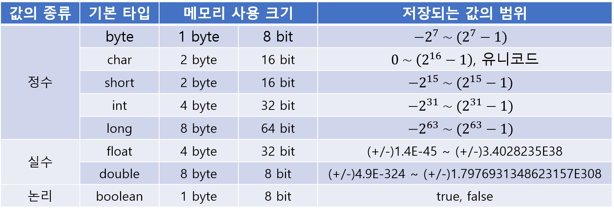

# 변수와 타입

## 변수란 무엇인가
> 변수는 하나의 값, 타입을 저장할 수 있는 메모리 공간이다.
> 프로그램은 작업을 처리하는 과정에서 필요에 따라 데이터를 메모리에 저장한다. 이때 변수를 사용하는데, 변수(Variable)는 값을 저장할 수 있는 메모리의 > 공간을 의미한다. 변수는 수시로 값이 변할 수 있기 때문에 변수에는 복수의 값을 저장할 수 없고 하나의 값만 저장할 수 있다.

## 변수의 선언
> 변수 선언을 통해 어떤 타입의 데이터를 저장하고, 이름은 무엇으로 할지 결정한다.
> 변수 선언은 '타입-변수이름' 형식을 따른다.
<pre>
<code>
타입    변수이름
int     memberId
double  value;
</code>
</pre>
필요에 따라 같의 타입의 변수를 여러개 사용할 때 다음과 같이 사용할 수 있다.
<pre>
<code>
int hour, min, sec;
</code>
</pre>

변수 타입 설정에 따라 해당 변수에 들어갈 수 있는 값의 종류의 범위가 결정된다.
따라서 어떤 값을 저장하고, 따라서 어떤 타입을 사용해야 할지 신중하게 고려해야 한다.

변수 이름은 메모리 주소에 붙여진 이름이다. 프로그램은 변수 이름을 통해 메모리 주소에 접근하고, 그곳에 값을 저장하거나 읽는다.
변수 이름은 자바에서 정한 명명 규칙(naming convention)을 따라야 한다. 명명 규칙은 다음과 같다.

* 첫 번째 글자는 문자이거나 '$','_'이어야 하고 숫자로 시작할 수 없다.
    * 가능) price, $price, _companyName
    * 불가능) 1v, @price, $#price
* 영어 대소문자가 구분된다.
    * ex) memberid와 memberId는 서로 다른 변수
* 이름에 여러 단어를 혼합하여 사용한다면, 첫 번째 단어는 소문자, 두 번째 단어부터는 대문자로 시작한다.(카멜케이스)
    * joinDate, firstName
* 문자 길이의 제한이 없다.
* 자바 예약어는 사용할 수 없다.

자바는 '예약어'라는 것이 있는데, 예약어란 해당 프로그래밍 언어에서 문법적인 용도로 사용되고 있기 때문에 식별자로 사용할 수 없는 단어들이다.
예약어들로 변수 이름을 지정하면 컴파일 에러가 발생하기 때문에 사용을 피해야 한다.

| 분류 | 예약어 |
| --- | --- |
| '기본 데이터 타입' | boolean, byte, char, short, int, long, float, double |
| '접근 지정자' | private, protected, public |
| '클래스와 관련된 것' | class, abstract, interface, extends, implements, enum |
| '객체와 관련된 것' | new, instanceof, this, super, null |
| '메소드와 관련된 것' | void, return |
| '제어문과 관련된 것' | if, else, switch, case, default, for, do, while, break, continue |
| '논리값' | true, false |
| '예외 처리와 관련된 것' | try, catch, finally, throw, throws |
| '기타' | transient, volatile, package, import, synchronized, native, final, static, strictfp, assert |

## 변수의 사용
> 변수에 값을 저장하고 읽는 방법을 알아보자.

### 변수값 저장
변수에 값을 저장할 때에는 대입 연산자( = )를 사용한다. 자바에서 이 연산자의 의미는 우측의 값을 좌측 변수에 저장한다는 의미를 갖는다.
변수를 선언하고 처음 값을 저장할 경우, 이러한 값을 초기값이라고 한다. 변수에 초기값을 주는 행위를 '변수의 초기화'라고 한다.

<pre>
<code>
int age;  // 변수 선언
age = 18; // 값 저장
</code>
</pre>

초기값을 변수의 선언과 동시 줄 수도 있다.
<pre>
<code>
int age = 18;
</code>
</pre>

변수의 초기값은 코드에 직접 입력하는 경우가 많은데, 소스 코드 내에서 직접 입력된 값을 리터럴(literal)이라고 부른다.
리터럴은 값의 종류에 따라 정수 리터럴, 실수 리터럴, 문자 리터럴, 논리 리터럴로 구분된다. 리터럴 종류에 따라 정해진 표기법이 있다.
사실 리터럴은 상수(constant)와 같은 의미지만, 프로그램에서는 상수를 "값을 한 번 저장하면 변경할 수 없는 변수"로 정의하기 때문에 이와 구분하기 위해 '리터럴'이라는 용어를 사용한다.

### 정수 리터럴
소수점이 없는 정수 리터럴은 10진수로 간주한다.
<pre>
<code>
0, 77, -100 
</code>
</pre>
0으로 시작되는 리터럴은 8진수로 간주한다.
<pre>
<code>
02, -02
</code>
</pre>
0또는 0X로 시작하고 0~9 숫자나 A, B, C, D, E, F 또는 a, b, c, d, e, f로 구성된 리터럴은 16진수로 간주한다.
<pre>
<code>
0x5, 0xA, 0xB3, 0xAC08
</code>
</pre>
정수 리터럴을 저장할 수 있는 타입은 byte, char, short, int, long 5개가 있다.

### 실수 리터럴
소수점이 있는 리터럴은 10진수 실수로 간주한다.
<pre>
<code>
0.25, -3.14
</code>
</pre>
대문자 E 또는 소문자 e가 있는 리터럴은 10진수 지수와 가수로 간주한다.
<pre>
<code>
5E7 // 5 x 10의 7제곱
0.12E-5 // 0.12 x 10의 -5제곱
</code>
</pre>
실수 리터럴을 저장할 수 있는 타입은 float, double이 있다.

### 문자 리터럴
작은 따옴표( ' )로 묶은 텍스트는 하나의 문자 리터럴로 간주한다.
<pre>
<code>
'A', '가', '\t', '\n'
</code>
</pre>
역슬래시( \ )가 붙은 문자 리터럴은 이스케이프(escape) 문자라고 한다.

| 이스케이프 문자 | 용도 |
| --- | --- |
| '\t' | 수평 탭 |
| '\n' | 줄 바꿈 |
| '\r' | 리턴 |
| '\"' | 큰 따옴표( " ) |
| '\'' | 작음 따옴표( ' ) |
| '\\' | \ |

문자 리터럴을 저장할 수 있는 타입은 char 하나뿐이다.

### 문자열 리터럴
큰 따옴표( " )로 묶은 텍스트는 문자열 리터럴로 간주한다. 큰 따옴표 안에 텍스트가 없어도 문자열 리터럴로 간주한다.
문자열 리터럴 내부에서도 이스케이스 문자를 사용할 수 있다.
<pre>
<code>
"안녕 세상아"
"어 그러니까 내 말은 \n" // 이스케이프 문자 '\n' 사용하여 줄 바꿈 적용
</code>
</pre>

### 논리 리터럴
true와false는 논리 리터럴로 간주한다.
<pre>
<code>
true, false
</code>
</pre>
논리 리터럴을 저장할 수 있는 타입은 boolean 하나뿐이다.

## 변수값 읽기
> 변수는 초기화가 되어야 읽을 수 있다.

잘못된 변수 사용 예시
변수 profit이 선언되었지만, 초기화가 되지 않았기 때문에 산술 연산식 profit * 0.5를 사용할 수 없다.
<pre>
<code>
int profit;
int result = profit * 0.5; 
</code>
</pre>

올바른 변수 사용 예시
<pre>
<code>
int profit = 30; // 변수 profit을 30으로 초기화
int result = profit * 0.5;
</code>
</pre>

## 변수의 사용 범위
> 변수는 중괄호( {} )블록 내에서 선언되고 사용된다.
<pre>
<code>
public class VariableScope{
    public static void main(String[] args){
        int profit = 30;
        if(profit<50){
           int margin = prifit * 0.2;
        }
        int result = profit - margin; // margin 변수를 사용할 수 없기 때문에 컴파일 에러 발생
    }
}
</code>
</pre>

## 데이터 타입
> 모든 변수에는 타입(type)이 있으며, 타입에 따라 저장할 수 있는 값의 종류 및 범위가 달라진다.

### 정수 타입
정수 타입은 모두 다섯 개의 타입이 있으며 저장할 수 있는 값의 범위가 서로 다르다.

| 정수 타입 | byte | char | short | int | long |
| 바이트 수 | 1 | 2 | 2 | 4 | 8 |

자바는 기본적으로 정수 연산을 int타입으로 수행한다. 때문에 저장하려는 값이 정수 리터럴이라면 int타입 변수 사용을 추천한다.
byte와 short는 int보다 메모리 사용 크기가 작아 메모리 절약에 효율적이지만, 값의 범위가 작아 연산 시 범위를 초과하면 잘못된 결과를 얻기 쉽다.

### 실수 타입
실수 타입은 소수점이 있는 실수 데이터를 저장할 수 있는 타입이다.

| 실수 타입 | float | double |
| 바이트 수 | 4 | 8 |

float과 double의 메모리 사용 크기는 int와 long의 크기와 같지만, 정수 타입과는 다른 저장 방식 때문에 정수 타입보다 훨씬 큰 범위의 값을 저장한다.
실수는 정수와 달리 부동 소수점(floating-point) 방식으로 저장된다.

### 논리 타입
boolean 타입은 1byte(8bit)로 표현되는 논리값(true/false)을 저장할 수 있는 데이터 타입이다.
주로 조건문 사용 시 상태값에 따른 출력 결과를 제어하는데 사용된다.
<pre>
<code>
public class Boolean{
    public static void main(String[] args){
       boolean pigIsOnHisWay = true;
       if(pigIsOnHisWay){
           System.out.println("돼지가 길을 간다 붐차차 붐차차");
       }else{
           System.out.println("앞에서 차가 온다. 돼지는 길을 비켜준다.");
       }
    }
}
</code>
</pre>

## 타입 변환
> 타입 변환은 데이터 타입을 다른 데이터 타입으로 변환하는 것을 말한다.
> 타입 변환에는 자동(묵시적) 타입 변환과 강제(명시적) 타입 변환이 있다.

### 자동 타입 변환
프로그램 실행 도중에 자동으로 타입 변환이 일어나는 것.
자동 타입 변환은 작은 크기를 가지는 타입이 큰 크기를 가지는 타입에 저장될 때 발생한다.

크기별로 타입을 정리하면
<pre>
<code>
byte(1) < short(2) < int(4) < long(8) < float(4) < double(8)
</code>
</pre>

자동 타입 변환 예시
byte 타입은 int 타입보다 크기가 작다. 따라서 int 타입에 byte 타입의 값을 대입하면 자동으로 int 타입으로 타입 변환이 일어난다.
<pre>
<code>
byte byteValue = 8;
int intValue = byteValue; 
</code>
</pre>

char 타입의 경우 int 타입으로 자동 변환되면 유니코드 값이 int 타입에 저장된다.
<pre>
<code>
int charValue = 'A';
int intValue = charValue; // char 'A'에 해당하는 유니코드 값은 65
</code>
</pre>

char 타입 사용 시 주의점은 char의 범위는 0~65535이기 때문에 음수가 저장될 수 없다.
따라서 byte 타입을 char 타입으로 자동 변환시킬 수 없다.
<pre>
<code>
int byteValue = 65;
char charValue = byteValue; // 컴파일 에러 발생
char charValue = (char)byteValue; // 강제 타입 변환 필요
</code>
</pre>

### 강제 타입 변환
강제적으로 큰 데이터 타입을 작은 데이터 타입으로 쪼개어 저장하는 것을 강제 타입 변환(캐스팅: casting)이라고 한다.
강제 타입 변환은 캐스팅 연산자 '()'를 사용한다.

<pre>
<code>
int intValue = 222222222;
int byteValue = (byte)intValue;
</code>
</pre>

실수 타입(float, double)은 정수 타입(byte, short, int, long)으로 자동 변환되지 않기 때문에 강제 타입 변환해야 한다.
이 경우 소수점 이하는 버려지고 정수 부분만 저장된다.
<pre>
<code>
double doubleValue = 2.54;
int intValue = (int)doubleValue; // 2
</code>
</pre>

### 연산식에서의 자동 타입 변환
연산은 기본적으로 같은 타입의 피연산자(operand) 간에만 수행된다. 따라서 서로 다른 타입의 피연산자가 있을 경우 두 피연산자 중 큰 타입으로 자동 변환된 후 연산을 수행한다.
<pre>
<code>
int intValue = 10;
double doubleValue = 5.5;
double result = intValue + doubleValue; // 결과는 15.5
</code>
</pre>

int 타입 결과를 얻고 싶다면 강제 타입 변환이 필요하다.
<pre>
<code>
int intValue = 10;
double doubleValue = 5.5;
double result = intValue + (int)doubleValue; // 결과는 15
</code>
</pre>