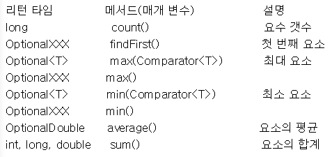
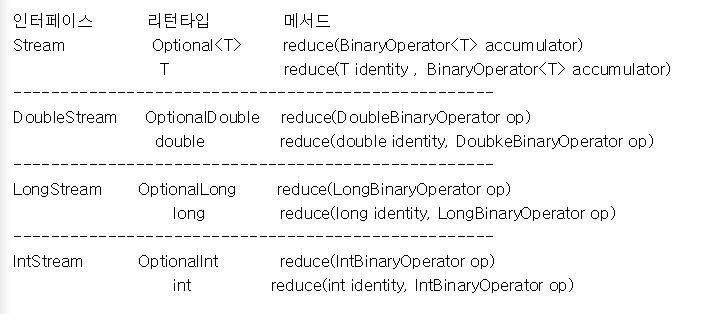

# 스트림과 병렬 처리

자바 7 이전까지 List<String>\ 컬렉션에서 요소를 순차적으로 처리하기 위해 Iterator 반복자를 다음과 같이 사용했다.

<pre>
<code>
List<String> list = Arrays.asList("A", "B", "C");
Iterator<String> iterator = list.iterator();
while(iterator.hasNext()){
    String str = iterator.next();
    System.out.println(str);
}
</code>
</pre>

위 코드를 Stream을 사용해서 변경하면 다음과 같다.

<pre>
<code>
List<String> list = Arrays.asList("A", "B", "C");
Stream<String> stream = list.stream();
stream.forEach(name->System.out.println(name));
</code>
</pre>

컬렉션(java.util.Collection)의 stream() 메소드로 스트림 객체를 얻고 나서 stream.forEach(name->System.out.printnln(name)); 메소드를 통해 컬렉션의 요소를 하나씩 콘솔에 출력한다. forEach() 메소드는 Consumer 함수적 인터페이스 타입의 매개값을 가지므로 컬렉션의 요소를 소비할 코드를 람다식으로 기술할 수 있따.

<pre>
<code>
void forEach(Consumer<T> action)
</code>
</pre>

아래 코드는 List<String> 컬렉션의 String 요소를 Iterator와 Stream을 이용해서 순차적으로 콘솔에 출력한다.

<pre>
<code>
import java.util.Arrays;
import java.util.Iterator;
import java.util.List;
import java.util.stream.Stream;

public class Main {
    public static void main(String[] args) {
        List<String> list = Arrays.asList("A", "B", "C");

        // iterator
        Iterator<String> iterator = list.iterator();
        while(iterator.hasNext()){
            String str = iterator.next();
            System.out.println(str);
        }

        // Stream
        Stream<String> stream = list.stream();
        stream.forEach(name->System.out.println(name));
    }
}
</code>
</pre>

### Stream의 특징

Stream은 Iterator와 비슷하지만 람다식으로 요소 처리 코드를 제공하는 점과 내부 반복자를 사용하므로 병렬 처리가 쉽다는 것, 중간 처리와 최종 처리 작업을 수행하는 점에서 많은 차이가 있다. 

### Stream의 특징_람다식으로 요소 처리 코드 제공

Stream이 제공하는 대부분의 요소 처리 메소드는 함수적 인터페이스 매개 타입을 가지기 때문에 람다식 또는 메소드 참조를 이용해서 요소 처리 내용을 매개값으로 전달할 수 있다. 

아래 코드는 컬렉션에 저장된 Student를 하나씩 가져와 학생 이름과 성적을 콘솔에 출력하도록 forEach() 메소드의 매개값으로 람다식을 주었다.

<pre>
<code>
import java.util.Arrays;
import java.util.List;
import java.util.stream.Stream;

public class Main {
    public static void main(String[] args) {
        List<Student> list = Arrays.asList(
            new Student("Park", 98),
            new Student("Hong", 78)
        );

        Stream<Student> stream = list.stream();
        stream.forEach(s->{
            String name = s.getName();
            int score = s.getScore();
            System.o0ut.println(name + " / " + score);
        });
    }
}

public class Student {
    private String name;
    private int score;

    public Student(String name, int score){
        this.name = name;
        this.score = score;

        public String getName() { return name; }
        public int getScore() { return score; }
    }
}
</code>
</pre>

### Stream의 특징_내부 반복자를 사용하므로 병렬 처리가 쉽다.

외부 반복자(external iterator)란 개발자가 코드로 직접 컬렉션의 요소를 반복해서 가져오는 코드 패턴을 말한다. index를 이용하는 for문, Iterator를 이용하는 while문은 모두 외부 반복자를 이용하는 것이다. 

내부 반복자(internal iterator)는 컬렉션 내부에서 요소들을 반복시키고 개발자는 요소당 처리해야 할 코드만 제공하는 코드 패턴을 말한다. 

내부 반복자 사용 시 컬렉션 내부에서 어떻게 요소를 반복시킬 것인가는 컬렉션에게 맡겨두고 개발자는 요소 처리 코드에만 집중할 수 있다. 내부 반복자는 요소들의 반복 순서를 변경하거나 멀티 코어 CPU를 최대한 활용하기 위해 요소들을 분배시켜 병렬 작업을 할 수 있게 도와주기 때문에 하나씩 처리하는 순차적 외부 반복자보다는 효율적으로 요소를 반복시킬 수 있다.

Iterator는 컬렉션의 요소를 가져오는 것에서부터 처리하는 것까지 모두 개발자가 작성해야 한다. 반면 Stream은 람다식으로 요소 처리 내용만 전달할 뿐 반복은 컬렉션 내부에서 일어난다. Stream을 이용하면 코드도 간결해지고, 무엇보다도 요소의 병렬 처리가 컬렉션 내부에서 처리되므로 일석이조의 효과를 가져온다.

### 병렬(parallel) 처리란?

한 가지 작업을 서브 작업으로 나누고, 서브 작업들을 분리된 스레드에서 병렬적으로 처리하는 것을 말한다. 병렬 처리 스트림을 이용하면 런타임 시 하나의 작업을 서브 작업으로 자동으로 나누고, 서브 작업의 결과를 자동으로 결합하여 최종 결과물을 생성한다. 예를 들어 컬렉션의 요소 총합을 구할 때 순차 처리 스트림은 하나의 스레드가 요소들을 순차적으로 읽어 합을 구하지만, 병렬 처리 스트림은 여러 개의 스레드가 요소들을 부분적으로 합하고 이 부분의 합을 최종 결합해서 전체 합을 생성한다. 

<pre>
<code>
import java.util.Arrays;
import java.util.List;
import java.util.stream.Stream;

public class Main {
    public static void main(String[] args) {
        List<String> list = Arrays.asList(
            "Park", "Hong", "Kim", "Hwang"
        );

        // 순차 처리
        Stream<String> stream = list.stream();
        stream.forEach(Main :: print); // == s->Main.print(s)
        System.out.println();

        // 병렬 처리
        Stream<String> parallelStream = list.parallelStream();
        parallelStream.forEach(Main :: print);
    }

    public static void print(String str){
        System.out.println(str + " / " + Thread.currentThread().getName());
    }
}

결과)
Park / main
Hong / main
Kim / main
Hwang / main

Kim / main
Hwang / main
Park / main
Hong / ForkJoinPool.commonPool-worker-1
</code>
</pre>

위 코드의 결과를 보면 병렬 처리 스트림은 main 스레드를 포함해서 ForkJoinPool(스레드풀)의 작업 스레드들이 병렬적으로 요소를 처리하는 것을 볼 수 있다.

### Stream의 특징_스트림은 중간 처리와 최종 처리를 할 수 있다.

Stream은 컬렉션의 요소에 대해 중간 처리와 최종 처리를 수행할 수 있다. 중간 처리에는 매핑, 필터링, 정렬을 수행하고 최종 처리에는 반복, 카운팅, 평균, 총합 등의 집계 처리를 수행한다.

아래 코드는 List에 저장된 Student 객체를 중간 처리에서 score 필드값으로 매핑한다. 이후 최종 처리에서 score의 평균값을 산출한다.

<pre>
<code>
public class Main {
    public static void main(String[] args) {
        List<Student> studentList = Arrays.asList(
            new Student("Park", 78);
            new Student("Hong", 89);
        );

        double avg = studentList.stream()
        // 중간 처리(학생 객체를 점수로 매핑)
        .mapToInt(Student :: getScore)
        // 최종 처리(평균 점수)
        .average()
        .getAsDouble();

        System.out.println("avg score = " + avg);
    }
}
</code>
</pre>

### Stream의 종류

[java.util.stream 패키지](https://docs.oracle.com/javase/8/docs/api/java/util/stream/package-summary.html)에는 스트림 API들이 있다.

출처 : https://altongmon.tistory.com/260

### 컬렉션으로부터 스트림 얻기

List<Student> 컬렉션에서 Stream<Student>를 얻어내고 요소를 콘솔에 출력한다.

<pre>
<code>
import java.util.Arrays;
import java.util.List;
import java.util.stream.Stream;

public class Main {
    public static void main(String[] args) {
        List<Student> studentList = Arrays.asList(
            new Student("Park", 56);
            new Student("Hwang", 98);
            new Student("Kim", 67);
        );

        Stream<Student> stream = studentList.stream();
        stream.forEach(s->System.out.println(s.getName()));
    }
}

public class Student {
    private String name;
    private int score;

    public Student(String name, int score) {
        this.name = name;
        this.score = score;
    }

    public String getName() { return name; }
    public int getScore() { score; }
}
</code>
</pre>

### 배열로부터 스트림 얻기

String[]과 int[] 배열로부터 스트림을 얻어내고 콘솔을 출력한다.

<pre>
<code>
import java.util.Arrays;
import java.util.stream.IntStream;
import java.util.stream.Stream;

public class Main {
    public static void main(String[] args) {
        String[] strArray = { "Park", "Hwang", "Kim" };
        Stream<String> strStream = Arrays.stream(strArray);
        strStream.forEach(a->System.out.println(a + " / "));
    }
}
</code>
</pre>

### 숫자 범위로부터 스트림 얻기

1부터 100까지의 합을 구하기 위해 IntStream의 rangeClosed() 메소드를 이용한다.
rangeClosed()는 첫 번째 매개값에서부터 두 번째 매개값까지 순차적으로 제공하는 IntStream을 리턴한다. IntStream의 또 다른 range() 메소드도 동일한 IntStream을 리턴하지만 두 번째 매개값은 포함하지 않는다.

<pre>
<code>
import java.util.stream.IntStream;

public class Main {

    public static int sum;

    public static void main(String[] args) {
        IntStream stream = IntStream.rangeClosed(1, 100);
        stream.forEach(a -> sum += a);
        System.out.println(sum);
    }
}
</code>
</pre>

### 파일로부터 스트림 얻기

Files의 정적 메소드인 lines()와 BufferedReader의 lines() 메소드를 이용하여 문자 파일의 내용을 스트림을 통해 행 단위로 읽고 콘솔에 출력한다.

<pre>
<code>
import java.io.BufferedReader;
import java.io.File;
import java.io.FileReader;
import java.io.IOException;
import java.nio.charset.Charset;
import java.nio.file.Files;
import java.nio.file.Path;
import java.nio.file.Paths;
import java.util.stream.Stream;

public class Main {
    public static void main(String[] args) throws IOException{
        Path path = Paths.get("D:\\linedata.txt");
        Stream<String> stream;

        stream = Files.lines(path, Charset.defaultCharset());
        stream.forEach(System.out :: println);
        System.out.println();

        File file = path.toFile();
        FileReader fileReader = new FileReader(file);
        BufferedReader br = new BufferedReader(fileReader);
        stream = br.lines();
        stream.forEach(System.out :: println);
    }   
}

결과)
파일로부터 스트림 얻기

파일로부터 스트림 얻기
</code>
</pre>

위 코드에서 가져온 linedata.txt는 D 드라이브에 저장된 txt 파일이다.

### 디펙토리로부터 스트림 얻기

Files의 정적 메소드인 list()를 이용해서 디렉토리의 내용(서브 디렉토리 또는 파일 목록)을 스트림을 통해 읽고 콘솔에 출력한다.

<pre>
<code>
import java.io.IOException;
import java.nio.file.Files;
import java.nio.file.Path;
import java.nio.file.Paths;
import java.util.stream.Stream;

public class Main {
    public static void main(String[] args) throws IOException {
        Path path = Paths.get("출력을 원하는 폴더 경로");
        Stream<Path> stream = Files.list(path);
        stream.forEach(p->System.out.println(p.getFileName()));
    }
}
</code>
</pre>

## 스트림 파이프라인

대량의 데이터를 가공해서 축소하는 것을 리덕션(Reduction)이라고 한다. 데이터의 합계, 평균값, 최대/최소값 등을 구하는 것은 리덕션의 결과물이다. 
컬렉션의 요소를 리덕션의 결과물로 바로 집계할 수 없을 때 집계하기 좋도록 필터링, 매핑, 정렬, 그룹핑 등의 중간 처리가 필요하다.

### 중간 처리와 최종 처리

스트림은 데이터의 필터링, 매핑, 정렬, 그룹핑 등의 중간 처리와 합계, 평균, 카운팅, 최대/최소값 등의 최종 처리를 파이프라인(pipelines)으로 해결한다. 파이프라인은 여러 개의 스트림이 연결되어 있는 구조를 말한다.

회원 컬렉션에서 남자만 필터링하는 중간 스트림을 연결하고, 다시 남자의 나이로 매핑하는 스트림을 연결, 최종적으로 남자 평균 나이를 집계하는 파이프라인을 코드로 표현하면 다음과 같다.

<pre>
<code>
import java.util.Arrays;
import java.util.List;

public class Main {
    public static void main(String[] args) {
        List<Member> list = Arrays.asList(
            new Member("Park", Member.MALE, 30);
            new Member("Hwang", Member.MALE, 55);
            new Member("Kim", Member.MALE, 18);
        );

        double ageAvg = list.strea()
            .filter(m->m.getSex() == Member.MALE)
            .mapToInt(Member :: getAge)
            .average()
            .getAsDouble();

        System.out.println("avg age of male = " + ageAvg);
    }
}

public class Member {
    public static int MALE = 0;
    public static int FEMALE = 1;

    private String name;
    private int sex;
    private int age;

    public Member(String name, int sex, int age) {
        this.name = name;
        this.sex = sex;
        this.age = age;
    }

    public int getSex() { return sex; }
    public int getAge() { return age; }
}
</code>
</pre>

### 중간 처리 메소드와 최종 처리 메소드

출처 : https://velog.io/@ansalstmd/%EC%9D%B4%EA%B2%83%EC%9D%80-%EC%9E%90%EB%B0%94%EB%8B%A4-16%EC%9E%A5%EC%8A%A4%ED%8A%B8%EB%A6%BC%EA%B3%BC-%EB%B3%91%EB%A0%AC%EC%B2%98%EB%A6%AC

리턴 타입이 스트림이라면 중간 처리 메소드이다.
기본 타입이거나 OptionalXXX라면 최종 처리 메소드이다.

### 필터링( distinct(), filter() )

필터링은 중간 처리 기능으로 요소를 걸러낸다. distinct(), filter() 메소드는 모든 스트림이 가지고 있는 공통 메소드이다.

distinc() 메소드는 중복을 제거한다. Stream의 경우 Object.equals(Object)의 결과가 true면 동일 객체로 판단하고 중복을 제거한다. 
IntStream, LongStream, DoubleStream은 동일값일 경우 중복을 제거한다.

filter() 메소드는 매개값으로 주어진 Predicate가 true를 리턴하는 요소만 필터링한다.

아래 코드는 이름 List에서 중복된 이름을 제거 후 출력한다. 그리고 특정 성인 이름만 필터링해서 출력한다.

<pre>
<code>
import java.util.Arrays;
import java.util.List;

public class Main {

    public static void main(String[] args) {
        List<String> names = Arrays.asList("김사월", "황진이", "윤동주", "이창동");

        names.stream()
        .distinct() // 중복 제거
        .forEach(n->System.out.println(n));
        
        System.out.println();

        names.stream()
        .filter(n->n.startsWith("김")) // 필터링
        .forEach(n->System.out.println(n));

        System.out.println();

        // 중복 제거 후 필터링
        names.stream()
        .distinct()
        .filter(n->n.startsWith("윤"))
        .forEach(n->System.out.println(n));
    }
}

결과)
김사월
황진이
윤동주
이창동

김사월

윤동주
</code>
</pre>

### 매핑( flatMapXXX(), mapXXX(), asXXXStream(), boxed() )

매핑(mapping)은 중간 처리 기능으로 스트림의 요소를 다른 요소로 대체하는 작업을 말한다.

### flatMapXXX() 메소드

요소를 대체하는 복수 개의 요소들로 구성된 새로운 스트림을 리턴한다.

아래 코드는 입력된 데이터(요소)들이 List<String>에 저장되어 있다고 가정하고 요소별로 단어를 뽑아 단어 스트림으로 재생성한다. 만약 입력된 데이터들이 숫자라면 숫자를 뽑아 숫자 스트림으로 재생성한다.

<pre>
<code>
import java.util.Arrays;
import java.util.List;

public class Main{
    public static void main(String[] args) {
        List<String> inputList = Arrays.asList("Doubt", "is", "the", "origin", "of", "wisdom");
        inputList.stream()
                 .flatMap(data->Arrays.stream(data.split(" ")))
                 .forEach(word->System.out.println(word));

        System.out.println();

        List<String> inputList2 = Arrays.asList("1,2,3", "3,2,1");
        inputList2.stream()
                  .flatMapToInt(data->{
                      String[] strArr = data.split(",");
                      int[] intArr = new int[strArr.length];
                      for(int i = 0; i < strArr.length; i++){
                          intArr[i] = Integer.parseInt(strArr[i].trim());
                      }
                      return Arrays.stream(intArr);
                  })
                  .forEach(number->System.out.println(number));
    }
}

결과)
Doubt
is
the
origin
of
wisdom

1
2
3
3
2
1
</code>
</pre>

### mapXXX() 메소드

요소를 대체하는 요소로 구성된 새로운 스트림을 리턴한다.

아래 코드는 학생 List에서 학생의 점수를 요소로 하는 새로운 스트림을 생성하고 점수를 순차적으로 콘솔에 출력한다.

<pre>
<code>
import java.util.Arrays;
import java.util.List;

public class Main {
    public static void main(String[] args) {
        List<Student> studentList = Arrays.asList(
            new Student("Park", 10),
            new Student("Hwang", 20)
        );

        studentList.stream()
                   .mapToInt(Student :: getScore)
                   .forEach(score->System.out.println(score));
    }
}

public class Student {
    private String name;
    private int score;

    public String getName() {
        return this.name;
    }

    public int getScore() {
        return this.score;
    }

    public Student(String name, int score) {
        this.name = name;
        this.score = score;
    }  
}

결과) 
10
20
</code>
</pre>

### asDoubleStream(), asLongStream(), boxed() 메소드

* asDoubleStream() : IntStream의 int 요소 또는 LongStream의 long 요소를 double 요소로 타입 변환해서 DoubleStream을 생성한다. 
* asLongStream() : IntStream의 int 요소 또는 LongStream의 long 요소를 double 요소로 타입 변환해서 LongStream을 생성한다. 
* boxed() : int, long, double 요소를 Integer, Long, Double 요소로 박싱해서 Stream 생성.

아래 코드는 int[] 배열로부터 IntStream을 얻고 난 다음 int 요소를 double 요소로 타입 변환해서 DoubleStream을 생성한다. 또한 int요소를 Integer 객체로 박싱해서 Stream<Integer>를 생성한다.

<pre>
<code>
import java.util.Arrays;
import java.util.stream.IntStream;

public class Main {
    public static void main(String[] args) {
        int[] intArr = { 1,2,3,4,5 };

        IntStream intStream = Arrays.stream(intArr);
        intStream.asDoubleStream().forEach(d->System.out.println(d));

        System.out.println();

        intStream = Arrays.stream(intArr);
        intStream.boxed().forEach(obj->System.out.println(obj));
    }
}

결과)
1.0
2.0
3.0
4.0
5.0

1
2
3
4
5
</code>
</pre>

## 정렬( sorted() )

스트림은 요소가 최종 처리되기 전에 중간 단계에서 요소를 정렬해서 최종 처리 순서를 변경할 수 있다. 
객체 요소일 경우 클래스가 Comparable을 구현하지 않으면 sorted() 메소드를 호출했을 때 ClassCastException이 발생한다. 따라서 Comparable을 구현한 요소에서만 sorted() 메소드를 호출해야 한다. 

아래 코드는 점수를 기준으로 Student 요소를 오름차순으로 정렬하기 위해 Comparable을 구현했다.

<pre>
<code>
public class Student implements Comparable<Student> {
    private String name;
    private int score;

    public Student(String name, int score) {
        this.name = name;
        this.score = score;
    }

    public String getName() {
        return this.name;
    }

    public void setName(String name) {
        this.name = name;
    }

    public int getScore() {
        return this.score;
    }

    public void setScore(int score) {
        this.score = score;
    }

    @Override
    public int compareTo(Student o) {
        return Integer.compare(score, o.score);
    } 
}
</code>
</pre>

객체 요소가 Comparable을 구현한 상태에서 기본 비교(Comparable) 방법으로 정렬하고 싶다면 다음 세 가지 방법 중 하나를 선택해서 sorted()를 호출한다.

<pre>
<code>
1. sorted()
2. sorted( (a,b) -> a.compare(b) );
3. sorted( Comparator.naturalOrder() );
</code>
</pre>

만약 객체 요소가 Comparable을 구현하고 있지만 기본 비교 방법과 정반대 방법으로 정렬하고 싶다면 다음과 같이 sorted()를 호출한다.

<pre>
<code>
sorted( (a,b) -> a.compare(b) );
sorted( Comparator.naturalOrder() );
</code>
</pre>

객체 요소가 Comparable를 구현하지 않았다면 Comparator를 매개값으로 갖는 sorted() 메소드를 사용한다. Comparator는 함수적 인터페이스이므로 다음과 같이 람다식으로 매개값을 작성할 수 있다.

<pre>
<code>
sorted( (a,b) -> { ... } )
</code>
</pre>

중괄호 {} 안에는 a,b를 비교해서 a가 작으면 음수, 같으면 0, 크면 양수를 리턴하는 코드를 작성한다.

아래 코드는 숫자 요소일 경우 오름차순으로 정렬한 후 출력했다. Student 요소일 경우에는 Student의 기본 비교(Comparator) 방법을 이용해서 점수를 기준으로 오름차순으로 정렬한 후 출력했다. 그리고 Comparator를 제공해서 점수를 기준으로 내림차순으로 정렬한 후 출력했다.

<pre>
<code>
import java.lang.reflect.Array;
import java.util.Arrays;
import java.util.Comparator;
import java.util.List;
import java.util.stream.IntStream;

public class Main {
    public static void main(String[] args) {
        // 숫자 요소일 경우
        IntStream intStream = Arrays.stream(new int[] {5,3,1,2,4});
        intStream.sorted().forEach(n -> System.out.print(n + " "));

        System.out.println();

        // 객체 요소일 경우
        List<Student> studentList = Arrays.asList(
            new Student("Park", 80),
            new Student("Hwang", 67),
            new Student("Kim", 77)
        );

        studentList.stream().sorted().forEach(s -> System.out.print(s.getScore() + " "));

        System.out.println();

        // 거꾸로 출력
        studentList.stream().sorted((Comparator.reverseOrder())).forEach(s -> System.out.print(s.getScore() + " "));
    }    
}

결과)
1 2 3 4 5 
67 77 80  
80 77 67  
</code>
</pre>

## 루핑( peek(), forEach() )

루핑은 요소 전체를 반복한다. 

- peek() : 중간 처리 메소드 / 중간 처리 단게에서 전체 요소를 루핑하면서 추가적인 작업을 하기 위해 사용. 최종 처리 메소드가 실행되지 않으면 지연되기 때문에 반드시 최종 처리 메소드가 호출되어야 동작한다.
- forEach() : 최종 처리 메소드 / 파이프라인 마지막에 루핑하면서 요소를 하나씩 처리한다. 최종 처리 메소드이므로 이후에 sum()과 같은 다른 최종 메소드를 호출하면 안 된다.

<pre>
<code>
import java.util.Arrays;

public class Main {
    public static void main(String[] args) {
        int[] intArr = { 1,2,3,4,5};

        System.out.println("peek()만 사용");
        Arrays.stream(intArr).filter(a -> a%2 == 0).peek(n->System.out.println(n)); // 동작 X

        System.out.println("최종처리 메소드 추가");
        int total = Arrays.stream(intArr).filter(a -> a%2 == 0).peek(n->System.out.println(n)) // 동작 O
        .sum(); // 최종 메소드
        System.out.println("total = " + total); 

        System.out.println("forEach() 마지막에 호출");
        Arrays.stream(intArr).filter(a -> a%2 == 0).forEach(n->System.out.println(n)); // 최종 메소드로 동작
    }
}

결과)
peek()만 사용
최종처리 메소드 추가
2
4
total = 6
forEach() 마지막에 호출
2
4
</code>
</pre>

## 매칭( allMatch(), anyMatch(), noneMatch() )

스트림 클래스는 최종 처리 단계에서 요소들이 특정 조건에 만족하는지 조사할 수 있도록 세 가지 매칭 메소드를 제공한다.

- allMatch() : 모든 요소들이 매개값으로 주어진 Predicate의 조건을 만족하는지 조사.
- anyMatch() : 최소한 한 개의 요소가 매개값으로 주어진 Predicate의 조건을 만족하는지 조사.
- noneMatch() : 모든 요소들이 매개값으로 주어진 Predicate의 조건을 만족하지 않는지 조사.

아래 코드는 int[] 배열로부터 스트림을 생성, 모든 요소가 2의 배수인지, 하나라도 3의 배수인지, 모든 요소가 3의 배수가 아닌지를 조사한다.

<pre>
<code>
import java.util.Arrays;

public class Main {
    public static void main(String[] args) {
        int[] intArr = { 2,4,6,8,9 };

        // allMatch는 모든 요소가 조건을 만족해야 true
        boolean result = Arrays.stream(intArr).allMatch(a -> a%2 == 0);
        System.out.println("Are all numbers in inArr even? = " + result);

        // anyMatch는 최소한 한 개의 요소만 조건을 만족하면 true
        result = Arrays.stream(intArr).anyMatch(a -> a%3 == 0);
        System.out.println("Is there an even number in inArr? = " + result);

        // noneMatch는 모든 요소가 조건을 만족하지 않으면 true
        result = Arrays.stream(intArr).noneMatch(a -> a%3 == 0);
        System.out.println("Are there no multiples of 3 in inArr? = " + result);
    }
}

결과)
Are all numbers in inArr even? = false(intArr의 9가 짝수가 아니므로 false)
Is there an even number in inArr? = true(intArr의 2,4,6,8이 짝수이므로 true)
Are there no multiples of 3 in inArr? = false(intArr 9가 3의 배수라는 조건을 만족하므로 false)
</code>
</pre>

## 기본 집계( sum(), count(), average(), max(), min() )

집계(Aggregate)는 최정 처리 기능으로 요소들을 처리해서 카운팅, 합계, 평균값, 최대/최소값 등과 같이 하나의 값으로 산출하는 것이다.
집계는 대량의 데이터를 가공 -> 축소하는 리덕션(Reduction)이라고 볼 수 있다.

스트림에서 제공하는 기본 집계 메소드는 다음과 같다.

출처 : https://altongmon.tistory.com/264

집계 메소드에서 리턴하는 OptionalXXX는 자바8에서 추가한 java.util 패키지의 Optional, OptionalDouble, OptionalInt, OptionalLong 클래스 타입이다. 이들은 값을 저장하는 값 기반 클래스(value-based class)들이다. 이 객체에서 값을 얻으려면 **get(), getAsDouble(), getAsInt(), getAsLong()**을 호출하면 된다.

<pre>
<code>
import java.util.Arrays;

public class Main {
    public static void main(String[] args) {
        long count = Arrays.stream(new int[] {1,2,3,4,5,6}).filter(n->n%2==0).count();
        System.out.println(count);

        long sum = Arrays.stream(new int[] {1,2,3,4,5,6}).filter(n->n%2==0).sum();
        System.out.println(sum);

        double avg = Arrays.stream(new int[] {1,2,3,4,5,6}).filter(n->n%2==0).average().getAsDouble();
        System.out.println(avg);

        int max = Arrays.stream(new int[] {1,2,3,4,5,6}).filter(n->n%2==0).max().getAsInt();
        System.out.println(max);

        int min = Arrays.stream(new int[] {1,2,3,4,5,6}).filter(n->n%2==0).min().getAsInt();
        System.out.println(min);

        int first = Arrays.stream(new int[] {1,2,3,4,5,6}).filter(n->n%2==0).findFirst().getAsInt();
        System.out.println(first);
    }
}

결과)
3
12
4.0
6
2
2
</code>
</pre>

## 커스텀 집계( reduce() )

스트림은 기본 집계 메소드 sum(), average(), count(), max(), min()을 제공한다. 추가로 프로그램화해서 다양한 집계 결과물을 만들 수 있도록 reduce() 메소드도 제공한다.

출처 : https://altongmon.tistory.com/264

각 인터페이스에는 매개 타입으로 XXXOperator, 리턴 타입으로 OptionalXXX, int, long, double을 가지는 reduce() 메소드가 오버로딩되어 있다. 스트림에 요소가 전혀 없을 경우 디폴트 값이 identity 매개값이 리턴된다. XXXOperator 매개값은 집계 처리를 위한 람다식을 대입한다.

<pre>
<code>
import java.util.Arrays;
import java.util.List;

public class Main {
    public static void main(String[] args) {
        List<Student> studentList = Arrays.asList(
            new Student("Park", 89),
            new Student("Hwang", 77),
            new Student("Kim", 45)
        );

        int sum1 = studentList.stream().mapToInt(Student :: getScore).sum();
        int sum2 = studentList.stream().map(Student :: getScore).reduce((a,b)->a+b).get();
        int sum3 = studentList.stream().map(Student :: getScore).reduce(0, (a,b)->a+b);

        System.out.println(sum1);
        System.out.println(sum2);
        System.out.println(sum3);
    }
}

결과)
211
211
211
</code>
</pre>

## 병렬 처리

병렬 처리(Parallel Operation)란 멀티 코어 CPU 환경에서 하나의 작업을 분할해서 각각의 코어가 병렬적으로 처리하는 것을 말한다. 
병렬 처리의 목적은 작업 처리 시간을 줄이기 위한 것이다. 
자바 8부터 요소를 병렬 처리할 수 있도록 병렬 스트림을 제공하기 때문에 컬렉션(배열)의 전체 요소 처리 시간을 줄여 준다.

### 동시성(Concurrency)과 병렬성(Parallelism)

멀티 스레드는 동시성 또는 병렬성으로 실행된다. 이 둘은 멀티 스레드 동작 방식이라는 점에서는 동일하지만 서로 다른 목적을 가지고 있다. 
- 동시성: 멀티 작업을 위해 멀티 스레드가 번갈아가며 실행하는 성질
- 병렬성: 멀티 작업을 위해 멀티 코어를 이용해서 동시에 실행하는 성질

싱글 코어 CPU를 이용한 멀티 작업은 병렬적으로 실행되는 것처럼 보이지만, 번갈아가며 실행하는 동시성 작업이다. 

병렬성은 데이터 병렬성(Data Parallelism), 작업 병렬성(Task Parallelism)으로 구분된다.

- **데이터 병렬성**: 전체 데이터를 쪼개어 서브 데이터들로 만들고 서브 데이터들을 병렬 처리해서 작업을 빨리 끝내는 것을 말한다. 멀티 코어의 수만큼 대용량 요소를 서브 요소들로 나누고, 각각의 서브 요소들을 분리된 스레드에서 병렬 처리시킨다. 

- **작업 병렬성**: 서로 다른 작업을 병렬 처리하는 것을 말한다. 대표적인 예는 웹 서버(Web Server)이다. 웹 서버는 각각의 브라우저에서 요청한 내용을 개별 스레드에서 병렬로 처리한다.

### 포크조인(ForkJoin) 스레드워크

병렬 스트림은 요소들을 병렬 처리하기 위해 포크조인 프레임워크를 사용한다. 병렬 스트림 이용 시 런타임 때 포크조인 프레임워크가 동작하는데, 포크 단계에서는 전체 데이터를 서브 데이터로 분리한다. 그리고 서브 데이터를 멀티 코어에서 병렬로 처리한다. 조인 단계에서는 서브 결과를 결합해 최종 결과를 만들어 낸다.

포크조인 프레임워크는 포크와 조인 기능 이외에 스레드풀인 ForkJoinPool을 제공한다. 각각의 코어에서 서브 요소를 처리하는 것은 개별 스레드가 해야 하므로 스레드 관리가 필요하다. 포크조인 프레임워크는 ExecutorService의 구현 객체인 ForkJoinPool을 사용해서 작업 스레드를 관리한다.

### 병렬 스트림 생성

병렬 처리를 위해 포크조인 프레임워크를 직접 사용할 수는 있지만, 병렬 스트림을 이용하면 더 쉽게 병렬 처리를 할 수 있다.
병렬 스트림은 두 가지 메소드를 제공한다.

- parallelStream(): 컬렉션으로부터 병렬 스트림을 바로 리턴한다. 
- parallel(): 순차 처리 스트림을 병렬 처리 스트림으로 변환해서 리턴한다.

# 출처
* [이것이 자바다](http://www.kyobobook.co.kr/product/detailViewKor.laf?ejkGb=KOR&mallGb=KOR&barcode=9788968481475&orderClick=LAG&Kc=)