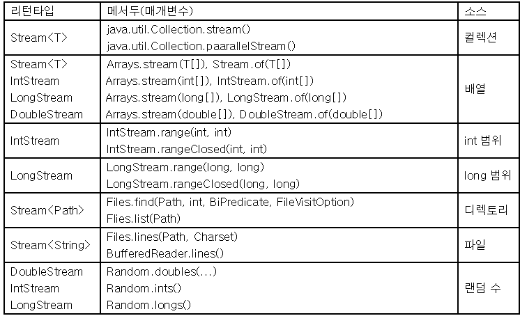
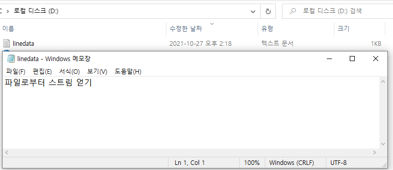
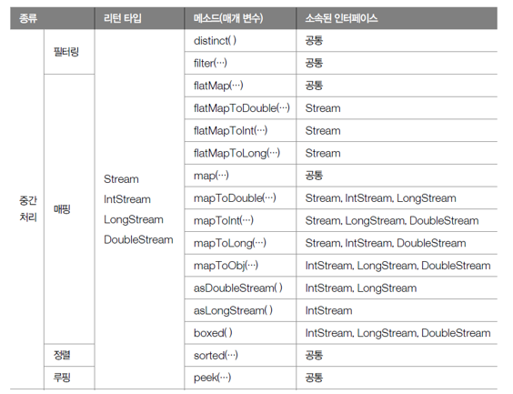
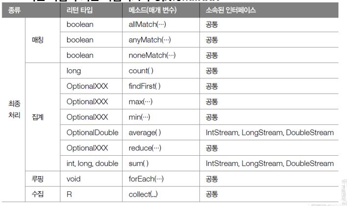

# 스트림과 병렬 처리

자바 7 이전까지 List<String>\ 컬렉션에서 요소를 순차적으로 처리하기 위해 Iterator 반복자를 다음과 같이 사용했다.

<pre>
<code>
List<String> list = Arrays.asList("A", "B", "C");
Iterator<String> iterator = list.iterator();
while(iterator.hasNext()){
    String str = iterator.next();
    System.out.println(str);
}
</code>
</pre>

위 코드를 Stream을 사용해서 변경하면 다음과 같다.

<pre>
<code>
List<String> list = Arrays.asList("A", "B", "C");
Stream<String> stream = list.stream();
stream.forEach(name->System.out.println(name));
</code>
</pre>

컬렉션(java.util.Collection)의 stream() 메소드로 스트림 객체를 얻고 나서 stream.forEach(name->System.out.printnln(name)); 메소드를 통해 컬렉션의 요소를 하나씩 콘솔에 출력한다. forEach() 메소드는 Consumer 함수적 인터페이스 타입의 매개값을 가지므로 컬렉션의 요소를 소비할 코드를 람다식으로 기술할 수 있따.

<pre>
<code>
void forEach(Consumer<T> action)
</code>
</pre>

아래 코드는 List<String> 컬렉션의 String 요소를 Iterator와 Stream을 이용해서 순차적으로 콘솔에 출력한다.

<pre>
<code>
import java.util.Arrays;
import java.util.Iterator;
import java.util.List;
import java.util.stream.Stream;

public class Main {
    public static void main(String[] args) {
        List<String> list = Arrays.asList("A", "B", "C");

        // iterator
        Iterator<String> iterator = list.iterator();
        while(iterator.hasNext()){
            String str = iterator.next();
            System.out.println(str);
        }

        // Stream
        Stream<String> stream = list.stream();
        stream.forEach(name->System.out.println(name));
    }
}
</code>
</pre>

### Stream의 특징

Stream은 Iterator와 비슷하지만 람다식으로 요소 처리 코드를 제공하는 점과 내부 반복자를 사용하므로 병렬 처리가 쉽다는 것, 중간 처리와 최종 처리 작업을 수행하는 점에서 많은 차이가 있다. 

### Stream의 특징_람다식으로 요소 처리 코드 제공

Stream이 제공하는 대부분의 요소 처리 메소드는 함수적 인터페이스 매개 타입을 가지기 때문에 람다식 또는 메소드 참조를 이용해서 요소 처리 내용을 매개값으로 전달할 수 있다. 

아래 코드는 컬렉션에 저장된 Student를 하나씩 가져와 학생 이름과 성적을 콘솔에 출력하도록 forEach() 메소드의 매개값으로 람다식을 주었다.

<pre>
<code>
import java.util.Arrays;
import java.util.List;
import java.util.stream.Stream;

public class Main {
    public static void main(String[] args) {
        List<Student> list = Arrays.asList(
            new Student("Park", 98),
            new Student("Hong", 78)
        );

        Stream<Student> stream = list.stream();
        stream.forEach(s->{
            String name = s.getName();
            int score = s.getScore();
            System.o0ut.println(name + " / " + score);
        });
    }
}

public class Student {
    private String name;
    private int score;

    public Student(String name, int score){
        this.name = name;
        this.score = score;

        public String getName() { return name; }
        public int getScore() { return score; }
    }
}
</code>
</pre>

### Stream의 특징_내부 반복자를 사용하므로 병렬 처리가 쉽다.

외부 반복자(external iterator)란 개발자가 코드로 직접 컬렉션의 요소를 반복해서 가져오는 코드 패턴을 말한다. index를 이용하는 for문, Iterator를 이용하는 while문은 모두 외부 반복자를 이용하는 것이다. 

내부 반복자(internal iterator)는 컬렉션 내부에서 요소들을 반복시키고 개발자는 요소당 처리해야 할 코드만 제공하는 코드 패턴을 말한다. 

내부 반복자 사용 시 컬렉션 내부에서 어떻게 요소를 반복시킬 것인가는 컬렉션에게 맡겨두고 개발자는 요소 처리 코드에만 집중할 수 있다. 내부 반복자는 요소들의 반복 순서를 변경하거나 멀티 코어 CPU를 최대한 활용하기 위해 요소들을 분배시켜 병렬 작업을 할 수 있게 도와주기 때문에 하나씩 처리하는 순차적 외부 반복자보다는 효율적으로 요소를 반복시킬 수 있다.

Iterator는 컬렉션의 요소를 가져오는 것에서부터 처리하는 것까지 모두 개발자가 작성해야 한다. 반면 Stream은 람다식으로 요소 처리 내용만 전달할 뿐 반복은 컬렉션 내부에서 일어난다. Stream을 이용하면 코드도 간결해지고, 무엇보다도 요소의 병렬 처리가 컬렉션 내부에서 처리되므로 일석이조의 효과를 가져온다.

### 병렬(parallel) 처리란?

한 가지 작업을 서브 작업으로 나누고, 서브 작업들을 분리된 스레드에서 병렬적으로 처리하는 것을 말한다. 병렬 처리 스트림을 이용하면 런타임 시 하나의 작업을 서브 작업으로 자동으로 나누고, 서브 작업의 결과를 자동으로 결합하여 최종 결과물을 생성한다. 예를 들어 컬렉션의 요소 총합을 구할 때 순차 처리 스트림은 하나의 스레드가 요소들을 순차적으로 읽어 합을 구하지만, 병렬 처리 스트림은 여러 개의 스레드가 요소들을 부분적으로 합하고 이 부분의 합을 최종 결합해서 전체 합을 생성한다. 

<pre>
<code>
import java.util.Arrays;
import java.util.List;
import java.util.stream.Stream;

public class Main {
    public static void main(String[] args) {
        List<String> list = Arrays.asList(
            "Park", "Hong", "Kim", "Hwang"
        );

        // 순차 처리
        Stream<String> stream = list.stream();
        stream.forEach(Main :: print); // == s->Main.print(s)
        System.out.println();

        // 병렬 처리
        Stream<String> parallelStream = list.parallelStream();
        parallelStream.forEach(Main :: print);
    }

    public static void print(String str){
        System.out.println(str + " / " + Thread.currentThread().getName());
    }
}

결과)
Park / main
Hong / main
Kim / main
Hwang / main

Kim / main
Hwang / main
Park / main
Hong / ForkJoinPool.commonPool-worker-1
</code>
</pre>

위 코드의 결과를 보면 병렬 처리 스트림은 main 스레드를 포함해서 ForkJoinPool(스레드풀)의 작업 스레드들이 병렬적으로 요소를 처리하는 것을 볼 수 있다.

### Stream의 특징_스트림은 중간 처리와 최종 처리를 할 수 있다.

Stream은 컬렉션의 요소에 대해 중간 처리와 최종 처리를 수행할 수 있다. 중간 처리에는 매핑, 필터링, 정렬을 수행하고 최종 처리에는 반복, 카운팅, 평균, 총합 등의 집계 처리를 수행한다.

아래 코드는 List에 저장된 Student 객체를 중간 처리에서 score 필드값으로 매핑한다. 이후 최종 처리에서 score의 평균값을 산출한다.

<pre>
<code>
public class Main {
    public static void main(String[] args) {
        List<Student> studentList = Arrays.asList(
            new Student("Park", 78);
            new Student("Hong", 89);
        );

        double avg = studentList.stream()
        // 중간 처리(학생 객체를 점수로 매핑)
        .mapToInt(Student :: getScore)
        // 최종 처리(평균 점수)
        .average()
        .getAsDouble();

        System.out.println("avg score = " + avg);
    }
}
</code>
</pre>

### Stream의 종류

[java.util.stream 패키지](https://docs.oracle.com/javase/8/docs/api/java/util/stream/package-summary.html)에는 스트림 API들이 있다.

출처 : https://altongmon.tistory.com/260

### 컬렉션으로부터 스트림 얻기

List<Student> 컬렉션에서 Stream<Student>를 얻어내고 요소를 콘솔에 출력한다.

<pre>
<code>
import java.util.Arrays;
import java.util.List;
import java.util.stream.Stream;

public class Main {
    public static void main(String[] args) {
        List<Student> studentList = Arrays.asList(
            new Student("Park", 56);
            new Student("Hwang", 98);
            new Student("Kim", 67);
        );

        Stream<Student> stream = studentList.stream();
        stream.forEach(s->System.out.println(s.getName()));
    }
}

public class Student {
    private String name;
    private int score;

    public Student(String name, int score) {
        this.name = name;
        this.score = score;
    }

    public String getName() { return name; }
    public int getScore() { score; }
}
</code>
</pre>

### 배열로부터 스트림 얻기

String[]과 int[] 배열로부터 스트림을 얻어내고 콘솔을 출력한다.

<pre>
<code>
import java.util.Arrays;
import java.util.stream.IntStream;
import java.util.stream.Stream;

public class Main {
    public static void main(String[] args) {
        String[] strArray = { "Park", "Hwang", "Kim" };
        Stream<String> strStream = Arrays.stream(strArray);
        strStream.forEach(a->System.out.println(a + " / "));
    }
}
</code>
</pre>

### 숫자 범위로부터 스트림 얻기

1부터 100까지의 합을 구하기 위해 IntStream의 rangeClosed() 메소드를 이용한다.
rangeClosed()는 첫 번째 매개값에서부터 두 번째 매개값까지 순차적으로 제공하는 IntStream을 리턴한다. IntStream의 또 다른 range() 메소드도 동일한 IntStream을 리턴하지만 두 번째 매개값은 포함하지 않는다.

<pre>
<code>
import java.util.stream.IntStream;

public class Main {

    public static int sum;

    public static void main(String[] args) {
        IntStream stream = IntStream.rangeClosed(1, 100);
        stream.forEach(a -> sum += a);
        System.out.println(sum);
    }
}
</code>
</pre>

### 파일로부터 스트림 얻기

Files의 정적 메소드인 lines()와 BufferedReader의 lines() 메소드를 이용하여 문자 파일의 내용을 스트림을 통해 행 단위로 읽고 콘솔에 출력한다.

<pre>
<code>
import java.io.BufferedReader;
import java.io.File;
import java.io.FileReader;
import java.io.IOException;
import java.nio.charset.Charset;
import java.nio.file.Files;
import java.nio.file.Path;
import java.nio.file.Paths;
import java.util.stream.Stream;

public class Main {
    public static void main(String[] args) throws IOException{
        Path path = Paths.get("D:\\linedata.txt");
        Stream<String> stream;

        stream = Files.lines(path, Charset.defaultCharset());
        stream.forEach(System.out :: println);
        System.out.println();

        File file = path.toFile();
        FileReader fileReader = new FileReader(file);
        BufferedReader br = new BufferedReader(fileReader);
        stream = br.lines();
        stream.forEach(System.out :: println);
    }   
}

결과)
파일로부터 스트림 얻기

파일로부터 스트림 얻기
</code>
</pre>

위 코드에서 가져온 linedata.txt는 D 드라이브에 저장된 txt 파일이다.

### 디펙토리로부터 스트림 얻기

Files의 정적 메소드인 list()를 이용해서 디렉토리의 내용(서브 디렉토리 또는 파일 목록)을 스트림을 통해 읽고 콘솔에 출력한다.

<pre>
<code>
import java.io.IOException;
import java.nio.file.Files;
import java.nio.file.Path;
import java.nio.file.Paths;
import java.util.stream.Stream;

public class Main {
    public static void main(String[] args) throws IOException {
        Path path = Paths.get("출력을 원하는 폴더 경로");
        Stream<Path> stream = Files.list(path);
        stream.forEach(p->System.out.println(p.getFileName()));
    }
}
</code>
</pre>

## 스트림 파이프라인

대량의 데이터를 가공해서 축소하는 것을 리덕션(Reduction)이라고 한다. 데이터의 합계, 평균값, 최대/최소값 등을 구하는 것은 리덕션의 결과물이다. 
컬렉션의 요소를 리덕션의 결과물로 바로 집계할 수 없을 때 집계하기 좋도록 필터링, 매핑, 정렬, 그룹핑 등의 중간 처리가 필요하다.

### 중간 처리와 최종 처리

스트림은 데이터의 필터링, 매핑, 정렬, 그룹핑 등의 중간 처리와 합계, 평균, 카운팅, 최대/최소값 등의 최종 처리를 파이프라인(pipelines)으로 해결한다. 파이프라인은 여러 개의 스트림이 연결되어 있는 구조를 말한다.

회원 컬렉션에서 남자만 필터링하는 중간 스트림을 연결하고, 다시 남자의 나이로 매핑하는 스트림을 연결, 최종적으로 남자 평균 나이를 집계하는 파이프라인을 코드로 표현하면 다음과 같다.

<pre>
<code>
import java.util.Arrays;
import java.util.List;

public class Main {
    public static void main(String[] args) {
        List<Member> list = Arrays.asList(
            new Member("Park", Member.MALE, 30);
            new Member("Hwang", Member.MALE, 55);
            new Member("Kim", Member.MALE, 18);
        );

        double ageAvg = list.strea()
            .filter(m->m.getSex() == Member.MALE)
            .mapToInt(Member :: getAge)
            .average()
            .getAsDouble();

        System.out.println("avg age of male = " + ageAvg);
    }
}

public class Member {
    public static int MALE = 0;
    public static int FEMALE = 1;

    private String name;
    private int sex;
    private int age;

    public Member(String name, int sex, int age) {
        this.name = name;
        this.sex = sex;
        this.age = age;
    }

    public int getSex() { return sex; }
    public int getAge() { return age; }
}
</code>
</pre>

### 중간 처리 메소드와 최종 처리 메소드

출처 : https://velog.io/@ansalstmd/%EC%9D%B4%EA%B2%83%EC%9D%80-%EC%9E%90%EB%B0%94%EB%8B%A4-16%EC%9E%A5%EC%8A%A4%ED%8A%B8%EB%A6%BC%EA%B3%BC-%EB%B3%91%EB%A0%AC%EC%B2%98%EB%A6%AC

리턴 타입이 스트림이라면 중간 처리 메소드이다.
기본 타입이거나 OptionalXXX라면 최종 처리 메소드이다.

### 필터링( distinct(), filter() )

필터링은 중간 처리 기능으로 요소를 걸러낸다. distinct(), filter() 메소드는 모든 스트림이 가지고 있는 공통 메소드이다.

distinc() 메소드는 중복을 제거한다. Stream의 경우 Object.equals(Object)의 결과가 true면 동일 객체로 판단하고 중복을 제거한다. 
IntStream, LongStream, DoubleStream은 동일값일 경우 중복을 제거한다.

filter() 메소드는 매개값으로 주어진 Predicate가 true를 리턴하는 요소만 필터링한다.

아래 코드는 이름 List에서 중복된 이름을 제거 후 출력한다. 그리고 특정 성인 이름만 필터링해서 출력한다.

<pre>
<code>
import java.util.Arrays;
import java.util.List;

public class Main {

    public static void main(String[] args) {
        List<String> names = Arrays.asList("김사월", "황진이", "윤동주", "이창동");

        names.stream()
        .distinct() // 중복 제거
        .forEach(n->System.out.println(n));
        
        System.out.println();

        names.stream()
        .filter(n->n.startsWith("김")) // 필터링
        .forEach(n->System.out.println(n));

        System.out.println();

        // 중복 제거 후 필터링
        names.stream()
        .distinct()
        .filter(n->n.startsWith("윤"))
        .forEach(n->System.out.println(n));
    }
}

결과)
김사월
황진이
윤동주
이창동

김사월

윤동주
</code>
</pre>

# 출처
* [이것이 자바다](http://www.kyobobook.co.kr/product/detailViewKor.laf?ejkGb=KOR&mallGb=KOR&barcode=9788968481475&orderClick=LAG&Kc=)