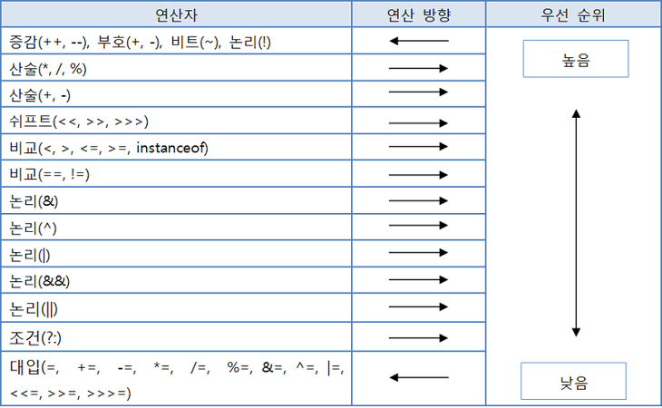

# 연산자와 연산식

우선 용어 정리부터 해보자.

| 용어 | 의미 |
| --- | --- |
| 연산(expression) | 프로그램에서 데이터를 처리하여 결과를 산출하는 것 |
| 연산자(operator) | 연산에 사용되는 표시나 기호 |
| 피연산자(operand) | 연산되는 데이터 |

다음 예시는 연산자와 피연산자의 사용을 보여준다.
+, -, *, / 기호는 연산자. x, y는 피연산자이다.
<pre>
<code>
x + y;
x - y;
x * y;
x / y;
</code>
</pre>

자바에서 제공하는 다양한 연산자 종류

| 연산자 종류 | 연산자 | 피연산자 수 | 산출값 | 기능 설명 |
| --- | --- | --- | --- | --- |
| 산술 | +, -, *, /, % | 이항 | 숫자 | 사칙연산 및 나머지 계산 |
| 부호 | +, - | 단항 | 숫자 | 음수와 양수의 부호 |
| 문자열 | + | 이항 | 문자열 | 두 문자열을 연결 |
| 대입 | =, +=, -=, *=, /=, %=, &=, ^=, !=, <<=, >>=, >>>= | 이항 | 다양 | 우변의 값을 좌변의 변수에 대입 |
| 증감 | ==, !=, >, <, >=, <=, instanceof | 이항 | boolean | 값의 비교 |
| 논리 | !, &, |, &&, || | 단항, 이항 | boolean | 논리적NOT, AND, OR 연산 |
| 조건 | (조건식)? A : B | 삼항 | 다양 | 조건식에 따라 A 또는 B 중 하나를 선택한다 |
| 비트 | ~, &, |, ^ | 단항, 이항 | 숫자, boolean | 비트 NOT, AND, OR, XOR 연산 |
| 쉬프트 | >>, <<, >>> | 이항 | 숫자 | 비트를 좌측/우측으로 밀어서 이동 |

연산자는 필요로 하는 피연산자의 수에 따라 단항, 이상, 삼항으로 구분된다. 

<pre>
<code>
단항 연산자: x++;
이항 연산자: x + y;
삼항 연산자: (sum>90) ? "A" : "B";
</code>
</pre>

연산식은 반드시 **하나의 값만** 산출한다. 연산자 수가 아무리 많아도 두 개 이상의 값을 산출하지 않는다.
일반적으로 연산식의 값은 아래 예시와 같이 변수에 저장하여 사용한다.
<pre>
<code>
// 연산식의 값은 변수에 저장하여 사용한다.
int result = x + y;
</code>
</pre>

연산식은 다른 연산식의 피연산자로도 사용 가능하다.
아래 예시는 비교 피연산자인 < 의 좌측 피연산자로 (x+y)라는 연산식이 사용되었다.
<pre>
<code>
boolean result = (x+y) < 5;
</code>
</pre>

## 연산자의 방향과 우선순위
> 프로그램에서는 연산자의 연산 방향과 연산자 간의 우선순위가 정해져 있다.

아래 예시를 살펴보자.
<pre>
<code>
x > 0 && y < 0
</code>
</pre>
&& 보다는 >, < 가 우선순위가 높기 때문에 x > 0, y < 0 가 먼저 처리되고 &&는 x > 0, y < 0 의 산출값을 가지고 연산한다.

**우선순위가 같은 경우**는 어떻게 할까?
이 경우 **연산자의 방향**에 따라 달라진다.
아래 예시를 살펴보자.
<pre>
<code>
100 * 2 / 3 % 5
</code>
</pre>
*, /, % 는 같은 우선순위를 가지고 있다. 이 연산자들은 왼쪽에서 오른쪽으로 연산을 수행한다.
따라서 100 * 2가 가장 먼저 연산된다. 연산 순서에 따라 연산을 하면.
1. 100 * 2 = 200
2. 200 / 3 = 66
3. 66 % 5 = 1
최종 결과값은 1이 나온다.

하지만 **단항 연산자(++, --, ~, !), 부호 연산자(+, -), 대입 연산자(=, +=, -=, ...)는 오른쪽에서 왼쪽**으로 연산된다.
아래 예시를 살펴보자.
<pre>
<code>
a = b = c = 7;
</code>
</pre>
위 연산식의 연산 순서는 다음과 같다.
1. c = 7
2. b = c
3. a = b
최종 결과값은 a, b, c 모두 값이 7이 된다.

연산자의 연산 방향과 우선순위

[출처]: https://medium.com/@katekim720

이것저것 복잡하게 우선순위나 방향을 고려하기 귀찮다면 괄호()를 사용하는 것을 추천한다.
괄호를 사용하면 괄호 안의 연산식이 우선순위로 처리된다.
아래 예시를 살펴보자.
<pre>
<code>
int num1 = 1;
int num2 = 2;
int num3 = 3;
int result = (num1 + num2) * num3;
</code>
</pre>
원래대로라면 num2 * num3가 우선적으로 연산되지만, (num1 + num2)와 같이 괄호로 묶어주면 해당 부분의 연산이 최우선순위를 가지도록 할 수 있다.

## 단항 연산자
> 단항 연산자는 피연산자가 단 하나뿐인 연산자를 말한다.

단항 연산자의 종류
* 부호 연산자(+, -)
* 증감 연산자(++, --)
* 부정 연산자( ! )
* 비트 반전 연산자( ~ )

### 부호 연산자
부호 연산자는 boolean 타입과 char 타입을 제외한 나머지 기본 타입에 사용 가능하다.

산술 연산자는 부호 연산자, 산술 연산자 두 역할 수행한다.
아래 예시를 살펴보자.
<pre>
<code>
int a1 = +100;
int a2 = -100;
double b1 = -3.14;
double b2 = -10.34;
</code>
</pre>
정수 리터럴 앞에 부호 연산자를 붙여 양수 및 음수를 표현한다.

리터럴 앞이 아닌 변수 앞에 붙어있는 경우도 있다. 이 경우는 변수를 양수 및 음수로 표현한 것이 아니고, 변수 값의 부호를 유지하거나 바꾸기 위함이다.
아래 예시를 살펴보자.
<pre>
<code>
int a1 = +100;
int result1 = +a1;
int result2 = -a1;
</code>
</pre>
result1에는 + 부호 연산자를 붙여 양수를 유지한다. 반면 result2에서는 음수 부호 연산자를 사용해 음수로 변경한다.

**부호 연산자의 산출 타입은 int타입**이다.
따라서 다른 타입 값을 부호 연산하면 int 값으로 바뀌기 때문에 컴파일 에러가 발생한다.
아래 예시를 살펴보자.
<pre>
<code>
short s = 100;
short result = -s; // 컴파일 에러 발생
</code>
</pre>

다음과 같이 변경해야 한다.
<pre>
<code>
short s = 100;
int result = -s;
</code>
</pre>

### 증감 연산자
증감 연산자는 변수의 값을 1증가(++) 또는 감소(--)시키는 연산자.
boolean타입을 제외한 모든 기본 타입의 피연산자에 사용할 수 있다.

| 연산식 | 설명 |
| --- | --- |
| ++피연산자 | 다른 연산을 수행하기 전에 피연산자의 값을 1 증가시킴 |
| --피연산자 | 다른 연산을 수행하기 전에 피연산자의 값을 1 감소시킴 |
| 피연산자++ | 다른 연산을 수행한 후에 피연산자의 값을 1 증가시킴 |
| 피연산자-- | 다른 연산을 수행한 후에 피연산자의 값을 1 감소시킴 |

위 표에서 알 수 있듯이 연산식에서 증감 연산자의 위치에 따라 연산식의 결과가 달라질 수 있으니 주의해야 한다.
아래 예시를 살펴보자.
<pre>
<code>
int x = 1;
int y = 1;
int result1 = ++x + 10; // 12
int result2 = y++ + 10; // 11
</code>
</pre>
result1은 피연산자 x의 값을 우선 1 증가시킨 후 10을 더한다. 따라서 결과는 12
result2는 우선 피연산자에 10을 더하기 때문에 결과가 11이 나온다. 11이 나온 이후에 y의 증감 연산자가 수행되어 y는 2가 된다.

### 논리 부정 연산자
논리 부정 연산자는 '!'기호를 사용하여 true를 false로, false를 true로 변경한다. 따라서 boolean 타입에만 사용할 수 있다.

| 연산식 | 설명 |
| --- | --- |
| !피연산자 | 피연산자가 true이면 false값 산출 / 피연산자가 false이면 true값 산출 |

### 비트 반전 연산자
정수 타입(byte, short, int, long)의 피연산자에만 사용되며, 피연산자를 2진수로 표현했을 때 비트값이 0을 1로, 1은 0으로 반전한다.
'~'기호를 사용한다.

사용 시 주의점은 비트 반전 연산자 산출 타입은 int 타입이 된다는 것이다.
피연산자는 연산을 수행하기 전에 int타입으로 변환되고, 비트 반전이 일어난다.
아래 예시를 살펴보자.
<pre>
<code>
byte a1 = 10;
byte a2 = ~a1; // 컴파일 에러
</code>
</pre>

다음과 같이 변경해야 한다.
<pre>
<code>
byte a1 = 10;
int a2 = ~a1;
</code>
</pre>

비트 반전 연산자의 결과를 이용해 부호가 반대인 정수도 구할 수 있다.
비트 반전 연산자의 산출값에 1을 더하면 부호가 반대인 정수를 얻을 수 있다. 
아래 예시를 살펴보자.
<pre>
<code>
byte a1 = 10;
int a2 = ~a1 + 1; // -10
</code>
</pre>
10을 비트 반전하면 -11이 되는데, 여기에 1을 더하면 -10을 얻는다.

### 이상 연산자
