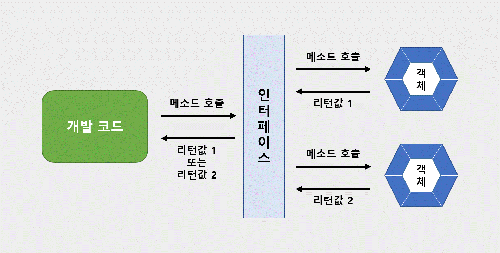

# 인터페이스(interface)

인터페이스는 객체의 사용 방법을 정의한 타입이다.(사용 설명서) 인터페이스는 개발 코드와 객체가 서로 통신하는 접점 역할을 한다. 개발 코드가 인터페이스의 메소드를 호출하면 인터페이스는 객체의 메소드를 호출한다. 따라서 개발 코드는 객체의 내부 구조를 알 필요가 없고 인터페이스의 메소드만 알고 있으면 된다.

출처 : https://hyuntaekhong.github.io/blog/java-basic20/

개발 코드가 직접 객체의 메소드를 호출하지 않고 인터페이스를 거치는 이유는 간단하다. **개발 코드를 수정하지 않고, 사용하는 객체를 변경할 수 있도록 하기 위함이다.**
인터페이스는 여러 객체들과 사용이 가능하므로 객체 사용에 따라 실행 내용과 리턴값이 다르다. 따라서 개발 코드 측면에서 코드 변경 없이 실행 내용과 리턴값을 다양화할 수 있다.

## 인터페이스 선언
인터페이스 선언은 class 키워드 대신 interface 키워드를 사용한다.

> [ public ] interface [ 인터페이스명 ] { ... }

인터페이스명은 대소문자를 구분하고, 첫 문자를 대문자로, 나머지는 소문자로 작성하는 것이 일반적이다.

클래스는 필드, 생성자, 메소드를 구성 멤버로 가지는데, **인터페이스는 상수와 메소드만을 구성 멤버로 가진다.**
인터페이스는 객체로 생성할 수 없기 때문에 생성자를 가질 수 없다.

<pre>
<code>
interface 인터페이스명 {
    // 상수
    타입 상수명 = 값;

    // 추상 메소드
    타입 메소드명(매개변수, ..);

    // 디폴트 메소드
    default 타입 메소드명(매개변수, ..) { ... }

    // 정적 메소드
    static 타입 메소드명(매개변수) { ... }
}
</code>
</pre>

* 상수 필드(constant field)
인터페이스는 객체 사용 설명서이므로 런타임 시 데이터를 저장할 수 있는 필드 선언이 불가능하지만, 상수 필드 선언은 가능하다. 상수는 인터페이스에 고정된 값으로 런타임 시 데이터를 바꿀 수 없다. 상수 선언 시 반드시 초기값을 대입해야 한다.

* 추상 메소드(abstract method)
객체가 가진 메소드를 설명하는 것. 호출 시 어떤 매개값이 필요하고, 리턴 타입이 무엇인지 설명한다. 실제 실행부는 객체(구현 객체)가 가지고 있다.

* 디폴트 메소드(default method)
인터페이스에 선언되지만 사실 객체가 가지고 있는 인스턴스 메소드라고 생각해야 한다. 자바8에서 추가되었고, 기존 인터페이스를 확장해서 새로운 기능을 추가하는 용도로 사용됨.

* 정적 메소드(static method)
자바8부터 사용 가능. 디폴트 메소드와 다르게 객체가 없어도 인터페이스만으로 호출이 가능하다.

### 상수 필드 선언
인터페이스는 데이터를 저장할 수 없기 때문에 데이터 저장 용도의 인스턴스, 정적 필드를 선언할 수 없다. 대신 상수 필드만 선언할 수 있다. 상수는 **public static final**로 선언한다. 따라서 인터페이스에 선언된 상수 필드는 모두 public static final의 특성을 가진다. public static final 생략해도 컴파일 과정에서 자동으로 붙는다.

> [ public static final ] 타입 상수명 = 값;

상수명은 대문자로 작성하고, 서로 다른 단어로 구성되어 있는 경우 언더바(_)로 연결한다. 
인터페이스 상수는 반드시 선언과 동시에 초기값을 지정해야 한다.
<pre>
<code>
public interface RemoteControl{
    public int MAX_VOLUME = 100;
    public int MIN_VOLUME = 0;
}
</code>
</pre>

### 추상 메소드 선언
인터페이스를 통해 호출된 메소드는 최종적으로 객체에서 실행된다. 그래서 인터페이스의 메소드는 실행 블록이 필요 없는 추상 메소드로 선언한다.
추상 메소드는 리턴 타입, 메소드명, 매개변수만 기술되고 중괄호( {} )를 붙이지 않는 메소드를 말한다. 
인터페이스 선언된 추상 메소드는 모두 public abstract의 특성을 가지기 때문에 public abstract를 생략해도 컴파일 과정에서 자동으로 붙는다.

개발 코드가 인터페이스의 추상 메소드를 호출하고, 인터페이스의 추상 메소드가 실제 구현 객체의 재정의된 메소드(실제 실행 메소드)를 호출한다.

다음은 인터페이스의 추상 메소드 사용 예시이다.
<pre>
<code>
public interface RemoteControl{

    // constant field
    public int MAX_VOLUME = 100;
    public int MIN_VOLUME = 0;

    // abstract method
    public void turnOn();
    public void turnOff();
    public setVolume(int volume);
}
</code>
</pre>

### 디폴트 선언 메소드
자바8에 추가된 인터페이스의 새로운 멤버. 
형태는 클래스의 인스턴스 메소드와 동일하지만, default 키워드가 리턴 타입 앞에 붙는다. 
디폴트 메소드는 public 특성을 가진다. 따라서 public을 생략해도 컴파일 과정에서 자동으로 붙는다.

> [ public ] default 리턴타입 메소드명(매개변수, ...) { ... }

다음은 RemoteControl 인터페이스에서 무음 처리를 담당하는 디폴트 메소드 setMute의 에시이다.
<pre>
<code>
public interface RemoteControl{

    // constant field
    public int MAX_VOLUME = 100;
    public int MIN_VOLUME = 0;

    // abstract method
    public void turnOn();
    public void turnOff();
    public setVolume(int volume);

    // default method
    default void setMute(boolean mute){
        if(mute){
            System.out.println("Mute on");
        }else{
            System.out.println("Mute off");
        }
    }
}
</code>
</pre>

### 정적 메소드 선언
자바8에 추가된 인터페이스의 새로운 멤버. 
형태는 클래스의 정적 메소드와 완전히 동일하다. 
public 특성을 가진다. 따라서 public을 생략해도 컴파일 과정에서 자동으로 붙는다.

> [ public ] static 리턴타입 메소드명(매개변수, ...) { ... }

다음은 RemoteControl 인터페이스에서 배터리 교환을 담당하는 정적 메소드 changeBattery() 선언 예시이다.
<pre>
<code>
public interface RemoteControl{

    // constant field
    public int MAX_VOLUME = 100;
    public int MIN_VOLUME = 0;

    // abstract method
    public void turnOn();
    public void turnOff();
    public setVolume(int volume);

    // default method
    default void setMute(boolean mute){
        if(mute){
            System.out.println("Mute on");
        }else{
            System.out.println("Mute off");
        }
    }

    // static method
    static void changeBattery(){
        System.out.println("change the battery");
    }
}
</code>
</pre>

## 인터페이스 구현
개발 코드가 인터페이스 메소드를 호출 -> 인터페이스는 객체의 메소드를 호출한다.
객체는 인터페이스에서 정의된 추상 메소드 이름, 매개 타입, 리턴 타입을 가진 실체 메소드를 가지고 있어야 한다. 이러한 객체를 **인터페이스의 구현(implement) 객체라고 하고, 구현 객체를 생성하는 클래스를 구현 클래스라고 한다.**

### 구현 클래스
구현 클래스는 일반 클래스와 동일하다. 다만 인터페이스 타입으로 사용할 수 있다는 것을 알리기 위해 클래스 선언부에 implements 키워드를 추가하고 인터페이스명을 명시해야 한다. 그 다음 인터페이스에 선언된 추상 메소드의 실제 메소드 선언한다.

<pre>
<code>
public class 구현클래스명 implements 인터페이스명 {

    // 인터페이스에 선언된 추상 메소드의 실제 메소드 선언

}
</code>
</pre>

다음은 구현 클래스 Television과 인터페이스 RemoteControl을 사용하는 예시이다.
<pre>
<code>
public class Television implements RemoteControl {
    // field
    private int volume;

    // turnOn() 추상 메소드의 실체 메소드
    public void turnOn() {
        System.out.println("turn on Television");
    }

    // turnOff() 추상 메소드의 실체 메소드
    public void turnOff() {
        System.out.println("turn off Television");
    }

    // setVolume() 추상 메소드의 실체 메소드
    public void setVolume(int volume) {
        if(volume > RemoteControl.MAX_VOLUME){
            this.volume = RemoteControl.MAX_VOLUME;
        }else if(volume < RemoteControl.MIN_VOLUME){
            this.volume = RemoteControl.MIN_VOLUME;
        }else{
            this.volume = volume;
        }
        System.out.println("current tv volume : " + this.volume);
    }
}
</code>
</pre>

구현 클래스가 작성되면 new 연산자로 객체를 생성할 수 있다. 사용 방법은 **인터페이스 변수를 선언하고 구현 객체를 대입하면 된다.**
인터페이스 변수는 참조 타입이기 때문에 구현 객체가 대입될 경우 구현 객체의 번지를 저장한다.

<pre>
<code>
인터페이스 변수;
변수 = 구현객체;
</code>
</pre>

다음은 인터페이스 변수에 구현 객체를 대임하여 사용하는 예제이다.
<pre>
<code>
public class Main {
    public static void main(String[] args){

        RemoteControl rc;
        rc = new Television();

    }
}
</code>
</pre>

### 익명 구현 객체
자바는 소스 파일을 만들지 않고도 구현 객체를 만들 수 있는 방법을 제공한다. 그것이 익명 구현 객체라는 것이다.

다음은 익명 구현 객체를 생성해서 인터페이스 변수에 대입하는 예시이다.
<pre>
<code>
인터페이스 변수 = new 인터페이스() {
    // 인터페이스에 선언된 추상 메소드의 실체 메소드 선언
}
</code>
</pre>

new 연산자 뒤에 클래스 이름이 와야 하는데, 이름이 없다. 인터페이스() {}는 인터페이스를 구현해서 중괄호와 같이 클래스를 선언하라는 뜻이고, new 연산자는 이렇게 선언된 클래스를 객체로 생성한다. 중괄호에는 인터페이스에 선언된 모든 추상 메소드들의 실체 메소드를 작성해야 한다. 추가적인 필드와 메소드 선언이 가능하지만, 익명 객체 안에서만 사용 가능하고 인터페이스 변수로 접근할 수 없다.

다음은 RemoteControl의 익명 구현 객체를 만든 것이다.
<pre>
<code>
public class Main {
    public static void main(String[] args){

        RemoteControl rc = new RemoteControl() {
            public void turnOn() { 실행문 }
            public void turnOff() { 실행문 }
            public void setVolume(int volume){ 실행문 }
        }

    }
}
</code>
</pre>

### 다중 인터페이스 구현 클래스
여러 인터페이스가 객체의 메소들르 호출하려면 다음과 같이 한다.
<pre>
<code>
public class 구현클래스명 implements 인터페이스1, 인터페이스2 {

    // 인터페이스1에 선언된 추상 메소드의 실체 메소드 선언
    // 인터페이스2에 선언된 추상 메소드의 실체 메소드 선언
}
</code>
</pre>

## 인터페이스 사용

### 추상 메소드 사용
인터페이스 변수에 구현 객체를 대입하면 사용 가능하다.

개발 코드에서 RemoteControl의 변수 rc로 turnOn(), turnOff() 메소드를 호출하면 구현 객체의 turnOn(), turnOff() 메소드가 자동 실행된다.
<pre>
<code>
RemoteControl rc = new Television();
rc.turnOn();
rc.turnOff();
</code>
</pre>

### 디폴트 메소드 사용
디폴트 메소드는 인터페이스에 선언되지만, 인터페이스에서 바로 사용할 수 없다. 디폴트 메소드는 추상 메소드가 아닌 인스턴스 메소드이므로 구현 객체가 있어야 사용할 수 있다. 구현 객체를 인스턴스 변수에 대입하고 나서 디폴트 메소드를 호출할 수 있다.

디폴트 메소드는 인터페이스의 모든 구현 객체가 가지고 있는 기본 메소드라고 생각하면 된다. 만약 디폴트 메소드의 내용이 맞지 않아 수정이 필요한 경우 구현 클래스를 작성할 때 디폴트 메소드를 재정의(오버라이딩)하면 된다.

### 정적 메소드 사용
인터페이스의 정적 메소드는 인터페이스로 바로 호출이 가능하다. 
<pre>
<code>
public class Main {
    public static void main(String[] args){

        // 인터페이스 RemoteControl의 정적 메소드 changeBattery를 바로 호출하는 모습.
        RemoteControl.changeBattery();
    }
}
</code>
</pre>

## 타입 변환과 다형성
인터페이스도 다형성을 구현하는 기술이 사용된다. 다형성은 하나의 타입에 대입되는 객체에 실행 결과가 다양하게 나오는 성질을 말한다. 인터페이스에 어떤 구현 객체를 삽입하느냐에 따라 실행 결과가 달라진다. 

인터페이스는 메소드의 매개 변수로도 많이 등장한다. 인터페이스 타입으로 매개 변수를 선언하면 메소드 호출 시 매개값으로 여러 가지 종류의 구현 객체를 줄 수 있기 때문에 메소드 실행 결과가 다양하게 나온다.

### 자동 타입 변환(Promotion)
구현 객체가 인터페이스 타입으로 변환되는 것은 자동 타입 변환에 해당한다. 자동 타입 변환은 프로그램 실행 도중 자동으로 타입 변환이 일어나는 것이다.

인터페이스의 구현 클래스를 상속해서 자식 클래스를 만들었다면 자식 객체 역시 인터페이스 타입으로 자동 타입 변환시킬 수 있다. 예를 들어 인터페이스 A의 구현 클래스 B를 상속받은 자식 클래스 C가 있다고 한다면, **A a = new C();**로 자동 타입 변환시켜서 구현할 수 있다. 

자동 타입 변환을 이용하면 필드의 다형성과 매개 변수의 다형성을 구현할 수 있다. 필드와 매개 변수의 타입을 인터페이스로 선언하면 여기에 다양한 구현 객체를 대입해서 실행 결과를 다양하게 만들 수 있다.

### 인터페이스 배열로 구현 객체 관ㄹ;

<pre>
<code>
// 인터페이스
public interface Tire {
    public void roll();
}

// 구현 클래스1
public class Michelin implements Tire {
    
    @Override
    public void roll() {
        System.out.println("미쉐린 타이어가 굴러간다.");
    }
}

// 구현 클래스2
public void Firelli implements Tire {
    
    @Override
    public void roll() {
        System.out.println("피렐리 타이어가 굴러간다.");
    }
}

// 필드 다형성(배열로 관리)
public class MotorBike {
    
    Tire[] tires = {

        new Michelin()
    };

    void run() {
        for(Tire tire : tires){
            tire.roll();
        }
    }
}

// 실행 클래스
public class Main {
    public static void main(String[] args){
        MotorBike motorBike = new MotorBike();

        motorBike.run();

        motorBike[0] = new Firelli();

        motorBike.run();
    }
}

// 미쉐린 타이어가 굴러간다.
// 피렐리 타이어가 굴러간다.
</code>
</pre>

## 매개 변수의 다형성
자동 타입 변환은 필드의 값을 대입할 때에도 발생하지만, 주로 메소들르 호출할 때 많이 발생한다. 
상속에서는 매개 변수를 부모 타입으로 선언하고 호출할 때 자식 객체를 대입했다. 이번엔 매개 변수를 인터페이스 타입으로 선언하고 호출할 때에는 구현객체를 대입한다. 

매개변수의 타입이 인터페이스인 경우 어떠한 구현 객체도 매개값으로 사용할 수 있고, 어떤 구현 객체가 제공되느냐에 따라 메소드의 실행 결과는 다양해질 수 있다. 이것이 매개 변수의 다형성이다.

<pre>
<code>
// 매개 변수의 인터페이스화
public class Driver {
    public void drive(Vehicle vehicle) {
        vehicle.run(); // 구현 객체의 run() 메소드가 실행됨
    }
}

// 인터페이스
public interface Vehicle {
    public void run();
}

// 구현 클래스1
public class MotorBike implements Vehicle {
    @Override
    public void run() {
        System.out.println("MotorBike is running");
    }
}

// 구현 클래스2
public clas Car implements Vehicle {
    @Override
    public void run() {
        System.out.println("Car is running");
    }
}

// 실행 클래스
public class Main [
    public static void main(String[] args){
        Driver driver = new Driver();

        MotorBike motorBike = new MotorBike();
        Car car = new Car();

        driver.run(motorBike); // 자동 타입 변환 발생 : Vehicle vehicle = motorBike
        driver.run(car); // 자동 타입 변환 발생 : Vehicle vehicle = car
    }
]

// MotorBike is running
// Car is running
</code>
</pre>

### 강제 타입 변환(Casting)
구현 객체가 인스턴스 타입으로 자동 변환하면 인터페이스에 선언된 메소드만 사용 가능하다는 제약 사항이 따른다. 
하지만 경우에 따라서는 구현 클래스에 선언된 필드, 미소드를 사용해야 하는 경우도 발생한다. 이때 강제 타입 변환을 해서 다시 구현 클래스 타입으로 변환한 다음, 구현 클래스의 필드, 메소드를 사용할 수 있다.

> 구현클래스 변수 = (구현클래스) 인터페이스변수;

<pre>
<code>
// 인터페이스
public interface Vehicle {
    public void run();
}

// 구현 클래스
public class MotorBike implements Vehicle {
    @Override
    public void run() {
        System.out.println("MotorBike is running");
    }

    public void stop() {
        System.out.println("MotorBike is stop");
    }
}

// 강제 타입 변환
public class Main {
    public static void main(String[] args){
        Vehicle vehicle = new Vehicle();

        vehicle.run();

        MotorBike motorBike = (motorBike) vehicle;

        motorBike.run();
        motorBike.stop();
    }
}

</code>
</pre>

### 인터페이스 상속
인터페이스도 다른 인터페이스를 상속할 수 있다. 인터페이스는 클래스와 달리 다중 상속을 허용한다.

> public interface 하위인터페이스 extends 상위인터페이스1, 상위인터페이스2 { ... }

하위인터페이스를 구현하는 클래스는 하위 인터페이스의 메소드뿐만 아니라 상위 인터페이스의 모든 추상 메소드들에 대한 실체 메소드를 가지고 있어야 한다. 그렇기 때문에 구현 클래스로부터 객체를 생성하고 나서 다음과 같이 하위 및 상위 인터페이스 타입으로 변환이 가능하다.

<pre>
<code>
하위인터페이스 변수 = new 구현클래스(...);
상위인터페이스 변수 = new 구현클래스(...);
</code>
</pre>

하위 인터페이스로 타입 변환이 되면 상/하위 인터페이스에 선언된 모든 메소드를 사용할 수 있으나, 상위 인터페이스로 타입 변환되면 상위 인터페이스에 선언된 메소드만 사용 가능하고 하위 인터페이스에 선언된 메소드는 사용할 수 없다.

<pre>
<code>
// 부모 인터페이스
public interface InterfaceA {
    public void methodA();
}

// 부모 인터페이스
public interface InterfaceB {
    public void methodB();
}

// 하위 인터페이스
public interface InterfaceC extends InterfaceA, InterfaceB {
    public void methodC();
}

// 하위 인터페이스 구현
public class ImplementationC implements InterfaceC {
    public void methodA() {
        System.out.print("methodA");
    }

    public void methodB() {
        System.out.print("methodB");
    }

    public void methodC() {
        System.out.print("methodC");
    }
}

// 실행 메소드
public class Main {
    public static void main(String[] args){
        ImplementationC implC = new ImplementationC();

        InterfaceA ia = implC; // methodA만 호출 가능
        ia.methodA();

        InterfaceB ib = implC; // methodB만 호출 가능
        ib.methodB();

        InterfaceC ic = implC; 
        ic.methodA();
        ic.methodB();
        ic.methodC(); 
      
    }
}
</code>
</pre>

## 디폴트 메소드와 인터페이스 확장
디폴트 메소드는 인터페이스에 선언된 인스턴스 메소드이기 때문에 구현 객체가 있어야 사용할 수 있다. 선언은 인터페이스에서 하고, 사용은 구현 객체를 통해 한다. 디폴트 메소드는 모든 구현 객체에서 공유하는 기본 메소드처럼 보이지만, 인터페이스에서 디폴트 메소드를 허용한 다른 이유가 있다.

### 디폴트 메소드의 필요성
인터페이스에서 디폴트 메소드를 허용한 이유는 기존 인터페이스를 확장해서 새로운 기능을 추가하기 위함이다. 기존 인터페이스의 이름과 추상 메소드의 변경 없이 디폴트 메소드만 추가할 수 있기 때문에 이전에 개발한 구현 클래스를 그대로 사용할 수 있으면서 새롭게 개발하는 클래스는 디폴트 메소드를 활용할 수 있다.

<pre>
<code>
// 기존 인터페이스
public interface MyInterface {
    public void method1();

    public default void method2() {
        System.out.println("method2");
    }
}

// 기존 구현 클래스
public class MyClassA implements MyInterface {
    @Override
    public void method1() {
        System.out.println("method1");
    }
}

// 새로운 구현 클래스
public class MyClassB implements MyInterface {
    @Override
    public void method1() {
        System.out.println("method1");
    }

    @Override
    public void method2() {
        System.out.println("MyClassB-method2");
    }
}

// 디폴트 메소드 사용
public class Main {
    public static void main(String[] args){
        
        MyInterface mi1 = new MyClassA();
        mi1.method1();
        mi1.method2(); // MyInterface의 default 메소드 호출

        MyInterface mi2 = new MyClassB();
        mi2.method1();
        mi2.method2(); // MyClassB에서 재정의한 메소드 호출
    }
}
</code>
</pre>

# 출처
* [이것이 자바다](http://www.kyobobook.co.kr/product/detailViewKor.laf?ejkGb=KOR&mallGb=KOR&barcode=9788968481475&orderClick=LAG&Kc=)
