# 참조 타입

자바의 데이터 타입은 크게 두 가지로 구분된다.
* 기본 타입(원시 타입: primitive type) 
* 참조 타입(reference type)

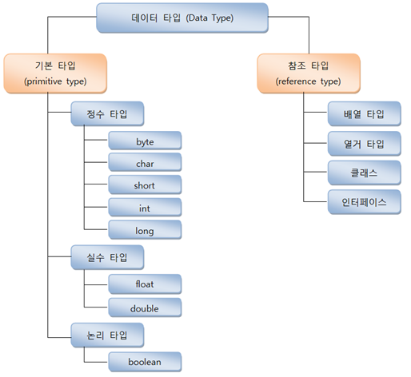

출처: https://0eun.tistory.com

기본 타입과 참조 타입으로 선언된 변수의 차이점은 저장되는 값이 무엇이냐이다.
기본 타입으로 선언된 변수는 실제 값을 변수 안에 저장하지만, 참조 타입을 이용해 선언된 변수는 메모리의 번지를 값으로 갖는다. 참조 타입이라는 이름도 번지를 통해 객체를 참조한다는 뜻에서 만들어졌다.

예를 들어 다음과 같이 변수가 선언되었다.
<pre>
<code>
// 기본 타입 변수
int age = 25;
double price = 101.5;

// 참조 타입 변수
String name = "홍길동";
String hobby = "스키";
</code>
</pre>

위 코드를 그림으로 표현하면 다음과 같다.

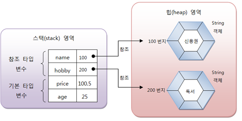

출처: https://0eun.tistory.com

변수 age, price는 직접 값을 저장하고 있지만, name과 hobby는 힙 영역의 String 객체 주소 값을 가지고 있다. 주소를 통해 객체를 참조한다는 뜻에서 String 클래스 변수를 참조 타입 변수라고 한다.

## 메모리 사용 영역

참조 타입을 알아보기 전에 JVM이 사용하는 메모리 영역에 대해 알아보자.
java.exe로 JVM이 시작되면 JVM은 운영체제에서 할당받은 메모리 영역(Runtime Data Area)을 다음과 같이 세부 영역으로 구분해서 사용한다.

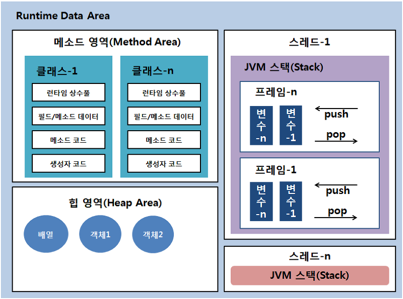

출처: https://programmer-seva.tistory.com

### 메소드 영역

메소드 영역에는 코드에서 사용되는 클래스(~.class)들을 클래스 로더로 읽어 클래스별로 런타임 상수풀(runtime constant pool), 필드(field) 데이터, 메소드(method) 데이터, 메소드 코드, 생성자(constructor) 코드 등을 분류해서 저장한다. 이 영역은 JVM이 시작할 때 생성되고 모든 스레드가 공유되는 영역이다.

### 힙 영역

힙 영역은 객체와 배열이 생성되는 영역이다. 힙 영역에 생성된 객체와 배열은 JVM 스택 영역의 변수나 다른 객체의 필드에서 참조한다.
참조하는 변수나 필드가 없다면(변수 값을 다른 것으로 바꾸었던지) 의미 없는 객체가 되기 때문에 이것을 쓰레기로 취급하고 JVM은 가비지 컬렉터(Garbage Collector)를 실행시켜 사용하지 않는 객체를 힙 영역에서 자동으로 제거한다. 따라서 자바 언어를 사용할 때 개발자는 객체 제거를 위해 별도의 코드를 작성할 필요가 없다.(자바는 코드로 객체를 직접 제거시키는 방법을 제공하지 않는다.)

### JVM 스택 영역

JVM 스택 영역은 각 스레드마다 하나씩 존재하며 스레드가 시작될 때 할당된다. 자바 프로그램에서 추가적으로 스레드를 생성하지 않았다면 main 스레드만 존재하므로 JVM 스택도 하나(one)이다. JVM 스택은 메소드를 호출할 때마다 프레임(Frame)을 추가(push)하고 메소드가 종료되면 해당 프레임을 제거(pop)한다. 

프레임 내부에는 로컬 변수 스택이 있는데, 기본 타입 변수와 참조 타입 변수가 추가, 제거된다. 변수가 이 영역에 생성되는 시점은 초기화가 될 때, 즉 최초로 변수에 값이 저장될 때이다. 
변수는 선언된 블록 안에서만 스택에 존재하고 블록을 벗어나면 스택에서 제거된다.
<pre>
<code>
char var1 = 'A';

if(var1 == 'A'){
    int var2 = 777;
    double var3 = 3.14;
}

boolean var4 = true;
</code>
</pre>

선언된 변수는 실행 순서에 따라서 다음과 같이 스택에 생성되고 소멸된다. var2, var3는 if 블록 내부가 실행되고 있을 때만 스택 영역에 존재하고 실행 흐름이 if문을 벗어나면 소멸된다.

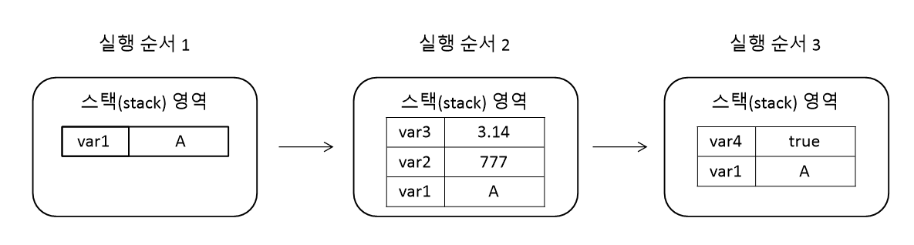

기본 타입 변수는 스택 영역에 직접 값을 가지고 있지만, 참조 타입 변수는 값이 아니라 힙 영역이나 메소드 영역의 객체 주소를 가진다. 
<pre>
<code>
String[] members = {"Lee", "Hong", "Park"};
</code>
</pre>

배열 변수인 members는 스택 영역에 생성되지만 실제 "Lee", "Hong", "Park"을 갖는 배열은 힙 영역에 생성된다. 배열 변수 members에는 배열의 힙 영역의 주소가 저장된다.(자바에서 배열은 객체로 취급된다)

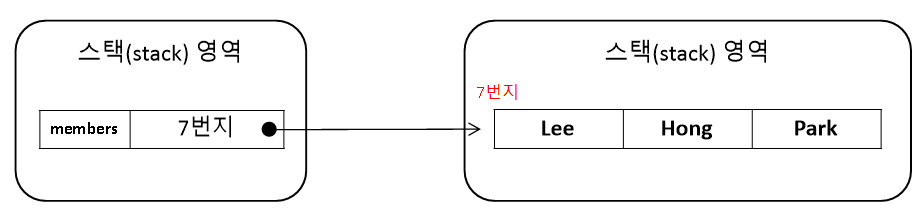

## 참조 변수의 ==, != 연산

데이터 타입에 따라 ==, != 연산의 쓰임이 다르다.
* 기본 타입 변수: 변수의 값이 같은지, 아닌지 확인
* 참조 타입 변수: 동일한 객체를 참조하는지, 다른 객체를 참조하는지 확인

참조 타입 변수의 값은 힙 영역의 객체 주소이므로 결국 주소 값을 비교하는 것이 된다.
따라서 동일한 객체를 참조하고 있을 경우 true, 반대의 경우 false이다.

## null과 NullPointerException

참조 타입 변수는 힙 영역의 객체를 참조하지 않는다는 뜻으로 null값을 가질 수 있다. null값도 초기값으로 사용할 수 있기 때문에 null로 초기화된 참조 변수는 스택 영역에 생성된다. 

참조 타입 변수가 null값을 가졌는지 확인하려면 ==, != 연산을 수행하면 된다.
<pre>
<code>
var1 == null
var != null
</code>
</pre>

자바는 프로그램 실행 도중에 발생하는 오류를 예외(Exceptiopn)라고 부른다. 예외는 사용자의 잘못된 입력 혹은 개발자의 잘못된 코드로 발생할 수 있다. 
참조 변수를 사용하면서 가장 많이 발생하는 예외 중 하나는 NullPointerException이다. 이 예외는 참조 타입 변수를 잘못 사용하면 발생한다.

참조 타입 변수가 null을 가지고 있을 경우, 참조 타입 변수는 사용할 수 없다. 참조 타입 변수를 사용하는 것은 곧 객체를 사용하는 것을 의미하는데, 참조할 객체가 없으므로 사용할 수가 없다. 만약 실수로 null 값을 가진 참조 변수를 사용하면 NullPointerException이 발생한다.

<pre>
<code>
int[] scores = null;
scores[0] = 10; // NullPointerException
</code>
</pre>

배열 scores는 배열 타입 변수이므로 참조 타입 변수이다. 그래서 null로 초기화가 가능하다. 이 상태에서 scores[0]에 10을 저장하려고 하면 NullPointerException이 발생한다. scores 변수가 참조하는 배열 객체가 없기 때문이다.

<pre>
<code>
String str = null;
System.out.println("문자수는 = " + str.length()); // NullPointerException
</code>
</pre>

String은 클래스 타입이므로 참조 타입이다. 따라서 str 변수도 null로 초기화가 가능하다. 이 상태에서 String 객체의 length() 메소드를 호출하면 NullPointerException이 발생한다. str 변수가 참조하는 String 객체가 없기 때문이다. 

따라서 프로그램 실행 도중 NullPointerException이 발생하면 **예외가 발생된 곳에서 객체를 참조하지 않은 상태로 참조 타입 변수를 사용하고 있음을 알아야 한다.**
대처 방법은 해당 변수를 추적해서 객체를 참조하도록 수정해야 한다. 

## String 타입

<pre>
<code>
String name = "Hong";
</code>
</pre>
문자열 Hong을 String 변수 name에 저장했다고 생각할 수 있지만, 문자열이 직접 변수에 저장되는 것이 아니다.
문자열은 String 객체로 생성되고 변수는 String 객체를 참조한다.

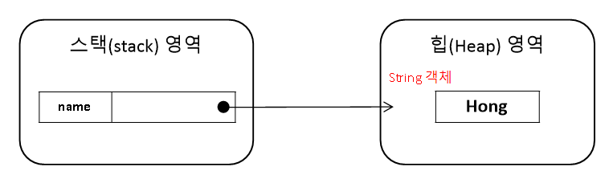

위 그림을 보면 name 변수는 스택 영역에 생성되고, 문자열 리터럴인 "Hong"은 힙 영역에 String 객체로 생성된다. 그리고 name 변수에는 String 객체의 주소 값이 저장된다.

자바는 문자열 리터럴인 동일하면 String 객체를 공유한다. 
다음과 같이 str1, str2 변수가 동일한 문자열 리터럴인 "Hello"를 참조할 경우 str1, str2는 동일한 String 객체를 참조하게 된다.
<pre>
<code>
String str1 = "Hello";
String str2 = "Hello";
</code>
</pre>

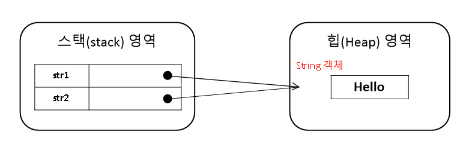

일반적으로 변수에 문자열을 지정할 경우 문자열 리터럴을 사용한다. 
하지만 new 연산자를 사용해 직접 String 객체를 생성하는 방법도 있다.
new 연산자는 힙 영역에 새로운 객체를 만들 때 사용하는 연산자로 객체 생성 연산자라고 한다.

<pre>
<code>
String str1 = new String("Hello");
String str2 = new String("Hello");
</code>
</pre>

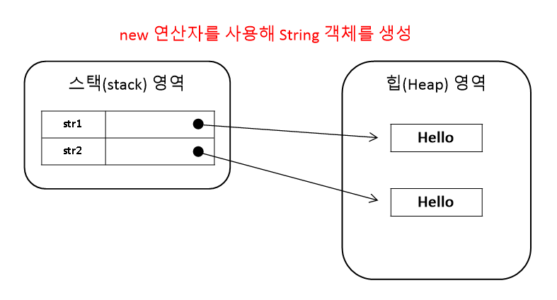

위 그림처럼 str1, str2는 **서로 다른 객체**를 참조하기 때문에 == 연산을 하면 false가 나온다.

동일한 문자열 리터럴로 String 객체를 생성하고 == 연산자로 비교하면 true가 나온다.
new 연산자로 String 객체를 생성하고 == 연산자로 비교하면 false가 나온다. 
왜냐하면 == 연산자는 **변수에 저장된 객체 번지가 동일한지**를 검사하기 때문이다.

<pre>
<code>
String str1 = "Hello";
String str2 = "Hello";
String str3 = new String("Hello");

System.out.println(str1 == str2); // true
System.out.println(str2 == str3); // false
</code>
</pre>

객체의 주소 여부에 따라 판단하지 않고 문자열만을 비교하고 싶을 때는 equals() 메소드를 사용해야 한다.
equals() 메소드는 원본 문자열과 매개값으로 주어진 비교 문자열이 동일한지 비교한 후 true 또는 false를 리턴한다.
<pre>
<code>
String str1 = "Hello";
String str2 = new String("Hello");

boolean result = str1.equals(str2); // true
</code>
</pre>

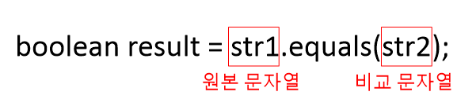

String 변수는 참조 타입이므로 초기값으로 null을 대입할 수 있다. null은 String 변수가 참조하는 String 객체가 없다는 뜻이다.
다음 코드처럼 name 변수가 String 객체를 참조하였으나, null을 대입함으로써 더 이상 String 객체를 참조하지 않도록 할 수 있다.
<pre>
<code>
String name = "Hong";
name = null;
</code>
</pre>

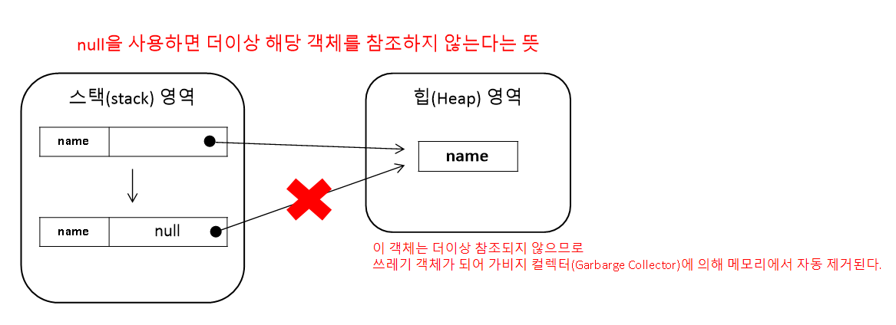

## 배열 타입

배열은 같은 타입의 데이터를 연속된 공간에 나열시키고, 각 데이터에 인덱스(index)를 부여해 놓은 자료구조이다.
배열의 인덱스는 배열 안의 특정 데이터의 위치를 나타낸다.

<pre>
<code>
names[인덱스]
</code>
</pre>

배열의 특징은 다음과 같다.
* 같은 데이터만 저장할 수 있다.(int 배열은 int값만, String 배열은 문자열만 저장 가능하다)
* 배열은 선언과 동시에 저장할 수 있는 데이터 타입이 결정된다. 다른 타입의 값을 저장하려고 하면 타입 불일치(Type mismatch) 컴파일 오류가 발생한다.
* 한 번 생성된 배열은 길이를 늘이거나 줄일 수 없다. 만약 길이를 수정하고 싶다면 새로운 배열을 생성하고, 기존 배열 항목을 새 배열로 복사해야 한다.

### 배열 선언

배열 선언은 두 가지 형태로 가능하다.
<pre>
<code>
타입[] 변수;
타입 변수[];
</code>
</pre>

타입은 배열에 저장될 데이터의 타입을 말한다.

배열 변수는 참조 변수에 속한다. 배열도 객체이므로 힙 영역에 생성되고 배열 변수는 힙 영역의 배열 객체를 참조하게 된다. 참조할 배열 객체가 없다면 배열 변수는 null 값으로 초기화될 수 있다.
만약 배열 변수가 null 값을 가진 상태에서 변수[인덱스]로 값을 읽거나 저장하면 NullPointerException이 발생한다. 따라서 배열 변수는 배열을 생성하고 참조하는 상태에서 값을 저장하고 읽어야 한다.

### 값 목록으로 배열 생성

<pre>
<code>
데이터타입[] 변수 = {값0, 값1, 값2, 값3, ...}
</code>
</pre>

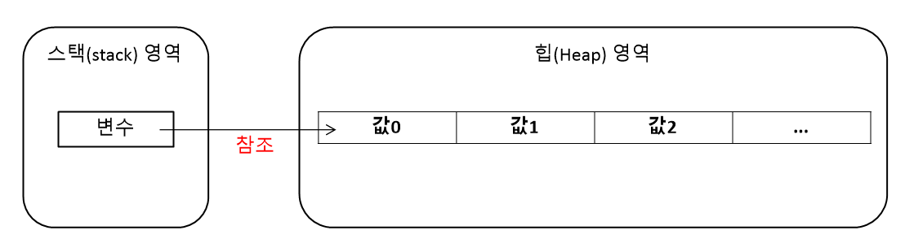

중괄호( {} )안에 값을 넣어 해당 값들을 항목으로 가지는 배열 객체를 힙에 생성하고, 배열 객체의 번지를 리턴한다. 배열 변수는 리턴된 번지를 저장함으로써 참조가 이루어진다.

배열 변수를 이미 선언한 후에 다른 실행문에서 중괄호를 사용한 배열 생성은 허용되지 않는다.
<pre>
<code>
타입[] 변수;
변수 = {값0, 값1, 값2, 값3, ...}; // 컴파일 에러
</code>
</pre>

배열 변수를 미리 선언하고, 값 목록들이 나중에 결정되는 상황이라면 new 연산자를 사용해서 값 목록을 지정해야 한다.
<pre>
<code>
타입[] 변수;
변수 = new 타입[] {값0, 값1, 값2, 값3, ...};
</code>
</pre>

메소드 선언 시 매개변수로 배열이 선언되었을 경우에도 값 목록으로 배열을 생성함과 동시에 해당 메소드의 매개값으로 사용하고자 할 때는 반드시 new 연산자를 사용해야 한다.
<pre>
<code>
int sum = add( new int[] {10, 20, 30});
System.out.println(sum);

public static void(int add[] scores){
    int sum = 0;
    for(int i = 0; i<=scores.length; i++){
        sum += scores[i];
    }
    return sum;
}
</code>
</pre>

### new 연산자로 배열 생성

현재 값 목록을 가지고 있지 않지만, 향후 값들을 저장할 배열을 미리 만들고 싶다면 new 연산자로 다음과 가티 배열 객체를 생성할 수 있다.

<pre>
<code>
타입[] 변수 = new 타입[길이];
</code>
</pre>

길이는 배열이 저장할 수 있는 값의 수를 말한다. new 연산자는 배열을 생성할 경우 이미 배열 변수가 선언된 후에도 가능하다.
<pre>
<code>
타입[] 변수 = null;
변수 = new 타입[길이];
</code>
</pre>

new 연산자로 배열을 처음 생성한 경우, 배열은 자동적으로 기본값으로 초기화된다. 
<pre>
<code>
int[] scores = new int[5];
</code>
</pre>
scores 배열은 int 타입 배열이므로 scores[0] ~ scores[4]까지 모두 기본값 0으로 초기화된다.(참고로 배열의 인덱스는 0부터 시작한다)

<pre>
<code>
String[] names = new String[5];
</code>
</pre>
String 배열을 생성했다면 names[0] ~ names[4] 까지 모두 null 값으로 초기화된다.

다음은 타입별로 배열의 초기값을 보여준다.

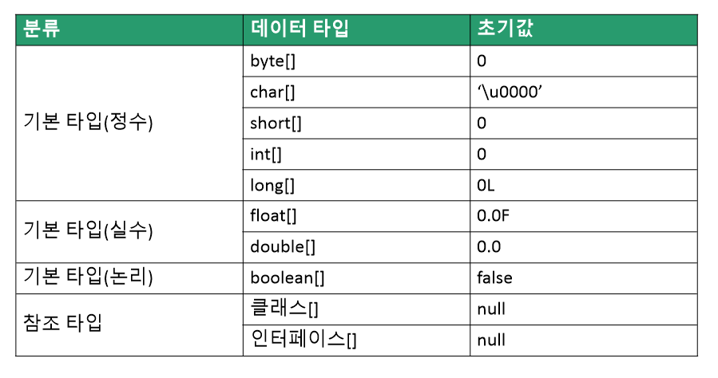

배열이 생성된 후 새로운 값을 저장하려면 대입 연산자를 사용하면 된다.
<pre>
<code>
변수[인덱스] = 값;

String[] names = new String[3];
names[0] = "Park";

System.out.println(names[0]) // Park
</code>
</pre>

### 배열 길이

배열의 길이는 배열에 저장할 수 있는 전체 항목 수를 말한다.
배열의 길이를 얻으려면 배열 객체의 length 필드를 읽으면 된다.(필드는 객체 내부의 데이터를 말한다)

<pre>
<code>
배열변수.length;
</code>
</pre>

length는 **읽기 전용** 필드이기 때문에 값을 바꿀 수가 없다.

### 다차원 배열

행과 열로 구성된 배열을 2차원 배열이라고 한다. 가로 인덱스와 세로 인덱스를 사용한다.
자바는 2차원 배열을 중첩 배열 방식으로 구현한다. 
예를 들어 3(행) x 4(열) 배열을 만들기 위해 다음과 같은 코드를 사용한다.
<pre>
<code>
int[][] scores = new int[3][4];
</code>
</pre>

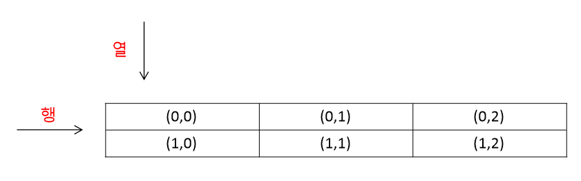

만약 그룹화된 값 목록을 가지고 있다면 다음과 같이 중괄호 안에 중괄호를 하영해서 값 목록을 나열하면 된다.

<pre>
<code>
int[][] scores = { {10, 20}, {30, 40} };

int score = scores[0][0] // 10 
int score = scores[1][0] // 30
</code>
</pre>

### 객체를 참조하는 배열

기본 타입(byte, char, short, int, long, float, double, boolean) 배열은 각 항목에 직접 값을 갖고 있지만, 참조 타입(클래스, 인터페이스) 배열은 각 항목에 객체의 번지를 갖고 있다. 

예를 들어 String은 클래스 타입이므로 String[] 배열은 각 항목에 문자열이 아니라 String 객체의 주소를 가지고 있다. 즉 String 객체를 참조하게 된다.
따라서 String[] 배열의 항목도 String 변수와 동일하게 취급되어야 한다. String[] 배열 항목 간에 문자열을 비교하게 위해 == 연산자 대신 equals() 메소드를 사용해야 하는 것이 그 이유다. == 연산자는 객체의 번지 비교이기 때문에 문자열 비교에 사용할 수 없다.

<pre>
<code>
String[] strArray = new String[3];
strArray[0] = "Hong";
strArray[1] = "Hong";
strArray[2] = "Hong";

System.out.println(strArray[0] == strArray[1]); // true
System.out.println(strArray[1] == strArray[2]); // false
</code>
</pre>

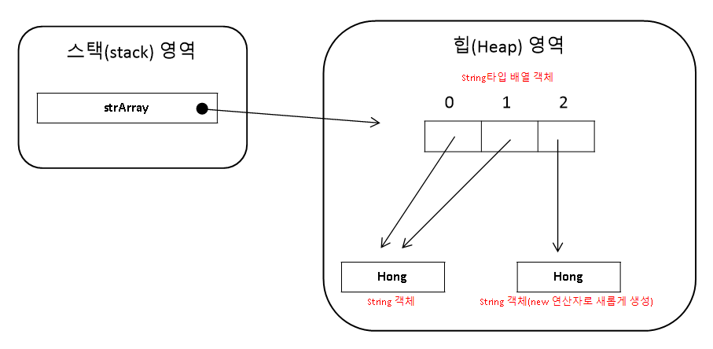

### 배열 복사

배열은 한 번 생성하면 크기를 변경할 수 없다. 크기를 변경하려면 새로운 배열을 만들어 항복 값들을 복사해야 한다.
배열 간의 항목 값들을 복사하려면 for문을 사용하거나 System.arraycopy() 메소드를 사용한다.

<pre>
<code>
int[] oldArray = {1,2,3};
int[] newArray = new int[5];

for(int i = 0; i<oldArray.length; i++){
    newArray[i] = oldArray[i];
}
</code>
</pre>

oldArray -> newArray로 배열이 복사되었다. 새로 복사된 newArray 배열 길이가 더 길다. 복사되지 않은 남은 인덱스는 기본 초기값 0이 들어간다.

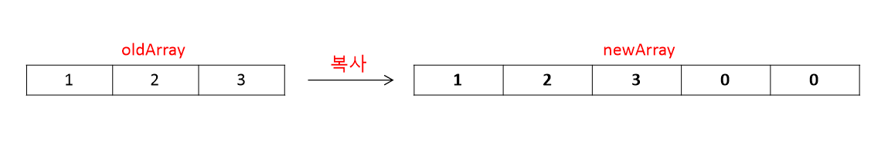

System.arraycopy() 메소드를 호출하는 방법은 다음과 간다.
<pre>
<code>
System.arraycopy(Object src, int srcPos, Object dest, int destPos, int length);
</code>
</pre>
* src: 원본 배열
* srcPos: 원본 배열에서 복사할 항목의 시작 인덱스
* dest: 새 배열
* destPos: 새 배열에서 붙여넣을 시작 인덱스
* length: 복사할 개수

<pre>
<code>
String[] oldArray = {"Lee", "Hong", "Park"};
String[] newArray = new String[5];

System.arraycopy(oldArray, 0, newArray, 0, oldArray.length);

for(int i = 0; i<newArray.length; i++){
    System.out.print(newArray[i] + " "); // Lee Hong Park null null
}
</code>
</pre>

참조 타입 배열일 경우 배열 복사가 되면 복사되는 값이 객체의 번지이므로 새 배열의 항목은 이전 배열의 항목이 참조하는 객체와 동일하다. 이것을 얕은 복사(shallow copy)라고 한다. 반대로 깊은 복사(deep copy)는 참조하는 객체도 별도로 생성하는 것을 말한다.

### 향상된 for문

자바 5부터 배열 및 컬렉션 객체를 좀 더 쉽게 처리하기 위해 향상된 for문을 제공한다.
향상된 for문은 배열 및 컬렉션 항목의 개수만큼 반복하고, 자동으로 for문을 빠져나간다.

<pre>
<code>
for(타입 변수 : 배열){ // 타입 변수는 타입, 변수 개념이다. 하나의 단어로 혼동하지 않아야 한다.
    실행문
}
</code>
</pre>

<pre>
<code>
int[] scores = {1,2,3,4,5};

int sum = 0;
for(int score : scores){
    sum += score;
}
System.out.println(sum); // 15
</code>
</pre>

### 열거 타입

데이터 중에는 몇 가지로 한정된 값만을 갖는 경우가 있다. 예를 들어 요일에 대한 데이터는 월~일까지 일곱 개의 값만을 갖고, 월에 대한 데이터 또한 1월~12월 까지의 값만을 가진다. 이와 같이 한정된 값만을 가지는 데이터 타입이 열거 타입(enumeration type)이다. 열거 타입은 몇 개의 열거 상수(enumeration constant) 중에서 하나의 상수를 저장하는 데이터 타입이다.

### 열거 타입 선언

열거 타입 선언을 위해 우선 열거 타입의 이름을 정하고 열거 타입 이름으로 소스 파일(.java)을 생성해야 한다. 
열거 타입 이름은 관례적으로 첫 문자를 대문자로 하고 나머지는 소문자로 구성한다. 
<pre>
<code>
// 열거 타입 이름
Month.java
Week.java
ProductKind.java
</code>
</pre>

소스 파일 내용은 열거 타입 선언이 온다.
<pre>
<code>
// Month.java

public enum Month{ ... } // 열거 파일명은 소스 파일명과 일치해야 한다!
</code>
</pre>
public enum 키워드는 열거 타입을 선언하기 위한 키워드이다. 반드시 소문자로 작성해야 한다. 열거 타입 이름은 소스 파일명과 대소문자가 모두 일치해야 한다.( public enum(열거 파일 이름) )

열거 타입을 선언한 후 열거 상수를 선언하면 된다.
열거 상수는 열거 타입의 값으로 사용되는데, 관례적으로 열거 상수는 모두 대문자로 작성한다.
<pre>
<code>
public enum Month { 
    JANUARY, 
    FEBRUARY, 
    MARCH,

    ... 

    DECEMBER
}
</code>
</pre>

열거 상수가 여러 단어로 구성될 경우 단어 사이를 언더바(_)로 연결하는 것이 관례이다.
<pre>
<code>
public enum LoginResult { LOGIN_SUCCESS, LOGIN_FAILED }
</code>
</pre>

### 열거 타입 변수

열거 타입을 선언했다면 이제 열거 타입을 사용할 수 있다.
열거 타입도 하나의 데이터 타입이므로 변수를 선언하고 사용해야 한다.
<pre>
<code>
// 열거 타입 변수를 선언하는 방법
열거타입 변수;
</code>
</pre>

위에 열거 타입 Month로 변수를 선언하면
<pre>
<code>
Month thisMonth;
Month nextMonth;
</code>
</pre>

열거 타입 변수를 선언했다면 다음과 같이 열거 상수를 저장할 수 있다. 열거 상수는 단독으로 사용할 수는 없고 반드시 콤마(.)를 사용해 **열거타입.열거상수** 형태로 사용된다.
기본 형태는 '열거타입 변수 = 열거타입.열거상수'이다.
<pre>
<code>
Month thisMonth = Month.JANUARY;
</code>
</pre>

열거 타입 변수는 null값을 저장할 수 있는데 열거 타입도 참조 타입이기 때문이다.
<pre>
<code>
Month nextMonth = null;
</code>
</pre>

참조 타입 변수는 객체를 참조하는 변수이다. 따라서 열거 상수 또한 열거 객체로 생성된다. 위에서 생성한 열거 타입 Month의 경우 JANUARY부터 DECEMBER까지 12개의 열거 상수를 Month 객체로 생성했다. 그리고 메소드 영역에 생성된 열거 상수가 해당 Month 객체를 각각 참조하게 된다.

<pre>
<code>
Month thisMonth = Month.JANUARY;
</code>
</pre>
좀 더 자세히 설명하자면, 열거 타입 변수 thisMonth는 스택 영역에 생성된다. thisMonth에 저장된 값은 Month.JANUARY 열거 상수가 참조하는 객체의 번지이다. 따라서 열거 상수 Month.JANUARY와 thisMonth 변수는 서로 같은 Month 객체를 참조하게 된다. 
<pre>
<code>
Month thisMonth = Month.JANUARY;

thisMonth == Month.JANUARY // true
</code>
</pre>

자바는 컴퓨터의 날짜 및 요일, 시간을 프로그램에서 사용하도록 Date, Calendar, LocalDateTime 등의 클래스를 제공한다.
이 중 LocalDateTime은 자바 8부터 지원하는 API이다.

Calendar를 이용하는 방법은 다음과 같다.
<pre>
<code>
Calendar now = Calendar.getInstance();
</code>
</pre>
Calendar 변수를 선언하고 Calendar.Instance() 메소드가 리턴하는 Calendar 객체를 얻는다.

이제 get() 메소드를 이용해서 년, 월, 일, 요일, 시간, 분, 초를 얻을 수 있다.
<pre>
<code>
Calendar now = Calendar.getInstance();

int year = now.get(Calendar.YEAR);
int month = now.get(Calendar.MONTH)+1;
int day = now.get(Calendar.DAY_OF_MONTH);
int week = now.get(Calendar.DAY_OF_WEEK);
int hour = now.get(Calendar.HOUR);
int min = now.get(Calendar.MINUTE);
int sec = now.get(Calendar.SECOND);
</code>
</pre>

### 열거 객체의 메소드

열거 객체는 열거 상수의 문자열을 내부 데이터로 가지고 있다. 
열거 객체가 가지는 데이터 및 메소드는 java.lang.Enum 클래스에서 관리하는데, 열거 객체에서 사용할 수 있는 이유는 모든 열거 타입은 컴파일 시에 Enum 클래스를 상속하게 되어 있기 때문이다. 

| 리턴 타입 | 메소드(매개 변수) | 설명 |
| --- | --- | --- |
| String | name() | 열거 객체의 문자열을 리턴 |
| int | ordinal() | 열거 객체의 순번(0부터 시작)을 리턴 |
| int | compare To() | 열거 객체를 비교해서 순번 차이를 리턴 |
| 열거 타입 | valueOf(String name) | 주어진 문자열의 열거 객체를 리턴 |
| 열거 타입 | values() | 모든 열거 객체들을 배열로 리턴 |

### name() 메소드

열거 객체가 가지고 있는 문자열을 리턴한다. 이때 리턴되는 문자열은 열거 타입을 정의할 때 사용한 상수 이름과 동일하다. 
<pre>
<code>
Month thisMonth = Month.JANUARY;
String name = thisMonth.name();
</code>
</pre>
thisMonth가 참조하는 열거 객체에서 name() 메소드를 호출하여 문자열을 얻어낸다. name() 메소드는 열거 객체 내부의 문자열인 "JANUARY"를 리턴하고 name 변수에 저장한다.

## ordinal() 메소드

전체 열거 객체 중 몇 번째 열거 객체인지 알려준다.
열거 객체의 순번은 열거 타입을 정의할 때 주어진 순번을 말하는데, 0부터 시작한다. 
<pre>
<code>
public enum Month { 
    JANUARY,  // 순번0
    FEBRUARY, // 순번1
    MARCH,    // 순번2

    ... 

    DECEMBER  // 순번11
}
</code>
</pre>

아래 코드는 thisMonth가 참조하는 열거 객체가 전체 열거 객체에서 몇 번째 순번인지 알아내는 코드이다.
ordinal() 메소드는 0을 리턴해서 ordinal 변수에 저장한다.
<pre>
<code>
Month thisMonth = Month.JANUARY;
String ordinal = thisMonth.ordinal(); // 0
</code>
</pre>

### compareTo() 메소드

매개값으로 주어진 열거 객체를 기준으로 전후로 몇 번째 위치하는지를 비교한다. 
열거 객체가 매가값의 열거 객체보다 순번이 빠르다면 음수, 순번이 느리다면 양수가 리턴된다.

<pre>
<code>
Month thisMonth = Month.JANUARY;
Month nextMonth = Month.FEBRUARY;

String result1 = thisMonth.compareTo(nextMonth); // -1
String result2 = nextMonth.compareTo(thisMonth); // 1
</code>
</pre>

### valueOf() 메소드

매개값으로 주어지는 문자열과 동일한 문자열을 가지는 열거 객체를 리턴한다.
외부로부터 문자열을 입력받아 열거 객체로 변환할 때 유용하게 사용할 수 있다.

<pre>
<code>
Month thisMonth = Month.valueOf("JANUARY");
</code>
</pre>
이 코드에서 thisMonth 변수는 (만약 상수값에 해당 문자열이 있다면)Month.JANUARY 열거 객체를 참조하게 된다.

### values() 메소드

열거 타입의 모든 열거 객체들을 배열로 만들어 리턴한다.

<pre>
<code>
Month[] months = Month.values();
for(Month month : months){
    System.out.print(month + " "); // JANUARY FEBRUARY ...
}
</code>
</pre>

# 출처
* [이것이 자바다](http://www.kyobobook.co.kr/product/detailViewKor.laf?ejkGb=KOR&mallGb=KOR&barcode=9788968481475&orderClick=LAG&Kc=)