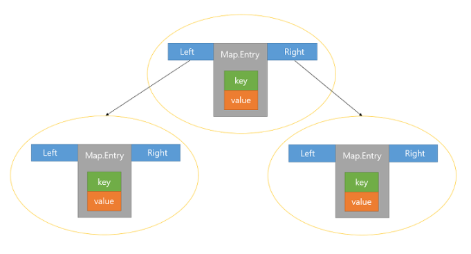

# 컬렉션 프레임워크

자바 컬렉션은 객체를 수집해서 저장하는 역할을 한다. 프레임워크란 사용 방법을 미리 정해 놓은 라이브러리를 말한다. 자바 컬렉션 프레임워크는 몇 가지 인터페이스를 통해 다양한 컬렉션 클래스를 이용할 수 있도록 한다. 주요 인터페이스는 List, Set, Map이 있다. 

## List 컬렉션

[List 컬렉션](https://docs.oracle.com/javase/8/docs/api/java/util/List.html)은 객체를 일렬로 늘어놓은 구조를 가지고 있다. 객체를 인덱스(index)로 관리하기 때문에 객체를 저장하면 자동으로 인덱스가 부여되고, 인덱스로 객체를 검색/삭제할 수 있는 기능을 제공한다. List 컬렉션은 객체 자체를 저장하는 것이 아니라 객체의 번지를 참조한다. 동일한 객체를 중복 저장할 수 있는데, 이 경우 동일한 번지가 참조된다. null도 저장 가능하다. 이 경우 해당 인덱스는 객체를 참조하지 않는다.

List 컬렉션에는 ArrayList, Vector, LinkedList 등이 있다. 아래 표는 List 컬렉션에서 공통적으로 사용 가능한 List 인터페이스의 메소드이다. 인덱스로 객체를 관리하기 때문에 인덱스를 매개값으로 갖는 메소드가 많다.

리턴 타입으로 E라는 타입 파라미터가 있는 경우가 있는데, 이것은 List 인터페이스가 제네릭 타입이기 때문이다. 구체적인 타입은 구현 객체를 생성할 때 결정된다. 

아래 코드는 List 컬렉션에 저장되는 구체적인 타입을 String으로 하고, 추가, 삽입, 삭제하는 모습이다.

<pre>
<code>
List<String> list = ...;
list.add("Park");
list.add(1,"Hong"); // 지정된 인덱스에 객체 삽입(1번 인덱스에 문자열 Hong을 삽입하겠다)
String str = list.get(1); // 인덱스로 특정 객체 찾아오기
list.remove(0); // 인덱스로 특정 객체 삭제
list.remove("Hong"); // 객체 삭제
</code>
</pre>

만약 전체 객체를 대상으로 하나씩 반복해서 저장된 객체를 얻고 싶다면 for문을 사용하면 된다.

<pre>
<code>
List<String> list = ...;
for(int i = 0; i<list.size(); i++) {
    String str = list.get(i); // i 인덱스에 저장된 String 객체 가져온다.
}
</code>
</pre>

인덱스가 필요 없다면 향상된 for문을 사용하는 것이 편리하다.
<pre>
<code>
for(String str : list) { ... } // String 객체를 하나씩 가져온다.
</code>
</pre>

### ArrayList

[ArrayList](https://docs.oracle.com/javase/8/docs/api/java/util/ArrayList.html)에 객체를 추가하면 객체가 인덱스로 관리된다. 일반 배열과 ArrayList는 인덱스로 객체를 관리한다는 점에서 유사하지만 차이점이 있다.

* 일반 배열: 생성 시 크기가 고정되고, 사용 중에 크기 변경이 불가능.
* ArrayList: 저장 용량(capacity)을 초과한 객체들이 들어오면 자동적으로 저장 용량이 늘어난다.
(As elements are added to an ArrayList, its capacity grows automatically.)

ArrayList를 생성하기 위해서는 저장할 객체 타입을 타입 파라미터로 표기하고 기본 생성자를 호출하면 된다. 예를 들어 String을 저장하는 ArrayList는 다음과 같이 생성할 수 있다.

<pre>
<code>
List<String> list = new ArrayList<String>();
</code>
</pre>

기본 생성자로 ArrayList 객체를 생성하면 내부에 10개의 객체를 저장할 수 있는 초기 용량(capacity)을 가지게 된다. 저장되는 객체 수가 늘어나면 용량이 자동으로 증가하고, 처음부터 용량을 크게 잡고 싶다면 용량의 크기를 매개값으로 받는 생성자를 이용하면 된다.

<pre>
<code>
// String 객체 30개를 저장할 수 있는 용량을 가지는 ArrayList 생성
List<String> list = new ArrayList<String>(30);
</code>
</pre>

ArrayList에 객체를 추가하면 인덱스 0부터 차례대로 저장된다. ArrayList에서 특정 인덱스의 객체를 제거하면 바로 뒤 인덱스부터 마지막 인덱스까지 모두 앞으로 1씩 당겨진다. 마찬가지로 특정 인덱스에 객체를 삽입하면 해당 인덱스부터 마지막 인덱스까지 모두 1씩 밀려난다. 따라서 **빈번한 객체 삭제와 삽입이 일어나는 곳에서는 ArrayList를 사용하는 것이 바람직하지 않다. 이 경우 LinkedList를 사용하는 것이 좋다.** 인덱스 검색이나, 맨 마지막에 객체를 추가하는 경우라면 ArrayList가 더 좋은 성능을 발휘한다. 

아래 코드는 ArrayList에 String 객체를 추가, 검색, 삭제하는 모습이다.

<pre>
<code>
import java.util.*;

public class Main {
    public static void main(String[] args) {
        List<String> list = new ArrayList<String>();

        list.add("A1");
        list.add("A2");
        list.add("A3");

        // 저장된 총 객체 수 
        int size = list.size();
        System.out.println("size = " + size); // 3

        // 특정 인덱스의 객체 가져오기
        String value = list.get(1);
        System.out.println("value of an index 1 = " + value); // A2

        // 저장된 총 객체 수만큼 루핑
        for(int i = 0; i < list.size(); i++){
            String value = list.get(i);
            System.out.println(i + " : " + value);

            결과)
            0 : A1
            1 : A2
            2 : A3
        }
        
        // 특정 인덱스 객체 삭제
        list.remove(1);
        for(int i = 0; i < list.size(); i++){
            String value = list.get(i);
            System.out.println(i + " : " + value);

            결과)
            0 : A1
            1 : A3
        }

        // 특정 인덱스 객체 삭제   
        list.remove("A3");
        for(int i = 0; i < list.size(); i++){
            String value = list.get(i);
            System.out.println(i + " : " + value);

            결과)
            0 : A1
        }
    }
}
</code>
</pre>

ArrayList를 생성하고 런타임 시 필요에 의해 객체들을 추가하는 것이 일반적이지만, 고정된 객체들로 구성된 List를 생성할 때도 있다. 이 경우 Arrays.asList(T... a) 메소들르 사용하는 것이 간편하다.

<pre>
<code>
List<T> list = Arrays.asList(T... a);
</code>
</pre>

T 타입 파라미터에 맞게 asList()의 매개값을 순차적으로 입력하거나, T[] 배열을 매개값으로 주면 된다.
아래 코드는 고정된 String 객체를 요소로 갖는 ArrayList 객체를 생성한다.

<pre>
<code>
import java.util.Arrays;
import java.util.List;

public class Main {
    public static void main(String[] args) {
        List<String> list = Arrays.asList("A1", "A2", "A3");
        for(String value : list) {
            System.out.println(value);
        }

        List<Integer> list2 = Arrays.asList(3, 2, 1);
        for(int value : list2) {
            System.out.println(value);
        }
    }
}

결과)
A1
A2
A3
3
2
1
</code>
</pre>

### Vector

[Vector](https://docs.oracle.com/javase/8/docs/api/java/util/Vector.html)는 ArrayList와 동일한 내부 구조를 가지고 있다. Vector를 생성하기 위해서는 저장할 객체 타입을 타입 파라미터로 표기하고 기본 생성자를 호출한다.

<pre>
<code>
List<E> list = new Vector<E>();
</code>
</pre>

ArrayList와 다른 점은 Vector는 **동기화된(synchronized) 메소드로 구성되어 있기 때문에 멀티 스레드가 동시에 이 메소드를 실행할 수 없고, 하나의 스레드가 실행을 완료해야만 다른 스레드를 실행할 수 있다.** 그래서 멀티 스레드 환경에서 안전하게 객체를 추가, 삭제할 수 있다. 이것을 스레드가 안전(Thread Safe)하다라고 말한다. 반대로 thread-safe한 동작이 필요하지 않은 경우, Vector 보다는 ArrayList의 사용이 권장된다.

아래 코드는 Vector를 이용해서 Board 객체를 추가, 삭제, 검색하는 예시이다.

<pre>
<code>
import java.util.*;

public class Main {
    public static void main(String[] args) {
        List<Board> list = new Vector<Board>();

        list.add(new Board("name1", "content1", "writer1"));
        list.add(new Board("name2", "content2", "writer2"));
        list.add(new Board("name3", "content3", "writer3"));

        list.remove(1); // 1번 인덱스 객체 삭제(뒤의 인덱스는 1씩 앞으로 당겨짐)

        for(int i = 0; i < list.size(); i++) {
            Board board = list.get(i);
            System.out.println(board.subject + " " + board.name + " " + board.writer);
        }
    }
}

// 게시물 정보 객체
public class Board {
    String subject;
    string name;
    String writer;

    public Board(String subject, Sting name, String writer) {
        this.subject = subject;
        this.name = name;
        this.writer = writer;
    }
}

결과)
name1 content1 writer1
name3 content3 writer3
</code>
</pre>

### LinkedList

[LinkedList](https://docs.oracle.com/javase/8/docs/api/java/util/LinkedList.html)는 List 구현 클래스이므로 ArrayList와 사용 방법은 동일하지만 내부 구조는 다르다. 

ArrayList는 내부 배열에 객체를 저장해서 인덱스로 관리하지만, LinkedList는 인접 참조를 링크해서 체인처럼 관리한다.

LinkedList에서 특정 인덱스의 객체를 제거하면 앞뒤 링크만 변경되고 나머지 링크는 변경되지 않는다. 특정 인덱스에 객체를 삽입할 때에도 마찬가지다. ArrayList는 중간 인덱스의 객체를 제거하면 뒤의 객체는 인덱스가 1씩 앞으로 당겨진다. 그렇기 때문에 빈번한 객체 삭제와 삽입이 일어나는 곳에서는 ArrayList보다 LinkedList가 좋은 성능을 발휘한다. 

아래 이미지는 중간에 객체를 제거할 경우 앞뒤 링크의 수정이 일어나는 모습을 보여준다.

LinkiedList를 생성하려면 저장할 객체 타입을 타입 파라미터(E)에 표기하고 기본 생성자를 호출하면 된다. LinkedList가 처음 생성될 때에는 어떠한 링크도 만들어지지 않기 때문에 내부는 비어 있다고 보면 된다.

<pre>
<code>
List<E> list = new LinkedList<E>();
</code>
</pre>

아래 코드는 ArrayList와 LinkedList에 10000개의 객체를 삽입하는데 걸린 시간을 측정한다. 0번 인덱스에 String 객체를 10000번 추가하기 위해 List 인터페이스의 add(int index, E element) 메소드를 이용했다. 실행 결과를 보면 LinkedList가 훨씬 빠르다.

<pre>
<code>
import java.util.*;

public class Main {
    public static void main(String[] args) {
        List<String> list1 = new ArrayList<String>();
        List<String> list2 = new LinkedList<String>();

        long startTime;
        long endTime;

        startTime = System.nanoTime();
        for(int i = 0; i < 10000; i++) {
            list1.add(0, String.valueOf(i));
        }

        endTime = System.nanoTime();
        System.out.println("ArrayList = " + (endTime-startTime) + " ns");

        startTime = System.nanoTime();
        for(int i = 0; i < 10000; i++) {
            list2.add(0, String.valueOf(i));
        }
        endTime = System.nanoTime();
        System.out.println("LinkedList = " + (endTime-startTime) + " ns");
    }
}
</code>
</pre>

끝에서부터(순차적으로) 추가/삭제하는 경우 ArrayList가 빠르지만 중간에 추가 또는 삭제할 경우에는 앞뒤 링크 정보만 변경하면 되는 LinkedList가 더 빠르다. Arraylist는 뒤쪽 인덱스들을 모두 1씩 증가 또는 감소시키는 시간이 필요하므로 처리 속도가 느리다.

| 구분 | 순차적으로 추가/삭제 | 중간에 추가/삭제 | 검색 |
| --- | --- | --- | --- |
| ArrayList | 빠르다 | 느리다 | 빠르다 |
| LinkedList | 느리다 | 빠르다 | 느리다 |

## Set 컬렉션

List 컬렉션은 저장 순서를 유지하지만 [Set컬렉션](https://docs.oracle.com/javase/8/docs/api/java/util/Set.html)은 저장 순서가 유지되지 않는다. 또한 객체를 중복해서 저장할 수 없고, 하나의 null만 저장할 수 있다. Set 컬렉션은 수학의 집합에 비유될 수 있다. 집합은 순서와 상관없고 중복이 허용되지 않는다. Set 컬렉션은 또한 구슬 주머니와도 같다. 동일한 구슬을 두 개 넣을 수 없고, 들어갈(저장할) 때의 순서와 나올(찾을) 때의 순서가 다를 수 있기 때문이다.

아래는 Set 인터페이스의 메소드이다. 인덱스로 관리하지 않기 때문에 인덱스를 매개값으로 갖는 메소드가 없다.

메소드 매개 변수 타입과 리턴 타입의 E라는 타입 파라미터가 사용되는 이유는 Set 인터페이스가 제네릭 타입이기 때문이다. 구체적인 타입은 구현 객체를 생성할 때 결정된다. 

아래 코드는 Set 컬렉션에 저장되는 구체적인 타입을 String으로 정해놓고 String 객체를 저장, 삭제한다.

<pre>
<code>
Set<String> set = ...;
set.add("Park");
set.add("Hong");

set.remove("Hong");
</code>
</pre>

Set 컬렉션은 인덱스로 객체를 검색해서 가져오는 메소드가 없다. 따라서 전체 객체를 한번씩 반복해서 가져오는 반복자(Iterator)를 사용한다. 반복자 Iterator 인터페이스를 구현하여 iterator() 메소드를 호출하면 된다.

<pre>
<code>
Set<String> set = ...;
Iterator<String> iterator = set.iterator();
</code>
</pre>

다음은 Iterator 인터페이스에 선언된 메소드이다.

| 리턴 타입 | 메소드명 | 설명 | 
| --- | --- | --- | 
| boolean | hasNext() | 가져올 객체가 있으면 true를 리턴하고 없으면 false를 리턴한다. |
| E | next() | 컬렉션에서 하나의 객체를 가져온다. |
| void | remove() | Set 컬렉션에서 객체를 제거한다. |

Iterator에서 하나의 객체를 가져올 때 next() 메소드를 사용한다. next()를 사용하기 전에 먼저 가져올 객체가 있는지 hasNext() 메소드로 확인하는 것이 좋다. 객체가 있어서 true를 리턴하면 next() 메소드를 사용한다. 

아래 코드는 Set 컬렉션에서 String 객체들을 반복해서 하나씩 가져오는 코드이다.

<pre>
<code>
Set<String> set = ...;
Iterator<String> iterator = set.iterator();

while(iterator.hasNext()) { // 저장된 객체 수만큼 루핑.
    // next() 메소드로 String 객체를 하나 가져온다.
    String str = iterator.next();
}
</code>
</pre>

Iterator를 사용하지 않더라도 향상된 for문을 이용해서 전체 객체를 대상으로 반복할 수 있다.

<pre>
<code>
Set<String> set = ...;
for(String str : set) {

}
</code>
</pre>

Set 컬렉션에서 Iterator의 next() 메소드로 가져온 객체를 제거하고 싶다면 remove() 메소드를 호출한다. Iterator의 메소드이지만 Set 컬렉션에서 객체가 제거된다는 사실을 기억해야 한다. 

<pre>
<code>
Set<String> set = ...;
Iterator<String> iterator = set.iterator();

while(iterator.hasNext()) { // 저장된 객체 수만큼 루핑.
    // next() 메소드로 String 객체를 하나 가져온다.
    String str = iterator.next();

    if(str.equals("Hong")){
        iterator.remove();
    }
}
</code>
</pre>

### HashSet

[HashSet](https://docs.oracle.com/javase/8/docs/api/java/util/HashSet.html)은 Set 인터페이스의 구현 클래스이다. HashSet을 생성하기 위해서는 다음과 같이 기본 생성자를 호출한다.

<pre>
<code>
Set<E> set = new HashSet<E>();
</code>
</pre>

타입 파라미터 E에는 컬렉션에 저장할 객체 타입을 지정한다. 예를 들어 String 객체를 저장하는 HashSet은 다음과 같이 생성한다.

<pre>
<code>
Set<String> set = new HashSet<String>();
</code>
</pre>

HashSet은 **객체들을 순서 없이 저장하고 동일한 객체는 중복 저장하지 않는다.** HashSet이 판단하는 동일 객체란 꼭 같은 인스턴스를 뜻하지는 않는다. HashSet은 객체를 저장하기 전에 먼저 객체의 hashCode() 메소드를 호출해서 해시코드를 얻어낸다. 그리고 이미 저장되어 있는 객체들의 해시코드와 비교한다. 만약 동일한 해시코드가 있다면 다시 equals() 메소드로 두 객체를 비교해서 true가 나오면 동일 객체로 판단하고 중복 저장을 하지 않는다.

문자열을 HashSet에 저장할 경우 같은 문자열을 갖는 String 객체는 동등한 객체로 간주되고 다른 문자열을 갖는 String 객체는 다른 객체로 간주된다. 그 이유는 String 클래스가 hashCode()와 equals() 메소들르 재정의해서 같은 문자열일 경우 hashCode()의 리턴값을 같게, equals()의 리턴값은 true가 나오게 하게 때문이다. 

아래 코드는 HashSet에 String 객체를 추가, 검색, 제거하는 코드이다.

<pre>
<code>
import java.util.*;

public class Main {
    public static void main(String[] args) {
        Set<String> set = new HashSet<String>();

        set.add("A1");
        set.add("A2");
        set.add("A3");

        int size = set.size();
        System.out.println("총 객체 수 = " + size); // 3

        Iterator<String> iterator = set.iterator();
        while(iterator.hasNext()) {
            String element = iterator.next(); // 객체 하나씩 꺼내오기
            System.out.println(element);
        }

        set.remove("A2");

        System.out.println("총 객체 수 = " + size); // 2

        iterator = set.iteartor();
        while(iterator.hasNext()) {
            String element = iterator.next();
            System.out.println(element);
        }

        set.clear(); // 코든 객체를 제거하고 비운다.
        if(set.isEmpty()) {
            System.out.println("- Empty -");
        }
    }
}
</code>
</pre>

아래 코드는 사용자 정의 클래스 Member를 만들고 hashCode()와 equals() 메소드를 오버라이딩 했다. 인스턴스가 달라도 이름과 나이가 동일하면 동일 객체로 간주하여 중복 저장되지 않도록 하기 위해서이다.

<pre>
<code>
public class Member {
    public String name;
    public int age;

    public Member(String name, int age) {
        this.name = name;
        this.age = age;
    }

    @Override
    public boolean equals(Object obj) {
        if(obj instanceof Member) {
            Member member = (Member) obj;
            return member.name.equals(name) && (member.age == age);
        }else{
            return false;
        }
    }

    @Override
    public int hashCode() { // name과 age값이 같으면 동일한 hashCode가 리턴
        return name.hashCode() + age;
    }
}

import java.util.*;

public class Main {
    public static void main(String[] args) {
        Set<member> set = new HashSet<Member>();

        set.add(new Member("Hong", 15));
        set.add(new Member("Hong", 15));

        System.out.println("총 객체수 = " + set.size()); // 1
    }
}
</code>
</pre>

## Map 컬렉션

[Map 컬렉션](https://docs.oracle.com/javase/8/docs/api/java/util/Map.html)은 키(key), 값(value)으로 구성된 Entry 객체를 저장하는 구조를 가지고 있다. 여기서 키와 값은 모두 객체이다. 키는 중복 저장될 수 없지만 값은 중복 저장될 수 있다. 만약 기존에 저장된 키와 동일한 키로 값을 저장하면 기존 값은 없어지고 새로운 값으로 대치된다.

Map 컬렉션에는 HashMap, Hashtable, LinkedHashMap, Properties, TreeMap 등이 있다. 

메소드의 매개 변수 타입과 리턴 타입에 K와 V라는 타입 파라미터가 있는데, 이것은 Map 인터페이스가 제네릭 타입이기 때문이다. 구체적인 타입은 구현 객체를 생성할 때 결정된다. 

키를 알고 싶다면 get() 메소드로 간단하게 객체를 찾아오면 되지만, 저장된 전체 객체를 대상으로 하나씩 얻고 싶을 경우에는 두 가지 방법을 사용할 수 있다. 첫 번째는 keySet() 메소드로 모든 키를 Set 컬렉션으로 얻은 다음, 반복자를 통해 키를 하나씩 얻고 get() 메소드를 통해 값을 얻는다.

<pre>
<code>
Map<K, V> map = ...;
Set<K> keySet = map.keySet();
Iterator<K> keyIterator = keySet.iterator();
while(keyIterator.hasNext()) {
    K key = keyIterator.next();
    V value = map.get(key);
}
</code>
</pre>

두 번째 방법은 entrySet() 메소드로 모든 Map.Entry를 Set 컬렉션으로 얻은 다음 반복자를 통해 Map.Entry를 하나씩 얻고 getKey()와 getValue() 메소드를 이용해 키와 값을 얻으면 된다.

<pre>
<code>
Set<Map.Entry<K,V>> entrySet = map.entrySet();
Iterator<Map.Entry<K,V>> entryIterator = entrySet.iterator();
while(entryIterator.hasNext()) {
    Map.Entry<K,V> entry = entryIterator.next();
    K key = entry.getKey();
    V value = entry.getValue();
}
</code>
</pre>

### HashMap

[HashMap](https://docs.oracle.com/javase/8/docs/api/java/util/HashMap.html)은 Map 인터페이스를 구현한 대표적인 Map 컬렉션이다. HashMap의 키로 사용할 객체는 hashCode()와 equals() 메소드를 재정의해서 동등 객체가 될 조건을 정해야 한다. 동등 객체, 즉 동일한 키가 될 조건은 hashCode()의 리턴값이 같아야 하고 equals() 메소드가 true를 리턴해야 한다.

HashMap 생성은 키 타입과 값 타입을 파라미터로 주고 기본 생성자를 호출하면 된다.

<pre>
<code>
Map<K, V> map = new HashMap<K, V>();
</code>
</pre>

키와 값의 타입은 기본 타입(byte, short, int, float, double, boolean, char)을 사용할 수 없다. 클래스 및 인터페이스 타입만 가능하다.
아래 코드는 이름을 키, 점수를 값으로 저장하는 HashMap을 사용한다.

<pre>
<code>
import java.util.HashMap;
import java.util.Iterator;
import java.util.Map;
import java.util.Set;

public class Main {
    public static void main(String[] args) {
        // Map 컬렉션 생성
        Map<String, Integer> map = new HashMap<String, Integer>();

        // 객체 저장
        map.put("A1", 1);
        map.put("A2", 2);
        map.put("A3", 3);
        System.out.println(map.size()); // 3

        // 객체를 하나씩 처리
        Set<String> keySet = map.keySet();
        Iterator<String> keyIterator = keySet.iterator();
        while(keyIterator.hasNext()) {
            String key = keyIterator.next();
            Integer value = map.get(key);
            System.out.println(key + " " + value);
        }

        // 객체 삭제
        map.remove("A1");

        // 객체를 하나씩 처리
        Set<Map.Entry<String, Integer>> entrySet = map.entrySet();
        Iterator<Map.Entry<String, Integer>> entryIterator = entrySet.iterator();

        while(entryIterator.hasNext()) {
            Map.Entry<String, Integer> entry = entryIterator.next();
            String key = entry.getKey();
            Integer value = entry.getValue();
            System.out.println(key + " " + value);
        }
    }
}
</code>
</pre>

아래 코드는 사용자 정의 객체 Student를 키로 하여 점수를 저장하는 HashMap 사용 방식을 보여준다.
학번과 이름이 동일한 Student를 동등 키로 간주하기 위해 Student 클래스에는 hashCode()와 equals() 메소드가 재정의되어 있다.

<pre>
<code>
class Student {
    public int sno;
    public String name;

    public Student(int sno, String name) {
        this.sno = sno;
        this.name = name;
    }

    public boolean equals(Object obj) { // 학번과 이름이 동일한 경우 true를 리턴
        if(obj instanceof Student) {
            Student student = (Student) obj;
            return (sno == student.sno) && (name.equals(student.name));
        }else{
            return false;
        }
    }

    public int hashCode() { // 학번과 이름이 같다면 동일 값 리턴
        return sno + name.hashCode();
    }
}

import java.util.*;

public class Main {
    public static void main(String[] args) {
        Map<Student, Integer> map = new HashMap<Student, Integer>();

        // 학번과 이름이 동일한 Student를 키로 저장
        map.put(new Student(1, "Park"), 95);
        map.put(new Student(1, "Park"), 95);

        System.out.println("The number of Entry = " + map.size()); // 1
    }
}
</code>
</pre>

### Hashtable

[Hashtable](https://docs.oracle.com/javase/8/docs/api/java/util/Hashtable.html)은 HashMap과 동일한 내부 구조를 가지고 있다. Hashtable도 키로 사용할 객체는 hashCode()와 equals() 메소드를 재정의해서 동등 객체가 될 조건을 정해야 한다. 

HashMap과의 차이점은 Hashtable은 동기화된(synchronized) 메소드로 구성되어 있기 때문에 멀티 스레드가 동시에 이 메소드들을 실행할 수는 없고, 하나의 스레드가 실행을 완료해야만 다른 스레드를 실행할 수 있다. 멀티 스레드 환경에서 안전하게 객체를 추가, 삭제할 수 있다. 이것을 스레드가 안전(thread safe)하다라고 말한다.

Hashtable 생성 방법은 아래와 같다. 키 타입과 값 타입을 지정하고 기본 생성자를 호출한다.

<pre>
<code>
Map<K, V> map = new Hashtable<K, V>();
</code>
</pre>

키로 String, 값으로 Integer 타입을 사용하는 Hashtable 생성자의 모습이다.

<pre>
<code>
Map<String, Integer> map = new Hashtable<String, Integer>();
</code>
</pre>

아래 코드는 키보드로 아이디와 비밀번호를 입력받아 Hashtable에 저장되어 있는 키(아이디)와 값(비밀번호)으로 비교한 후 로그인 여부를 출력한다.

<pre>
<code>
import java.util.*;

public class Main {
    public static void main(String[] args) {
        Map<String, String> map = new Hashtable<String, String>();

        // 아이디, 비밀번호를 미리 저장
        map.put("A", "11");
        map.put("B", "22");
        map.put("C", "33");

        // 입력된 내용을 받는다
        Scanner scanner = new Scanner(System.in);

        whlie(true) {
            System.out.println("Input the ID and Pwd);
            System.out.print("ID = ");
            String id = scanner.nextLine();

            System.out.println("Pwd = ");
            String pwd = scanner.nextLine();
            System.out.println();

            if(map.containsKey(id)) {
                if(map.get(id).equals(password)) {
                    System.out.println("Success");
                    break;
                }else {
                    System.out.println("invalid password");
                }
            }else {
                System.out.println("invalid id");
            }
        }
    }
}
</code>
</pre>

### Properties

[Properties](https://docs.oracle.com/javase/8/docs/api/java/util/Properties.html)는 Hashtable의 하위 클래스이기 때문에 Hashtable의 모든 특징을 그대로 가지고 있다. 차이점은 Hashtable은 키, 값을 다양한 타입으로 지정 가능하지만, Properties는 키, 값을 String 타입으로 제한한 컬렉션이다.(Each key and its corresponding value in the property list is a string.)

Properties는 애플리케이션의 옵션 정보, 데이터베이스 연결 정보, 국제화(다국어) 정보가 저장된 프로퍼티(~.properties) 파일으 읽을 때 주로 사용한다.

프로퍼티 파일은 키와 값이 = 기호로 연결되어 있는 텍스트 파일로 ISO 8859-1 문자셋으로 저장된다. 이 문자셋으로 직접 표현할 수 없는 한글은 유니코드(Unicode)로 변환되어 저장된다. 

아래 코드는 데이터베이스 연결 정보가 있는 프로퍼티 파일의 내용이다. driver, url, username, password는 키가 되고 그 뒤의 문자열은 값이 된다.

<pre>
<code>
driver=oracle.jdbc.OracleDriver
url=jdbc:oracle:thin:@localhost:1521:orcl
username=scott
password=tiger
</code>
</pre>

프로퍼티 파일을 읽으려면 Properties 객체 생성 후 load() 메소드를 호출하면 된다. load() 메소드는 프로퍼티 파일에서 데이터를 얻기 위해 FileReader 객체를 매개값으로 받는다.

<pre>
<code>
Properties properties = new Properties();
properties.load(new FileReader("C:/~/database.properties"));
* 'C:/~/database.properties'는 데이터 파일 경로임
</code>
</pre>

프로퍼티 파일은 일반적으로 클래스 파일(~.class)과 함께 저장된다. 클래스 파일을 기준으로 상대 경로를 이용해서 프로퍼티 파일의 경로를 얻으려면 Class의 getResource() 메소드를 이용하면 된다. getResource()는 주어진 파일의 상대 경로를 URL 객체로 리턴하는데 URL의 getPath()는 파일의 절대 경로를 리턴한다. 
아래 코드는 클래스 파일과 동일한 위치에 있는 "database.properties" 파일을 읽고 Properties 객체를 생성하는 코드이다.

<pre>
<code>
String path = 클래스.class.getResource("database.properties").getPath();
path = URLDecoder.decode(path, "utf-8") // 경로에 한글이 있을 경우 한글을 복원하도록 설정
Properties properties = new Properties();
properties.load(new FileReader(path));
</code>
</pre>

다른 패키지에 프로퍼티 파일이 있을 경우 경로 구분자로 '/' 를 사용한다. 예를 들어 Hello.class가 com.mycompany 패키지에 있고, database.properties 파일이 com.mycompany.config 패키지에 있을 경우 프로퍼티 파일의 절대 경로는 다음과 같이 얻을 수 있다.

<pre>
<code>
String path = Hello.class.getResource("config/database.properties").getPath();
</code>
</pre>

Properties 객체에서 해당 키의 값을 읽으려면 getProperty() 메소드를 사용한다. Properties도 Map 컬렉션이므로 get() 메소드로 값을 얻을 수 있다. 그러나 get() 메소드는 값을 Object 타입으로 리턴하므로 강제 타입 변환해서 String을 얻어야 하기 때문에 일반적으로 getProperty() 메소드를 사용한다.

<pre>
<code>
String value = properties.getProperty("key");
</code>
</pre>

아래 코드는 database.properties 파일로부터 값을 읽고 출력하는 코드이다.

<pre>
<code>
import java.io.FileReader;
import java.net.URLDecoder;
import java.util.Properties;

public class Main {
    public static void main(String[] args) {
        Properties properties = new Properties();
        String path = Main.class.getResource("database.properties").getPath();
        path = URLDecoder.decode(path, "utf-8");
        properties.load(new FileReader(path));

        String driver = properties.getProperty("driver");
        String url = properties.getProperty("url");

        System.out.println(driver + " / " + url);
    }
}
</code>
</pre>

## 검색 기능을 강화시킨 컬렉션

컬렉션 프레임워크는 검색 기능을 강화시킨 TreeSet, TreeMap을 제공한다. TreeSet은 Set 컬렉션, TreeMap은 Map 컬렉션이다. 이진 트리(binary tree)를 이용해서 계층적 구조(Tree 구조)를 가지면서 객체를 저장한다.

### 이진 트리 구조

이진 트리는 여러 개의 노드(node)가 트리 형태로 연결된 구조로서, 루트 노드(root node)라고 불리는 하나의 노드에서부터 시작하여 각 노드에 최대 2개의 노드를 연결할 수 있는 구조를 가지고 있다. 위아래로 연결된 두 노드를 부모-자식관계에 있다고 한다. 위의 노드를 부모 노드, 아래의 노드를 자식 노드라고 한다.

하나의 부모 노드는 최대 두 개의 자식 노드와 연결될 수 있다. 이진 트리는 부모 노드의 값보다 작은 노드는 왼쪽에, 부모 노드의 값보다 큰 노드는 오른쪽에 위치시킨다. 

출처 : https://www.researchgate.net/figure/An-example-of-a-binary-tree_fig3_337544122

첫 번째로 저장되는 값(가장 위에 있는 값)은 루트 노드가 되고 두 번째 값을 루트 노드로부터 시작해서 값의 크기를 비교하면서 트리를 따라 내려간다. 작은 값은 왼쪽, 큰 값은 오른쪽에 저장한다. 숫자가 아닌 문자를 저장할 경우에는 문자의 유니코드 값으로 비교한다. 이렇게 트리를 구성하면 왼쪽 마지막 노드가 제일 작은 값이 되고 오른쪽 마지막 노드가 가장 큰 값이 된다.

왼쪽 마지막 노드에서부터 오른쪽 마지막 노드까지 **왼쪽 노드 -> 부모 노드 -> 오른쪽 노드** 순으로 값을 읽으면 오름차순으로 정렬된 값을 얻을 수 있다. 반대로 오른쪽 마지막 노드에서부터 왼쪽 마지막 노드까지 **오른쪽 노드 -> 부모 노드 -> 왼쪽 노드** 순으로 값을 읽으면 내림차순으로 정렬된 값을 얻을 수 있다.

이진 트리가 범위 검색을 쉽게 할 수 이는 이유는 값들이 정렬되어 있어 그룹핑이 쉽기 때문이다.

### TreeSet

[TreeSet](https://docs.oracle.com/javase/7/docs/api/java/util/TreeSet.html)은 이진 트리를 기반으로 한 Set 컬렉션이다. 하나의 노드는 노드값인 value와 왼쪽과 오른쪽 자식 노드를 참조하기 위한 두 개의 변수로 구성된다. 

TreeSet에서 객체를 저장하면 자동으로 정렬되는데 부모값과 비교해서 낮은 것은 왼쪽 자식 노드에, 높은 것은 오른쪽 자식 노드에 저장한다.

출처 : https://hijjang2.tistory.com/182

TreeSet 생성은 저장할 객체 타입을 파라미터로 표기하고 기본 생성자를 호출하면 된다.

<pre>
<code>
TreeSet<E> treeSet = new TreeSet<E>();
</code>
</pre>

Set 인터페이스 타입 변수에 대입해도 되지만 TreeSet 클래스 타입으로 대입한 이유는 객체를 찾거나 범위 검색과 관련된 메소드를 사용하기 위해서이다. 

출처 : https://hijjang2.tistory.com/182

아래 코드는 점수를 무작위로 저장하고 특정 점수를 찾는 코드이다.

<pre>
<code>
import java.util.TreeSet;

public class Main {
    public static void main(String[] args) {
        TreeSet<Integer> scores = new TreeSet<Integer>();

        // 책에서는 Integer 생성자를 통해 값을 넣었지만(new Integer(55)), 이 방법은 Java9 이후로 권장되지 않는(deprecated) 방법이다.
        // 메모리 활용 및 성능 향상 측면에서 valueOf 메소드 사용을 권장하고 있다.
        scores.add(Integer.valueOf(55));
        scores.add(Integer.valueOf(75));
        scores.add(Integer.valueOf(87));
        scores.add(Integer.valueOf(23));

        Integer score = null;

        score = scores.first();
        System.out.println("What is the lowest score? = " + score);

        score = scores.last();
        System.out.println("What is the highest score? = " + score);

        score = scores.lower(Integer.valueOf(87));
        System.out.println("What is the score lower than 87? = " + score);

        score = scores.higher(Integer.valueOf(23));
        System.out.println("What is the score higher than 23? = " + score);
    }
}

결과)
What is the lowest score? = 23
What is the highest score? = 87       
What is the score lower than 87? = 75 
What is the score higher than 23? = 55
</code>
</pre>

다음은 TreeSet이 가지고 있는 정렬과 관련된 메소드들이다.

| 리턴 타입 | 메소드 | 설명 |
| --- | --- | --- | 
| Iterator<E> | descendingIterator() | 내림차순으로 정렬된 Iterator를 리턴 |
| NavigableSet<E> | descendingSet() | 내림차순으로 정렬된 NavigableSet을 반환 |

descendingIterator() 메소드는 내림차순으로 정렬된 Iterator 객체를 리턴한다. descendingSet() 메소드는 내림차순으로 정렬된 NavigableSet 객체를 리턴한다. NavigableSet은 TreeSet과 마찬가지로 first(), last(), lower(), higher(), floor(), ceiling() 메소드를 제공하고, 정렬 순서를 마꾸는 descendingSet() 메소드도 제공한다. 오름차순으로 정렬하고 싶다면 descendingSet() 메소드를 두 번 호출하면 된다.

<pre>
<code>
NavigableSet<E> descendingSet = treeSet.descendingSet();
NavigableSet<E> ascendingSet = descendingSet.descendingSet();
</code>
</pre>

<pre>
<code>
import java.util.NavigableSet;
import java.util.TreeSet;

public class Main {
        TreeSet<Integer> scores = new TreeSet<Integer>();

        scores.add(Integer.valueOf(55));
        scores.add(Integer.valueOf(15));
        scores.add(Integer.valueOf(23));
        scores.add(Integer.valueOf(77));

        NavigableSet<Integer> descendingSet = scores.descendingSet();

        System.out.println("DESC");
        for(Integer score : descendingSet) {
            System.out.println(score);
        }

        NavigableSet<Integer> ascendingSet = descendingSet.descendingSet();

        System.out.println("ASC");
        for(Integer score : ascendingSet) {
            System.out.println(score);
        }
    }
}

결과)
DESC
77
55
23
15
ASC
15
23
55
77
</code>
</pre>

TreeSet이 가지고 있는 범위 검색과 관련된 메소드들이다.

출처 : https://hijjang2.tistory.com/182

세 가지 메소드 중 subSet() 메소드는 네 개의 매개 변수가 있는데, 시작 객체, 끝 객체, 이 객체들을 포함할지 여부의 boolean 값을 받는다.

<pre>
<code>
NavigableSet<E> set = treeSet.subSet( E fromElement, boolean fromInclusive, // 시작 객체와 시작 객체의 포함 여부
                                     E toElement, boolean toInclusive )  // 끝 객체와 끝 객체의 포함 여부
</code>
</pre>

아래 코드는 하나의 문장을 TreeSet에 저장한 후 알파벳 t~z 사이의 단어를 검색해보는 코드이다.

<pre>
<code>
import java.util.Navigable;
import java.util.TreeSet;

public class Main {
    public static void main(String[] args) {
        TreeSet<String> treeSet = new TreeSet<String>();
        treeSet.add("there");
        treeSet.add("is");
        treeSet.add("the");
        treeSet.add("light");
        treeSet.add("that");
        treeSet.add("never");
        treeSet.add("goes");
        treeSet.add("out");

        NavigableSet<String> rangeSet = treeSet.subSet("t", true, "z", true); // t<= 검색 단어 <= z
        for(String word : rangeSet) {
            System.out.println(word);
        }
    }
}

결과)
that
the
there
</code>
</pre>

### TreeMap

[TreeMap](https://docs.oracle.com/javase/8/docs/api/java/util/TreeMap.html)은 이진 트리를 기반으로 한 Map 컬렉션이다. TreeSet과의 차이점은 **키와 값이 저장된 Map.Entry를 저장한다는 것이다.** TreeMap에 객체를 저장하면 자동으로 정렬되는데, 기본적으로 부모 키값과 비교해서 키 값이 낮은 것은 왼쪽 자식 노드에, 키 값이 높은 것은 오른쪽 자식 노드에 Map.Entry 객체를 저장한다.

출처 : https://hijjang2.tistory.com/182

TreeMap 생성은 키로 저장할 객체 타입과 값으로 저장할 객체 타입을 타입 파라미터로 주고 기본 생성자를 호출한다.

<pre>
<code>
TreeMap<K, V> treeMap = new TreeMap<K, V>();
</code>
</pre>

TreeMap 생성 시 Map 인터페이스 타입 변수에 대입해도 되지만 TreeMap 클래스 타입으로 대입한 이유는 특정 객체를 ㅊ ㅏㅈ거나 범위 검색과 관련된 메소드를 사용하기 위해서이다. 

출처 : https://hijjang2.tistory.com/182

아래 코드는 점수를 키, 이름을 값으로 무작위로 저장한 후 특정 Map.Entry를 찾는 코드이다.

<pre>
<code>
import java.util.Map;
import java.util.TreeMap;

public class Main {
    public static void main(String[] args) {
        TreeMap<Integer, String> scores = new TreeMap<Integer, String>();
        scores.put(Integer.valueOf(55), "Park");
        scores.put(Integer.valueOf(65), "Hong");
        scores.put(Integer.valueOf(89), "Kim");
        scores.put(Integer.valueOf(77), "Gwak");

        Map.Entry<Integer, String> entry = null;

        entry = scores.firstEntry();
        System.out.println("the lowest score = " + entry);

        entry = scores.lastEntry();
        System.out.println("the highest score = " + entry);
    }
}

결과)
the lowest score: 55=Park
the highest score: 89=Kim
</code>
</pre>

TreeMap이 가지고 있는 정렬과 관련된 메소드들이다.

| 리턴 타입 | 메소드 | 설명 |
| --- | --- | --- |
| NavigableSet<K> | descendingKeySet() | 내림차순으로 정렬된 키의 NavigableSet을 리턴 |
| NavigableMap<K, V> | descendingMap() | 내림차순으로 정렬된 Map.Entry의 NavigableMap을 리턴 |

descendingKeySet() 메소드는 내림차순으로 정렬된 키의 NavigableSet 객체를 리턴한다. descendingMap() 메소드는 내림차순으로 정렬된 NavigableMap 객체를 리턴하는데 firstEntry(), lastEntry(), lowerEntry(), higherEntry(), floorEntry(), ceilingEntry() 메소드를 제공하고, 또한 오름차순과 내림차순을 번갈아가며 정렬 순서를 바꾸는 descendingMap() 메소드도 제공한다. 오름차순으로 정렬화고 싶다면 descendingMap() 메소드를 두 번 호출하면 된다.

<pre>
<code>
NavigableMap<K, V> descendingMap = treeMap.descendingMap();
NavigableMap<K, V> ascendingMap = descendingMap.descendingMap();
</code>
</pre>

아래 코드는 점수를 키, 이름을 값으로 무작위로 저장한 후 TreeMap의 정렬 관련 메소드를 사용한 코드이다.

<pre>
<code>
import java.util.Map;
import java.util.TreeMap;

public class Main {
    public static void main(String[] args) {
        TreeMap<Integer, String> scores = new TreeMap<Integer, String>();
        scores.put(Integer.valueOf(55), "Park");
        scores.put(Integer.valueOf(65), "Hong");
        scores.put(Integer.valueOf(89), "Kim");
        scores.put(Integer.valueOf(77), "Gwak");

        NavigableMap<Integer, String> descendingMap = scores.descendingMap();
        Set<Map.Entry<Integer, String>> descendingEntrySet = descendingMap.entrySet();
        for(Map.Entry<Integer,String> entry : descendingEntrySet) {
            System.out.println(entry.getKey() + " / " + entry.getValue());
        }

        NavigableMap<Integer, String> ascendingMap = descendingMap.descendingMap();
        Set<Map.Entry<Integer, String>> ascendingEntrySet = ascendingMap.entrySet();
        for(Map.Entry<Integer,String> entry : ascendingEntrySet) {
            System.out.println(entry.getKey() + " / " + entry.getValue());
        }
    }
}

결과)
89 / Kim
77 / Gwak
65 / Hong
55 / Park
55 / Park
65 / Hong
77 / Gwak
89 / Kim
</code>
</pre>

TreeMap이 가지고 있는 범위 검색과 관련된 메소드들이다.

출처 : https://hijjang2.tistory.com/182

세 가지 메소드 중 subMap() 메소드는 네 개의 매개 변수가 있는데, 시작 키와 끝 키, 이 키들의 Map.Entry를 포함할지 여부의 boolean 값을 받는다.

<pre>
<code>
NavigableMap<K, V> subMap = treeMap.subMap(K fromKey, boolean fromInclusive,   // 시작 키와 시작 Map.Entry의 포함 여부
                                           K toKey, boolean toInclusive) // 끝 키와 끝 Map.Entry의 포함 여부
</code>
</pre>

아래 코드는 영어 단어와 페이지 정보를 무작위로 TreeMap에 저장한 후 알파벳 t~z 사이의 단어를 검색하는 코드이다.

<pre>
<code>
import java.util.Map;
import java.util.NavigableMap;
import java.util.TreeMap;

public class Main {
    public static void main(String[] args) {
        TreeMap<String, Integer> treeMap = new TreeMap<String, Integer>();
        treeMap.put("truck", Integer.valueOf(34));
        treeMap.put("forever", Integer.valueOf(77));

        NavigableMap<String, Integer> rangeMap  = treeMap.subMap("t", true, "z", true);
        for(Map.Entry<String, Integer> entry : rangeMap.entrySet()) {
            System.out.println(entry.getKey() + " / " + entry.getValue());
        }
    }
}

결과)
truck / 34
</code>
</pre>

### Comparable과 Comparator

TreeSet의 객체와 TreeMap의 키는 저장과 동시에 자동 오름차순으로 정렬된다. 숫자(Integer, Double) 타입일 경우 값으로 정렬하고, 문자열(String) 타입일 경우 유니코드로 정렬한다. TreeSet, TreeMap은 정렬을 위해 java.lang.Comparable을 구현한 객체를 요구한다. Integer, Double, String 모두 Comparable 인터페이스를 구현한다. 사용자 정의 클래스도 Comparable을 구현한다면 자동 정렬이 가능하다. Comparable에는 comparableTo() 메소드가 정의되어 있기 때문에 사용자 정의 클래스에서는 이 메소드를 오버라이딩하여 리턴 값을 만들어 내야 한다.

| 리턴 타입 | 메소드 | 설명 |
| --- | --- | --- |
| int | compareTo(T o) | 주어진 객체보다 같으면 0을 리턴 / 주어진 객체보다 적으면 음수를 리턴 / 주어진 객체보다 크면 양수를 리턴 |

아래 코드는 나이를 기준으로 Person 객체를 오름차순으로 정렬하기 위해 Comparable 인터페이스를 구현했다. 나이가 적을 경우 -1을, 동일한 경우 0, 클 경우 1을 리턴하도록 compareTo() 메소드를 재정의했다.

<pre>
<code>
public class Person implements Comparable<Person>{
    public String name;
    public int age;

    public Person(String name, int age){
        this.name = name;
        this.age = age;
    }

    @Override
    public int compareTo(Person o){
        if(age < o.age) return -1;
        else if(age == o.age) return 0;
        else return 1;
    }
}

import java.util.Iterator;
import java.util.TreeSet;

public class Main {
    public static void main(String[] args){
        TreeSet<Person> treeSet = new TreeSet<Person>();

        treeSet.add(new Person("Park", 41));
        treeSet.add(new Person("Hong", 33));

        Iterator<Person> iterator = treeSet.iterator();
        while(iterator.hasNext()){
            Person person = iterator.next();
            System.println(person.name + " / " + person.age);
        }
    }
}
</code>
</pre>

TreeSet, TreeMap의 키가 Comparable을 구현하고 있지 않을 경우 저장하는 순간 ClassCastException이 발생한다. Comparable 비구현 객체를 정렬하는 방법은 TreeSet, TreeMap 생성자의 매개값으로 정렬자(Comparator)를 제공하면 Comparable 비구현 객체도 정렬시킬 수 있다.

<pre>
<code>
TreeSet<E> treeSet = new TreeSet<E>( new AscendingComparator() );
TreeSet<E> treeSet = new TreeSet<E>( new DescendingComparator() );
</code>
</pre>

정렬자는 Comparator 인터페이스를 구현한 객체를 말한다. Comparator 인터페이스에는 다음과 같이 메소드가 정의되어 있다.

| 리턴 타입 | 메소드 | 설명 |
| --- | --- | --- |
| int | compare(T o1, T o2) | o1과 o2가 동등하다면 0 리턴 / o1이 o2보다 앞에 오게 하려면 음수 리턴 / o1이 o2보다 뒤에 오게 하려면 양수 리턴 |

compare() 메소드는 비교하는 두 객체가 동등하면 0, 비교하는 값보다 앞에 오게 하려면 음수, 뒤에 오게 하려면 양수를 리턴하도록 구현하면 된다.
아래 코드는 가격을 기준으로 Fruit 객체를 내림차순으로 정렬시킨다.

<pre>
<code>
import java.util.Comparator;

public class DescendingComparator implements Comparator<Fruit>{
    @Override
    public int compare(Fruit o1, Fruit o2){
        if(o1.price < o2.price) return 1;
        else if(o1.price == o2.price) return 0;
        else return -1;
    }
}

public class Fruit {
    public String name;
    public int price;

    public Fruit(String name, int price){
        this.name = name;
        this.price = price;
    }
}
</code>
</pre>

아래 코드는 내림차순 정렬자를 이용해서 TreeSet에 Fruit을 저장한다. 정렬자를 주지 않고 TreeSet에 저장하면 ClassCastException 예외가 발생한다. 하지만 정렬자를 TreeSet의 생성자에 주면 예외가 발생하지 않고 자동적으로 내림차순 정렬된다.

<pre>
<code>
public class Main {
    public static void main(String[] args) {

        // Fruit이 Comparable을 구현하지 않았기 때문에 예외 발생
        /*
        TreeSet<Fruit> treeSet = new TreeSet<Fruit>();
        treeSet.add(new Fruit("Grape", 3000));
        treeSet.add(new Fruit("Apple", 4000));
        treeSet.add(new Fruit("Blueberry", 1000));
        */

        TreeSet<Fruit> treeSet = new TreeSet<Fruit>(new DescendingComparator());
        treeSet.add(new Fruit("Grape", 3000));
        treeSet.add(new Fruit("Apple", 4000));
        treeSet.add(new Fruit("Blueberry", 1000));

        Iterator<Fruit> iterator = treeSet.iterator();
        while(iterator.hasNext()){
            Fruit fruit = iterator.next();
            System.out.println(fruit.name + " / " + fruit.price);
        }
    }
}
</code>
</pre>

## LIFO와 FIFO 컬렉션

* LIFO(Last In First Out): 후입선출. 나중에 넣은 객체가 먼저 빠져나가는 자료구조.
* FIFO(First In First Out): 선입선출. 먼저 넣은 객체가 먼저 빠져나가는 자료구조.

컬렉션 프레임워크에는 LIFO 자료구조를 제공하는 [스택(Stack)](https://docs.oracle.com/javase/7/docs/api/java/util/Stack.html) 클래스와 FIFO 자료구조를 제공하는 [큐(Queue)](https://docs.oracle.com/javase/7/docs/api/java/util/Queue.html) 인터페이스를 제공한다.

스택의 대표적인 예시는 JVM 스택 메모리이다. 스택 메모리에 저장된 변수는 나중에 저장된 것부터 제거된다. 큐의 대표적인 예시는 스레드풀(ExecutorService)의 작업 큐이다. 작업 큐는 먼저 들어온 작업부터 처리된다.

### Stack

Stack 클래스는 LIFO 자료구조를 구현한 클래스이다.

| 리턴 타입 | 메소드 | 설명 |
| --- | --- | --- |
| E | push(E item) | 주어진 객체를 스택에 넣는다. |
| E | peek() | 스택의 맨 위 객체를 가져온다. 객체를 스택에서 제거하지 않는다. |
| E | pop() | 스택의 맨 위 객체를 가져온다. 객체를 스택에서 제거한다. |

Stack 객체 생성은 저장할 객체 타입을 파라미터로 표기하고 기본 생성자를 호출한다.

<pre>
<code>
Stack<E> stack = new Stack<E>();
</code>
</pre>

아래 코드는 동전케이스를 Stack 클래스로 구현한 것이다. 동전 케이스는 위로만 동전을 넣을 수 있고, 먼저 넣은 동전은 나중에 빼낼 수 있는 LIFO 구조를 가지고 있다.

<pre>
<code>
public class Coin {
    private int value;

    public Coin(int value){
        this.value = value;
    }

    public int getValue(){
        return value;
    }
}

import java.util.*;

public class Main {
    public static void main(String[] args){
        Stack<Coin> coinBox = new Stack<Coin>();

        coinBox.push(Integer.valueOf(100));
        coinBox.push(Integer.valueOf(500));
        coinBox.push(Integer.valueOf(50));
        coinBox.push(Integer.valueOf(100));

        whlie(!coinBox.isEmpty()){
            Coin coin = coinBox.pop();
            System.out.println(coin.getValue());
        }
    }
}
</code>
</pre>

### Queue

Queue 클래스는 FIFO 자료구조를 구현한 클래스이다.

| 리턴 타입 | 메소드 | 설명 |
| --- | --- | --- |
| boolean | offer(E e) | 주어진 객체를 넣는다. |
| E | peek() | 객체 하나를 가져온다. 객체를 큐에서 제거하지 않는다. |
| E | poll() | 객체 하나를 가져온다. 객체를 큐에서 제거한다. |

Queue 인터페이스를 구현한 대표적인 클래스는 LinkedList이다. LinkedList는 List의 인터페이스를 구현해기 때문에 List 컬렉션이기도 하다. 

아래 코드는 Queue를 이용해 먼저 넣은 메시지가 먼저 나오는 메시지 큐를 구현한 것이다.

<pre>
<code>
public class Message {
    public String command;
    public String to;

    public Message(String command, String to){
        this.command = command;
        this.to = to;
    }
}

import java.util.LinkedList;
import java.util.Queue;

public class Main {
    public static void main(String[] args) {
        Queue<Message> messageQueue = new LinkedList<Message>();

        messageQueue.offer(new Message("sendMessage", "Park"));
        messageQueue.offer(new Message("respondMessage", "Hong"));

        while(!messageQueue.isEmpty()){
            Message message = messageQueue.poll();
            switch(message.command){
                case "sendMessage":
                    System.out.println(message.to + "님에게 메시지 전송");
                case "respondMessage":
                    System.out.println(message.to + "님이 응답");
            }
        }
    }
}
</code>
</pre>

## 동기화된 컬렉션

컬렉션 프레임워크의 대부분의 클래스들은 싱글 스레드 환경에서 사용할 수 있도록 설계되었기 때문에 여러 스레드가 동시에 컬렉션에 접근하면 의도치 않은 변경이 발생할 수 있다. Vector, Hashtable은 동기화된(Synchronized) 메소드로 구성되어 있기 때문에 멀티 스레드 환경에서 안전하게 요소를 처리할 수 있다. ArrayList, HashSet, HashMap은 동기화된 메소드로 구성되어 있지 않아 멀티 스레드 환경에서 안전하지 않다.

컬렉션 프레임워크는 비동기화된 메소드를 도익화된 메소드로 래핑하는 Collections의 synchronizedXXX() 메소드를 제공한다. 매개값으로 비동기화된 컬렉션을 대입하면 동기화된 컬렉션을 리턴한다.

| 리턴 타입 | 메소드(매개 변수) | 설명 |
| --- | --- | --- |
| List<T> | synchronizedList(List<T> list) | List를 동기화된 List(thread-safe한 List)로 리턴 |
| Map<K,V> | synchronizedMap(Map<K,V> m) | Map 동기화된 Map(thread-safe한 Map)으로 리턴 |
| Set<T> | synchronizedSet(Set<T> s) | Set 동기화된 Set(thread-safe한 Set)으로 리턴 |

<pre>
<code>
// ArrayList를 Collections.synchronizedList() 메소드를 사용해서 동기화된 List로 변환한다.
List<T> list = Collections.synchronizedList(new ArrayList<T>());

// HashSet을 Collections.synchronizedSet() 메소드를 사용해서 동기화된 Set으로 변환.
Set<E> set = Collections.synchronizedSet(new HashSet());

// HashMap을 Collections.synchronizedMap() 메소드를 사용해서 동기화된 Map으로 변환.
Map<K, V> map = Collections.synchronizedMap(new HashMap());
</code>
</pre>

## 병렬 처리를 위한 컬렉션

동기화된(synchronized) 컬렉션은 멀티 스레드 환경에서 하나의 스레드가 요소를 안전하게 처리하도록 도와주지만, 전체 요소를 빠르게 처리하지는 못한다. **하나의 스레드가 요소를 처리할 때 전체 잠금이 발생하여 다른 스레드는 대기 상태가 된다. 그렇기 때문에 멀티 스레드가 병렬적으로 컬렉션의 요소들을 처리할 수 없다.** 자바는 멀티 스레드가 컬렉션의 요소를 병렬적으로 처리할 수 있도록 특별한 컬렉션을 제공한다. java.util.concurrent 패키지의 [ConcurrentHashMap(Map의 구현 클래스)](https://docs.oracle.com/javase/8/docs/api/java/util/concurrent/ConcurrentHashMap.html)과 [ConcurrentLinkedQueue(Queue의 구현 클래스)](https://docs.oracle.com/javase/7/docs/api/java/util/concurrent/ConcurrentLinkedQueue.html)이다.

ConcurrentHashMap을 사용하면 스레드에 안전하면서도 멀티 스레드가 요소를 병렬적으로 처리할 수 있다. 이것이 가능한 이유는 ConcurrentHashMap은 부분(segment) 잠금을 사용하기 때문이다. 컬렉션에 10개의 요소가 저장되어 있을 경우 1개를 처리할 동안 전체 10개의 요소를 다른 스레드가 처리하지 못하도록 하는 것이 전체 잠금이다. **부분 잠금은 처리하는 요소가 포함된 부분만 잠금하고 나머지 부분은 다른 스레드가 변경할 수 있도록 하는 것이다.** 

ConcurrentHashMap 사용은 다른 Map 구현 객체와 마찬가지로 Map 인터페이스의 메소드를 호출하면 된다.

<pre>
<code>
Map<K, V> map = new ConcurrentHashMap<K, V>();
</code>
</pre>

ConcurrentLinkedQueue는 락-프리(lock-free) 알고리즘을 구현한 컬렉션이다. 락-프리 알고리즘은 여러 개의 스레드가 동시에 접근할 경우 잠금을 사용하지 않고도 최소한 하나의 스레드가 안전하게 요소를 저장하거나 얻도록 해준다. ConcurrentLinkedQueue 생성은 다음과 같다.

<pre>
<code>
Queue<E> queue = new ConcurrnetLinkedQueue<E>();
</code>
</pre>

사용 방법은 다른 Queue 구현 객체와 마찬가지로 Queue 인터페이스의 메소드를 호출하면 된다.

# 출처
* [이것이 자바다](http://www.kyobobook.co.kr/product/detailViewKor.laf?ejkGb=KOR&mallGb=KOR&barcode=9788968481475&orderClick=LAG&Kc=)
