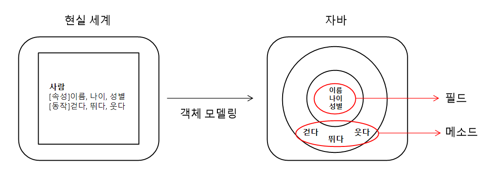

# 클래스_1

## 객체 지향 프로그래밍

소프트웨어를 개발할 때 필요한 기능이 담긴 객체를 먼저 만들고, 하나씩 조립해서 완성된 프로그램을 만드는 기법을 객체 지향 프로그래밍(OOP)이라고 한다. 객체 지향 프로그래밍을 이해하기 위해서는 우선 객체의 개념과 객체의 상호작용에 대해 알아야 한다.

## 객체란?

객체(Object)란 물리적으로 존재하거나 추상적으로 생각할 수 있는 것 중에서 자신의 속성을 가지고 있고 다른 것과 식별 가능한 것을 말한다.
물리적으로 존재하는 모든 것(사람, 사물 등)은 객체가 될 수 있다.
객체는 속성과 동작으로 구성되어 있는데, 사람의 예를 들면 속성은 이름, 나이, 성별이 있고 동작은 걷다, 뛰다, 웃다 등이 있다. 자바는 이 속성과 동작을 각각 필드(field)와 메소드(method)라고 부른다.

현실 세계의 객체의 소프트웨어 객체로 설계하는 것을 객체 모델링(Object Modeling)이라고 한다. 이를 통해 현실 세계 객체의 속성과 동작을 소프트웨어 객체의 필드와 메소드로 정의한다.

## 객체의 상호작용

객체들은 각각 독립적으로 존재하고, 다른 객체와 서로 상호작용 하면서 동작한다. 객체들 사이의 상호작용 수단은 메소드이다. 객체가 다른 객체의 기능을 이용하는 것이 메소드 호출이다.

<pre>
<code>
리턴값 = 호출할 객체.메소드(매가값1, 매개값2, ...);
</code>
</pre>
매개값은 메소드를 실행하기 위해 필요한 데이터이다. 
리턴값은 메소드가 실행되고 나서 호출한 곳으로 돌려주는 값이다.

객체의 상호작용은 객체 간의 메소드 호출을 의맣고, 매개값과 리턴값을 통해 데이터를 주고 받는다.

## 객체 간의 관계

관계의 종류는 다음과 같다.
* 집합 관계: 부품에 해당하는 객체들이 모여 완성품에 해당하는 객체 밑에 있는 것(자동차 객체는 완성품. 타이어, 핸들, 휀다 등은 구성품)
* 사용 관계: 객체 간의 상호작용을 말한다.(사람 객체가 자전거 객체를 사용한다)
* 상속 관계: 상위(부모) 객체를 기반으로 하위(자식) 객체를 생성하는 관계를 말한다. 일반적으로 상위 객체는 종류, 하위 객체는 구체적인 사물에 해당한다.
(기계 객체가 부모 객체. 비행기, 자동차 등이 자식 객체.)

## 객체 지향 프로그래밍의 특징

### 캡슐화(Encapsulation)

캡슐화는 객체의 필드, 메소드를 하나로 묶고, 실제 구현 내용을 감추는 것을 말한다. 외부 객체는 객체 내부의 구조를 알지 못하며 객체가 제공하는 필드와 메소드만 알 수 있다.

캡술화는 외부의 접근을 차단하여 객체가 손상되는 것을 방지한다. 자바 언어는 캡술화된 멤버를 노출시킬 것인지, 숨길 것인지 결정하기 위해 접근 제한자(Access Modifier)를 사용한다. 접근 제한자는 객체의 필드와 메소드의 사용 범위를 제한한다.

### 상속(Inheritance)

상속은 상위 객체(부모)가 하위 객체(자식)에게 필드와 메소드를 물려주는 것이다. 따라서 하위 객체는 상위 객체의 필드와 메소드를 사용할 수 있다.

상속을 하면 상위 객체에서 이미 잘 구성된 객체를 그대로 사용하기 때문에(아버지 사업을 물려받으면 맨땅에 헤딩할 일이 없는 것처럼) 반복된 코드의 중복이 줄어든다. 또한 상위 객체가 수정되면 하위 객체 또한 별다른 수고 없이 수정된 상위 객체의 필드와 메소드를 사용할 수 있기 때문에 유지 보수 시간이 절약된다.

### 다형성(Polymorphism)

다형성은 같은 타입이지만 실행 결과가 다양한 객체를 이용할 수 있는 성질을 말한다. 하나의 타입에 여러 객체를 대입함으로써 다양한 기능을 이용할 수 있도록 해준다. 자바는 다형성을 위해 부모 클래스 또는 인터페이스의 타입 변환을 허용한다. 
다형성의 효과로 객체는 부품화가 가능하다.

간단히 정의하자면, 다형성은 한 곳에서 다양한 기능을 수행할 수 있도록 하는 것인데, 이를 구현하기 위해 인터페이스와 상속이라는 개념을 활용한다. 

## 객체와 클래스

자바에서 클래스는 객체를 생성하기 위한 설계도라고 할 수 있다. 클래스에는 객체 생성을 위한 필드와 메소드가 정의되어 있다. **클래스로부터 만들어진 객체를 해당 클래스의 인스턴스(instance)**라고 한다. 자전거 객체는 자전거 클래스의 인스턴스인 셈이다. 클래스로부터 객체를 만드는 과정을 인스턴스화(Instantiation)라고 한다. 하나의 클래스로부터 여러 개의 인스턴스를 만들 수 있다.  

## 클래스 선언

사용하고자 하는 객체를 구상했다면, 그 객체의 대표 이름을 하나 결정하고 이것을 클래스 이름으로 한다.
클래스는 자바의 식별자 작성 규칙에 따라 만들어야 한다.

* 하나 이상의 문자로 이루어져야 한다. / Member, PopMusic
* 첫 번째 글자는 숫자가 올 수 없다.
* '$','_'외의 특수 문자는 사용할 수 없다.
* 자바 키워드는 사용할 수 없다.

관례적으로 자바 클래스는 첫 글자를 대문자로 한다. 여러 단어가 조합되는 경우 단어의 첫 글자는 대문자로 한다.

클래스 생서 시 '클래스 이름.java'로 소스 파일을 생성하는데, 소스 파일 이름은 반드시 클래스 이름과 대소문자가 같도록 해야 한다.
소스 파일을 생성하면 다음과 같이 클래스를 선언한다.
<pre>
<code>
public class 클래스 이름{

}
</code>
</pre>
클래스 이름 뒤에는 반드시 중괄호( {} )를 붙여주는데, 이는 클래스의 시작과 끝을 의미한다.
일반적으로 소스 파일당 하나의 클래스를 생성하지만, 복수의 클래스를 생성하는 경우도 있다.
<pre>
<code>
public class Member{

}

public class boardMember{

}
</code>
</pre>

두 개 이상의 클래스가 선언된 소스 파일을 컴파일하면 바이트 코드 파일은(.class) 클래스를 선언한 개수만큼 생긴다. 결국 소스 파일은 클래스 선언을 담고 있는 저장 단위일 뿐, 클래스 자체가 아니다. 상기 코드를 컴파일하면 Member.class, boardMember.class가 각각 생성된다.

## 객체 생성과 클래스 변수

클래스로부터 객체를 생성할 때는 다음과 같이 new 연산자를 사용한다.
<pre>
<code>
new 클래스();
</code>
</pre>

new는 클래스로부터 객체를 생성하는 연산자이다. new 연산자 뒤에 생성자가 오는데, 생성자는 **클래스()** 형태를 가지고 있다.
new 연산자로 생성된 객체는 메모리의 힙(heap) 영역에 생성되고, 객체의 주소를 리턴하도록 되어 있다. 이 주소를 참조 타입인 클래스 변수에 저장해 두면, 변수를 통해 객체를 사용할 수 있다.
<pre>
<code>
클래스 변수;
변수 = new 클래스();
</code>
</pre>
상기 코드와 같이 클래스 변수에 new 연산자로 객체를 생성하고 리턴된 객체의 주소를 저장하면 변수가 객체를 참조한다.

다음은 클래스 선언과 new 연산자를 사용한 객체 생성까지 함께하는 코드이다.
Member 클래스를 선언하고, main() 메소드에서 Member 객체를 생성한다.
<pre>
<code>
// Member 클래스 선언
public class Member{

}
</code>
</pre>

<pre>
<code>
// main() 메소드에서 Member 객체 생성
public class Main{
    public static void main(String[] args){
        
        Member m1 = new Member();

        Member m2 = new Member();

    }
}
</code>
</pre>
Member 클래스는 하나이다. 하지만 new 연산자를 사용할 때마다 다른 주소값을 가지는 객체가 생성된다. 이러한 객체들은 Member 클래스의 인스턴스들이다. 같은 클래스에서 생성되었지만 각각의 Member 객체는 자신만의 고유한 데이터를 가진다. 따라서 m1, m2가 참조하는 Member 객체는 완전히 독립된 서로 다른 객체이다.

## Notice
Member 클래스와 Main 클래스는 둘 다 클래스이지만, **용도**가 다르다.
Member 클래스는 라이브러리(API_Application Program Interface)용이고 Main은 실행용이다. 라이브러리 클래스는 다른 클래스에서 이용할 목적으로 설계되고, 실행 클래스는 프로그램의 실행 진입점인 main() 메소드를 제공하는 역할을 한다. 프로그램 전체에서 사용되는 클래스가 50개라면 49개는 라이브러리용 클래스이고, 1개만 실행 클래스이다. 

물론 라이브러리 클래스 안에 실행 클래스를 생성하는 것도 가능하다.
<pre>
<code>
public class Member{

    public class Main{
        public static void main(String[] args){

            Member m = new Member();

        }
    }

}
</code>
</pre>
하지만 라이브러리 클래스와 실행 클래스를 분리하는 것을 권장한다.

## 클래스의 구성 멤버

클래스 구성 멤버는 필드(field), 생성자(constructor), 메소드(method)가 있다. 각 구성 멤버들은 필수가 아니며, 복수개로 사용 가능하다.

* 필드: 객체의 데이터가 저장되는 곳
* 생성자: 객체 생성 시 초기화 역할 담당
* 메소드: 객체의 동작에 해당하는 실행 블록

<pre>
<code>
public class Member{

    // 필드
    int MemberId;

    // 생성자
    Member(){ ... }

    // 메소드
    void 메소드 이름(){ ... }

}
</code>
</pre>

### 필드
필드는 객체의 고유 데이터 및 상태 정보를 저장하는 곳이다. 선언 형태는 변수(variable)와 비슷하지만, 필드를 변수라고 부르지 않는다.
[필드와 변수의 차이]
* 필드: 생성자와 메소드 전체에서 사용되며 객체가 소멸되지 않는 한 객체와 함께 존재한다.
* 변수: 생성자와 메소드 내에서만 사용되고 생성자와 메소드가 실행 종료되면 자동 소멸된다.

### 생성자
생성자는 new 연산자로 호출되는 특별한 중괄호 블록이다. 생성자는 객체 생성 시 **초기화**를 담당한다. 필드를 초기화하거나, 메소드를 호출해서 객체를 사용할 준비를 한다. 메소드와 비슷하게 생겼지만, **클래스 이름**으로 되어있고 **리턴 타입이 없다.**

### 메소드
메소드는 객체의 동작에 해당하는 중괄호 블록이다. 메소드를 호출하면 해당 메소드 중괄호 안에 있는 코드들이 일괄적으로 실행된다. 주로 객체 간의 데이터 전달의 수단으로 사용되며, 외부에서 매개값을 받기도 하고 직접 값을 리턴하기도 한다.

## 필드
필드는 객체의 고유 데이터, 객체가 가져야 할 부품, 객체의 현재 상태 데이터를 저장하는 곳이다.
<pre>
<code>
public class SmartPhone{

    // 고유 데이터
    String company;
    String model;
    String color;

    // 상태
    int speed;

    // 부품
    Body body;
    Screen screen;
}
</code>
</pre>

### 필드 선언
필드 선언은 클래스 중괄호 안에서 선언할 수 있다. 하지만 생성자와 메소드 중괄호 블록 내부에 선언할 수 없다. 
필드 선언은 변수의 선언 형태와 비슷한데, 그래서 일부 사람들은 클래스 멤버 변수라고 부르기도 한다. 하지만 필드라는 용어의 사용을 권장한다.

<pre>
<code>
타입 필드 = 초기값;
</code>
</pre>
타입은 필드에 저장할 데이터의 종류. 기본 타입(byte, short, int, long, float, double, booelan)과 참조 타입(배열, 클래스, 인터페이스) 모두 올 수 있다.
<pre>
<code>
String company = "SAMSUNG";
String model = "Galaxy";
int speed = 100;
int productionYear;
int updateYear;
</code>
</pre>
초기값이 지정되지 않은 productionYear, updateYear는 객체 생성 시 자동으로 기본 초기값으로 설정된다. 초기값은 필드 타입에 따라 다르다.

## 생성자
생성자는 new 연산자와 같이 사용되어 클래스로부터 객체를 생성할 때 호출되어 객체의 초기화를 담당한다. 초기화란 필드를 초기화하거나, 메소드를 호춣새서 객체를 사용할 준비를 하는 것을 말한다. 생성자 없이 클래스로부터 객체를 만들 수 없다. 
new 연산자에 의해 객체가 생성되면 메모리의 힙(heap) 영역에 객체가 생성되고 객체의 주소가 리턴된다. 리턴된 객체의 주소는 클래스 타입 변수에 저장되어 객체에 접근할 때 이용된다. 
<pre>
<code>
public class Member{

    int memberId;
    String memberName;

}

public class Main{
    public static void main(String[] args){

        Member m = new Member();

    }
}
</code>
</pre>
new 연산자를 사용해 Member 클래스의 객체를 생성하고 초기화를 했다. 생성된 객체는 메모리의 힙 영역에 저장되고, 클래스 타입 변수 m에 객체 주소를 반환한다. 그러면 클래스 타입 변수 m은 주소를 참조하여 객체를 생성 및 수정할 수 있다.

### 기본 생성자
모든 클래스는 생성자가 반드시 존재하며, 하나 이상을 가질 수 있다. 개발자가 클래스 내부에 생성자 선언을 생략했다면 컴파일러는 다음과 같이 중괄호 블록 내용이 비어있는 기본 생성자(Default Constructor)를 바이트 코드에 자동 추가시킨다.
<pre>
<code>
[public] class(){} // public을 []로 감싼 이유는 public이 있을 수도 없을 수도 있기 때문
</code>
</pre>
public 없이 class로만 클래스가 선언되면 기본 생성자도 public 없이 생성된다. 

그러니까
<pre>
<code>
public class Member{

    // 이렇게 생성자 없이 클래스를 선언했다면,

}

public class Member{

    public Member(){} // 클래스 생성자가 자동 추가된다.

}

public class Main{
    public static void main(String[] args){

        Member m = new Member(); // 그렇기 때문에 클래스 생성자를 선언하지 않아도 new 연산자 뒤에 기본 생성자를 호출해서 객체를 생성시킬 수 있다.

    }
}
</code>
</pre>

클래스를 명시적으로 선언한 생성자가 하나라도 있다면 컴파일러는 기본 생성자를 추가하지 않는다.
명시적으로 생성자를 선언하는 이유는 객체를 다양하게 초기화하기 위해서이다. 

### 생성자 선언
기본 생성자 대신 명시적으로 생성자를 선언하려면 다음과 같이 작성하면 된다.
<pre>
<code>
클래스(매개변수 선언, ...){
    // 객체의 초기화 코드
}
</code>
</pre>
생성자는 메소드와 비슷하지만, 메소드와의 차이점이 있다면 **리턴 타입이 없고 클래스 이름과 동일하다는 것**이다.
생성자 블록 내부에는 객체 초기화 코드가 작성된다. 일반적으로 필드에 초기값을 저장하거나 메소드를 호출하여 객체 사용 전에 필요한 준비를 한다.

매개 변수 선언은 생략해도 괜찮다. 매개 변수는 new 연산자로 생성자를 호출할 때 외부의 값을 생성자 블록 내부로 전달하는 역할을 한다.
<pre>
<code>
public class Member{

    // 생성자
    Member(int memberId, String memberName){}

}

public class Main{
    public static void main(String[] args){

        Member m = new Member(1, "Hong");

    }
}
</code>
</pre>
Member 클래스에서 int 타입의 memberId, String 타입의 memberName 두 개의 매개값을 가지는 생성자를 선언했다.
Member 클래스에 생성자가 명시적으로 선언되어 있기 때문에 new 연산자로 생성자를 호출할 때 반드시 이 생성자를 호출해야 한다. 비어있는 기본 생성자를 호출할 수 없다. 그리고 호출된 생성자가 매개값을 가지고 있다면 매개값의 타입에 맞는 값을 넣어주어야 한다.

### 필드 초기화
클래스로부터 객체가 생성될 때 필드는 기본 초기값으로 자동 설정된다. 만약 다른 값으로 초기값을 주고 싶다면 필드를 선언할 때 초기값을 주거나, 생성자에서 초기값을 주는 방법이 있다.

필드 선언 시 초기값을 주게 되면 해당 필드를 가진 클래스 생성자를 다른 곳에서 호출할 때 동일한 초기값을 가지게 된다.
<pre>
<code>
public class Member{
    int memberId = 1;
    String memberName;
}

Member m = new Member(); // memberId가 1로 초기값을 준 것을 그대로 들고 온다.
</code>
</pre>

생성자를 선언하는 시점에서 초기값을 준다면 개발자가 원하는대로 사용할 수 있다.
<pre>
<code>
public class Phone{
    String company = "Samsung";
    String model;
    int price;

    // 생성자
    public Phone(String model, int price){

        this.model = model; // this.필드 = 매개변수
        this.price = price; // this.필드 = 매개변수

    }
}

Phone p1 = new Phone("Galaxy", 111);
Phone p2 = new Phone("Flip", 222);
</code>
</pre>
클래스 Phone의 생성자 매개변수를 초기화값을 받지 않은 model, price 두 필드로 설정했다. 관례적으로 필드와 동일한 이름을 갖는 매개 변수를 사용한다. 필드와 매개변수 이름이 동일하기 때문에 생성자 내부에서 해당 필드에 접근할 수 없다. 왜냐하면 동일한 이름의 매개 변수가 사용 우선순위가 높기 때문이다. 이를 해결하기 위해 객체 자신의 참조를 뜻하는 'this'를 붙인다. 객체 자신을 this라고 하는데, 'this.필드'라고 하면 this라는 참조 변수로 필드를 사용하는 것과 동일하다. **'this'를 이용해 매개변수와 필드값을 구분하는 것이다.**

### 생성자 오버로딩(Overloading)
자바는 다양한 방법으로 객체를 생성할 수 있도록 생성자 오버로딩을 제공한다. 생성자 오버로딩은 매개 변수를 달리하는 생성자를 여러 개 선언하는 것을 말한다. 
<pre>
<code>
public class Phone{

    // 오버로딩은 매개 변수를 달리하는 생성자를 여러 개 선언하는 것이다.
    Phone(){}
    Phone(String model){}
    Phone(String model, int price){}
    Phone(String model, int price, int productionYear){}

}
</code>
</pre>

매개 변수의 타입과 개수 그리고 선언된 순서가 똑같을 경우 매개 변수 이름만 바꾸는 것은 생성자 오버로딩이라고 볼 수 없다.
<pre>
<code>
// 오버로딩이 아니다.
Phone(String model, int price){}
Phone(int price, String model){}
</code>
</pre>

### 서로 다른 생성자 호출( this() )
this() 메소드는 생성자 내부에서만 사용할 수 있으며, 같은 클래스의 다른 생성자를 호출할 때 사용한다.
생성자 오버로딩이 많아질 경우 매개 변수의 수만 다르고 필드 초기화 내용이 비슷한 경우 코드를 좀 더 간결하게 작성하기 위해 사용한다.
<pre>
<code>
클래스( [매개변수 선언은 optional] ){
    this(매개변수 혹은 값); // 클래스의 다른 생성자를 호출한다.
}
</code>
</pre>

<pre>
<code>
public class Phone{

    // field
    String company = "Samsung";
    String model;
    int price;
    int productionYear;
    
    // constructor
    Phone(){}

    Phone(String model){
        this(model, 999, 2021);
    }

    Phone(String model, int price){
        this(model, int, 2021);
    }

    Phone(String model, int price, int productionYear){
        this.model = model;
        this.price = price;
        this.productionYear = productionYear;
    }
}
</code>
</pre>
맨 아래에 위치한 Phone 클래스의 생성자를 Phone(String model), Phone(String model, int price) 생성자가 호출한다.

# 출처
* [이것이 자바다](http://www.kyobobook.co.kr/product/detailViewKor.laf?ejkGb=KOR&mallGb=KOR&barcode=9788968481475&orderClick=LAG&Kc=)
