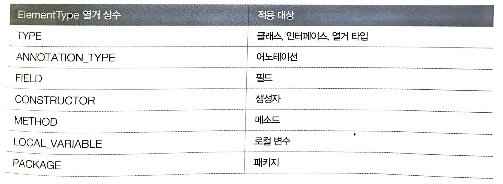

# 클래스_2

## 메소드
메소드는 객체의 동작에 해당하는 중괄호 블록이다. 중괄호 블록은 이름을 가지는데, 이것이 메소드의 이름이다.
구현 방식에 따라 필드를 읽고 수정하기도 하고 데이터를 전달하기도 한다.

## 메소드 선언
메소드 선언은 선언부, 실행부로 구성된다.

<pre>
<code>
리턴타입 메소드이름( [매개변수선언] ){

    - 실행할 코드 -

}
</code>
</pre>

### 리턴타입
메소드는 리턴타입이 있을 수도 없을 수도 있다. 리턴타입을 설정한 경우 메소드 실행에 대한 결과를 넘겨주도록 설정해야 한다.
리턴값이 없는 메소드는 void, 리턴값이 있는 메소드는 원하는 리턴 타입을 설정해야 한다.
<pre>
<code>
void engineStart(); // (예를들면)자동차 시동을 거는 메소드. 시동만 걸면 되니까 리턴 타입 필요 없다.
int plusNum(int a, int b); // 매개변수 a, b를 더한 결과를 리턴하는 메소드. 메소드 실행에 대한 결과값을 리턴해야 하므로 알맞은 리턴 타입 설정.
</code>
</pre>

상기 메소드를 호출하려면 다음과 같이 하면 된다.
<pre>
<code>
engineStart();
int result = plusNum(1, 2); // 메소드 리턴값을 받는 변수가 있어야 한다. 
plusNum(1, 2); // 리턴값이 반드시 필요한 것은 아니다. 메소드 실행 자체가 중요하다면 이렇게 해도 상관없다.
</code>
</pre>

### 메소드 이름
메소드 이름은 자바 식별자 규칙에 맞게 작성하면 된다.
* 숫자로 시작하면 안됨. '$'와 '_'를 제외한 특수문자 사용 금지.
* 메소드 이름은 소문자로 작성한다.
* 서로 다른 단어끼리 혼합되는 경우 뒤이어 오는 단어의 첫머리 글자는 대문자로 작성한다.

<pre>
<code>
void engineStart();
void getMemberId();
void order();
</code>
</pre>

메소드 이름은 해당 메소드가 어떤 기능을 수행하는지 명확히 알 수 있는 이름으로 짓자.

### 매개 변수 선언
매개 변수는 메소드 실행 시 필요한 데이터를 외부로부터 받기 위해 사용된다. 
매개 변수가 필요한 메소드와 필요없는 메소드가 있는데, 구현 의도에 맞게 작성하면 된다.
매개 변수가 있는 메소드는 해당 메소드 호출 시 반드시 매개변수 타입에 부합되는 값이 필요하다.

<pre>
<code>
public class Phone{

    // 매개 변수가 없는 메소드
    void powerOn(){
        System.out.println("전원을 켭니다.");
    }

    // 매개 변수가 있는 메소드
    int makeCall(int idNum, int num){
        int result = idNum + num;
        return result;
    }
}
</code>
</pre>

상기 메소드 호출은 다음과 같습니다.

<pre>
<code>
public class Main{
    public static void main(String[] args){

        Phone phone = new Phone();

        phone.poewrOn();

        int idNum = 010;
        int num = 11112222;

        phone.makeCall(idNum, num);
    }
}
</code>
</pre>

### 매개 변수의 수를 모르는 경우
메소드의 매개 변수는 선언할 때 이미 정해지는 것이 일반적이지만, 복수 개수의 매개 변수 값을 받아서 계산하는 메소드의 경우 명확한 매개 변수의 수를 알 수 없다.

배열을 매개변수로 넘겨주면 해결가능.
<pre>
<code>
int sum(int[] nums){}
</code>
</pre>

<pre>
<code>
// 호출방법1
int[] nums = {1,2,3};
sum(nums);

// 호출방법2
sum(new int[]{1,2,3});
</code>
</pre>

하지만 배열을 생성해야 하는 불편함이 있다. 그래서 배열을 생성하지 않고 값의 리스트만 넘겨주는 방법이 있다. 메소드의 매개 변수를 "..."를 사용해서 선언하면 메소드 호출 시 넘겨준 값의 수에 따라 자동으로 배열이 생성되고 매개값으로 사용된다.
"..."로 선언된 매개 변수는 배열타입이다.
<pre>
<code>
// 메소드 선언
int sum(int ... nums){}

// 메소드 호출
sum(1,2,3);
</code>
</pre>

### 리턴(return)문
메소드 선언에 리턴 타입이 있다면 반드시 리턴문을 사용해 리턴값을 지정해야 한다.
리턴문 이후의 실행문은 실행되지 않는다. 주의해야 한다.
<pre>
<code>
int sum(int ... nums){
    int result = 0;
    for(int i = 0; i<nums.length; i++){
        i++;
        result += i;
    }
    return result;
    System.out.println("메소드 종료"); // Unreachable code 에러 발생
}
</code>
</pre>

### 리턴값이 없는 메소드(void)
void로 선언된 리턴값이 없는 메소드에도 리턴문을 사용할 수 있다. 여기에 리턴문을 사용하면 메소드 실행을 강제 종료시킨다.
<pre>
<code>
int x = 10;

void run(){
    if(x >= 0){
        x--;
    }else{
        return; // void 선언된 메소드에 리턴문을 사용하면 메소드 실행 강제 종료.
    }
}
</code>
</pre>

### 메소드 호출
클래스 내부에서 메소드를 호출할 때 단순한 메소드 이름으로 호출하면 된다. 클래스 외부에서 메소드를 호출할 때 해당 메소드가 선언되 클래스로부터 객체를 생성한 뒤, 참조 변수를 이용해서 메소드를 호출한다.

### 객체 내부에서 메소드 호출
<pre>
<code>
public class Phone{

    // 메소드 선언
    void makeCall(int idNum, int num){
        int result = idNum + num;
        return result;
    }
    
    // 메소드 호출
    makeCall(010, 11112222); // 클래스 내부에서 호출하는 경우 메소드 이름 및 매개 변수만 잘 설정하면 된다.

}
</code>
</pre>

### 객체 외부 메소드 호출
외부 클래스에서 다른 클래스의 메소드를 호출하려면 해당 메소드가 있는 클래스의 객체를 생성해야 한다. **메소드는 객체에 소속된 멤버**이므로 객체가 존재하지 않으면 메소드도 존재하지 않는다.

<pre>
<code>
클래스 참조변수 = new 클래스(매개값, ...);
참조변수.메소드(매개값,...);
</code>
</pre>
객체를 생성한 후 도트(.) 연산자를 사용해서 메소드를 호출할 수 있다. 도트 연산자는 객체 접근 연산자로 객체가 가지고 있는 필드, 메소드에 접근할 때 사용한다.

<pre>
<code>
public class Phone{

    void makeCall(int idNum, int num){
        int result = idNum + num;
        return result;
    }

}

public class Main{
    public static void main(String[] args){
        Phone phone = new Phone();

        phone.makeCall(010, 11112222);
    }
}
</code>
</pre>

### 메소드 오버로딩(overloading)
클래스 내에 같은 이름의 메소드를 여러 개 선언하는 것을 메소드 오버로딩이라고 한다.
오버로딩을 하려면 매개 변수의 타입, 개수, 순서가 달라야 한다.

메소드 오버로딩을 사용하면 같은 메소드로 다양한 매개값을 받아서 처리할 수 있다.
<pre>
<code>
int plus(int a, int b){
    int result = a + b;
    return result;
}

double plus(double a, double b){
    double result = a + b;
    return result;
}
</code>
</pre>
이렇게 하면 하나의 메소드로 int, double타입 둘 다 처리할 수 있다.

<pre>
<code>
int plus(int a, int b){
    int result = a + b;
    return result;
}

double plus(double a, double b){
    double result = a + b;
    return result;
}
</code>
</pre>

## 인스턴스 멤버와 this
인스턴스(instance)멤버는 객체(인스턴스)를 생성한 후 사용할 수 있는 필드와 메소드를 말한다. 이들을 각각 인스턴스 필드, 인스턴스 메소드라고 부른다.
인스턴스 필드, 메소드는 객체에 소속된 멤버이기 때문에 객체 없이 사용할 수 없다.

### 외부에서 인스턴스 멤버에 접근하기
<pre>
<code>
public class Phone{
    // field
    int phoneNum;

    // method
    void powerOn(){ 
        System.out.println("실행.")
    };
}

public class Main{
    public static void main(String[] args){
        Phone phone = new Phone();

        phone.phoneNum = 01011112222;

        phone.powerOn();
    }
}
</code>
</pre>
상기 코드에서 Main 클래스에서 외부 클래스인 Phone 클래스의 필드, 메소드를 사용하기 위해 Phone 객체(인스턴스)를 생성하고 참조 변수 phone으로 접근했다.

### 내부에서 인스턴스 멤버에 접근하기
객체 외부에서 인스턴스 멤버에 접근하기 위해 참조 변수를 사용하듯이 객체 내부에서도 인스턴스 멤버에 접근하기 위해 this를 사용한다.
객체는 자신을 'this'라고 한다. 따라서 'this.필드'는 자신이 가지고 있는 클래스의 해당 필드라는 뜻이다.
this는 주로 생성자와 메소드의 매개 변수 이름이 필드와 동일한 경우 인스턴스 멤버인 필드임을 명시하고자 할 때 사용한다.

<pre>
<code>
public class Phone{
    // field
    int phoneNum;

    // constructor
    Phone(int phoneNum){
        this.phoneNum = phoneNum;
    }

    // method
    void setPhoneNum(int phoneNum){
        this.phoneNum = phoneNum;
    }
}
</code>
</pre>

## 정적 멤버와 static
정적 멤버는 클래스에 고정된 멤버로서 객체를 생성하지 않고 사용할 수 있는 필드와 메소드를 말한다.
정적 멤버는 객체(인스턴스)에 소속된 멤버가 아니라 클래스에 소속된 멤버이기 때문에 클래스 멤버라고도 한다.

### 정적 멤버 선언
필드와 메소드 선언 시 static 키워드를 붙이면 된다.
<pre>
<code>
public class Phone{

    // static field
    static 타입 필드 [ = 초기값 ]; // 초기값은 optional

    // static method
    static 리턴 타입 메소드( 매개변수선언, ...){}
}
</code>
</pre>

**필드를 선언할 때 객체마다 가지고 있어야 할 데이터라면 인스턴스 필드로 선언하고, 객체마다 가지고 있을 필요성이 없는 공용적인 데이터라면 정적 필드로 선언하는 것이 좋다.**

**메소드의 경우 필드를 이용해서 실행해야 한다면 인스턴스 메소드로 선언하고, 인스턴스 필드를 이용하지 않는다면 정적 메소드로 선언한다.**

### 정적 멤버 사용
클래스 이름과 함께 도트(.) 연산자로 접근한다.
<pre>
<code>
public class Calculator{

    static double pi = 3.14159;
    static int plus(int a, int b){ ... }
    static int minus(int a, int y){ ... }
}

double result1 = 10 * 10 * Calculator.pi; // 객체 생성 없이 사용 가능.
int result2 = Calculator.plus(10, 5);
int result3 = Calculator.minus(10, 5);
</code>
</pre>

### 정적 초기화 블록
인스턴스 필드는 생성자에서 초기화하지만, 정적 필드는 객체 생성 없이도 사용해야 하기 때문에 생성자에서 초기화 작업을 할 수 없다. 생성자는 객체 생성 시에만 실행되기 때문이다. 자바에서는 정적 필드 초기화를 위한 정적 블록(static block)을 제공한다.

정적 블록은 클래스가 메모리로 로딩될 때 자동으로 실행된다. 정적 블록은 클래스 내부에 여러개가 선언되어 상관없다. 클래스가 메모리로 로딩될 때 선언된 순서대로 실행된다. 

<pre>
<code>
public class Phone{

    static String company = "Samsung";
    static String model = "Galaxy";
    static String info;

    static{
        info = company + " " + model;
    }
}

public class Main{
    public static void main(String[] args){
        System.out.println(Phone.info); // Samsung Galaxy
    }
}
</code>
</pre>
Phone 클래스에 초기값이 없는 정적 필드 info를 정적 블록에서 company, model 필드와 연결하여 초기값을 만들었다.

### 정적 메소드와 블록 선언 시 주의할 점
정적 메소드와 정적 블록을 선언할 때 인스턴스 필드, 인스턴스 메소드를 사용할 수 없다. 또한 객체 자신의 참조인 this 키워드도 사용이 불가능하다.
<pre>
<code>
public class Phone{

    // instance field
    int price;
    String model;

    // instance method
    void run(){ ... }

    // static field
    static String company;

    // static method
    static void finish(){ ... }

    // static block
    static{
        price = 11; // Compile Error
        model = "Galaxy"; // Compile Error
        company = "Samsung";
    }

    // static method
    static void Method{
        this.price; // Compile Error
        this.run(); // Compile Error

        price;
        model;
        finish();
    }

}
</code>
</pre>

정적 메소드와 정적 블록에서 인스턴스 멤버를 사용하고 싶다면 객체를 먼저 생성하고 참조 변수로 접근해야 한다.
<pre>
<code>
public class Phone{

    // instance field
    int price;
    String model;

    // instance method
    void run(){ ... }

    // static field
    static String company;

    // static method
    static void finish(){ ... }

    // static block
    static{
        Phone obj = new Phone();
        obj.price = 11; 
        obj.model = "Galaxy"; 
        company = "Samsung";
    }

    // static method
    static void Method{
        Phone obj = new Phone();
        obj.price; 
        obj.run(); 
        price;
        model;
        finish();
    }

}
</code>
</pre>

자바에서 프로그램 실행을 담당하는 main() 메소드도 정적 메소드이므로 객체 생성 없이 인스턴스 필드와 인스턴스 메소드를 main() 메소드에서 바로 사용할 수 없다.
따라서 객체를 먼저 생성한 후 참조 변수로 접근해야 한다.
<pre>
<code>
public class Phone{
    String company = "Samsung";
}

public class Main{
    public static void main(String[] args){
        Phone obj = new Phone();
        obj.company; // Samsung
    }
}
</code>
</pre>

### 싱글톤(Singleton)
단 하나만 생성한다는 의미로 싱글톤이라고 한다. 싱글톤을 구현하려면 클래스 외부에서 new 연ㅅ나자로 생성자를 호출할 수 없도록 막아야 한다. 생성자를 호출한 만큼 객체가 생성되기 때문이다. 생성자를 외부에서 호출할 수 없도록 하려면 생성자 앞에 **private** 접근 제한자를 붙여주면 된다. 

그 다음 자신의 타입인 정적 필드를 하나 선언하고 자신의 객체를 생성해 초기화한다.
클래스 내부에서는 new 연산자로 생성자 호출이 가능하다. 정적 필드도 private 접근자를 붙여 외부에서 필드값을 변경하지 못하도록 막는다. 대신 외부에서 호출할 수 있는 정적 메소드인 getInstance()를 선언하고 정적 필드에서 참조하고 있는 자신의 객체를 리턴해준다.

<pre>
<code>
public class 클래스{
    // 정적 필드
    private static 클래스 singleton = new 클래스();

    // 생성자
    privaet 클래스(){}

    // 정적 메소드
    static 클래스 getInstance(){
        return singleton;
    }

}
</code>
</pre>

외부에서 객체를 얻는 유일한 방법은 getInstance() 메소드를 호출하는 것이다. 이 메소드는 단 하나의 객체만 리턴한다.

<pre>
<code>
public class SingletonClass{
    // 정적 필드
    private static SingletonClass singleton = new SingletonClass();

    // 생성자
    privaet SingletonClass(){}

    // 정적 메소드
    static SingletonClass getInstance(){
        return singleton;
    }

}
</code>
</pre>

## final 필드와 상수
final 필드는 초기값이 저장되면 이것이 **최종적인 값**이 되어서 프로그램 실행 도중에 수정할 수 없다는 뜻이다.
final 필드는 다음과 같이 선언한다.
<pre>
<code>
final 타입 필드 [ = 초기값 ];
</code>
</pre>

final 필드는 한 번 초기화 되면 수정할 수 없다.

<pre>
<code>
public class Person{
    final String nation = "Korea";
    final String ssn;
    String name;

    public Person(String ssn, String name){
        this.ssn = ssn;
        this.name = name;
    }

}
</code>
</pre>
국가(nation), 주민번호(ssn)는 한 번 값이 지정되면 변경할 수 없으므로 final 필드로 선언했다.
이 중 국가는 항상 고정된 값을 갖기 때문에 초기값을 주었고, 주민번호는 Person 객체가 생성될 때 부여되므로 Person 클래스 설계 시 초기값을 미리 줄 수 없다. 그래서 생성자 매개값으로 주민번호를 받아서 초기값으로 지정했다.

<pre>
<code>
public class Main{
    public static void main(String[] args){
        Person p = new Person("123456-1234567", "Hong");

        p.nation; // Korea
        p.ssn; // 123456-1234567
        p.name; // Hong

        // final 필드는 수정 불가
        p.nation = "Mars"; // Error
        p.ssn = "369369"; // Error
        p.name = "Elon Musk"; // Error
    }
}
</code>
</pre>

### 패키지(Package)
자바에서는 클래스를 체계적으로 관리하기 위해 패키지를 사용한다. 패키지를 만들어 클래스를 저장 관리한다. 패키지의 물리적인 형태는 파일 시스템의 폴더이다.
패키지는 클래스를 유일하게 만드는 식별자 역할을 한다. 클래스 이름이 동일해도 패키지가 다르면 다른 클래스로 취급된다.

클래스의 전체 이름은 '패키지명+클래스명'인데 패키지가 상/하로 구분되어 있다면 도트(.)를 사용해서 구분한다.
> 상위패키지.하위패키지.클래스

예를 들어 Member 클래스가 'com.company' 패키지에 속해 있다면 Member 클래스의 전체 이름은 'com.company.Member'가 되고 실제 파일 시스템에서는 'com/company'폴더에 Member.class가 위치한다.
패키지가 중요한 이유는 클래스만 따로 복사해서 다른 곳으로 이동하면 클래스는 사용할 수 없기 때문이다. 클래스를 이동시키려면 패키지 전체를 이동시켜야 한다.

### 패키지 선언
패키지 네이밍 규칙이 있다.
* 숫자로 시작해서는 안되고 '$','_'를 제외한 특수 문자 사용 금지.
* java로 시작하는 패키지는 자바 표준 API에서만 사용하므로 사용 금지.
* 모두 소문자로 작성할 것.

일반적으로 회사의 도메인 이름으로 패키지를 만든다. 도메인은 등록 기관에서 유일한 이름으로 검증되었기 때문에 도메인 이름으로 패키지를 만들면 다른 회사의 패키지와 중복되는 경우가 발생하지 않아 다른 회사와의 협업 시 불편함이 없다.
도메인 이름으로 패키지를 만드는 경우 도메인 이름 역순으로 패키지 이름을 만든다. 그 이유는 포괄적인 이름이 상위 패키지가 되도록 하기 위함이다. 그리고 마지막에는 프로젝트 이름을 붙여주는 것이 관례이다.
<pre>
<code>
com.naver.projectname
com.tesla.projectname
</code>
</pre>

### import문을 사용해 다른 패키지 클래스에 접근
같은 패키지라면 상관없지만 다른 패키지에 속하는 클래스를 사용하려면 두 가지 방법이 있다.

첫번째 방법은, 패키지와 클래스를 모두 기술한다. 즉 해당 패키지의 클래스를 이용해서 필드를 선언하고 객체를 생성하는 방법.
아래 예시를 보자.
<pre>
<code>
package.com.mycompany;

public class Member{
    com.hankook.Tire tire = new com.hankook.Tire(); // com.hankook 패키지에 소속된 Tire 클래스를 이용해서 필드를 선언하고 객체를 생성하는 방법.
       (타입)      (필드명)      (객체 생성)
}
</code>
</pre>
코드가 난잡하다. 그래서 두 번째 방법인 import문을 주로 사용한다. 사용하고자 하는 패키지를 import문으로 선언하고, 클래스를 사용할 때에는 패키지를 생략하는 것이다.

<pre>
<code>
package.com.mycompany;

import com.hankook.Tire; 또는 com.hankook.*; 

public class Member{
    Tire tire = new Tire();
}
</code>
</pre>
패키지에 포함된 다수의 클래스를 사용해야 한다면 클래스 이름을 생략하고 *를 사용해서 import문을 한 번만 작성하면 된다. *는 패키지에 속하는 모든 클래스들을 의미한다. 
주의점은 **import문으로 지정된 패키지의 하위 패키지는 import 대상이 아니다.**
상위 패키지를 사용한다고 해서 모든 하위 패키지 내부의 클래스에 접근할 수 있는 것은 아니다.
<pre>
<code>
import com.company.*; // com.company 패키지에 있는 클래스들만 사용 가능.
import com.company.member.* // com.company.member 패키지에 있는 클래스들만 사용 가능.
</code>
</pre>

## 접근 제한자

| 종류 | 적용 대상 | 설명 |
| --- | --- | --- |
| public | 클래스, 필드, 생성자, 메소드 | 외부 클래스가 자유롭게 사용 가능 |
| protected | 필드, 생성자, 메소드 | 같은 패키지 또는 자식 클래스에서 사용 가능 |
| default | 클래스, 필드, 생성자, 메소드 | 같은 패키지에 소속된 클래스에서만 사용할 수 있음 |
| private | 필드, 생성자, 메소드 | 외부에 노출되지 않음 |

### default 접근제한
클래스 생성 시 접근제한을 생략했다면 default 접근제한을 가진다.
default 접근제한은 같은 패키지에서는 사용할 수 있지만 다른 패키지에서는 사용할 수 없도록 제한한다.
<pre>
<code>
class Member{

}
</code>
</pre>

### public 접근제한
클래스 생성 시 public 접근제한을 붙였다면 클래스는 public 접근제한을 가진다.
public 접근제한을 가지면 같은 패키지 뿐만이 아니라 다른 패키지에서도 접근 가능하다. 
만약 클래스가 인터넷으로 배포되는 라이브러리 클래스로 개발되어야 한다면 반드시 public 접근제한을 갖도록 해야 한다.
<pre>
<code>
public class Member{
    
}
</code>
</pre>

### 생성자의 접근 제한
객체를 생성하기 위해 new 연산자로 생성자를 호출하지만, 어디에서나 생성자를 호출할 수 있는 것은 아니다. 생성자가의 접근 제한자에 따라 호출 가능 여부가 결정된다. 생성자는 public, protected, default, private 접근 제한을 가진다.
<pre>
<code>
public class Member{

    public Member(){}

    protected Member(){}

    default Member(){}

    private Member(){}
    
}
</code>
</pre>

클래스에 생성자를 선언하지 않으면 기본 생성자가 자동 생성되는데, 자동으로 생성되는 기본 생성자의 접근제한은 클래스 접근 제한을 따라간다. 클래스가 default면 default, public이면 생성자도 public이다.

### public 접근 제한 생성자
모든 패키지에서 아무런 제한 없이 생성자를 호출할 수 있다. 생성자가 public 접근 제한자를 가지면 클래스도 public 접근 제한을 가지는 것이 일반적이다. 클래스가 default 접근 제한을 가진다면 클래스 사용이 같은 패키지로 한정된다. 따라서 비록 생성자가 public 접근 제한을 가지더라도 같은 패키지에서만 호출할 수 있다.

### protected 접근 제한 생성자
default 접근 제한과 마찬가지로 같은 패키지에 속하는 클래스에서 생성자를 호출할 수 있도록 한다. 차이점은 다른 패키지에 속한 클래스가 해당 클래스의 자식(child)클래스라면 생성자를 호출할 수 있다.

### default 접근 제한 생성자
생성자 선언 시 public 또는 private을 생략했다면 생성자는 default 접근 제한을 가진다. 같은 패키지에서는 아무런 제한 없이 생성자를 호출할 수 있으나, 다른 패키지에서는 생성자를 호출할 수 없다.

### private 접근 제한 생성자
동일 패키지이건 다른 패키지이건 상관없이 생성자를 호출할 수 없도록 제한한다. 클래스 외부에서 new 연산자로 객체를 만들 수 없다. 오로지 클래스 내부에서만 생성자를 호출할 수 있고, 객체를 만들 수 있다.

### 필드와 메소드의 접근 제한
필드와 메소드 선언 시 사용 범위를 어떻게 할 것인지 고려해야 한다.

| 접근 제한자 | 설명 |
| --- | --- |
| public | 모든 패키지에서 아무런 제한 없이 필드와 메소들르 사용할 수 있도록 해준다. 필드, 메소드가 public 접근 제한을 가지는 경우 클래스도 public 접근 제한을 가져야 한다. 클래스가 default 접근 제한을 가지면 같은 패키지 안에서만 클래스가 사용되기 때문이다. |
| protected | default 접근 제한과 마찬가지로 같은 패키지에 속하는 클래스에서 필드와 메소드를 사용할 수 있다. 차이점은 다른 패키지에 속한 클래스가 해당 클래스의 자식 클래스라면 필드와 메소드를 사용할 수 있다. |
| default | 필드, 메소드 선언 시 public 또는 private을 생략했다면 default 접근 제한을 가진다. 같은 패키지에서는 아무런 제한 없이 필드와 메소드를 사용할 수 있으나, 다른 패키지에서는 필드와 메소드를 사용할 수 없다. |
| private | 도일 패키지이건 다른 패키지이건 상관없이 필드와 메소드를 사용하지 못하도록 제한한다. 오로지 클래스 내부에서만 사용할 수 있다. |

### Getter와 Setter 메소드
일반적으로 객체 지향 프로그래밍에서 객체의 데이터는 객체 외부에 직접적으로 접근하는 것을 막는다. 외부에서 객체를 마음대로 읽고 변경할 경우 객체의 무결성이 깨어질 수 있기 때문이다. 예를 들면 해당 필드는 음수값이 들어가면 안되는데 누군가 마음대로 접근해 음수값을 집어넣을 수 있기 때문이다.

이 문제점을 해결하기 위해 객체 지향 프로그래밍에서는 메소들르 통해 데이터를 변경하는 방법을 선호한다. 데이터는 외부의 접근을 막고 메소드는 외부의 접근을 허용하여 메소드를 통해 데이터에 접근하도록 유도한다. 메소드는 매개값을 겁증해서 유효한 값만 데이터로 저장할 수 있기 때문에 객체 무결성을 지킬 수 있다. 
이러한 역할을 하는 메소드가 Setter이다. 예를 들어 자동차의 속도를 setSpeed() 메소드로 변경할 경우 다음과 같이 검증 코드를 작성할 수 있다. 이 메소드의 매개값 speed는 음수 값을 가지면 안된다.
<pre>
<code>
void setSpeed(double speed){
    if(speed < 0){
        this.speed = 0;
        return;
    }else{
        this.speed = speed;
    }
}
</code>
</pre>

외부에서 객체의 데이터를 읽을 때도 메소드 사용을 권장한다. 객체 외부에서 객체의 필드값을 사용하기에 부적절한 경우 메소드로 필드값을 가공한 다음 외부로 전달하는 방법이 있다. 이것이 Getter 메소드이다. 예를 들어 자동차 속도를 mile -> km 단위로 환산해서 외부로 리턴하는 getSpeed() 메소드를 작성할 수 있다.
<pre>
<code>
double getSpeed(){
    double km = speed*1.6;
    return km;
}
</code>
</pre>

클래스 선언 시 가능하다면 필드를 private으로 선언해서 외부로부터 보호하고, 필드에 대한 Setter, Getter 메소드를 작성해서 필드값을 안전하게 변경하고 사용하는 것을 권장한다. 

다음은 Setter, Getter 메소드를 선언하는 방법이다.
<pre>
<code>
private 타입 memberId;

// Getter
public 리턴 타입 getMemberId(){
    return memberId;
}

// Setter
public void setMemberId(타입 memberId){
    this.memberId = memberId;
}
</code>
</pre>

boolean 타입은 Getter는 get으로 시작하지 않고 is로 시작하는 것이 관례이다.
<pre>
<code>
private boolean ordered;

// Getter
public boolean isOrdered(){
    return stop;
}

// Setter
public void setOrdered(boolean order){
    this.order = order;
}
</code>
</pre>

만약 외부에서 값을 읽기만 하고 변경하지 못하도록 하려면 Getter만 설정하고 Setter는 사용하지 않거나 Setter 메소드가 private 접근 제한을 가지도록 하면 된다.

## 어노테이션(Annotation)
어노테이션은 메타데이터(metadata)라고 볼 수 있다. 메타데이터란 어플리케이션이 처리해야 할 데이터가 아니라, 컴파일 과정과 실행 과정에서 코드를 어떻게 컴파일하고 처리할 것인지를 알려주는 정보이다. 어노테이션은 다음과 같이 작성된다.
> @어노테이션 이름

어노테이션의 용도는
* 컴파일러에게 코드 문법 에러를 체크하도록 정보를 제공
* 소프트웨어 개발 툴이 빌드나 배치 시 코드를 자동으로 생성할 수 있도록 정보 제공
* 실행 시(런타임 시) 특정 기능을 실행하도록 정보를 제공

컴파일러에게 코드 문법 에러를 체크하도록 정보를 제공하는 대표적인 어노테이션은 @Override이다. 이 어노테이션은 메소드 선언 시 사용되는데, 메소드가 오버라이드(재정의)된 것임을 컴파일러에게 알려주어 컴파일러가 오버라이드 검사를 하도록 해준다. 

어노테이션은 빌드 시 자동으로 XMl 설정 파일을 생성하나, 배포를 위해 JAR 압축 파일을 생성하는데에도 사용된다. 그리고 실행 시 클래스의 역할을 정리하기도 한다.

### 어노테이션 타입 정의와 적용
어노테이션 타입을 정의하는 방법은 인터페이스 정의와 유사하다. 
@interface를 사용해서 어노테이션을 정의하고, 그 뒤에 사용할 어노테이션 이름을 지정한다.

> public @interface 어노테이션 이름{}

이렇게 정의한 어노테이션을 사용하려면

> @어노테이션 이름

어노테이션은 엘리먼트(element)를 가질 수 있다. 엘리먼트는 타입과 이름으로 구성되며, 디폴트 값을 가질 수 있다.
<pre>
<code>
public @interface 어노테이션 이름{
    타입 엘리먼트 이름(){ default 값 }; // 엘리먼트 선언
}
</code>
</pre>

엘리먼트의 타입은 int, double, String, 열거 타입, Class 타입, 배열 타입을 사용할 수 있다.
엘리먼트를 타입을 포함한 어노테이션을 정의하고 실제 적용을 하면 다음과 같다.
<pre>
<code>
public @interface 어노테이션 이름{
    String 엘리먼트 이름1();
    int 엘리먼트 이름2() default 7;
}

// 어노테이션 사용
@어노테이션(엘리먼트 이름1="값", 엘리먼트 이름2=7);
또는
@어노테이션(엘리먼트 이름1="값");
</code>
</pre>
엘리먼트 이름1은 default값이 없기 때문에 어노테이션 사용 시 반드시 기술해야 하고, 엘리먼트 이름2는 default값이 있기 때문에 생략 가능하다.

어노테이션은 기본 엘리먼트인 value를 가질 수 있다.
<pre>
<code>
public @interface 어노테이션 이름{

    String value(); // 기본 엘리먼트

}

// 어노테이션 사용
@어노테이션 이름("값");
</code>
</pre>
value 엘리먼트를 가진 어노테이션을 적용할 때에는 값만 기술할 수 있다. 이 값은 기본 엘리먼트인 value 값으로 자동 설정된다.

### 어노테이션 적용 대상
어노테이션을 적용할 수 있는 대상은 java.lang.annotation.ElementType 열거 상수이다.

출처: https://kimgom2.tistory.com/61?category=865616

어노테이션이 적용될 대상을 지정할 때 @Target 어노테이션을 사용한다. @Target의 기본 엘리먼트인 value는 ElementType 배열을 값으로 가진다. 어노테이션이 적용될 대상을 복수개로 지정하기 위함이다. 

다음과 같이 어노테이션을 정의하면
<pre>
<code>
@Target({ElementType.TYPE, ElementType.FIELD, ElementType.METHOD})
    public @interface 어노테이션 이름{

    }

@어노테이션 이름
public clsas Member{
    @어노테이션 이름
    private int memberId;

    @어노테이션 이름 // @Target에 CONSTRUCT가 없어 생성자는 적용 못함
    public Member(){}

    @어노테이션 이름
    public void getMember(){}
}
</code>
</pre>

### 어노테이션 유지 정책
어노테이션 정의 시 정의된 어노테이션을 어느 범위까지 유지할 것인지 지정해야 한다. 소스상에서만인지, 컴파일된 클래스까지인지, 런타임 시에도 유지할 것인지 지정해야 한다. 어노테이션 유지 정책은 java.lang.annotation.RetentionPolicy 열거 상수로 정의되어 있다.

* SOURCE: 소스상에서만 어노테이션 정보를 유지한다.
* CLASS: 바이트 코드 파일까지 어노테이션 정보를 유지한다.
* RUNTIME: 바이트 코드 파일까지 어노테이션 정보를 유지하면서 리플렉션을 이용해서 런타임 시에 어노테이션 정보를 얻을 수 있다.

리플렉션(Reflection)은 런타임 시에 클래스의 메타 정보를 얻는 기능이다. 클래스가 가지고 있는 필드는, 생성자는, 메소드는, 적용된 어노테이션은 무엇인지 알아내는 것이 리플렉션이다. 리플렉션을 이용해서 런타임 시에 어노테이션 정보를 얻으려면 어노테이션 유지 정책을 RUNTIME으로 설정해야 한다. 어노테이션 유지 정책을 지정할 때에는 @Retention 어노테이션을 사용한다. 
<pre>
<code>
@Target({ElementType.TYPE, ElementType.FIELD, ElementType.METHOD})
@Retention(RetentionPolicy.RUNTIME)
    public @interface 어노테이션 이름{

    }
</code>
</pre>

### 런타임 시 어노테이션 정보 사용하기
리플렉션을 통해 어노테이션 적용 여부와 엘리먼트 값을 읽고 처리할 수 있다. 

# 출처
* [이것이 자바다](http://www.kyobobook.co.kr/product/detailViewKor.laf?ejkGb=KOR&mallGb=KOR&barcode=9788968481475&orderClick=LAG&Kc=)