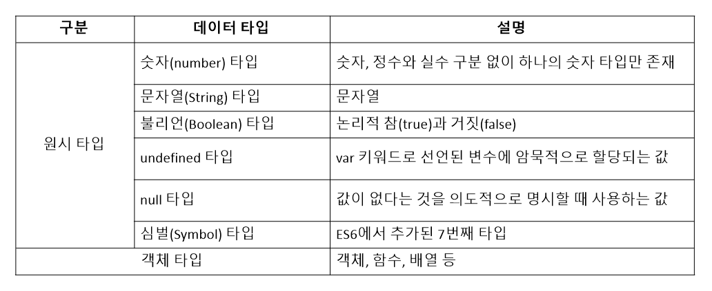
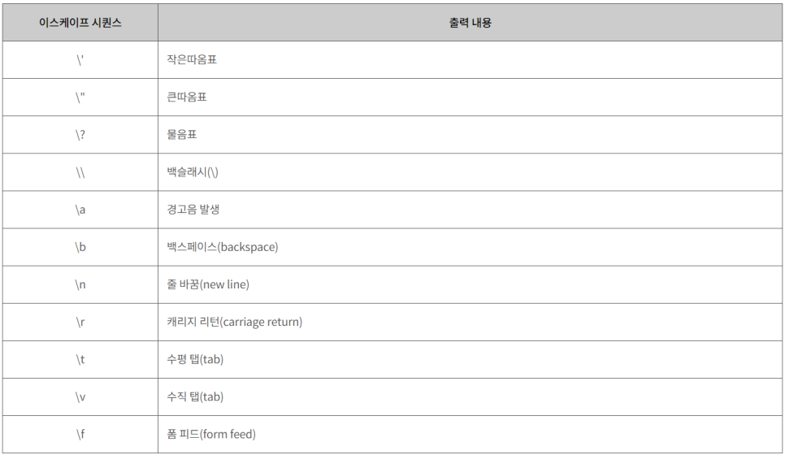

# 데이터 타입

데이터 타입(data type), '타입'이라고도 불리는 이것은 값의 종류를 말한다. 자바스크립트의 모든 값은 데이터 타입을 갖는다.

## 숫자 타입

자바에서는 정수, 소수를 구분한 다양한 숫자 타입이 존재하지만, 자바스크립트는 하나의 숫자 타입만 존재한다. 

ECMAScript 사양에 따르면 숫자 타입의 값은 배정밀도 64비트 부동소수점 형식을 따른다. 즉 모든 수를 실수로 처리하며, 정수만 표현하기 위한 데이터 타입이 별도로 존재하지 않는다.

<pre>
<code>
// 모두 숫자 타입이다.
var integer = 100;
var double = 100.12;
var negative = -100;
</code>
</pre>

정수, 실수, 2진수, 8진수, 16진수 리터럴 모두 메모리에 배정밀도 64비트 부동소수점 형식의 2진수로 저장된다.
자바스크립트는 2진수, 8진수, 16진수를 표현하기 위한 데이터 타입을 제공하지 않기 때문에 이들 값을 참조하면 모두 10진수로 해석한다.

<pre>
<code>
var binary = 0b01000001;
var octal = 0o101;
var hex = 0x41;

// 표기법만 다를 뿐 모두 같은 값
console.log(binary) // 65
console.log(octal) // 65
console.log(hex) // 65

console.log(binary == octal) // true
</code>
</pre>

자바스크립트의 숫자 타입은 정수만을 위한 타입이 없고 모든 수를 실수로 처리한다. 이는 정수를 표시한다 해도 사실은 실수라는 것을 의미한다.
정수로 표시되는 수끼리 나누더라도 실수가 나올 수 있다.

<pre>
<code>
// 숫자 타입은 모두 실수로 처리된다
console.log(2 === 2.0) // true
console.log(3 / 2) // 1.5
</code>
</pre>

숫자 타입은 추가로 세 가지 특별한 값도 표현 가능하다.
* Infinity: 양의 무한대
* -Infinity: 음의 무한대
* NaN(Not a Number): 산술 연산 불가

<pre>
<code>
console.log(100 / 0) // Infinity
console.log(100 / -0) // -Infinity
console.log(1 * 'String') // NaN
</code>
</pre>

자바스크립트는 대소문자 구별을 하므로(case-sensitive) NaN을 NAN, nan과 같이 표현하면 에러가 발생한다. 이렇게 사용하면 값이 아닌 식별자로 해석한다.

## 문자열 타입

문자열 타입은 텍스트 데이터를 나타내는 데 사용된다.
문자열은 작음따옴표(''), 큰따옴표("") 또는 백틱(``)으로 텍스트를 감싼다. 자바스크립트에서 가장 일반적인 방법은 작음따옴표를 사용하는 것이다.

따옴표 안에 따옴표를 사용하면 문자열로 인식한다.
<pre>
<code>
var str;
str = 'Bond, "James Bond"';
str = "Bond, 'James Bond'";
</code>
</pre>

문자열을 따옴표로 감싸는 이유는 키워드나 식별자 같은 토큰과 구분하기 위함이다.
따옴표로 감싸지 않으면 자바스크립트 엔진은 키워드나 식별자 같은 토큰으로 인식한다.

<pre>
<code>
var str;
str = welcome; // ReferenceError: welcome is not defined
</code>
</pre>

자바스크립트에서 문자열은 원시 타입이며, 변경 불가능한 값(immutable value)이다. 이것은 문자열이 생성되면 그 문자열을 변경할 수 없다는 것을 의미한다.

## 템플릿 리터럴

템플릿 리터럴은 다음 기능을 제공한다.
* 멀티라인 문자열(multi-line string)
* 표현식 삽입(expression interpolation)
* 태그드 탬플릿(tagged template)

### 멀티라인 문자열

일반 문자열 내에서는 줄바꿈(개행)이 허용되지 않는다.
일반 문자열에서 줄바꿈 등의 공백을 표현하려면 백슬래시(\)로 시작하는 이스케이스 시퀀스(escape sequence)를 사용해야 한다.

일반 문자열과는 달리 템플릿 리터럴 내에서는 이스케이프 시퀀스를 사용하지 않고도 줄바꿈이 허용되며, 모든 공백도 있는 그대로 적용된다.
<pre>
<code>

var template = `<ul>
                <li><a href="/">Home</a></li>
                </ul>`;

console.log(template);

// 결과
<ul>
    <li><a href="/">Home</a></li>
</ul>

</code>
</pre>

### 표현식 삽입

일반적으로 문자열은 연산자 + 를 통해 문자열 혹은 값을 연결한다.
표현식 삽입을 사용하면 좀 더 간단하고 가독성 좋은 문자열을 만들 수 있다.

<pre>
<code>
var first = 'Morrison';
var last = 'Jim';

console.log(`My name is ${last} ${first}.`); // My name is Jim Morrison.
</code>
</pre>

표현식 삽입은 ${}으로 표현식을 감싼다. 표현식의 평가 결과가 문자열이 아니더라도 문자열로 타입이 강제 변환되어 삽입된다.
<pre>
<code>
console.log(`3 + 3 = ${3 + 3}`); // 3 + 3 = 6
</code>
</pre>

표현식은 반드시 템플릿 리터럴 내에서 사용해야 한다. 템플릿 리터럴이 아닌 일반 문자열에서 표현식을 삽입하면 문자열로 취급된다.
<pre>
<code>
console.log('3 + 3 = ${3 + 3}'); // 3 + 3 = ${3 + 3}
</code>
</pre>

## 불리언 타입

불리언 타입의 값은 true, false뿐이다.
참과 거짓으로 구분하여 조건에 따라 프로그램을 수행하는 조건문에 자주 사용된다.

## undefined 타입

undefined 타입의 값은 undefined가 유일하다.

var 키워드로 선언한 변수는 암묵적으로 undefined로 초기화된다. 변수 선언에 의해 확보된 메모리 공간을 처음 할당이 이뤄질 때까지 빈 상태로 내버려두지 않고 자바스크립트 엔진이 undefined로 초기화한다. 

<pre>
<code>
var hello;
console.log(hello); // undefined
</code>
</pre>

개발자가 의도하지 않은, 자바스크립트 엔진이 변수를 초기화할 때 사용하는 값이 undefined이다.
따라서 변수 참조 시 undefined가 반환된다면 참조한 변수가 변수 선언 이후 값이 할당된 적이 없는, 즉 초기화되지 않은 변수라는 것을 확인할 수 있다.

만약 개발자가 의도적으로 변수에 값이 없다는 것을 명시하고 싶을 때는 undefined가 아니라 null을 할당한다.

## null 타입

null 타입의 값은 null이 유일하다. 대소문자를 구별하므로(case-sensitive) NULL, Null 이렇게 사용하면 안된다.

프로그래밍 언어에서 null은 **변수에 값이 없다는 것을 의도적으로 명시**할 때 사용한다.(의도적 부재(intentional absence))
변수에 null을 할당하면 변수가 이전에 참조하던 값을 더 이상 참조하지 않겠다는 의미다. 이는 이전에 할당되어 있던 값에 대한 참조를 명시적으로 제거하는 것을 의미하며, 자바스크립트 엔진은 누구도 참조하지 않는 메모리 공간에 대해 가비지 콜렉션을 수행할 것이다.

## 심벌 타입

심벌(symbol)은 변경 불가능한 원시 타입의 값이다. 다른 값과 중복되지 않는 유일무이한 값이다. 따라서 주로 이름이 충돌할 위험이 없는 객체의 유일한 프로퍼티 키를 만들기 위해 사용한다. 
심벌은 Symbol 함수를 호출해 생성한다. 생성된 심벌값은 외부에 노출되지 않고 다른 값과 절대 중복되지 않는 유일무이한 값이다.

<pre>
<code>
// 심벌 값 생성
var key = Symbol('key');
console.log(typeof key); // symbol

// 객체 생성
var obj = {};

// 이름이 충돌할 위험이 없는 유일무이한 값만 심벌 프로퍼티 키로 사용한다.
obj[key] = 'value';
console.log(obj[key]); // value
</code>
</pre>

## 객체 타입

자바스크립트의 데이터 타입은 크게 원시 타입과 객체 타입으로 분류한다.
자바스크립트는 객체 기반의 언어이며, 자바스크립트를 이루고 있는 거의 모든 것이 객체라는 것을 기억해야 한다.
이제껏 살펴본 데이터 타입 이외의 값은 모두 객체 타입이다.

## 데이터 타입의 필요성

자바스크립트 엔진은 데이터 타입, 즉 값의 종류에 따라 정해진 크기의 메모리 공간을 확보한다. 변수에 할당되는 값의 데이터 타입에 따라 확보해야 할 메모리 공간의 크기가 결정된다.

# 출처
* [모던 자바스크립트 Deep Dive](http://www.kyobobook.co.kr/product/detailViewKor.laf?ejkGb=KOR&mallGb=KOR&barcode=9791158392239&orderClick=LEA&Kc=)