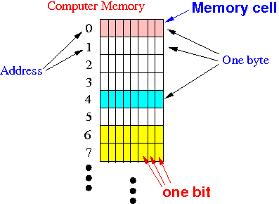
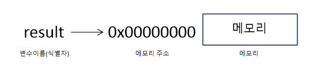

# 변수

컴퓨터는 CPU를 이용해 연산하고, 메모리를 사용해 데이터를 기억한다.

출처: http://www.mathcs.emory.edu

메모리는 데이터를 저장할 수 있는 메모리 셀(memory cell)의 집합체다. 메모리 셀 하나의 크기는 1바이트(8비트)이며, 컴퓨터는 메모리 셀의 크기, 즉 1바이트 단위로 데이터를 저장(write)하고 읽어(read)들인다.

컴퓨터는 모든 데이터를 2진수로 처리한다. 따라서 메모리에 저장되는 데이터는 데이터의 종류에 상관없이 모두 2진수로 저장된다.

<pre>
<code>
20 + 30
</code>
</pre>
다음 자바스크립트 코드를 실행하면 숫자 값 20과 30은 메모리 상의 임의의 위치(메모리 주소)에 기억(저장)되고 CPU는 이 값을 읽어들여 연산을 수행한다.
연산 결과로 생성된 숫자 50도 메모리 상의 임의의 위치에 저장된다. 

> 만약 연산 결과인 숫자 50을 재사용하고 싶다면 어떻게 해야할까?

메모리 주소에 직접 접근하는 방법을 생각할 수 있지만, 값이 변경되거나 시스템 전체가 마비될 수 있는 위험이 있다. 따라서 자바스크립트는 개발자의 직접적인 메모리 제어를 허용하지 않는다.

프로그래밍 언어는 기억하고 싶은 값을 메모리에 저장하고, 저장된 값을 읽어 들여 재사용하기 위해 변수라는 매커니즘을 제공한다. 

변수는 프로그래밍 언어에서 값을 저장하고 참조하는 매커니즘으로, 값의 위치를 가리키는 상징적인 이름이다.
변수를 사용하면 컴파일러 또는 인터프리터에 의해 값이 저장된 메모리 공간의 주소로 치환되어 실행된다. 따라서 직접 메모리 주소에 직접 접근할 필요가 없어진다.

변수는 하나의 값을 저장한다. 배열이나 객체같은 자료구조를 사용하면 여러 개의 값을 하나로 그룹화해서 하나의 값처럼 사용할 수 있다.
<pre>
<code>
// 변수는 하나의 값을 저장한다.
var age = 18;
var name = 'Charlie';

// 배열이나 객체같은 자료구조를 사용하면 여러 개의 값을 하나로 그룹화해서 하나의 값처럼 사용할 수 있다.
var users = [
    {id: 1, name: 'Hong'},
    {id: 2, name: 'Park'}
    ];
</code>
</pre>

앞의 20 + 30 코드에 변수를 부여하면 다음과 같다.
<pre>
<code>
var result = 20 + 30;
</code>
</pre>
변수 result는 20+30의 결과값 50의 식별자로서 사용된다.

변수에 값을 저장하는 것을 할당(assignment)라고 한다. 변수에 저장된 값을 읽어들이는 것을 참조(reference)라고 한다.

## 식별자(Identifier)
변수의 이름을 **식별자(identifier)**라고 부르기도 한다.

<pre>
<code>
var result = 20 + 30;
</code>
</pre>
앞서 살펴 보았던 result 변수다. 20+30의 결과값인 50의 식별자로 result가 만들어졌다.
아래 그림을 통해 알 수 있듯이 식별자 result는 값 50이 있는 메모리 주소를 기억하고 있다가 개발자가 그 값을 재사용하기 위해 식별자 result를 호출하면 값 50을 불러온다. 즉 **식별자는 값이 아니라 메모리 주소를 기억하고 있다.**

식별자라는 용어는 변수 이름에만 국한해서 사용하지 않는다. 함수, 클래스 등의 이름도 식별자다. 
변수 식별자를 통해 메모리 상에 있는 변수값을 식별하고, 함수 식별자를 통해 메모리상에 존재하는 함수(자바스크립트에서 함수는 값이다)를 식별할 수 있다.
이처럼 메모리 상에 존재하는 어떤 값을 식별할 수 있는 이름은 모두 식별자라고 부른다.

## 변수 선언(variable declaration)
변수 선언이란 변수를 생성하는 것을 말한다.

값을 저장하기 위한 메모리 공간을 확보(allocate)하고 변수 이름과 확보된 메모리 공간의 주소를 연결(name binding)해서 값을 저장할 수 있게 준비하는 것이다. 변수 선언에 의해 확보된 메모리 공간은 확보가 해제되기 전까지 해당 변수의 고유 공간이므로 안전하게 사용할 수 있다.

변수를 선언할 때 var, let, const 키워드를 사용한다.

var 키워드를 사용해 변수를 선언하자.
<pre>
<code>
var age;
</code>
</pre>
변수 선언 후 아직 값을 할당하지 않았다. 따라서 변수 선언에 의해 확보된 메모리 공간은 비어 있을 것으로 생각할 수 있지만, 확보된 메모리 공간에는 자바스크립트 엔진에 의해 undefined라는 값이 암묵적으로 할당되어 초기화된다. 자바스크립트만의 특징이다.

