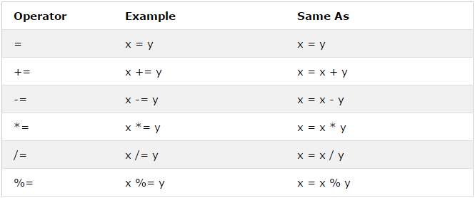
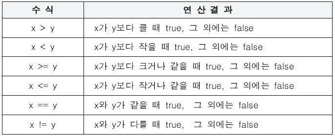

# 연산자

연산자(operator)는 하나 이상의 표현식을 수행하여 하나의 값을 만든다. 이때 연산의 대상을 피연산자(operand)라고 한다. 피연산자는 값으로 표현될 수 있는 표현식이어야 한다. 연산자는 피연산자를 연산해 새로운 값을 만든다.

## 산술 연산자
산술 연산자(arithmetic operator)는 피연산자를 대상으로 수학적 계산을 수행해 새로운 값을 만든다.
산술 연산이 불가능한 경우 NaN을 리턴한다.
이항 산술 연산자, 단항 산술 연산자 두 가지로 구분된다.

### 이항 산술 연산자
두 개의 피연산자를 산술 연산하여 숫자 값을 만든다.
종류는 +, -, *, /, %(덧셈, 뺄셈, 곱셈, 나눗셈, 나머지)가 있다.

### 단항 산술 연산자
하나의 피연산자를 산술 연산하여 숫자 값을 만든다.
종류는 ++, --(증가, 감소)가 있다.

이항 연산자와는 다르게 단항 산술 연산자에서 사용되는 ++, -- 연산자는 **피연산자의 값을 바꾸는 경우도 있다.**

<pre>
<code>
var x = 2;

x++; // 피연산자 x 값이 바뀌었다.(1 증가)
</code>
</pre>

또한 ++, -- 연산자의 앞/뒤 위치에 따라 의미가 바뀐다.
* x++ : 먼저 다른 연산을 수행한 후 피연산자 값을 바꾼다.
* ++x : 피연산자 값을 먼저 바꾼 후 다른 연산을 수행한다.

<pre>
<code>
var x = 2, result;

result = x++;
console.log(result, x); // 2, 3이 나오는 이유는, 변수 x가 먼저 result에 할당된 후 x값이 바뀌었기 때문이다.

result = ++x;
console.log(result, x); // 3, 3이 나오는 이유는, 변수 x값을 먼저 바꾸고 x를 result에 할당했기 때문이다.
</code>
</pre>

### 문자열 연결 연산자
+ 연산자는 피연산자 중 하나 이상이 문자열인 경우 문자열 연결 연산자로 동작한다.
<pre>
<code>
'1' + 2; // 12
1 + 2; // 3

// true는 1로 타입 변환한다.
1 + true; // 2

// false는 0으로 타입 변환한다.
1 + false; // 1

// null은 0으로 타입 변환한다.
1 + null; // 1

// undefined는 숫자로 타입 변환되지 않는다.
1 + undefined; // NaN
</code>
</pre>

## 할당 연산자
할당 연산자(assignment operator)는 우항에 있는 피연산자의 평가 결과를 좌항에 있는 변수에 할당한다.

출처 : https://m.post.naver.com/viewer/postView.nhn?volumeNo=6578124&memberNo=15527418

<pre>
<code>
var x = 20;

x += 5; // x = x + 5;

console.log(x); // 25
</code>
</pre>

## 비교 연산자
비교 연산자(comparison operator)는 좌항과 우항의 피연산자를 비교한 다음 그 결과를 불리언 값으로 반환한다.

비교 연산자에는 동등 비교(loose equality)와 일치 비교(strict equality)가 있다. 비교하는 엄격성의 차이다.

동등 비교
* x == y : x와 y의 값이 같다.
* x != y : x와 y의 값이 다르다.

일치 비교
* x === y : x와 y의 값과 타입이 같다.
* x !== y : x와 y의 값과 타입이 다르다.

동등 비교 연산자는 좌항과 우항의 피연산자 비교 시 먼저 **암묵적 타입 변환**을 통해 타입을 일치시킨 후 값을 비교한다.
이는 두 값의 값 뿐만이 아니라 타입도 같아야 true를 반환하는 일치 비교에는 해당하지 않는다.
<pre>
<code>
5 == '5'; // 두 값의 타입은 다르지만 암묵적 타입 변환을 먼저 수행해 타입을 일치시킨 후 값을 비교하기 때문에 true
</code>
</pre>

## 일치 비교 시 주의사항

숫자 0 사용 시 주의해야 한다.
0은 양수이든 음수이든 비교하면 true를 반환한다.
<pre>
<code>
0 === -0; // true
0 == -0; // true
</code>
</pre>

해당 값이 NaN인지 확인하려면 비교 연산자 대신 빌트인 함수인 isNaN을 사용해야 한다.
<pre>
<code>
isNaN(NaN); // true
isNaN(7); // false
</code>
</pre>

또한 NaN끼리 비교하면 false를 반환한다.
NaN은 자신과 일치하지 않는 유일한 값이기 때문이다.
<pre>
<code>
NaN === NaN; // false
</code>
</pre>

## Object.is 메소드
ES6에서 도입된 Object.is 메소드는 예측 가능한 정확한 비교 결과를 반환한다.
<pre>
<code>
Object.is(-0, +0); // false
Object.is(NaN, NaN); // false
</code>
</pre>

## 대소 관계 비교 연산자

출처 : https://programmer-seva.tistory.com/8

## 삼항 조건 연산자(ternary operator)
조건식의 평가 결과에 따라 반환 값을 결정한다. 반환값은 불리언(boolean) 값이다.

<pre>
<code>
조건식 ? 조건식이 true일 때의 값 : 조건식이 false일 때의 값

var score = 90;
var result = score >= 90 ? 'A' : 'B';
console.log(result); // A
</code>
</pre>

만약 조건식 결과가 불리언 값이 나올 수 없는 경우 불리언 값으로 암묵적 타입 변환을 한다.
<pre>
<code>
var x = 3;
var result = x % 2 ? '홀수' : '짝수'; // 홀수
</code>
</pre>
값이 3인 변수 x를 2로 나눈 나머지 값은 1이다. 1은 true로 암묵적 타입 변환된다. 따라서 true인 경우의 반환 값인 '홀수'를 리턴한다.

삼항 조건 연산자는  **표현식**이다. 즉 상기 코드처럼 값처럼 사용해 연산 값을 변수에 할당할 수 있다. 
삼항 조건 연산자와 비슷해 보이는 if-else는 표현식이 아니라 **문**이기 때문에 값처럼 사용할 수 없다.

## 논리 연산자(logical operator)

* || : 논리합(OR)
* && : 논리곱(AND)
* ! : 부정(NOT)

## 쉽표 연산자( , )
왼쪽 피연산자부터 차례대로 피연산자를 평가하고 마지막 피연산자의 평가가 끝나면 마지막 피연산자의 평가 결과를 반환한다.

<pre>
<code>
var a, b, c;

a = 1, b = 2, c = 3; / 3
</code>
</pre>

## 그룹 연산자
소괄호()로 피연산자를 감싸는 그룹 연산자는 자신의 피연산자인 표현식을 가장 먼저 평가한다. 그룹 연산자 사용 시 연산자의 우선순위를 조절할 수 있다.
**그룹 연산자는 연산자 우선순위가 가장 높다.**

<pre>
<code>
20 * 4 + 6; // 86

2 * (4 + 6); // 20
</code>
</pre>
일반적으로 곱셈(*)이 덧셈(+)보다 연산 우선순위가 높기 때문에 그룹 연산자가 없으면 의도한 값이 나오지 않을 수 있다.

## typeof 연산자
피연산자의 데이터 타입을 문자열로 반환한다.
7가지 문자열 "string", "number", "boolean", "undefined", "symbol", "object", "function" 중 하나를 반환한다. 
"null"을 반환하는 경우는 없고, 함수의 경우 "function"을 반환한다.

<pre>
<code>
typeof '' // string
typeof 7 // number
typeof NaN // number
typeof true // boolean
typeof [] // object
typeof {} // object
typeof null // object
typeof function(){} // function
</code>
</pre>

typeof로 null을 확인하면 object가 나오는데, 이는 자바스크립트 첫 번째 버전의 오류로서 기존 코드에 영향을 줄 수 있기 때문에 수정되지 않았다.
null인지 아닌지 확인하고 싶다면 일치 연산자(===)를 사용하자.
<pre>
<code>
var score = null;

typeof score === null; // false
score === null; // true
</code>
</pre>

## 지수 연산자(exponent operator)
좌항의 피연산자를 밑(base)로, 우항의 피연산자를 지수(exponent)로 거듭 제곱하여 숫자 값을 반환한다.
연산을 위해 곱셉 연산자가 두 개 붙은( ** ) 연산식을 사용한다.
<pre>
<code>
2 ** 2; // 4
2 ** 0; // 1
10 ** 2; // 100
</code>
</pre>

지수 연산자 이전에 Math.pow 연산자를 사용했다.
<pre>
<code>
Math.pow(2,2); // 4
</code>
</pre>

지수 연산자는 다음과 같은 경우 Math.pow 연산자보다 가독성이 좋다.
<pre>
<code>
2 ** 2 ** 2; // 16(2 ** 2 = 4. 여기에 4 ** 2를 하면 16)
Math.pow(Math.pow(2,2), 2); // 16
</code>
</pre>

## 연산자 우선순위

# 출처
* [모던 자바스크립트 Deep Dive](http://www.kyobobook.co.kr/product/detailViewKor.laf?ejkGb=KOR&mallGb=KOR&barcode=9791158392239&orderClick=LEA&Kc=)