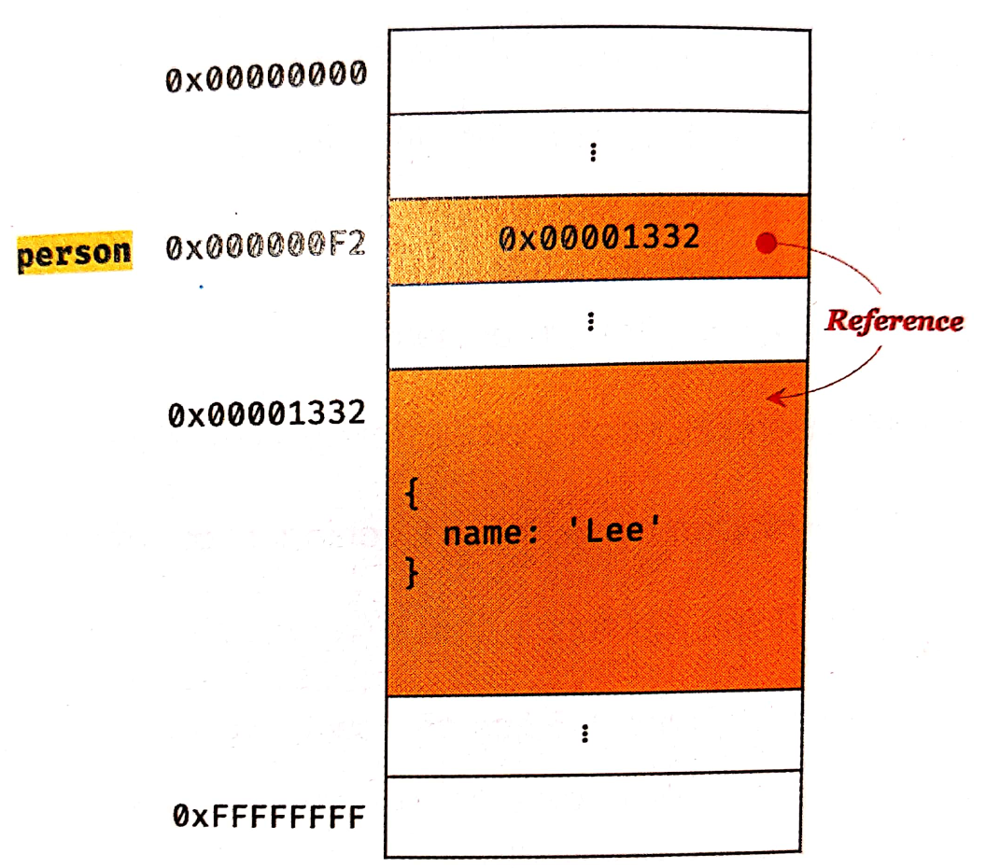

# 원시 값과 객체의 비교

자바스크립트의 데이터 타입은 크게 원시 타입(primitive type)과 객체 타입(object/reference type)으로 구분된다.
* 원시 타입은 변경 불가능한 값(immutable value)이며, 객체 타입은 변경 가능한 값(mutable value)이다. 
* 원시 값을 변수에 할당하면 변수(확보된 메모리 공간)에는 실제 값이 저장되고, 객체를 변수에 할당하면 변수에는 참조 값이 저장된다.
* 원시 값을 갖는 변수를 다른 변수에 할당하면 원본의 원시 값이 복사되어 전달되고, 객체를 가리키는 변수를 다른 변수에 할당하면 원본의 참조 값이 복사되어 전달된다.

## 원시 값
원시 값은 변경 불가능한 값이다. 한 번 생성된 원시 값은 읽기 전용(read only) 값으로서 변경할 수 없다.
이러한 원시 값의 특성은 데이터의 신뢰성을 보장한다.

원시 값을 할당한 변수에 새로원 원시값을 재할당하면 메모리 공간에 저장되어 있는 재할당 이전의 원시 값이 변경되는 것이 아니라 새로운 메모리 공간을 확보하고 재할당한 원시 값을 저장한 후, 변수는 새롭게 재할당한 원시 값을 가리킨다.
<pre>
<code>
// 변수 선언
var score;

// 값을 할당
score = 70;

// 값을 재할당
score = 80;

최초에 var score;로 변수 선언을 하면 메모리 공간을 확보하고 undefined 값을 가리킨다.(아무런 값을 할당하지 않았기 때문에)
이후 score = 70; 으로 값을 할당하면 기존 메모리 공간 값을 지우고 새로운 값을 할당하는 것이 아니라, 새로운 메모리 공간을 확보하고 그곳에 할당한 값을 저장한다.
또 이후 score = 80; 으로 값을 재할당하면 기존의 값 70이 있는 메모리 공간이 아니라, 새로운 메모리 공간을 확보하고 그곳에 할당한 값을 저장한다.
</code>
</pre>

위 예시를 통해 새로운 값을 할당하면 메모리 주소가 바뀌는 것을 알 수 있다. 그 이유는 변수에 할당된 원시 값이 변경 불가능한 값이기 때문이다.
만약 원시값이 변경 가능한 값이었다면 값이 할당될 때마다 메모리 주소가 바뀌지 않고 기존 주소에서 값만 계속 바뀌었을 것이다.
하지만 원시 값은 변경 불가능한 값(immutable value)이기 때문에 원시값을 재할당 하면 새로운 메모리 공간을 확보하고 그곳에 값을 저장한다. 값의 이러한 특성을 **불변성(immutability)**이라 한다.

불변성을 갖는 원시값을 할당한 변수는 재할당 이외에 변수 값을 변경할 수 있는 방법이 없다.

### 문자열과 불변성

자바스크립트의 문자열은 원시 타입이며, 변경 불가능하다. 즉 문자열이 생성된 이후에는 변경할 수 없다는 의미다.
<pre>
<code>
var str = 'Hello';
str = 'Stranger';
</code>
</pre>
식별자 str은 문자열 'Hello'가 저장된 메모리 공간의 첫 번째 메모리 셀 주소를 가리킨다. 
str = 'Stranger'가 실행되면 이전 문자열 'Hello'가 사라지지 않고 다른 새로운 메모리 공간을 확보해서 'Stranger'문자열을 저장하고, 이제 식별자 str은 이 값의 주소를 가리킨다. 문자열은 변경되지 않았다. 단지 식별자 str의 값 참조 주소(메모리 주소)만 변경되었을 뿐이다.

문자열은 유사 배열 객체(array-like object)이기 때문에 iterable, 즉 배열과 유사하게 인덱스로 프로퍼티 값에 접근할 수 있고, length 프로퍼티를 갖는다. 따라서 for문으로 순회할 수도 있다.
<pre>
<code>
var str = 'Valentino Rossi';

// 인덱스로 문자열에 접근
console.log(str[0]); // V

// 문자열의 일부를 변경할 수 있을 것 같지만, 문자열은 변경 불가능한 값이다. 해당 작업에 대한 에러는 발생하지 않는다. 하지만 아무런 변화가 없다.
str[0] = 'v';
</code>
</pre>

이처럼 원시값은 변경 불가능한 값이기 때문에 예기치 못한 변경으로 자유롭다. 따라서 데이터의 신뢰성을 보장한다.

### 값에 의한 전달
<pre>
<code>
var score = 70;
var copy = score;

console.log(score, copy); // 70 70
console.log(score === copy); // true
</code>
</pre>
변수에 변수를 할당했다. 즉 원시값을 갖는 변수를 또 다른 새로운 변수에 할당했다. 이를 **값에 의한 전달**이라 한다. 
**변수 score, copy의 값은 동일하지만 다른 메모리 공간에 저장된 별개의 값이다.** 따라서 둘 중 어느 한 변수의 값을 변경해도 서로 영향을 주지 않는다.
<pre>
<code>
var score = 70;
var copy = score;

score = 100;

console.log(score, copy); // 100 70
console.log(score === copy); // false
</code>
</pre>

## 객체
객체는 프로퍼티의 개수가 정해져 있지 않고 동적으로 추가되고 삭제할 수 있다. 또한 프로퍼티의 값에도 제약이 없다. 따라서 객체는 원시 값과 같이 확보해야 할 메모리 공간의 크기를 사전에 정해 둘 수 없다.

객체는 변경 가능한 값(mutable value)이다. 

객체를 할당한 변수에는 생성된 객체가 실제로 저장된 메모리 공간의 주소가 저장되어 있다. 이를 참조 값이라고 하는데, 변수는 이 참조 값을 통해 객체에 접근할 수 있다.

출처 : https://codingfarm.tistory.com/441

원시 값을 할당한 변수를 참조하면 메모리에 저장된 원시 값에 접근하지만, 객체를 할당한 변수를 참조하면 메모리에 저장된 참조 값을 통해 실제 객체에 접근한다.(한 번 더 거쳐서 값에 접근)

**원시값은 변경 불가능한 값이기 때문에 변수의 값을 변경하려면 재할당 외에는 방법이 없다. 하지만 객체는 변경 가능한 값이기 때문에 재할당 없이 동적으로 값을 변경하고 삭제할 수 있다.**

<pre>
<code>
var person = {
    name : 'Hong';
};

person.name = 'Park'; // 재할당 없이 동적으로 값 변경

person.age = 18; // 프로퍼티 동적 생성

console.log(person); // {name: "Hong", age: 18}
</code>
</pre>

원시값의 값 변경은 새로운 메모리 공간을 만들고, 그곳에 값을 추가했다. 하지만 객체는 **변경 가능한 값**이기 때문에 기존 메모리에 저장된 객체를 계속 수정, 삭제한다.(객체를 할당한 변수의 참조값은 변경되지 않는다)

### 참조에 의한 전달
객체는 여러개의 식별자가 하나의 객체를 공유할 수 있다. 

<pre>
<code>
var person = {
    name: 'Hong'
};

var copy = person;
</code>
</pre>
객체를 가리키는 변수(person)를 다른 변수(copy)에 할당하면 원본의 참조 값이 복사되어 전달된다. 이를 **참조에 의한 전달**이라 한다.
변수 person, copy는 서로 다른 메모리 주소에 저장되어 있지만, 동일한 참조 값을 갖는다.(동일한 객체를 가리킨다) 이것은 두 개의 식별자가 하나의 객체를 공유하는 것을 의미한다. 따라서 어느 한쪽의 값이 변경되면 서로 영향을 주고받는다.

<pre>
<code>
var person = {
    name: 'Hong'
};

var copy = person;

// person, copy는 동일한 객체를 참조한다.
console.log(person === copy); // true

// copy를 통해 객체 변경
copy.name = 'Park';

// person을 통해 객체 변경
person.address = 'Italy';

console.log(person); // {name: "Kim", address: "Italy"}
console.log(copy); // {name: "Kim", address: "Italy"}
</code>
</pre>

마지막으로 아래 예제를 살펴보자.
<pre>
<code>
var racer1 = {
    name: 'Rossi';
};

var racer2 = {
    name: 'Rossi';
};

console.log(racer1 === racer2); // false
console.log(racer1.name === racer2.name); // true
</code>
</pre>

=== 비교 연산자는 변수에 저장되어 있는 값을 타입 변환하지 않고 비교한다.
객체를 할당한 변수는 참조 값을 가지고 있고(변수가 참조한 메모리 주소값에 값이 있는 것이 아니라, 값이 위치한 메모리 주소가 있다는 의미), 원시 값을 할당한 변수는 원시 값 자체를 가지고 있다. 따라서 === 일치 비교 연산자를 통해 객체를 할당한 변수를 비교하면 참조 값을 비교하고, 원시 값을 할당한 변수를 비교하면 원시 값을 비교한다.

객체 리터럴은 평가될 때마다 객체를 생성한다. 따라서 racer1, racer2 변수는 내부의 내용은 같지만 다른 메모리에 저장된 별개의 객체다. 즉 각 변수의 참조 값은 전혀 다른 값이다. 

하지만 프로퍼티 값을 참조하는 racer1.name, racer2.name은 값으로 평가될 수 있는 표현식이다. 두 표현식 모두 원시 값 'Rossi'로 평가된다.

# 출처
* [모던 자바스크립트 Deep Dive](http://www.kyobobook.co.kr/product/detailViewKor.laf?ejkGb=KOR&mallGb=KOR&barcode=9791158392239&orderClick=LEA&Kc=)