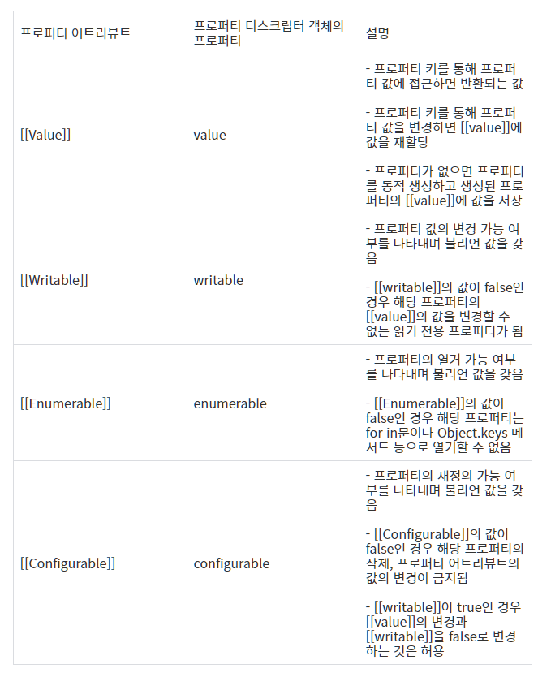
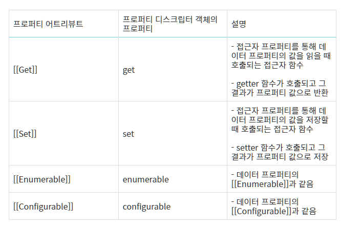

# 프로퍼티 어트리뷰트

## 내부 슬롯과 내부 메서드
프로퍼티 어트리뷰트 이해를 위해 우선 내부 슬롯과 내부 메서드의 개념에 대한 이해가 필요하다.

내부 슬롯, 내부 메서드는 자바스크립트 엔진의 구현 알고리즘을 설명하기 위해 ECMAScript 사양에서 사용하는 의사 프로퍼티(pseudo property)와 의사 메서드(pseudo method)다. ECMAScript 사양에 등장하는 이중 대괄호([[...]])로 감싼 이름들이 내부 슬롯과 내부 메서드다.

내부 슬롯, 내부 메서ㅕ드는 ECMAScript 사양에 정의된 대로 구현되어 자바스크립트 엔진에서 실제로 동작하지만 개발자가 직접 접근할 수 있도록 외부로 공개된 객체의 프로퍼티는 아니다. 즉 내부 슬롯, 내부 메서드는 자바스크립트 엔진의 내부 로직이므로 원칙적으로 자바스크립트는 내부 슬롯, 내부 메서드에 직접적으로 접근하거나 호출할 수 있는 방법을 제공하지 않는다. 단, 일부 내부 슬롯, 내부 메서드에 한하여 간접적으로 접근할 수 있는 수단을 제공한다.

예를 들어, 모든 객체는 [[Prototype]]이라는 내부 슬롯을 갖는다. 내부 슬롯은 자바스크립트 엔진의 내부 로직이므로 원칙적으로 직접 접근할 수 없지만 [[Prototype]] 내부 슬롯의 경우 __proto__를 통해 간접적으로 접근할 수 있다.

<pre>
<code>
const o = {};

// 내부 슬롯은 자바스크립트 엔진의 내부 로직이므로 직접 접근할 수 없다.
o.[[Prototype]] -> Uncaught SyntaxError: Unexpected token '}'
// 단, 일부 내부 슬롯, 내부 메서드에 한하여 간접적으로 접근할 수 있는 수단을 제공하기는 한다.
o.__proto__
// {constructor: ƒ, __defineGetter__: ƒ, __defineSetter__: ƒ, hasOwnProperty: ƒ, __lookupGetter__: ƒ, …}
</code>
</pre>

## 프로퍼티 어트리뷰트와 프로퍼티 디스크립터 객체
**자바스크립트 엔진은 프로퍼티를 생성할 때 프로퍼티의 상태를 나타내는 프로퍼티 어트리뷰트를 기본값으로 자동 정의한다.** 프로퍼티 상태란 프로퍼티의 값((value), 값의 갱신 가능 여부(writable), 열거 가능 여부(enumerable), 재정의 가능 여부(configurable)를 말한다.

프로퍼티 어트리뷰트는 자바스크립트 엔진이 관리하는 내부 상태 값(meta-property)인 내부 슬롯 [[Value]], [[Writable]], [[Configurable]]이다. 따라서 프로퍼티 어트리뷰트에 직접 접근할 수 없지만 Object.getOwnPropertyDescriptor 메서드를 사용하여 간접적으로 확인할 수는 있다.

<pre>
<code>
const person = {
    name: 'Lee'
};

// 프로퍼티 어트리뷰트 정보를 제공하는 프로퍼티 디스크립터 객체를 반환한다.
console.log(Object.getOwnPropertyDescriptor(person, 'name'));
// {value: 'Lee', writable: true, enumerable: true, configurable: true}
</code>
</pre>
Object.getOwnPropertyDescriptor 메서드를 호출할 때 첫 번째 매개변수에는 객체의 참조를 전달하고, 두 번째 매개변수에는 프로퍼티 키를 문자열로 전달한다. 이때 Object.getOwnPropertyDescriptor 메서드는 프로퍼티 어트리뷰트 정보를 제공하는 **프로퍼티 디스크립터_PropertyDescriptor 객체**를 반환한다. 만약 존재하지 않는 프로퍼티나 상속받은 프로퍼티에 대한 프로퍼티 디스크립터를 요구하면 undefined가 반환된다.

Object.getOwnPropertyDescriptor 메서드는 하나의 프로퍼티 디스크립터 객체를 반환하지만 ES8에서 도입된 Object.getOwnPropertyDescriptors 메서드는 모든 프로퍼티의 프로퍼티 어트리뷰트 정보를 제공하는 프로퍼티 디스크립터 객체들을 반환한다.

## 데이터 프로퍼티와 접근자 프로퍼티
프로퍼티는 데이터 프로퍼티와 접근자 프로퍼티로 구분할 수 있다.

* 데이터 프로퍼티
키와 값으로 구성된 일반적인 프로퍼티. 지금까지 살펴본 모든 프로퍼티는 데이터 프로퍼티다.

* 접근자 프로퍼티
자체적으로는 값을 갖지 않고 다른 데이터 프로퍼티의 값을 읽거나 저장할 때 호출되는 접근자 함수(accessor function)로 구성된 프로퍼티다.

## 데이터 프로퍼티
데이터 프로퍼티는 다음과 같은 프로퍼티 어트리뷰트를 갖는다. 이 프로퍼티 어트리뷰트는 자바스크립트 엔진이 프로퍼티를 생성할 때 기본값으로 자동 정의된다.

출처 : https://velog.io/@seeh_h/%ED%94%84%EB%A1%9C%ED%8D%BC%ED%8B%B0-%EC%96%B4%ED%8A%B8%EB%A6%AC%EB%B7%B0%ED%8A%B8feat.-%EB%82%B4%EB%B6%80-%EC%8A%AC%EB%A1%AF%EA%B3%BC-%EB%82%B4%EB%B6%80-%EB%A9%94%EC%86%8C%EB%93%9C

<pre>
<code>
const person = {
    name: 'Lee'
};

// 프로퍼티 어트리뷰트 정보를 제공하는 프로퍼티 디스크립터 객체를 반환한다.
console.log(Object.getOwnPropertyDescriptor(person, 'name'));
// {value: 'Lee', writable: true, enumerable: true, configurable: true}
</code>
</pre>
Object.getOwnPropertyDescriptor 메서드가 반환한 프로퍼티 디스크립터 객체를 살펴보면 value 프로퍼티의 값은 'Lee'다. 이것은 프로퍼티 어트리뷰트 [[Value]]의 값이 'Lee'인 것을 의미한다. 그리고 writable, enumerable, configurable 프로퍼티의 값은 모두 true다. 이것은 동명의 프로퍼티 어트리뷰트의 값이 모두 true인 것을 의미한다.
이처럼 프로퍼티가 생성될 때 [[Value]]의 값은 프로퍼티 값을 초기화되고, 나머지 어트리뷰트의 값은 true로 초기화된다. 이것은 프로퍼티를 동적 추가해도 마찬가지다.

const person = {
    name: 'Lee'
};

person.age = 20;

// 프로퍼티 어트리뷰트 정보를 제공하는 프로퍼티 디스크립터 객체를 반환한다.
console.log(Object.getOwnPropertyDescriptors(person));
// age: {value: 20, writable: true, enumerable: true, configurable: true}
// name: {value: 'Lee', writable: true, enumerable: true, configurable: true}
</code>
</pre>

### 접근자 프로퍼티
접근자 프로퍼티는 자체적으로는 값을 갖지 않고 다른 데이터 프로퍼티의 값을 읽거나 저장할 때 사용하는 접근자 함수로 구성된 프로퍼티다.

출처 : https://velog.io/@seeh_h/%ED%94%84%EB%A1%9C%ED%8D%BC%ED%8B%B0-%EC%96%B4%ED%8A%B8%EB%A6%AC%EB%B7%B0%ED%8A%B8feat.-%EB%82%B4%EB%B6%80-%EC%8A%AC%EB%A1%AF%EA%B3%BC-%EB%82%B4%EB%B6%80-%EB%A9%94%EC%86%8C%EB%93%9C

접근자 함수는 getter/setter 함수라고도 부른다. 접근자 프로퍼티는 getter와 setter 함수를 모두 정의할 수도 있고 하나만 정의할 수도 있다.

</code>
</pre>
const person = {
    // 데이터 프로퍼티
    firstName: 'Ungmo',
    lastName: 'Lee',

    // fullName은 접근자 함수로 구성된 접근자 프로퍼티다.
    // getter 함수
    get fullName() {
        return `${this.firstName} ${this.lastName}`;
    },
    // setter 함수
    set fullName(name) {
        // 배열 디스트릭처럼 할당
        [this.firstName, this.lastName] = name.split(' ');
    }
};

// 데이터 프로퍼티를 통한 프로퍼티 값의 참조
console.log(person.firstName + ' ' + person.lastName); // Ungmo Lee

// 접근자 프로퍼티를 통한 프로퍼티 값의 저장
// 접근자 프로퍼티 fullName에 값을 저장하면 setter 함수가 호출된다.
person.fullName = 'Heegun Lee';
console.log(person); // {firstName: "Heegun", lastName: "Lee"}

// 접근자 프로퍼티를 통한 프로퍼티 값의 참조
// 접근자 프로퍼티 fullName에 접근하면 getter 함수가 호출된다.
console.log(person.fullName); // Heegun Lee

// firstName은 데이터 프로퍼티다.
// 프로퍼티 어트리뷰트는 갖는다.
let descriptor = Object.getOwnPropertyDescriptor(person, 'firstName');
console.log(descriptor);
// {value: 'Heegun', writable: true, enumerable: true, configurable: true}

// fullName은 접근자 프로퍼티다.
// 프로퍼티 어트리뷰트를 갖는다.
descriptor = Object.getOwnPropertyDescriptor(person, 'fullName');
console.log(descriptor);
// {enumerable: true, configurable: true, get: ƒ, set: ƒ}
</code>
</pre>

person 객체의 firstName과 lastName 프로퍼티는 일반적인 데이터 프로퍼티다. 메서드 앞에 get, set이 붙은 메서드가 있는데 이것들이 바로 getter, setter 함수이고, getter/setter 함수의 이름 fullName이 접근자 프로퍼티다. 접근자 프로퍼티는 자체값으로 값(프로퍼티 어트리뷰트[[Value]])을 가지지 않으며 다만 데이터 프로퍼티의 값을 읽거나 저장할 때 관연할 뿐이다.

이를 내부 슬롯/메서드 관점에서 설명하면 접근자 프로퍼티 fullName으로 프로퍼티 값에 접근하면 [[Get]] 내부 메서드가 호출되어 다음과 같이 동작한다.

1. 프로퍼티 키가 유효한지 확인. 프로퍼티 키는 문자열 또는 심벌이어야 한다. 프로퍼티 키 "fullName"은 문자열이므로 유효한 프로퍼티 키다.
2. 프로토타입 체인에서 프로퍼티를 검색한다. person 객체에 fullName 프로퍼티가 존재한다.
3. 검색된 fullName 프로퍼티가 데이터 프로퍼티인지 접근자 프로퍼티인지 확인한다. fullName 프로퍼티는 접근자 프로퍼티다.
4. 접근자 프로퍼티 fullName의 프로퍼티 어트리뷰트 [[Get]]의 값, 즉 getter 함수를 호출하여 그 결과를 반환한다. 프로퍼티 fullName의 프로퍼티 어트리뷰트 [[Get]]의 값은 Object.getOwnPropertyDescriptor 메서드가 반환하는 프로퍼티 디스크립터 객체의 get 프로퍼티 값이다.

### 프로토타입
프로토타입은 어떤 객체의 상위(부모) 객체의 역할을 하는 객체다. 프로토타입은 하위(자식) 객체에게 자신의 프로퍼티와 메서드를 상속한다. 프로토타입 객체의 프로퍼티나 메서드를 상속받은 하위 객체는 자신의 프로퍼티 또는 메서드인 것처럼 자유롭게 사용할 수 있다.

프로토타입 체인은 프롵톼입이 단방향 링크드 리스트 형태로 연결되어 있는 상속 구조를 말한다. 객체의 프로퍼티나 메서드에 접근하려고 할 때 해당 객체에 접근하려는 프로퍼티 또는 메서드가 없다면 프로토타입 체인을 따라 프로토타입의 프로퍼티나 메서드를 차례대로 검색한다.

접근자 프로퍼티와 데이터 프로퍼티를 구분하는 방법은
</code>
</pre>
// 일반 객체의 __proto__는 접근자 프로퍼티다.
Object.getOwnPropertyDescriptor(Object.prototype, '__proto');

// 함수 객체의 prototype은 데이터 프로퍼티다.
Objec.getOwnPropertyDescriptor(function(){}, 'prototype');
</code>
</pre>

## 프로퍼티 정의
프로퍼티 정의란 새로운 프로퍼티를 추가하면서 프로퍼티 어트리뷰트를 명시적으로 정의하거나 기존 프로퍼티의 프로퍼티 어트리뷰트를 재정의하는 것을 말한다. 프로퍼티 값을 갱신 가능하도록 할 것인지, 프로퍼티를 재정의 가능하도록 할 것인지 정의할 수 있다. 이를 통해 객체의 프로퍼티가 어떻게 동작해야 하는지를 명확히 정의할 수 있다.

Object.defineProperty 메서드를 사용하면 프로퍼티의 어트리뷰트를 정의할 수 있다. 인수로는 객체의 참조와 데이터 프로퍼티의 키인 문자열, 프로퍼티 디스크립터 객체를 전달한다.

## 객체 변경 방지
객체는 변경 가능한 값임브로 재할당 없이 직접 변경할 수 있다. 즉, 프로퍼티를 추가하거나 삭제할 수 있고, 프로퍼티 값을 갱신할 수 있으며 Object.defineProperty 또는 Object.defineProperties 메서드를 사용하여 프로퍼티 어트리뷰트를 재정의할 수 있다.

자바스크립트는 객체의 변경을 방지한느 메서드를 제공한다. 객체 변경 방지 메서드들은 객체의 변경을 금지하는 강도가 다르다.

### 객체 확장 금지_Object.preventExtensions
Object.preventExtensions 메서드는 객체의 확장을 금지한다. 객체 확장 금지란 프로퍼티 추가 금지를 의미한다. 즉, **확장이 금지된 객체는 프로퍼티 추가가 금지된다.** 프로퍼티는 프로퍼티 동작 추가와 Object.defineProperty 메서드로 추가할 수 있다. 이 두 가지 추가 방법이 모두 금지된다.
확장이 가능한 객체인지 여부는 Object.isExtensible 메서드로 확인할 수 있다.
</code>
</pre>
const person = { name: 'Lee' };

// person 객체는 호가장이 금지된 객체가 아니다.
console.log(Object.isExtensible(person)); // true

// person 객체의 확장을 금지하여 프로퍼티 추가를 금지한다.
Object.preventExtensions(person);

// person 객체의 확장이 금지되었다.
console.log(Object.isExtensible(person)); // false

// 프로퍼티 추가가 금지된다.
person.age = 20; // 무시됨
console.log(person); // {name: "Lee"}

// 프로퍼티 추가는 금지되지만 삭제는 가능하다.
delete person.name;
console.log(person); // {}

// 프로퍼티 정의에 의한 프로퍼티 추가도 금지된다.
Object.defineProperty(person, 'age', {value: 20});
// TypeError: Cannot define property age, object is not extensible
</code>
</pre>

### 객체 밀봉_Object.seal
객체 밀봉이란 프로퍼티 추가 및 삭제와 프로퍼티 어트리뷰트 재정의 금지를 의미한다. 밀봉된 객체는 읽기와 쓰기만 가능하다.
밀봉된 객체인지 여부는 Object.isSealed 메서드로 확인 가능하다.
</code>
</pre>
const person = { name: 'Lee' };

console.log(Object.isSealed(person)); // false

Object.seal(person);

console.log(Object.isSealed(person)); // true

// 밀봉된 객체는 프로퍼티 추가,삭제 금지된다.
person.age = 20; // 무시됨
console.log(person); // {name: "Lee"}

delete person.name;
console.log(person); // {name: "Lee"}

// 프로퍼티 값 갱신은 가능
person.name = "Kim";
console.log(person); // {name: "Kim"}
</code>
</pre>

### 객체 동결_Object.freeze
객체 동결이란 프로퍼티 추가 및 삭제와 프로퍼티 어트리뷰트 재정의 금지, 프로퍼티 값 갱신 금지를 의미한다. 동결된 객체는 읽기만 가능하다.
동결된 객체인지 여부는 Object.isFrozen 메서드로 확인 가능하다.
</code>
</pre>
const person = { name: 'Lee' };

console.log(Object.isFrozen(person)); // false

Object.freeze(person);

console.log(Object.isFrozen(person)); // true

// 동결된 객체는 프로퍼티 추가,삭제 금지된다.
person.age = 20; // 무시됨
console.log(person); // {name: "Lee"}

delete person.name;
console.log(person); // {name: "Lee"}

// 프로퍼티 값 갱신이 금지된다.
person.name = "Kim";
console.log(person); // {name: "Lee"}
</code>
</pre>

## 불변 객체
지금까지 살펴본 변경 방지 메서드들은 얕은 변경 방지(shallow only)로 직속 프로퍼티만 변경이 방지되고 중첩 객체까지는 영향을 주지 못한다. 따라서 Object.freeze 메서드로 객체를 동결하여도 중첩 객체까지 동결할 수는 없다.
</code>
</pre>
const person = { 
    name: 'Lee',
    address: {city: 'Daegu'} 
};

// 얕은 객체 동결
Object.freeze(person);

// 직속 프로퍼티만 동결
console.log(Object.isFrozen(person)); // true

// 중첩 객체까지 동결하지 못한다.
console.log(Object.isFrozen(person.address)); // false

person.address.city = 'Busan';
console.log(person); // {name: "Lee", address: {city: "Busan"}}
</code>
</pre>

객체의 중첩 객체까지 동결하여 변경이 불가능한 읽기 전용의 불변 객체를 구현하려면 객체를 값으로 갖는 모든 프로퍼티에 대해 재귀적으로 Object.freeze 메서드를 호출해야 한다.
</code>
</pre>
function deepFreeze(target) {
    // 객체가 아니거나 동결된 객체는 무시하고 객체이고 동결되지 않은 객체만 동결한다.
    if(target && typeof target == 'object' && !Object.isFrozen(target)) {
        Object.freeze(target);
        Object.keys(target).forEach(key => deepFreeze(target[key]));
    }
    return target;
}

const person = { 
    name: 'Lee',
    address: {city: 'Daegu'} 
};

// 얕은 객체 동결
Object.freeze(person);

// 직속 프로퍼티만 동결
console.log(Object.isFrozen(person)); // true

// 중첩 객체까지 동결.
console.log(Object.isFrozen(person.address)); // true

person.address.city = 'Busan';
console.log(person); // {name: "Lee", address: {city: "Daegu"}}
</code>
</pre>

# 출처
* [모던 자바스크립트 Deep Dive](http://www.kyobobook.co.kr/product/detailViewKor.laf?ejkGb=KOR&mallGb=KOR&barcode=9791158392239&orderClick=LEA&Kc=)