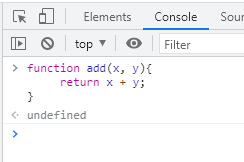

# 함수 part.1

프로그래밍 언어의 함수는 **일련의 과정을 문(statement)으로 구현하고 코드 블록으로 감싸서 하나의 실행 단위로 정의한 것이다.**
함수는 입력을 받아 출력으로 내보낸다. 이때 함수 내부로 입력을 전달받는 변수를 **매개변수(parameter)**, 출력을 **반환값(return value)**이라 한다.
함수는 여러 개 존재할 수 있으므로 특정 함수를 구별하기 위해 식별자인 함수 이름을 사용한다.

함수는 함수 정의(function definition)를 통해 생성한다. 자바스크립트의 함수는 다양한 방법으로 정의할 수 있다.
다음은 함수 정의를 통해 함수를 정의한 예시이다.
<pre>
<code>
// add라는 이름의 함수를 정의했다. 매개변수 x, y 두 개를 받고, 반환값으로 매개변수 x, y를 더한 값을 출력한다.
function add(x, y) {
    return x + y;
}
</code>
</pre>

함수 정의만으로 함수가 실행되지 않는다. **수학의 함수처럼 미리 정의된 일련의 과정을 실행하기 위해 필요한 입력, 즉 인수(argument)를 매개변수를 통해 함수에 전달하면서 함수의 실행을 명시적으로 지시해야 한다.**(여기서 매개변수(parameter)와 인수(argument)의 구분이 가능하다) 이를 함수 호출(function call/invoke)이라 한다. 함수를 호출하면 함수 body 부분이 실행되어 반환값을 리턴한다.
<pre>
<code>
// 함수 정의
function add(x, y) {
    return x + y;
}

// 함수 호출
var result = add(2, 4); // 함수 add에 인수 2, 4를 전달하면서 함수를 호출했다.

console.log(result); // 6
</code>
</pre>

## 함수를 사용하는 이유
함수 사용을 통해 중복을 제거하고 코드를 재사용할 수 있다. 이는 유지보수에 용이하다.
함수는 객체 타입의 값이기 때문에 이름(식별자)를 붙일 수 있다. 적절한 함수 이름을 통해 코드의 가독성을 높일 수 있다.

## 함수 리터럴
자바스크립트의 함수는 객체 타입의 값이기 때문에 함수도 함수 리터럴로 생성할 수 있다. 함수 리터럴은 function 키워드, 함수 이름, 매개변수 목록, 함수 몸체러 구성된다.

<pre>
<code>
// 변수에 함수 리터럴을 할당하는 모습
var f = function multiply(x, y) {
    return x * y;
};
</code>
</pre>

* 함수 이름은 식별자이기 때문에 식별자 네이밍 규칙을 준수해야 한다. 함수 이름은 생략 가능하다. 이름이 있는 함수는 기명 함수(named function), 이름이 없는 함수를 무기명 함수(anonymous function)라 한다.
* 매개변수는 0개 이상 사용 가능하다.(없어도 된다는 의미) 매개변수는 함수 몸체 내에서 변수와 동일하게 취급되기 때문에 변수와 마찬가지로 식별자 네이밍 규칙을 준수해야 한다.
* 함수 몸체는 함수 호출에 의해 실행된다.

위 예제는 multiply 함수 리터럴을 변수 f에 할당하고 있다. 리터럴은 사람이 이해할 수 있는 문자 또는 약속된 기호를 사용해 값을 생성하는 표기 방식을 말한다. 즉, 리터럴은 값을 생성하기 위한 표기법이다. 따라서 함수 리터럴도 평가되어 값을 생성하며, 이 값은 객체다. 즉, 함수는 객체다.

함수는 객체지만 일반 객체와는 다른 점이 있다. 그것은 **일반 객체는 호출할 수 없지만 함수는 호출할 수 있다.** 그리고 일반 객체에는 없는 함수 객체만의 고유한 프로퍼티를 갖는다. 함수가 객체라는 특징은 다른 프로그래밍 언어와 구별되는 자바스크립트의 중요한 특징이다.

## 함수 정의
함수 정의는 함수를 호출하기 이전에 인수를 전달받을 매개변수의 실행할 문들, 그리고 반환할 값을 지정하는 것을 말한다.
함수 정의 방법에는 4가지가 있다.

1. 함수 선언문
<pre>
<code>
function add(x, y) {
    return x + y;
}
</code>
</pre>

2. 함수 표현식
<pre>
<code>
var add = function(x, y) {
    return x + y;
}
</code>
</pre>

3. Function 생성자 함수
<pre>
<code>
var add = new Function('x'+'y','return x + y');
</code>
</pre>

4. 화살표 함수
<pre>
<code>
var add = (x, y) => x + y;
</code>
</pre>

## Notice
변수는 선언(declaration)한다고 하지만 함수는 정의(definition)한다고 표현한다. 함수 선언문이 평가되면 식별자가 암묵적으로 생성되고 함수 객체가 할당된다. 따라서 ECMAScript 사양에서도 변수에는 선언, 함수에는 정의라고 표현한다.

### 함수 선언문
함수 선언문을 사용해 함수를 정의하면 다음과 같다.
<pre>
<code>
// 함수 선언문
function add(x, y) {
    return x + y;
}

// 함수 참조
// console.dir는 함수 객체의 프로퍼티까지 출력한다.(Node.js 환경에서는 console.log와 동일한 결과를 출력한다)
console.dir(add); 

// console.dir(add); 결과
ƒ add(x, y)
arguments: null
caller: null
length: 2
name: "add"
prototype: {constructor: ƒ}
[[FunctionLocation]]: VM196:1
[[Prototype]]: ƒ ()
[[Scopes]]: Scopes[1]

// 함수 호출
console.log(add(2, 5)); // 7
</code>
</pre>

함수 선언문은 함수 리터럴과 형태가 동일하다. 단, 함수 리터럴은 함수 이름을 생략할 수 있으나 함수 선언문은 함수 이름을 생략할 수 없다.

<pre>
<code>
function (x, y) {
    return x + y;
}
// SyntaxError: Function statements require a function name
</code>
</pre>

**함수 선언문은 표현식이 아닌 문이다. 개발자 도구의 콘솔에서 함수 선언문을 실행하면 완료 값 undefined이 출력된다. 만약 함수 선언문이 표현식인 문이라면 완료 값 undefined 대신 표현식이 평가되어 생성된 함수가 출력되어야 한다.

표현식이 아닌 문은 변수에 할당할 수 없다. 함수 선언문도 표현식이 아닌 문이므로 변수에 할당할 수 없다.
하지만 다음 내용을 보면 함수 선언문이 변수에 할당되는 것처럼 보인다.
<pre>
<code>
var add = function(x, y) {
    return x + y;
}
</code>
</pre>

이렇게 동작하는 이유는 자바스크립트 엔진이 코드의 문맥에 따라 동일한 함수 리터럴을 표현식이 아닌 문인 함수 선언문으로 해석하는 경우와 표현식인 문인 함수 리터럴 표현식으로 해석하는 경우가 있기 때문이다. 함수 선언문은 함수 이름을 생략할 수 없다는 점을 제외하면 함수 리터럴과 형태가 동일하다. 이는 함수 이름이 있는 기명 함수 리터럴은 함수 선언문 또는 함수 리터럴 표현식으로 해석될 가능성이 있다는 의미다.

<pre>
<code>
// 기명 함수 리터럴을 단독으로 사용하면 함수 선언문으로 해석된다.
// 함수 선언문에서는 함수 이름을 생략할 수 없다.
function hello() { 
    console.log('Hello');
}
hello(); // Hello

// 함수 리터럴을 피연산자로 사용하면 함수 선언문이 아니라 함수 리터럴 표현식으로 해석한다.
// 함수 리터럴에서는 함수 이름을 생략할 수 있다.
(function bar() { console.log('bar'); });
</code>
</pre>

## Notice
위 예제에서 단독으로 사용된 함수 리터럴(hello)은 함수 선언문으로 해석된다. 하지만 그룸 연산자 () 내에 있는 함수 리터럴(bar)은 함수 선언문으로 해석되지 않고 함수 리터럴 표현식으로 해석된다. 그룹 연산자의 피연산자는 값으로 평가될 수 있는 표현식이어야 한다. 따라서 표현식이 아닌 문인 함수 선언문은 피연산자로 사용할 수 없다.

이처럼 이름이 있는 기명 함수 리터럴은 코드의 문맥에 따라 함수 선언문 또는 함수 리터럴 표현식으로 해석된다. 함수 선언문과 리터럴 표현식은 함수 객체를 생성한다는 점에서 동일하지만 호출에 차이가 있다. 위 예제에서 함수 선언문 hello는 호출할 수 있지만, 함수 리터럴 표현식으로 생성된 bar는 호출할 수 없다. 그 이유는 다음과 같다.

함수 이름은 함수 몸체 내에서만 참조할 수 있는 식별자다. 이는 함수 몸체 외부에서는 함수 이름으로 함수를 참조할 수 없기 때문에 함수 몸체 외부에서는 함수 이름으로 함수를 호출할 수 없다는 의미다. 즉 함수를 가리키는 식별자가 없다는 것과 마찬가지다. 따라서 함수 리터럴 표현식으로 생성된 bar는 호출할 수 없다.

하지만 위 예제에서 함수 선언문으로 정의된 함수는 hello라는 이름을 호출할 수 있다. hello는 함수 몸체 내부에서만 유효한 식별자인 함수 이름이므로 hello로 함수를 호출할 수 없어야 한다. hello라는 이름으로 함수를 호출하려면 hello는 함수 이름이 아니라 함수 객체를 가리키는 식별자여야 한다. 그런데 위 예제에서는 식별자 hello를 선언한 적도, 할당한 적도 없다. 하지만 호출할 수 있는 이유는 **hello는 자바스크립트 엔진이 암묵적으로 생성한 식별자이기 때문이다.**

자바스크립트 엔진은 함수 선언문을 해석해 함수 객체를 생성한다. 이때 함수 이름은 함수 몸체 내부에서만 유효한 식별자이므로 함수 이름과는 별도로 생성된 함수 객체를 가리키는 식별자가 필요하다. 함수 객체를 가리키는 식별자가 없으면 생성된 함수 객체를 참조할 수 없으므로 호출할 수도 없다. 따라서 **자바스크립트 엔진은 생성된 함수를 호출하기 위해 함수 이름과 동일한 이름의 식별자를 암묵적으로 생성하고, 거기에 함수 객체를 할당한다.**

위 개념을 가지고 다음 의사코드를 살펴보자.
<pre>
<code>
var hello = function hello() { 
    console.log('Hello');
}

console.log(add(2, 4)); // 6
</code>
</pre>
위 예제는 자바스크립트 엔진이 함수 생성 시 함수 이름과 동일한 이름의 식별자를 암묵적으로 생성하는 것을 물리적으로 표현한 것이다.
**함수는 함수 이름으로 호출하는 것이 아니라 함수 객체를 가리키는 식별자로 호출한다.** 즉, 함수 선언문으로 생성한 함수를 호출한 것은 함수 이름 hello가 아니라 자바스크립트 엔진이 암묵적으로 생성한 식별자 hello인 것이다. 함수 이름과 변수 이름이 동일하므로 함수 이름으로 호출한 듯 보이지만, 사실은 식별자로 호출된 것이다. 함수 선언 시 사용된 함수 이름 hello를 가져오는 것이 아니라, 함수 객체를 참조하는 var hello의 hello를 호출한 것이다.

결론적으로 자바스크립트 엔진은 함수 선언문을 함수 표현식으로 변환해 함수 객체를 생성한다고 생각할 수 있다. 단, 함수 선언문과 함수 표현식이 정확히 동일하게 동작하는 것은 아니다.

### 함수 표현식
자바스크립트의 함수는 객체 타입의 값이다. 따라서 자바스크립트 함수는 값처럼 변수에 할당할 수도 있고 프로퍼티 값이 될 수도 있고, 배열의 요소가 될 수도 있다. 이처럼 값의 성질을 갖는 객체를 **일급 객체**라 한다. 자바스크립트의 함수는 일급 객체다. 함수가 일급 객체라는 뜻은 함수를 값처럼 자유롭게 사용할 수 있다는 의미다.

함수는 일급 객체이므로 함수 리터럴로 생성한 함수 객체를 변수에 할당할 수 있다. 이러한 함수 정의 방식을 함수 표현식(function expression)이라 한다. 함수 선언문으로 정의한 hello 함수를 함수 표현식으로 바꿔서 정의하면 다음과 같다.
<pre>
<code>
// 함수 선언문
var hello = function hello() { 
    console.log('Hello');
};

// 함수 표현식
var hello = function (x, y) {
    return x + y;
};

console.log(hello(2, 4)); // 6
</code>
</pre>

함수 리터럴의 함수 이름은 생략 가능하다. 이러한 함수를 익명 함수라 한다. 함수 표현식의 함수 리터럴은 함수 이름을 생략하는 것이 일반적이다.

함수를 호출할 때 함수 이름이 아니라 함수 객체를 가리키는 식별자를 사용해야 한다. 함수 이름은 함수 몸체 내부에서만 유효한 식별자이므로 함수 이름으로 함수를 호출할 수 없다.
<pre>
<code>
// 기명 함수 표현식
var hello = function welcome(x, y) {
    return x + y;
};

// 함수 객체를 가리키는 식별자(hello)로 호출
console.log(hello(2, 4)); // 6

// 함수 이름으로 호출하면 ReferenceError 발생(함수 이름은 함수 몸체 내에서만 유효한 식별자이기 때문)
console.log(welcome(2, 4)); // ReferenceError: welcome is not defined
</code>
</pre>
자바스크립트 엔진은 함수 선언문의 함수 이름으로 식별자를 암묵적 생성하고 생성된 함수 객체를 할당하므로 함수 표현식과 유사하게 동작하는 것처럼 보인다. 하지만 함수 선언문과 함수 표현식은 정확히 동일하게 동작하지 않는다. 함수 선언문은 '표현식이 아닌 문'이고 함수 표현식은 '표현식인 문'이다. 따라서 미묘하지만 중요한 차이점이 있다.

### 함수 생성 시점과 함수 호이스팅

<pre>
<code>
// 함수 참조
console.dir(add); // f add(x, y)
console.dir(sub); // undefined

// 함수 호출
console.log(add(2, 5)); // 7
console.log(sub(2, 5)); // TypeError: sub is not a function

// 함수 선언문
function add(x, y) {
    return x + y;
}

// 함수 표현식
var sub = function (x, y) {
    return x + y;
}
</code>
</pre>
위 예제와 같이 함수 선언문으로 정의한 함수는 함수 선언문 이전에 호출할 수 있다. 하지만 함수 표현식으로 정의한 함수는 함수 표현식 이전에 호출할 수 없다. 이는 **함수 선언문으로 정의한 함수와 함수 표현식으로 정의한 함수의 생성 시점이 다르기 때문이다.**

함수 선언문은 코드가 한 줄씩 순차적으로 실행되는 시점인 런타임(runtime) 이전에 자바스크립트 엔진에 의해 먼저 실행된다. 함수 선언문으로 함수를 정의하면 런타임 이전에 함수 객체가 먼저 생성된다. 그리고 자바스크립트 엔진은 함수 이름과 동일한 이름의 식별자를 암묵적으로 생성하고 생성된 함수 객체를 할당한다.
즉 런타임 이전에 이미 함수 객체가 생성되어 있고 함수 이름과 동일한 식별자에 할당까지 완료된 상태다. 따라서 함수 선언문 이전에 함수를 참조할 수 있으며 호출할 수도 있다. 이처럼 **함수 선언문이 코드의 선두로 끌어 올려진 것처럼 동작하는 자바스크립트 고유의 특징을 함수 호이스팅(function hoisting)이라 한다.**

함수 호이스팅과 변수 호이스팅은 미묘한 차이가 있다. var 키워드를 사용한 변수 선언문과 함수 선언문은 런타임 이전에 자바스크립트 엔진에 의해 먼저 실행되어 식별자를 생성한다는 점에서 동일하다. 하지만 var 키워드로 선언된 변수는 undefined로 초기화되고, 함수 선언문을 통해 암묵적으로 생성된 식별자는 함수 객체로 초기화된다. 따라서 var 키워드를 사용한 변수 선언문 이전에 변수를 참조하면 변수 호이스팅에 의해 undefined로 평가되지만 함수 선언문으로 정의한 함수를 함수 선언문 이전에 호출하면 함수 호이스팅에 의해 호출이 가능하다.

함수 표현식은 변수에 할당되는 값이 함수 리터럴인 문이다. 따라서 함수 표현식은 변수 선언문과 변수 할당문을 한 번에 기술한 축약 표현과 도잉ㄹ하게 동작한다. 변수 선언은 런타임 이전에 실행되어 undefined로 초기화되지만 **변수 할당문의 값은 할당문이 실행되는 시점, 즉 런타임에 평가되므로 함수 표현식의 함수 리터럴도 할당문이 실행되는 시점에 평가되어 함수 객체가 된다.**

따라서 **함수 표현식으로 함수를 정의하면 함수 호이스팅이 발생하는 것이 아니라 변수 호이스팅이 발생한다.**

함수 표현식 이전에 함수를 참조하면 undefined로 평가되는데, 이때 함수를 호출하면 undefined를 호출하는 것과 마찬가지이므로 타입 에러가 발생한다. 따라서 함수 표현식으로 정의한 함수는 반드시 함수 표현식 이후에 참조 또는 호출해야 한다.

함수 호이스팅은 함수를 호출하기 전에 반드시 함수를 선언해야 한다는 당연한 규칙을 무시한다. 이 같은 문제 때문에 함수 선언문 대신 함수 표현식을 사용할 것을 권장한다.

### Function 생성자 함수
자바스크립트가 기본 제공하는 빌트인 함수인 Function 생성자 함수에 매개변수 목록과 함수 몸체를 문자열로 전달하면서 new 연산자와 함께 호출하면 함수 객체를 생성해서 반환한다. 사실 new 연산자 없이 호출해도 결과는 동일하다. 

Function 생성자 함수로 함수를 생성하면 다음과 같다.
<pre>
<code>
var add = new Function('x','y', 'return x + y');
console.log(add(2, 5)); // 7
</code>
</pre>
Function 생성자 함수 사용은 일반적이지 않으며 바람직하지도 않다. Function 생성자로 생서한 함수는 함수 선언문이나 함수 표현식으로 생성한 함수와 다르게 동작한다.

### 화살표 함수
ES6에 도입된 화살표 함수(arrow function)은 function 키워드 대신 화살표 => 를 사용해 좀 더 간략한 방법으로 함수를 선언할 수 있다. 화살표 함수는 항상 익명 함수로 정의한다.
<pre>
<code>
const add = (x, y) => x + y;
console.log(add(2, 5));
</code>
</pre>

화살표 함수는 생성자 함수로 사용할 수 없으며, 기존 함수와 this 바인딩 방식이 다르고, prototype 프로퍼티가 없으며 arguments 객체를 생성하지 않는다.

# 출처
* [모던 자바스크립트 Deep Dive](http://www.kyobobook.co.kr/product/detailViewKor.laf?ejkGb=KOR&mallGb=KOR&barcode=9791158392239&orderClick=LEA&Kc=)