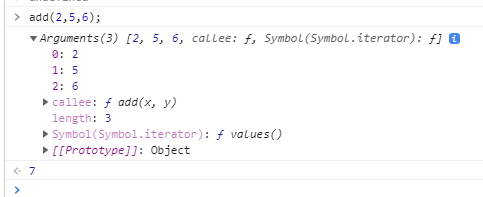

# 함수 part.2

## 함수 호출
함수는 함수를 가리키는 식별자와 한 쌍의 소괄호인 함수 호출 연산자로 호출한다. 함수 호출 연산자 내에는 0개 이상의 인수를 쉼표로 구분해서 나열한다.
함수를 호출하면 현재 실행 흐름을 중단하고 호출한 함수로 실행 흐름을 옮긴다. 이때 매개변수에 인수가 순서대로 할당되고 함수 몸체의 문들이 실행되기 시작한다. 

### 매개변수와 인수
함수를 실행하기 위해 필요한 값을 함수 외부에서 함수 내부로 전달할 필요가 있는 경우, 매개변수(parameter)를 통해 인수(argument)를 전달한다. 인수는 값으로 평가될 수 있는 표현식이어야 한다. 인수는 함수를 호출할때 지정하며, 개수와 타입에 제한이 없다.

<pre>
<code>
// 함수 선언문
function add(x, y) {
    return x + y;
}

// 인수 2,5가 매개변수 x,y에 순서대로 할당되고 함수 몸체의 문들이 실행된다.
console.log(add(2, 5)); // 7
</code>
</pre>

매개변수는 함수를 정의할 때 선언하며, 함수가 호출되면 함수 몸체 내에서 암묵적으로 매개변수가 생성되고 일반 변수와 마찬가지로 undefined로 초기화된 이후 인수가 순서대로 할당된다. 함수가 호출될 때마다 매개변수는 이와 같은 단계를 거친다.
매개변수는 함수 몸체 내에서만 참조 가능하다. 함수 몸체 외부에서는 참조할 수 없다. 즉 매개변수의 스코프(유효범위)는 함수 내부다.

함수는 매개변수의 개수와 인수의 개수가 일치하는지 체크하지 않는다. 함수를 호출할 때 매개변수의 개수만큼 인수를 전달하는 것이 일반적이지만 그렇지 않은 경우에도 에러가 발생하지 않는다. 인수가 부족해서 인수가 할당되지 않은 매개변수의 값은 undefined이다.

<pre>
<code>
function add(x, y) {
    return x + y;
}

console.log(add(2)); // NaN
</code>
</pre>
add 함수의 매개변수 x에는 인수 2가 전달되지만, 매개변수 y에는 전달할 인수가 없다. 따라서 매개변수 y는 undefined로 초기화된 상태 그대로다. 따라서 함수 몸체의 문 x + y는 2 + undefined와 같으므로 NaN이 반환된다.

매개변수보다 인수가 더 많은 경우 초과된 인수는 무시된다.
<pre>
<code>
function add(x, y) {
    return x + y;
}

console.log(add(2,5,6)); // 7
</code>
</pre>
초과된 인수는 버려지지 않는다. 모든 인수는 암묵적으로 arguments 객체의 프로퍼티로 보관된다.

<pre>
<code>
function add(x, y) {
    console.log(arguments);

    return x + y;
}

add(2,5,6);
</code>
</pre>
위 예제에서 add(2,5,6);의 결과는 다음과 같다.

arguments 객체는 함수를 정의할 때 매개변수 개수를 확정할 수 없는 가변 인자 함수를 구현할 때 유용하게 사용된다.

### 인수 확인

> 자바스크립트 함수는 매개변수와 인수의 개수가 일치하는지 확인하지 않는다.
> 자바스크립트는 동적 타입 언어다. 따라서 자바스크립트 함수는 매개변수의 타입을 사전에 지정할 수 없다.

따라서 자바스크립트의 경우 함수를 정의할 때 적절한 인수가 전달되었는지 확인할 필요가 있다.

<pre>
<code>
function add(x, y) {
    if(typeof x !== 'number' || typeof y !== 'number') {
        throw new TypeError('인수는 모두 숫자 값이어야 한다.');
    }
    return x + y;
}

add(2); // TypeError: 인수는 모두 숫자 값이어야 한다.
add('a', 'b'); // TypeError: 인수는 모두 숫자 값이어야 한다.
add(2, 5); // 7
</code>
</pre>

이처럼 함수 내부에서 적절한 인수가 전달되었는지 확인하더라도 부적절한 호출을 사전에 방지할 수는 없고 에러는 런타임에 발생한다.

<pre>
<code>
function add(x, y, z) {
    x = x || 0;
    y = y || 0;
    z = z || 0;
    return x + y + z;
}

add(1,2,3); // 6
add(1,2); // 3
add(1); // 1
add(); // 0
</code>
</pre>
위 예제처럼 ES6에서 도입된 매개변수 기본값을 사용하면 함수 내에서 수행하던 인수 체크 및 초기화를 간소화할 수 있다. 매개변수 기본값은 매개변수에 인수를 전달하지 않았을 경우와 undefined를 전달한 경우에만 유효하다.

매개변수 기본값 설정은 이렇게 사용할 수도 있다.
<pre>
<code>
function add(x = 0, y = 0, z = 0) {
    return x + y + z;
}

add(1,2,3); // 6
add(1,2); // 3
add(1); // 1
add(); // 0
</code>
</pre>

### 매개변수의 최대 개수
함수는 매개변수의 개수보다 순서에 의미가 있다. 함수의 매개변수는 코드를 이해하는 데 방해되는 요소이므로 이상적인 매개변수 개수는 0개이며 적을수록 좋다.
매개변수가 많다는 것의 의미는 함수가 여러가지 일을 처리한다는 증거이므로 바람직하지 않다. **이상적인 함수는 한 가지 일만 한다.**

따라서 매개변수는 최대 3개 이상을 넘지 않는 것을 권장한다. 만약 그 이상의 매개변수가 필요하다면 하나의 매개변수를 선언하고 객체를 인수로 전달하는 것이 유리하다. 

### 반환문
함수는 return 키워드와 표현식(반환값)으로 이뤄진 반환문을 사용해 실행 결과를 함수 외부로 반환(return)한다.
함수 호출은 표현식이다. 함수 호출 표현식은 return 키워드가 반환한 표현식의 평가 결과, 즉 반환값으로 평가된다.

평가문은 두 가지 역할을 한다.
1. 반환문은 함수의 실행을 중단하고 함수 몸체를 빠져나간다. 따라서 반환문 이후에 다른 문이 존재하면 그 문은 실행되지 않고 무시된다.
<pre>
<code>
function add(x, y) {
    return x + y;

    console.log('무시되는 부분');
}

add(1,2); // 3
</code>
</pre>

2. 반환문은 return 키워드 뒤에 오는 표현식을 평가해 반환된다. return 키워드 뒤에 반환값으로 사용할 표현식을 명시적으로 지정하지 않으면 undefined가 반환된다.
<pre>
<code>
function add(x, y) {
    return;
}

add(); // undefined
</code>
</pre>

반환문은 생략할 수 있다. 이때 함수는 함수 몸체의 마지막 문까지 실행한 후 암묵적으로 undefined를 반환한다.
<pre>
<code>
function add(x, y) {

}

add(); // undefined
</code>
</pre>

return 키워드와 반환값으로 사용할 표현식 사이에 줄바꿈이 있으면 세미콜론 자동 삽입 기능에 의해 세미콜론이 추가되어 다음과 같이 의도치 않은 결과가 발생할 수 있다.
<pre>
<code>
function add(x, y) {
    return
    x + y;
}

add(2, 5); // undefined
</code>
</pre>

## 다양한 함수의 형태

### 즉시 실행 함수
함수 정의와 동시에 실행되는 함수를 즉시 실행 함수(Immediately Invoked Function Expression)라고 한다. 즉시 실행 함수는 단 한 번만 호출되며 다시 호출할 수 없다.

<pre>
<code>
// 익명 즉시 실행 함수
(function () {
    var x = 1;
    var y = 2;
    return x + y;
}());

// 기명 즉시 실행 함수
(function add() {
    var x = 1;
    var y = 2;
    return x + y;
}());

</code>
</pre>
즉시 실행 함수는 익명 함수 사용이 일반적이다. 기명 함수로도 사용할 수 있지만, 그룹 연산자() 내의 기명 함수는 함수 실행문이 아니라 함수 리터럴로 평가되며 함수 이름은 함수 몸체에서만 참조할 수 있는 식별자이므로 즉시 실행 함수를 다시 호출할 수는 없다.
<pre>
<code>
// 기명 즉시 실행 함수
(function add() {
    var x = 1;
    var y = 2;
    return x + y;
}());

add(); // ReferenceError: add is not defined
</code>
</pre>

즉시 실행 함수는 반드시 그룹 연산자()로 감싸야 한다. 
그룹 연산자로 함수를 묶는 이유는 먼저 함수 리터럴을 평가해서 함수 객체를 생성하기 위해서이다.

즉시 실행 함수도 일반 함수처럼 값을 반환할 수 있고 인수를 전달할 수도 있다.
<pre>
<code>
var add = (function(){
    var x = 1;
    var y = 2;
    return x + y;
}());

console.log(add); // 3

// 즉시 실행 함수에도 일반 함수처럼 인수를 전달할 수 있다.
var add = (function(a,b){
    return a + b;
}(3,5));

console.log(add); // 8
</code>
</pre>

### 재귀 함수
함수가 자기 자신을 호출하는 것을 재귀 호출(recursive call)이라고 한다. 재귀 함수(recursive function)은 자기 자신을 호출하는 함수를 말한다.
재귀 함수는 반복되는 처리를 위해 사용한다. 다음은 10부터 0까지 출력하는 함수이다.
<pre>
<code>
function countdown(n) {
    if(n < 0) return; // 탈출조건: n이 0보다 작을 때 재귀 호출을 멈춘다.
    console.log(n);
    countdown(n - 1); // 재귀 호출(함수 이름은 함수 몸체 내부에서만 유효하기 때문에 함수 내부에서 함수 이름을 사용해 자기 자신을 호출할 수 있다)
}

countdown(10);
</code>
</pre>

재귀 함수는 자신을 무한 재귀 호출한다. 따라서 재귀 함수 내에는 자귀 호출을 멈출 수 있는 탈출 조건을 반드시 만들어야 한다. 그렇지 않으면 함수가 무한 호출되어 오버플로(stack overflow)가 발생한다.

다음은 매개변수 1부터 매개변수 n까지의 합을 구하는 재귀함수이다.
<pre>
<code>
function addNumbers(n) {
    if (n != 0)
        return n + addNumbers(n - 1);
    else
        return n;
}
</code>
</pre>

### 중첩 함수
함수 내부에 정의된 함수를 중첩 함수(nested function) 또는 내부 함수(inner function)라 한다. 중첩 함수를 포함하는 함수를 외부 함수(outer function)라 부른다. 중첩 함수는 외부 함수 내부에서만 호출할 수 있다. 일반적으로 중첩 함수는 자신을 포함하는 외부 함수를 돕는 헬퍼 함수(helper function)의 역할을 한다. 
<pre>
<code>
function outer() {
    var x = 1;

    // nested function
    function inner() {
        var y = 6;
        // 외부 함수의 변수를 참조할 수 있음.
        console.log(x + y);
    }
    
    inner();
}

// 외부 함수 호출
outer(); // 7
</code>
</pre>

### 콜백 함수
함수의 매개변수를 통해 다른 함수의 내부로 전달되는 함수를 콜백 함수라고 한다. 매개변수를 통해 함수의 외부에서 콜백 함수를 전달받은 함수를 고차 함수(Higher-Order Function)라고 한다. 

중첩 함수가 외부 함수를 돕는 헬퍼 함수의 역할을 하는 것처럼 콜백 함수도 고차 함수에 전달되어 헬퍼 함수의 역할을 한다. 단, 중첩 함수는 고정되어 있어 교체하기 곤란하지만 콜백 함수는 함수 외부에서 고차 함수 내부로 주입하기 때문에 자유롭게 교체할 수 있다. 즉 고차 함수는 콜백 함수를 자신의 일부분으로 합성한다. 

고차 함수는 매개변수를 통해 전달받은 콜백 함수의 호출 시점을 결정해서 호출한다. 콜백 함수는 고차 함수에 의해 호출되며 이때 고차 함수는 필요에 따라 콜백 함수에 인수를 전달할 수 있다. 따라서 고차 함수에 콜백 함수를 전달할 때 콜백 함수를 호출하지 않고 함수 자체를 전달해야 한다.

콜백 함수가 고차 함수 내부에만 호출된다면 콜백 함수를 익명 함수 리터럴로 정의하면서 곧바로 고차 함수에 전달하는 것이 일반적이다.
<pre>
<code>
// 익명 함수 리터럴을 콜백 함수로 고차 함수에 전달한다.
// 익명 함수 리터럴은 repeat 함수를 호출할 때마다 평가되어 함수 객체를 생성한다.
repeat(5, function(i) {
    if(i % 2) console.log(i); // boolean값은 결과가 1이면 true, 0이면 false를 반환한다. 따라서 i를 2로 나눈 나머지가 1이면 true이므로 홀수값 반환.
});
결과: 1 3
</code>
</pre>
이때 콜백 함수로서 전달된 함수 리터럴은 고차 함수가 호출될 때마다 평가되어 함수 객체를 생성한다.
콜백 함수를 다른 곳에서도 호출할 필요가 있거나 콜백 함수를 전달받는 함수가 자주 호출된다면 함수 외부에서 콜백 함수를 정의한 후 함수 참조를 고차 함수에 전달하는 편이 효율적이다.
<pre>
<code>
function repeat(n, f) {
    for(var i = 0; i<n; i++) {
        f(i); // i를 전달하면서 f를 호출
    }
}

// getOdds 함수는 단 한번만 실행된다.
var getOdds = function(i) {
    i(i % 2) console.log(i);
};

// 고차 함수에 함수 참조를 전달한다.
repeat(5, getOdds); // 1 3
</code>
</pre>
getOdds 함수는 단 한번만 생성되지만 콜백 함수를 익명 함수 리터럴로 정의하면서 곧바로 고차 함수에 전달하면 고차 함수가 호출될 때마다 콜백 함수가 생성된다.

콜백 함수는 비동기 처리뿐 아니라 배열 고차 함수에서도 사용된다.
<pre>
<code>
// 콜백 함수를 사용하는 고차 함수 map
var res = [1, 2, 3].map(function(item) {
    return item * 2;
});

console.log(res); // [2, 4, 6]

res = [1, 2, 3].filter(function(item) {
    return item % 2;
});

console.log(res); // [1, 3]

res = [1, 2, 3].reduce(function(acc, cur) {
    return acc + cur;
}, 0);

console.log(res); // 6
</code>
</pre>

### 순수 함수와 비순수 함수
함수형 프로그래밍에는 어떤 외부 상태에 의존하지도 않고 변경하지도 않는, 부수 효과가 없는 함수를 순수 함수(pure function)라 하고, 외부 상태에 의존하거나 외부 상태를 변경하는, 부수 효과가 있는 함수를 비순수 함수(impure function)라고 한다.

순수 함수는 동일한 인수가 전달되면 언제나 동일한 값을 반환한다. 어떤 외부 상태에도 의존하지 않고 오직 매개변수를 통해 함수 내부로 전달된 인수에게만 의존해 반환값을 만든다. 함수의 외부 상태에 의존하는 함수는 외부 상테에 따라 반환값이 달라진다.

순수 함수의 또 하나의 특징은함수의 외부 상태를 변경하지 않는다는 것이다. 즉 순수 함수는 어떤 외부 상태에도 의존하지 않으며 외부 상태를 변경하지도 않는다.

<pre>
<code>
var count = 0; // 현재 카운트를 나타내는 상태

// 순수 함수 increase는 동일한 인수가 전달되면 언제나 동일한 값을 반환한다.
function increase(n) {
    return ++n;
}

// 순수 함수가 반환한 결과값을 변수에 재할당해서 상태를 변경
count = increase(count);
console.log(count); // 1

count = increase(count);
console.log(count); // 2
</code>
</pre>

비순수 함수는 순수 함수와는 달리 함수의 외부 상태를 변경하는 부수 효과가 있다. 비순수 함수는 외부 상태에 의존하거나 외부 상태를 변경하는 함수다.
<pre>
<code>
var count = 0; // 현재 카운트를 나타내는 상태

// 비순수 함수
function increase(n) {
    return ++n;
}

// 비순수 함수는 외부 상태(count)를 변경하므로 상태 변화를 추적하기 어려워진다.
increase();
console.log(count); // 1

increase();
console.log(count); // 2
</code>
</pre>

위 예제와 같이 함수 내부에서 외부 상태를 직접 참조하면 외부 상태에 의존하게 되어 반환값이 변할 수 있고, 외부 상태도 변경할 수 있으므로 비순수 함수가 된다. 함수 내부에서 외부 상태를 직접 참조하지 않더라도 매개변수를 통해 객체를 전달받으면 비순수 함수가 된다. 

함수가 외부 상태를 변경하면 상태 변화 추적이 어려워진다. 따라서 함수 외부 상태의 변경을 지양하는 순수 함수를 사용할 것을 권장한다. 

함수형 프로그래밍은 순수 함수를 통해 부수 효과를 최대한 억제해 오류를 피하고 프로그램의 안정성을 높이는 것을 목표로 한다. 자바스크립트는 이런 함수형 프로그래밍을 적극 활용하고 있다.

# 출처
* [모던 자바스크립트 Deep Dive](http://www.kyobobook.co.kr/product/detailViewKor.laf?ejkGb=KOR&mallGb=KOR&barcode=9791158392239&orderClick=LEA&Kc=)