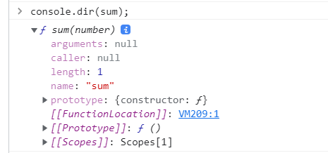
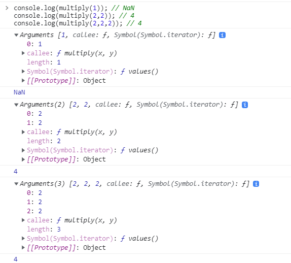

# 함수와 일급 객체

## 일급 객체

일급 객체는 다음과 같은 조건을 만족한다.
1. 무명의 리터럴로 생성할 수 있다. 즉, 런타임에 생성이 가능하다.
2. 변수나 자료구조(객체, 배열 등)에 저장할 수 있다.
3. 함수의 매개변수에 전달할 수 있다.
4. 함수의 반환값으로 사용할 수 있다.

자바스크립트 함수는 일급 객체다.

<pre>
<code>
// 1. 함수는 무명의 리터럴로 생성할 수 있다.
// 2. 함수는 변수에 저장할 수 있다.
// 런타임(할당 단계)에 함수 리터럴이 평가되어 함수 객체가 생성되고 변수에 할당된다.
const increase = function(num) {
    return ++num;
};

const decrease = function(num) {
    return --num;
};

// 2. 함수는 객체에 저장할 수 있다.
const predicates = { increase, decrease };

// 3. 함수의 매개변수에 전달할 수 있다.
// 4. 함수의 반환값으로 사용할 수 있다.
function makeCounter(predicates) {
    let num = 0;

    return function () {
        num = predicate(num);
        return num;
    };
}

// 3. 함수는 매개변수에 함수를 전달할 수 있다.
const increaser = makeCounter(predicates.increase);
console.log(increaser()); // 1
console.log(increaser()); // 2

const decreaser = makeCounter(predicates.decrease);
console.log(decreaser()); // -1
console.log(decreaser()); // -2
</code>
</pre>

함수가 일급 객체라는 것은 함수를 객체와 동일하게 사용할 수 있다는 의미다. 객체는 값이므로 함수는 값과 동일하게 취급할 수 있다. 따라서 함수는 값을 사용할 수 있는 곳(변수 할당문, 객체의 프로퍼티 값, 배열의 요소, 함수 호출의 인수, 함수 반환문)이라면 어디서든지 리터럴로 정의할 수 있으며 런타임에 함수 객체로 평가된다.

일급 객체로서 함수가 가지는 가장 큰 특징은 다음과 같다.
1. 일반 객체와 같이 함수의 매개변수에 전달할 수 있다.
2. 함수의 반환값으로 사용할 수도 있다.

위 특징은 함수형 프로그래밍을 가능하게 만드는 자바스크립트의 장점 중 하나다.

함수는 객체이지만 일반 객체와 구별되는 차이점이 있다.
일반 객체는 호출할 수 없지만 함수 객체는 호출할 수 있다. 그리고 함수 객체는 일반 객체에는 없는 함수 고유의 프로퍼티를 소유한다.

## 함수 객체의 프로퍼티

함수는 객체이기 때문에 프로퍼티를 가질 수 있다. 브라우저 콘솔에서 console.dir 메서드를 사용하여 함수 객체 내부를 살펴볼 수 있다.

<pre>
<code>
function sum(number){
    return number*number;
}
</code>
</pre>

위 코드와 같이 sum 메서드를 정의한 후 console.dir(sum) 명령어를 실행하면 아래와 같은 결과가 출력된다.

sum 함수의 모든 프로퍼티의 프로퍼티 어트리뷰트를 Object.getOwnPropertyDescriptors 메서드로 확인 해보면 다음과 같다.

<pre>
<code>
// __proto__는 num 함수의 프로퍼티가 아니다.
console.log(Object.getOwnPropertyDescriptor(sum, '__proto__')); // undefined

// __proto__는 Object.prototype 객체의 접근자 프로퍼티다.
// num 함수는 Object.prototype 객체로부터 __proto__ 접근자 프로퍼티를 상속받는다.
console.log(Object.getOwnPropertyDescriptor(Object.prototype, '__proto__')); // {enumerable: false, configurable: true, get: ƒ, set: ƒ}
</code>
</pre>

arguments, caller, length, name, prototype 프로퍼티는 모두 함수 객체의 데이터 프로퍼티다. 이 프로퍼티들은 일반 객체에는 없는 함수 객체 고유의 프로퍼티다. 하지만 __proto__는 접근자 프로퍼티이며, 함수 객체 고유의 프로퍼티가 아니라 Object.prototype 객체의 프로퍼티를 상속받은 것을 알 수 있다. Object.prototype 객체의 프로퍼티는 모든 객체가 상속받아 사용할 수 있다. Object.prototype 객체의 __proto__접근자 프로퍼티는 모든 객체가 사용할 수 있다. 

### arguments 프로퍼티

함수 객체의 arguments 프로퍼티 값은 arguments 객체다. arguments 객체는 함수 호출 시 전달된 인수(argument)들의 정보를 담고 있는 순회 가능한(iterable) 유사 배열 객체이며, 함수 내부에서 지역 변수처럼 사용된다. 즉 함수 외부에서는 참조할 수 없다.

자바스크립트는 함수의 매개변수와 인수의 개수가 일치하는지 확인하지 않는다. 따라서 호출 시 매개변수 개수만큼 인수를 전달하지 않아도 에러가 발생하지 않는다.

<pre>
<code>
function multiply(x, y) {
    console.log(arguments);
    return x * y;
}

console.log(multiply()); // NaN
console.log(multiply(1)); // NaN
console.log(multiply(2,2)); // 4
console.log(multiply(2,2,2)); // 4
</code>
</pre>

함수를 정의할 때 선언한 매개변수는 함수 몸체 내부에서 변수와 동일하게 취급된다. 즉 함수가 호출되면 함수 몸체 내에서 암묵적으로 매개변수가 선언되고 undefined로 초기화된 이후 인수가 할당된다. 

선언된 매개변수의 개수보다 인수를 적게 전달했을 경우 인수가 전달되지 않은 매개변수는 undefined로 초기화 상태를 유지한다. 매개변수의 개수보다 인수를 더 많이 전달한 경우 초과된 인수는 무시된다. 초과된 인수는 그냥 버려지지 않고 암묵적으로 arguments 객체의 프로퍼티로 보관된다. 

arguments 객체는 인수를 프로퍼티 값으로 소유하며 프로퍼티 키는 인수의 순서를 나타낸다. arguments 객체의 callee 프로퍼티는 호출되어 arguments 객체를 생성한 함수, 즉 함수 자신을 가리키고 arguments 객체의 length 프로퍼티는 인수의 개수를 가리킨다.

arguments 객체의 Symbol(Symbol.iterator) 프로퍼티는 arguments 객체를 순회 가능한 자료구조인 iterable로 만들기 위한 프로퍼티다. Symbol.iterator를 프로퍼티 키로 사용한 메서드를 구현하는 것에 의해 iterable이 된다.

선언된 매개변수의 개수와 함수를 호출할 때 전달하는 인수의 개수를 확인하지 않는 자바스크립트의 특성 때문에 함수가 호출되면 인수 개수를 확인하고 이에 따라 함수의 동작을 달리 정의할 필요가 있을 수 있다. 이 때 arguments 객체를 사용하면 유용하다.

arguments 객체는 매개변수 개수를 확정할 수 없는 **가변 인자 함수**를 구현할 때 유용하다.

<pre>
<code>
function sum() {
    let res = 0;

    // arguments 객체는 length 프로퍼티가 있는 유사 배열 객체이므로 for 문으로 순회할 수 있다.
    for(let i = 0; i<arguments.length; i++) {
        res += arguments[i];
    }
    return res;
}

console.log(sum());      // 0
console.log(sum(1,2));   // 3
console.log(sum(1,2,3)); // 6
</code>
</pre>

arguments 객체는 배열 형태로 인자 정보를 담고 있지만 실제 배열이 아닌 유사 배열 객체(array-like object)다. 유사 배열 객체란 length 프로퍼티를 가진 객체로 for문으로 순회할 수 있는 객체를 말한다.

유사 배열 객체는 배열이 아니므로 배열 메서드를 사용할 경우 에러가 발생한다. 따라서 배열 메서드를 사용하려면 Function.prototype.call, Function.prototype.apply를 사용해 간접 호출해야 하는 번거로움이 있다. 

### length 프로퍼티

length 프로퍼티는 함수를 정의할 때 선언한 매개변수의 개수를 가리킨다.

<pre>
<code>
function foo() {}
console.log(foo.length); // 0

function apple(x) {
    return x;
}
console.log(apple.length); // 1

function milk(x, y) {
    return x + y;
}
console.log(milk.length); // 2
</code>
</pre>

arguments 객체의 length 프로퍼티와 함수 객체의 length 프로퍼티의 값은 다를 수 있다. arguments 객체의 length 프로퍼티는 인자(argument)의 개수를 가리키고, 함수 객체의 length 프로퍼티는 매개변수(parameter)의 개수를 가리킨다.

### __proto__ 프로퍼티
모든 객체는 [[Prototype]]이라는 내부 슬롯을 갖는다. [[Prototype]] 내부 슬롯은 객체지향 프로그래밍의 상속을 구현하는 프로토타입 객체를 가리킨다. 
__proto__프로퍼티는 [[Prototype]] 내부 슬롯이 가리키는 프로토타입 객체에 접근하기 위해 사용하는 접근자 프로퍼티다. 내부 슬롯에는 직접 접근할 수 없고 간접적인 접근 방법을 제공하는 경우에 한하여 접근할 수 있다. [[Prototype]] 내부 슬롯에도 직접 접근할 수 없으며 __proto__접근자 프로퍼티를 통해 간접적으로 프로토타입 객체에 접근할 수 있다.

<pre>
<code>
const obj = { a: 1 };

// 객체 리터럴 방식으로 생성한 객체의 프로토타입 객체는 Object.prototype이다.
console.log(obj.__proto__ === Object.prototype); // true

// 객체 리터럴 방식으로 생성한 객체는 프로토타입 객체인 Object.prototype의 프로퍼티를 상속받는다.
// hasOwnProperty 메서드는 object.prototype의 메서드다.
console.log(obj.hasOwnProperty('a')); // true
console.log(obj.hasOwnProperty('__proto__')); // false
</code>
</pre>

hasOwnProperty 메서드는 인수로 전달받은 프로퍼티 키가 객체 고유의 프로퍼티 키인 경우에만 true를 반환한다. 상속받은 프로토타입의 프로퍼티 키인 경우 false를 반환한다.

### prototype 프로퍼티
prototype 프로퍼티는 생성자 함수로 호출할 수 있는 함수 객체, 즉 constructor만이 소유하는 프로퍼티다. 일반 객체와 생성자 함수로 호출할 수 없는 non-constructor에는 prototype 프로퍼티가 없다.

<pre>
<code>
// 함수 객체는 prototype 프로퍼티를 소유한다.
(function () {}).hasOwnProperty('prototype'); // true

// 일반 객체는 prototype 프로퍼티를 소유하지 않는다.
({}).hasOwnProperty('prototype'); // false
</code>
</pre>

prototype 프로퍼티는 함수가 객체를 생성하는 생성자 함수로 호출될 때 생성자 함수가 생성할 인스턴스의 프로토타입 객체를 가리킨다.

# 출처
* [모던 자바스크립트 Deep Dive](http://www.kyobobook.co.kr/product/detailViewKor.laf?ejkGb=KOR&mallGb=KOR&barcode=9791158392239&orderClick=LEA&Kc=)