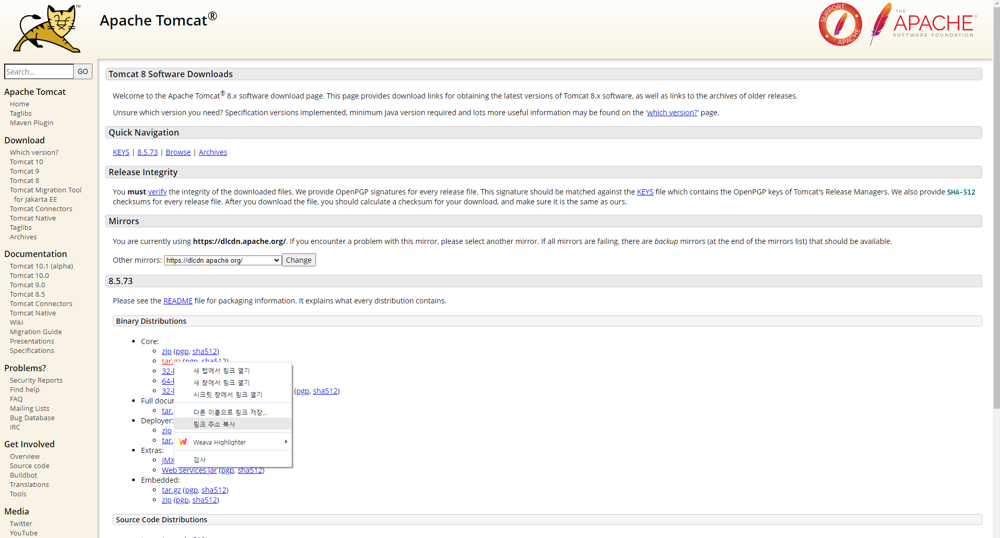
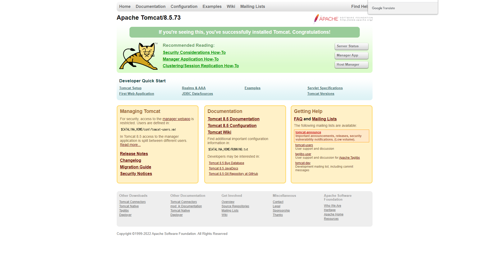

# Ubuntu 톰캣 설치

*Ubuntu 18.04.6 LTS 버전 기준으로 작성되었습니다.*

## 톰캣 다운로드

다운로드 링크 주소를 가지고 터미널 안에서 톰캣 설치를 진행할 것이다.  
[Apache Tomcat](https://tomcat.apache.org/) 사이트로 이동해서 원하는 버전의 톰캣 다운로드 링크 주소를 복사한다. **tar.gz** 파일의 다운로드 링크 주소를 복사한다.  



이후 다음 명령어를 실행한다.
```
wget [링크 주소]
```

[wget](http://www.incodom.kr/Linux/%EA%B8%B0%EB%B3%B8%EB%AA%85%EB%A0%B9%EC%96%B4/wget)은 **Web Get**의 약어로 웹 상의 파일을 다운로드 할 때 사용된다.  

## 파일 압축해제

**.gz** 확장자 파일의 압축을 해제하기 위해 **gunzip** 명령어를 사용한다.

```
gunzip https://dlcdn.apache.org/tomcat/tomcat-8/v8.5.73/bin/apache-tomcat-8.5.73.tar.gz
```

압축을 해제하면 apache-tomcat-8.5.73.tar.gz 이 apache-tomcat-8.5.73.tar 로 압축이 해제된다.  
이제 **.tar** 확장자 파일의 압축을 해제하기 위해 **tar** 명령어를 사용한다.

```
tar -xvf apache-tomcat-8.5.73.tar
```

[tar 명령어의 다양한 옵션](https://recipes4dev.tistory.com/146)이 있는데, 요구사항에 맞게 사용한다.  

압축을 해제하면 apache-tomcat-8.5.73 로 완전히 압축이 해제된다.  

## 심볼릭 링크 설정

톰캣을 실행하려면 apache-tomcat-8.5.73 폴더의 bin 폴더 내에 있는 **startup.sh** 파일을 실행해야 한다.  
복수의 폴더를 이동해야 하므로 작업 효율성이 떨어진다. 심볼릭 링크 설정을 통해 간편하게 원하는 폴더 및 파일에 접근할 수 있도록 한다.  

```
ln -s apache-tomcat-8.5.73/ tomcat
```

**tomcat** 이라는 이름으로 **apache-tomcat-8.5.73/** 경로에 접근할 수 있도록 설정했다. 설정 후 파일 리스트를 조회하면 아래와 같이 표시된다.  

```
tomcat -> apache-tomcat-8.5.73/
```

## 톰캣 PATH 설정

본인은 PATH 설정을 홈 디렉토리(**~**)의 **.bash_profile** 파일 내부에 했다.  
톰캣 PATH를 설정한 .bash_profile 파일 내부는 아래와 같다.  
이전에 설치 및 설정한 java와 maven PATH 설정도 포함되어 있다.

```
LANG="ko_KR.UTF-8"
LANGUAGE="ko_KR:ko:en_US:en"

export JAVA_HOME=~/java
export MAVEN_HOME=~/maven
export TOMCAT_HOME=~/tomcat
export PATH="$PATH:$JAVA_HOME/bin:$MAVEN_HOME/bin:$TOMCAT_HOME/bin"
```

.bash_profile 파일 작성 완료 후 아래 명령어를 통해 변경 내용을 적용하자.  

```
source .bash_profile
```

**env** 명령어를 통해 톰캣 PATH가 올바르게 적용 되었는지 확인한다. 
그냥 **env** 만 치면 된다.

```
env
```

여러 내용 중 PATH의 내용을 보면 맨 끝에 톰캣 PATH가 .bash_profile 파일의 내용과 동일하게 적용된 것을 확인할 수 있다. 이제 /bin 폴더까지 이동하지 않아도 홈 디렉토리에서 톰캣을 실행/종료 할 수 있다.

```
PATH=/usr/local/sbin:/usr/local/bin:/usr/sbin:/usr/bin:/sbin:/bin:/usr/games:/usr/local/games:/snap/bin:/home/ubuntu/java/bin:/home/ubuntu/java/bin:/home/ubuntu/maven/bin:/home/ubuntu/java/bin:/home/ubuntu/maven/bin:/home/ubuntu/tomcat/bin
```
## 톰캣 실행

톰캣 실행은 **startup.sh** 파일을 실행하면 된다.

```
startup.sh
```

**톰캣 폴더/bin** 내부에 startup.sh 파일이 있다. 참고하자.  

압축이 풀린 폴더 안의 bin 폴더 안에 있는 startup.sh를 실행하면 톰캣이 실행된다.  
같은 폴더 내의 shutdown.sh를 실행하면 톰캣이 종료된다.  
톰캣을 실행하면 아래와 같은 메시지가 출력되면서 성공적으로 실행 되었음을 알린다.  

```
Using CATALINA_BASE:   /home/ubuntu/tomcat
Using CATALINA_HOME:   /home/ubuntu/tomcat
Using CATALINA_TMPDIR: /home/ubuntu/tomcat/temp
Using JRE_HOME:        /home/ubuntu/java
Using CLASSPATH:       /home/ubuntu/tomcat/bin/bootstrap.jar:/home/ubuntu/tomcat/bin/tomcat-juli.jar
Using CATALINA_OPTS:
Tomcat started.
```

톰캣의 로그를 확인하고 싶다면 **톰캣 폴더/logs** 폴더에 위치한 **catalina.out** 파일을 실행하면 된다.  
tail 명령어를 통해 로그를 확인할 수 있다.

```
tail -f catalina.out
```

명령어를 실행하면 8080 포트로 톰캣이 실행 되었다고 알려준다.  

```
18-Jan-2022 14:50:25.814 INFO [localhost-startStop-1] org.apache.catalina.startup.HostConfig.deployDirectory 웹 애플리케이션 디렉토리 [/home/ubuntu/apache-tomcat-8.5.73/webapps/manager]을(를) 배치합니다.
18-Jan-2022 14:50:25.904 INFO [localhost-startStop-1] org.apache.catalina.startup.HostConfig.deployDirectory 웹 애플리케이션 디렉토리 [/home/ubuntu/apache-tomcat-8.5.73/webapps/manager]에 대한 배치가 [89] 밀리초에 완료되었습니다.
18-Jan-2022 14:50:25.904 INFO [localhost-startStop-1] org.apache.catalina.startup.HostConfig.deployDirectory 웹 애플리케이션 디렉토리 [/home/ubuntu/apache-tomcat-8.5.73/webapps/docs]을(를) 배치합니다.
18-Jan-2022 14:50:25.945 INFO [localhost-startStop-1] org.apache.catalina.startup.HostConfig.deployDirectory 웹 애플리케이션 디렉토리 [/home/ubuntu/apache-tomcat-8.5.73/webapps/docs]에 대한 배치가 [41] 밀리초에 완료되었습니다.
18-Jan-2022 14:50:25.946 INFO [localhost-startStop-1] org.apache.catalina.startup.HostConfig.deployDirectory 웹 애플리케이션 디렉토리 [/home/ubuntu/apache-tomcat-8.5.73/webapps/host-manager]을(를) 배치합니다.
18-Jan-2022 14:50:25.989 INFO [localhost-startStop-1] org.apache.catalina.startup.HostConfig.deployDirectory 웹 애플리케이션 디렉토리 [/home/ubuntu/apache-tomcat-8.5.73/webapps/host-manager]에 대한 배치가 [43] 밀리초에 완료되었습니다.
18-Jan-2022 14:50:25.990 INFO [localhost-startStop-1] org.apache.catalina.startup.HostConfig.deployDirectory 웹 애플리케이션 디렉토리 [/home/ubuntu/apache-tomcat-8.5.73/webapps/examples]을(를) 배치합니다.
18-Jan-2022 14:50:26.507 INFO [localhost-startStop-1] org.apache.catalina.startup.HostConfig.deployDirectory 웹 애플리케이션 디렉토리 [/home/ubuntu/apache-tomcat-8.5.73/webapps/examples]에 대한 배치가 [514] 밀리초에 완료되었습니다.
18-Jan-2022 14:50:26.512 INFO [main] org.apache.coyote.AbstractProtocol.start 프로토콜 핸들러 ["http-nio-8080"]을(를) 시작합니다.
18-Jan-2022 14:50:26.532 INFO [main] org.apache.catalina.startup.Catalina.start Server startup in 1444 ms
```

## 브라우저에서 톰캣 연결 확인

브라우저에서 톰캣 실행을 확인하려면 **서버 ip 주소:톰캣 포트 번호**로 확인이 가능하다.
본인은 AWS EC2 인스턴스 생성 후 Ubuntu 연결을 했다. 따라서 ip 번호가 다소 길다. 호스트 이름 등록을 통해 ip 주소 작성을 대체할 수 있다고 하던데, 어떻게 하는지 잘 모르겠다. 방법을 찾게 된다면 업로드 하겠다.  

브라우저에서 톰캣 연결이 정상적으로 되면 아래와 같은 페이지를 볼 수 있다.



# 참고
* [Tomcat 서버 설치 및 설정](https://www.youtube.com/watch?v=ZsiO27LeW34)