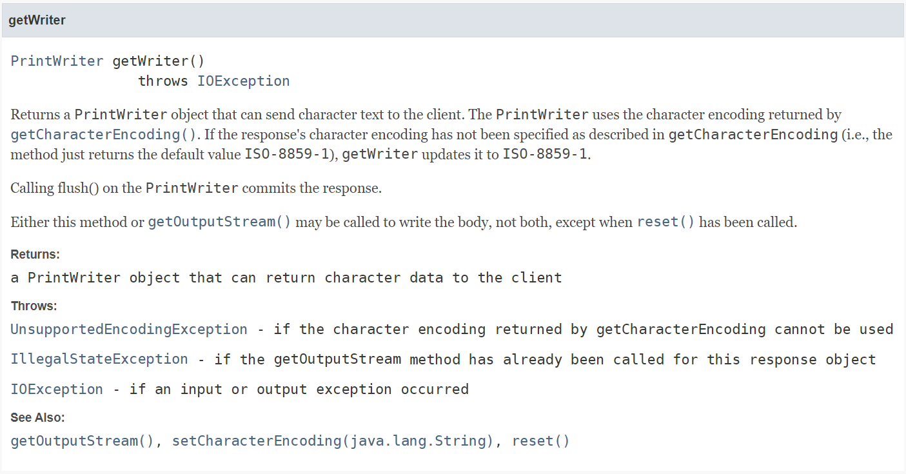

# PrintWriter out = response.getWriter(); 의 동작 원리

클라이언트로부터 Servlet으로 요청이 들어오면 요청(Request)을 파악한 후 응답(Response)을 전달한다.  
Servlet으로 들어온 요청은 대체로 텍스트(HTML) 형태로 응답을 보낸다. 따라서 아래와 같이 응답으로 내보낼 출력 스트림을 얻어내야 한다. 

```
	@Override
	protected void doGet(HttpServletRequest req, HttpServletResponse resp) throws ServletException, IOException {
		PrintWriter out = resp.getWriter();
		out.print("<html><head><title>Test</title></head>");
		out.print("<body><h1>have a nice day</h1></body>");
		out.print("</html>");
		out.close();
		
	}
```

우리는 여기서 아래 코드에 주목해야 한다.  

```
PrintWriter out = resp.getWriter();
```

위 코드는 HttpServletResponse 인터페이스의 상위 인터페이스인 ServletResponse의 getWriter() 메소드를 호출하고 있다. getWriter() 메소드는 java.io의 PrintWriter 클래스를 리턴타입으로 한다.



PrintWriter 클래스는 간단한 설명하자면, 바이트를 문자 형태를 가지는 객체로 바꿔준다. 클라이언트에게 문자 형태로 응답을 하고 싶기 때문에 out 이라는 PrintWriter 클래스 객체를 정의하고 getWriter() 메소드를 통해 인스턴스를 얻었다.

getWriter() 메소드를 통해 응답으로 내보낼 출력 스트림을 얻어낸 후 **out.print(HTML 태그)** 형태로 작성하여 스트림에 텍스트를 기록한다.  

코드의 마지막에 보면 **out.close()** 를 통해 스트림을 닫았다. 여기서 유의할 점은, close() 메소드를 통해 한 번 닫힌 스트림을 다시 사용할 수 없다. 스트림을 비우고 필요 시 계속 사용할 수 있는 flush() 메소드와의 차이점이 여기에 있다.  

close()를 호출하는 이유는, 작업을 종료하고 스트림을 닫아 종료된 작업에 대한 메모리를 확보하기 위함이다.  

## 요약
- Servlet에서 클라이언트의 요청(Request)에 대한 응답(Response) 형태는 문자(character) 또는 바이트(byte)가 될 수 있다.
- 클라이언트의 요청에 문자 형태로 응답하려면 데이터의 흐름(Stream)을 컨트롤 해야 한다. 즉 텍스트(==문자) 형태로 응답을 보내도록 설정해야 한다.
-  HttpServletResponse 인터페이스의 상위 인터페이스인 ServletResponse의 getWriter() 메소드를 호출하면 스트림에 텍스트를 기록하는 것이 가능하다.

# 참고
* [PrintWriter out = response.getWriter();](https://m.blog.naver.com/PostView.naver?isHttpsRedirect=true&blogId=min_sub&logNo=80069919296)
* [What is PrintWriter out = response.getWriter() in a Servlet?](https://stackoverflow.com/questions/25780467/what-is-printwriter-out-response-getwriter-in-a-servlet)
* [PrintWriter close() method in Java with Examples](https://www.geeksforgeeks.org/printwriter-close-method-in-java-with-examples/)


