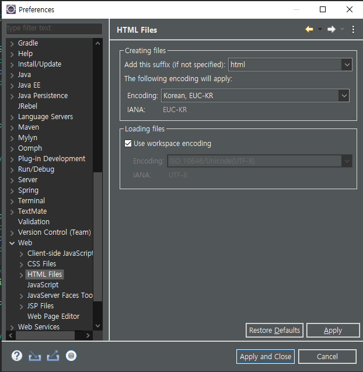

# Servlet 한글 처리

Servlet 사용 시 한글 깨짐 현상을 처리하는 방법은 POST, GET 메소드에 따라 다르다.  
그 이유는 POST 방식은 요청정보(Request) 몸체(body)에 값(value)이 전달되고, GET 방식은 요청정보 헤더의 URI에 값이 포함되어 전달되기 때문이다.  

## POST 한글 처리

아래 코드는 HTML 문서에서 form 태그로 post 메소드를 통해 submit한 결과를 처리하기 위해 작성되었다.  
여기서 집중해야 할 부분은 다음과 같다.

- **resp.setContentType("text/html;charset=UTF-8");**
- **req.setCharacterEncoding("UTF-8");**

```
public class PostServlet extends HttpServlet {

	@Override
	protected void doPost(HttpServletRequest req, HttpServletResponse resp) throws ServletException, IOException {

		resp.setContentType("text/html;charset=UTF-8");

		PrintWriter out = resp.getWriter();

		req.setCharacterEncoding("UTF-8");
		
		String name = req.getParameter("name");
		out.print("name : " + name + "<br/>");
		out.close();
	}
}

```

- **resp.setContentType("text/html;charset=UTF-8");**  

서버에서 클라이언트로 보내는 응답에 관한 기능을 처리한다. 서버에서 보내는 문서의 타입과 보내는 문자들을 처리할 문자코드를 지정한다.  
세미콜론(**;**)을 기준으로 왼쪽에는 문서의 타입, 오른쪽에는 charset= 다음에 문자셋을 지정한다.  
클라이언트는 설정 정보를 받고 데이터를 설정 정보에 맞게 처리한다.  

```
void setContentType(String type)

Sets the content type of the response being sent tothe client, if the response has not been committed yet.The given content type may include a character encodingspecification, for example, text/html;charset=UTF-8.The response's character encoding is only set from the givencontent type if this method is called before getWriteris called. 
This method may be called repeatedly to change content type andcharacter encoding.This method has no effect if called after the responsehas been committed. It does not set the response's characterencoding if it is called after getWriterhas been called or after the response has been committed. 

Containers must communicate the content type and the characterencoding used for the servlet response's writer to the client ifthe protocol provides a way for doing so. In the case of HTTP,the Content-Type header is used.

Parameters:type - a String specifying the MIMEtype of the content
```

- **req.setCharacterEncoding("UTF-8");**

클라이언트가 보낸 정보를 서버 쪽에서 처리할 때 사용한다. 클라이언트가 보낸 요청정보의 몸체에 있는 문자열들을 설정값에 맞게 인코딩 처리한다.  
POST 방식으로 요청정보 몸체에 전달된 질의 문자열들이 이 메소드를 만나면 내부적으로 인코딩 처리가 되기 때문에 개발자는 이 메소드를 이용해 쉽게 요청정보 몸체의 데이터를 원하는 문자셋으로 인코딩할 수 있다.

```
void setCharacterEncoding(String env)
                   throws UnsupportedEncodingException

Overrides the name of the character encoding used in the body of thisrequest. This method must be called prior to reading request parametersor reading input using getReader(). Otherwise, it has no effect.

Parameters:env - String containing the name ofthe character encoding.
```

## GET 한글 처리

GET 방식은 질의 문자열이 요청정보 헤더의 URI에 포함되어 전달되기 때문에 POST 방식처럼 문자를 처리할 수 없다. 따라서 URI에 대한 인코딩 처리 작업이 필요하다.  
URI 인코딩 처리 작업을 위해 다음 두 가지 확인 작업이 필요하다.

- 클라이언트가 입력하는 질의 문자열의 인코딩 문자코드
- 서버에서 URI를 인코딩하는 문자코드

### 클라이언트가 입력하는 질의 문자열의 인코딩 문자코드

클라이언트가 입력한 문자열 인코딩 처리 방법은 두 가지가 있다.

- 소스에서 직접 인코딩 문자코드 지정
- IDE에서 인코딩 문자를 지정

소스에서 직접 인코딩 문자코드를 지정하는 것은 아래 html 문서와 같이 < meta charset="UTF-8"> 태그처럼 사용하고자 하는 문자코드를 지정하는 것이다.

```
<!DOCTYPE html>
<html>
<head>
<meta charset="UTF-8">
<title>Insert title here</title>
</head>
<body>
	
</body>
</html>
```

IDE에서 인코딩 문자코드를 지정하는 것은, 이클립스(ecliipse) 기준으로 설명하자면, **[Window]-[Preferences]-[Web]-[HTML Files]** 로 이동하여 **Encoding** 에 원하는 문자코드를 지정할 수 있다.  
CSS, JSP 파일 등도 동일한 방법으로 원하는 문자코드를 지정할 수 있다.



### 서버에서 URI를 인코딩하는 문자코드

클라이언트로부터 전달된 URI 문자열의 인코딩 작업은 서버에서 처리한다.  
서버마다 기본적으로 URI의 인코딩 문자코드가 정해져 있다. Tomcat v8 이상에서는 UTF-8 문자코드가 기본값으로 적용되어 있다. 설정 내용은 server.xml 파일에서 확인할 수 있다.

# 참고
* [처음 해보는 Servlet & JSP 웹 프로그래밍](http://www.yes24.com/Product/Goods/37235901)
