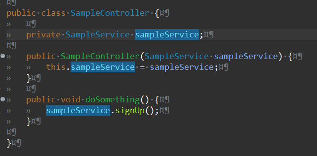
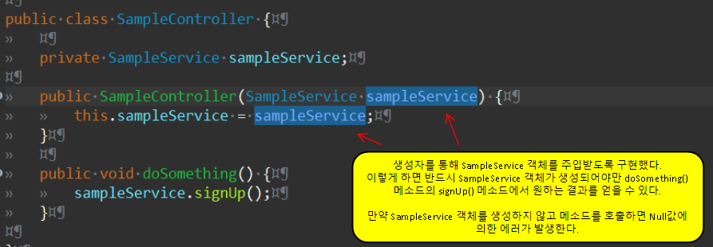

# 제어의 역전 그리고 의존성 주입

## 제어의 역전(Inversion of Control)

- 제어의 역전은 객체 제어의 주체가 객체를 사용하는 클래스 자신이 아닌 외부에 있다는 의미이다. 

- 필요한 객체를 클래스 내부에서 직접 생성하지 않고 외부에서 주입받는 형태를 가진다.

제어의 역전을 구현하는 방법인 의존성 주입(Dependency Injection)에 대해서 알아보자. 

```
// 1번 코드_제어의 역전 X
public clss UserController {
    // 클래스 내부에서 객체 생성!
    private UserService userService = new UserService();
}

// 2번 코드_제어의 역전 O
public clss UserController {
    // 인스턴스 필드만 선언!
    private UserService userService;

    // 생성자를 통해 외부에서 UserService 객체를 받을 수 있도록 구현!
    public UserController(UserService userService) {
        this.userService = userService;
    }
}
```

먼저 1번 코드를 살펴보자.  
**private UserService userService = new UserService();** 형태로 UserController 클래스 내부에 UserService 인스턴스를 생성하는 방식은 UserController 자신이 필요한 객체를 직접 생성하는 방식이다.  

2번 코드를 살펴보자.  
UserService 객체를 사용하기 위해 인스턴스 필드로 선언했지만, 인스턴스를 직접 생성하지는 않았다. 그리고 클래스 생성자를 선언해서 **외부에서 UserController 클래스로 UserService 클래스 객체를 주입할 수 있는 형태**를 만들었다. 객체 생성의 제어권이 자신이 아닌 외부로 역전(Inversion) 되었다. 

## 조금 더 자세히 알아보자

SampleController 클래스에 SampleService 클래스를 주입하는 상황을 구현해보자. 추가로 SampleService 클래스의 signUp() 메소드를 호출하도록 했다.





SampleController 클래스의 doSomething() 메소드를 테스트 해보자.  
doSomething() 메소드는 SampleService 클래스의 signUp() 메소드를 호출하기 때문에 반드시 SampleService 객체가 필요하다. 그리고 SampleService 객체 생성은 내부가 아닌 외부에서 생성한 것을 받을 수 있도록 구현되었다.  

SampelController의 테스트 코드를 살펴보자.  
테스트를 위해 SampleController 클래스의 doSomething() 메소드를 호출하려면 가장 먼저 SampleController의 생성자를 호출해야 한다. 그런데 SampleController를 호출할 때 SampleService 객체를 주입받도록 설정했다. 그래서 SampleService 객체를 먼저 생성한 다음, 생성한 SampleService 객체를 SampleController 생성 시 주입해야 한다. 만약 SampleService 객체를 주입하지 않으면 doSomething() 메소드 호출 시 에러가 발생한다. doSomething() 메소드 호출 내용은 SampleService 클래스를 의존하고 있기 때문이다.

```
public class SampleControllerTest {

	@Test
	public void test() {
		SampleService sampleService = new SampleService();
		SampleController sampleController = new SampleController(sampleService);
		sampleController.doSomething();
	}

}
```

위 테스트 코드처럼 자바 코드를 통해 의존성 주입을 통한 제어의 역전을 구현할 수 있다. 

## 스프링 프레임워크 환경에서의 의존성 주입

스프링 프레임워크를 사용하면 좀 더 편하게 의존성 주입을 할 수 있다. 스프링 프레임워크는 스프링 컨테이너라는 공간에서 객체를 관리한다. 

스프링에서는 컨테이너에서 객체의 생성, 설정, 조립을 담당한다. 그리고 스프링에서는 객체를 빈(Bean) 이라고 부른다. 컨테이너는 등록된 빈을 가지고 의존성 주입을 한다. 즉 스프링 환경에서는 컨테이너에 빈을 등록 해야만 의존성 주입이 가능하다는 것이다.   

그리고 스프링 컨테이너에 의해 관리되는 빈은 싱글톤 객체이다. 하나의 객체만 생성된다는 의미이다. 다음 코드를 살펴보자.

```
@Configuration
public class SampleConfig {

    @Bean
    public A a() {
        return new A();
    }

    @Bean
    public B b() {
        return new B(a());
    }

    @Bean
    public C c() {
        return new C(a());
    }
}
```

메소드 b(), c()에서 호출되어 생성되는 A 객체는 동일한 객체이다. 서로 다른 객체가 아니다.  
@Bean 어노테이션이 붙은 메소드는 한 개의 객체만 생성한다. 그래서 a() 메소드를 몇 번이나 호출해도 동일한 객체를 리턴한다. 스프링 설정에 따라 한 번 생성한 객체를 보관했다가 동일한 객체가 필요하면 보관하고 있는 객체를 리턴하는 방식을 따른다.

- @Bean : 스프링 컨테이너에 의해 관리되는 빈으로 등록한다.
- @Configuration : 이 클래스는 빈 등록 클래스라는 것을 명시하는 어노테이션.

## @Autowired를 이용한 빈 자동 주입

생성자, 필드, 메소드 등에 @Autowired 어노테이션을 붙이면 해당 타입의 빈에 의존하는 곳에 자동으로 주입한다.  
주의할 점은, @Autowired 어노테이션이 붙은 생성자, 필드, 메소드가 먼저 빈으로 등록되어 있는지 아닌지의 여부를 확인해야 한다. 만약 빈으로 등록되지 않은 곳에 @Autowired 어노테이션을 붙이고 애플리케이션을 실행하면 아래와 같은 에러 메시지가 출력된다.

```
No qualifying bean of type '[@Autowired 어노테이션이 붙은 곳]' available: expected at least 1 bean which qualifies as autowire candidate.
```

코드를 통해 @Autowired 코드의 사용을 알아보자. 
예제는 [초보 개발자를 위한 스프링5 프로그래밍 입문](http://www.kyobobook.co.kr/product/detailViewKor.laf?mallGb=KOR&ejkGb=KOR&barcode=9788980782970) 서적의 예제를 참고했다.  

AppConf1 클래스에 MemberDao, MemberPrinter 객체를 리턴하는 메소드를 빈으로 등록한다. 이렇게 먼저 @Autowired로 자동 주입하려는 타입의 빈이 등록되어 있어야 @Autowired를 통한 빈 자동 주입이 가능하다.

```
@Configuration
public class AppConf1 {

	@Bean
	public MemberDao memberDao() {
		return new MemberDao();
	}
	
	@Bean
	public MemberPrinter memberPrinter() {
		return new MemberPrinter();
	}
	
}

@Configuration
public class AppConf2 {

	@Autowired // AppConf1 클래스에 해당 타입의 빈이 등록 되었기 때문에 @Autowired로 자동 주입 기능 사용 가능.
	private MemberDao memberDao;
	@Autowired // AppConf1 클래스에 해당 타입의 빈이 등록 되었기 때문에 @Autowired로 자동 주입 기능 사용 가능.
	private MemberPrinter memberPrinter;
	
	@Bean
	public MemberRegisterService memberRegSvc() {
		return new MemberRegisterService(memberDao);
	}
	
	@Bean
	public ChangePasswordService changePwdSvc() {
		ChangePasswordService pwdSvc = new ChangePasswordService();

        // 수정자 주입을 하지 않아도 스프링 컨테이너가 @Autowired 어노테이션이 설정된 타입의 빈을 의존하는 곳을 찾아서 자동으로 주입해준다.
        // 따라서 이 코드는 생략 가능.
		pwdSvc.setMemberDao(memberDao); 

		return pwdSvc;
	}
```

@Autowired 어노테이션이 붙은 필드나 메소드와 타입이 일치하는 빈을 스프링 컨테이너에서 찾아서 자동으로 의존을 주입한다.

# 참고
* [예제로 배우는 스프링 입문](https://www.youtube.com/watch?v=HACQV_koAIU&list=PLfI752FpVCS8_5t29DWnsrL9NudvKDAKY&index=1)
* [초보 웹 개발자를 위한 스프링5 프로그래밍 입문](http://www.kyobobook.co.kr/product/detailViewKor.laf?mallGb=KOR&ejkGb=KOR&barcode=9788980782970)