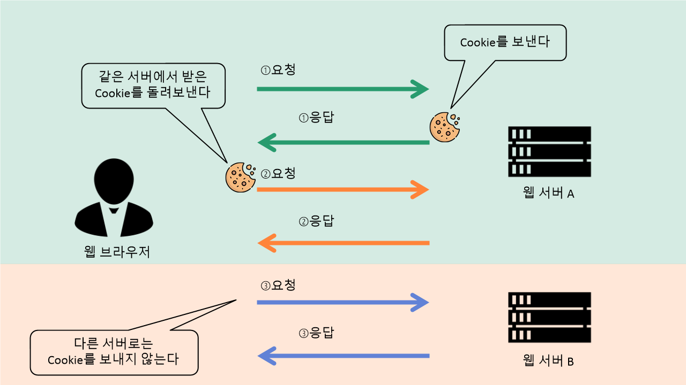
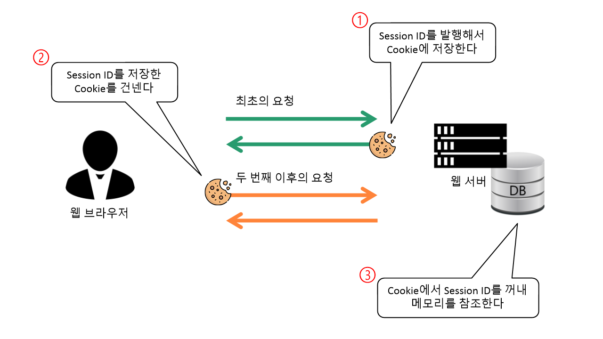

# Cookie 그리고 Session

## HTTP와 FTP

웹 애플리케이션 통신에 사용되는 HTTP는 무상태(Stateless), 상태를 가질 수 없는 특징을 가지고 있다. 상태를 유지하는(Stateful) FTP와는 상반된다.  

HTTP와 FTP의 차이점은 일반 양장점과 맞춤 양장점의 차이점과 비슷하다.  

HTTP는 일반 양장점이다. 같은 손님이 두 번 세 번 방문해도 점원은 손님에게 "어떤 스타일을 찾으십니까?" 라는 질문을 할 것이다. 즉 무상태다.  

FTP는 맞춤 양장점이다. 찾아온 손님의 정보를 기록해 놓기 때문에 어떤 스타일을 좋아하는지 파악하고 있다. 따라서 손님이 "지난번과 비슷한 것으로 부탁합니다." 라고 해도 충분히 알아들을 것이다. 이전의 요청에 입각해 대응하기 때문이다. 즉 상태 유지다. 

## HTTP의 등장배경

HTTP 등장 이전에 파일 전송용 프로토콜로 FTP가 있었다. 그런데 FTP를 계속 사용하지 않고 HTTP가 새롭게 고안된 이유가 있었다. 그것은 FTP는 통신 절차가 많아서 오버헤드(최초로 접속한 뒤의 인증 처리와 전송 방법 지정, 데이터 전송용 연결 확립 등)가 크고, 접속을 위해서는 인증이 필요하다.  

따라서 익명 서버가 아닌 한 접속처의 서버 관리자에게 의뢰해 계정을 발급받아야 한다. 이 때문에 인증이 필요 없고 오버헤드가 적으며 탑재도 간단한 FTP를 대신할 프로토콜이 필요했고, 통신 절차가 간단한 무상태 프로토콜로서 HTTP가 등장했다. 

*HTTP에서는 접속한 다음 바로 GET 요청을 보내 필요한 파일을 즉시 응답으로 받을 수 있다. 따라서 FTP에 비해 오버헤드가 적다고 할 수 있다.*

## Cookie의 등장

HTTP와 같은 무상태 특성을 가지는 프로토콜로 로그인과 같은 인증이 필요한 웹 애플리케이션을 어떻게 구현할 수 있을까?  

단순하게 GET 요청의 매개변수로 로그인 상태를 전달할 수 있을 것이다.  

```
http://localhost:8080/product_list.jsp?login=ok
```

이렇게 하면 전달하는 login 매개변수를 조사해 ok인지 아닌지 구분하면 되므로 간단하다.  
그런데 이 방법은 URL 뒤에 ?login=ok만 추가하면 쉽게 인증 절차를 통과할 수 있고, 매개변수가 URL에 포함되기 때문에 외부에 쉽게 노출된다.  

그렇다면 POST 방식으로 아이디, 비밀번호를 매번 전송하고 애플리케이션 측에서 확인하는 방법이 좋을 수 있겠다. POST 방식은 매개변수가 URL이 아니라 메시지 바디를 통해 전달되기 때문에 GET 방식 보다는 안전해 보인다.  

하지만 POST 요청을 전달하려면 form을 이용해야 하므로 이동 전의 페이지에 반드시  form을 포함시켜야 하기 때문에 조금 번거롭다.  

그래서 고안된 것이 Cookie 기술이다. Cookie는 HTTP의 규격을 확장해 웹 애플리케이션과 웹 브라우저 사이에서 정보를 교환할 수 있게 한 것이다. 

## Cookie

웹 서버에서 웹 브라우저로 HTTP 응답의 헤더를 이용해서 Cookie 정보를 보낸다. Cookie 정보는 이름=값 구조를 가진다.  

웹 서버로부터 쿠키를 받은 웹 브라우저는 다음번에 같은 웹 서버에 접속할 때 전에 받았던 Cookie를 그대로 HTTP 요청 헤더에 넣어 보낸다.  

웹 애플리케이션 측에서는 요청 헤더에 들어 있는 Cookie를 조사해 접속한 상대가 어떤 상대인지 알 수 있다.  

Cookie를 받은 뒤에도 Cookie를 받은 서버와 다른 웹 서버에는 Cookie를 보내지 않는다. 이러한 구조를 통해 의도하지 않은 정보가 다른 웹 서버에 보내지는 것을 막는다.  

## Cookie 생성 과정



- 웹 브라우저가 처음 웹 서버와 연결되었을 때는(처음 특정 사이트에 방문하면) Cookie가 없다.

- 웹 브라우저와 웹 서버가 (페이지 호출과 같은)상호작용을 시작하면 웹 서버는 응답 시 헤더(header)에 Set-Cookie 라는 이름으로 Cookie를 정의한다.

- Cookie에 어떤 정보를 담느냐는 애플리케이션이 자유롭게 결정할 수 있다.  

- 웹 서버에서 보내진 Cookie는 브라우저가 읽어들여 클라이언트 PC상에 보관된다.  

- (웹 서버에서 받은 Cookie가 클라이언트 PC에 저장된)이후 웹 브라우저가 같은 도메인에 요청을 보낼 때 요청 헤더에 **Cookie: 이름=값** 형태로 웹 서버로 전송된다.

- 웹 서버로 다시 전송된 Cookie는 웹 애플리케이션에서 확인한다. 여기서 확인한다의 의미는, 웹 브라우저에게 전달받은 Cookie값으로 유효한(valid) 사용자인지 판단하여 웹 브라우저가 요청한 내용을 처리하는 과정을 말한다.

## Cookie에 관한 기타 정보

- 도메인(웹 서버) 하나에 대해 보존할 수 있는 Cookie의 수는 20개까지이다.  

- Cookie 하나는 이름과 값을 합쳐서 4KB까지이다.  

- 클라이언트에 보존할 수 있는 Cookie의 수는 전체 300개까지이다.

- 만약 로그아웃과 같이 Cookie를 삭제해야 하는 경우가 있다면, 유효기간(expires 속성)을 조정해서 Cookie를 종료시킨다. 

## Cookie의 문제점

Cookie는 보안상의 문제가 있다. Cookie를 이용해 정보를 주고받을 때는 HTTP의 요청 헤더나 응답 헤더를 이용한다. 관련 지식이 있는 사람이라면 Cookie 내용을 엿볼 수 있다. 본인의 아이디, 패스워드와 같은 개인정보를 Cookie에 보관하는 방법은 보안상 큰 문제가 된다. 이에 따라 좀 더 안전하게 많은 정보를 보존하는 방법으로 고안된 것이 Session이다.


## Session

인터넷 쇼핑몰이 있다. 클라이언트는 쇼핑몰에서 물건을 구매하기 위해 쇼핑몰에 접속해서 물건을 보고, 장바구니에 담고, 결제를 완료한다. 이와 같이 일정 시간동안 클라이언트-웹 서버간에 일어나는 일련의 처리 흐름을 Session이라고 한다.  

일정 시간이라는 말의 의미는, 클라이언트가 웹 서버와 최초로 연결이 되고 끝나는 시작과 끝을 의미한다.  

## Session 상태 관리

Session 하나가 한 번의 처리로 완료되지 않을 수 있다. 쇼핑몰에서 물건을 장바구니에 담기만 하고 결제까지 않은 경우가 될 수 있다. 이 경우 Session에 상태를 추가해서 클라이언트가 웹 서버와 다시 연결되었을 때 Session 상태를 참고해서 작업을 계속 이어나갈 수 있도록 해야 한다. 쇼핑몰에서 장바구니에 물건을 담은 후 다시 해당 쇼핑몰에 접속했을 때 장바구니에 담긴 물건이 그대로 보관되어 있도록 하는 것을 말한다.  

Session 상태 관리를 하려면 현재 웹 서버와 연결된 클라이언트가 누구인지 파악해야 한다. 그래서 웹 서버에서 Session ID를 사용하여 요청을 발행한 클라이언트를 식별한다. 

표면적으로 웹 서버와 클라이언트는 Session ID를 주고받으면서 통신하고, Session ID를 관리하는 웹 서버는 데이터베이스를 사용해서 Session ID에 따른 세부 정보를 관리한다.  

Session ID는 단순한 숫자 또는 문자열로 구성되어 있다. Session ID 자체에는 식별 용도 이외에 큰 의미는 없다.  

## HTTP에서 Session ID를 전달하는 방법

Session ID는 Cookie를 이용해 주고받을 수 있다.  



- 웹 애플리케이션에서의 로그인처럼 Session을 개시할 때는 웹 서버 측이 새로운 Session ID를 발행한다. **Set-Cookie**라는 이름으로 헤더에 저장한다. 발행된 Session ID는 HTTP 응답의 Cookie에 저장되어 클라이언트에 전달된다. **(➀번 상황)**  

- 이후에 요청을 발행할 경우 클라이언트는 Session ID를 저장한 Cookie를 서버에 보낸다. 요청 헤더를 보면 **Cookie**라는 이름으로 **Cookie: Session ID** 형태로 저장되어 있다. **(➁번 상황)**  

- 웹 서버는 Cookie를 받으면 그 안에 들어 있는 Session ID를 바탕으로 메모리상에 보유하고 있는 클라이언트의 상태(로그인 상태나 장바구니의 내용 등)를 복원한다. **(➂번 상황)**  

**결국 Cookie를 이용해 정보를 주고받는 것이지만, Cookie 속에 정보 자체를 저장하는 것과 Session ID만을 저장하는 것은 큰 차이가 있다. Session ID만 저장함으로써 Cookie에 저장할 수 있는 정보량의 제한을 무시할 수 있으며 안전성도 높아지는 것이다.**

# 참고
* [프로가 되기 위한 웹 기술 입문](http://www.yes24.com/Product/Goods/6721651)
* [쿠키 세팅,읽기,삭제하기](https://keichee.tistory.com/327)