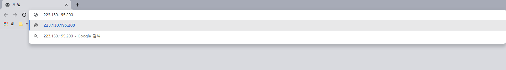

# DNS

인터넷상에서는 IP 주소로 통신 상대의 컴퓨터를 식별한다. 하지만 일반적으로 브라우저의 주소창에 입력하는 URL에 IP 주소 대신 도메인명을 입력한다. 도메인명을 IP 주소로 변환하는 DNS(Domain Name System)를 사용하기 때문이다.  

DNS는 도메인명과 IP 주소의 대응표를 가진 컴퓨터(DNS 서버)를 인터넷상에 배치해 놓고 DNS 서버를 통해 도메인명에 대응하는 IP 주소를 얻는다.


윈도우 명령 프롬프트를 통해 직접 DNS 서버에 문의할 수도 있다.  
명령 프롬프트에서 아래와 같이 nslookup 명령어 뒤에 도메인명을 입력하면 도메인명에 대응하는 IP 주소를 얻을 수 있다.

```
nslookup [도메인명]
```

네이버(www.naver.com)의 도메인명에 대응하는 IP 주소는 다음과 같다.  

```
권한 없는 응답:
이름:    www.naver.com.nheos.com
Addresses:  223.130.195.200
          223.130.200.107
Aliases:  www.naver.com
```

Addresses 부분에 두 개의 IP 주소가 출력된다. 두 IP 중에서 아무 IP 주소를 복사해서 브라우저에 URL 대신 입력하면 네이버로 연결되는 것을 확인할 수 있다.




## DNS 구현

도메인명을 DNS 서버에 질의해서 IP 주소를 얻어오는 방식이 간단하게 느껴질 수 있다. 하지만 문제는 IP 주소의 숫자가 매우 방대하다는 것이다. 따라서 하나의 DNS 서버를 두고 IP 주소를 얻어오는 것은 서버에 큰 부담이 된다.  

이 문제를 해결하기 위해 도메인명에 대응하는 DNS 서버를 다수 준비해 정보를 분산 관리하고 있다. 예를 들어 naver.com 이라는 도메인명은 마침표로 구분된 naver와 com 이라는 두 계층으로 나뉜다. 인터넷상에는 각 계층에 대응하는 DNS 서버가 준비돼 있으며, 이들 DNS 서버에 질의함으로써 하위 DNS 서버의 주소를 알 수 있다.


com, org, net 같은 최상위 도메인을 TLD(Top Level Domain) 이라고 하는데, 이러한 TLD의 DNS 서버를 관리하는 우두머리 격의 DNS 서버가 존재한다. 이것이 위 이미지의 최상단에 위치한 Root 서버이다.  

Root 서버는 현재(2021년 기준) 전 세계에 13대가 있다. Root 서버의 IP 주소는 거의 변경되지 않기 때문에 각 운영체제나 모든 DNS 서버에 등록되어 언제라도 참조할 수 있게 돼 있다. Root 서버부터 순서대로 하위 DNS 서버에 질의해 나감으로써 최종적으로 원하는 호스트명에 대응하는 IP 주소를 알 수 있다.  

# 참고
* [프로가 되기 위한 웹 기술 입문](http://www.yes24.com/Product/Goods/6721651)
* [Why There Are Only 13 DNS Root Name Servers](https://www.lifewire.com/dns-root-name-servers-3971336)