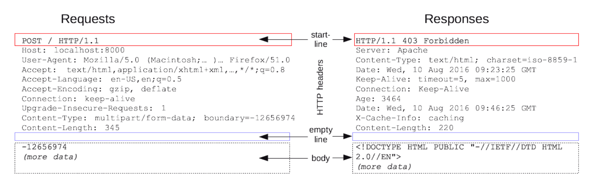
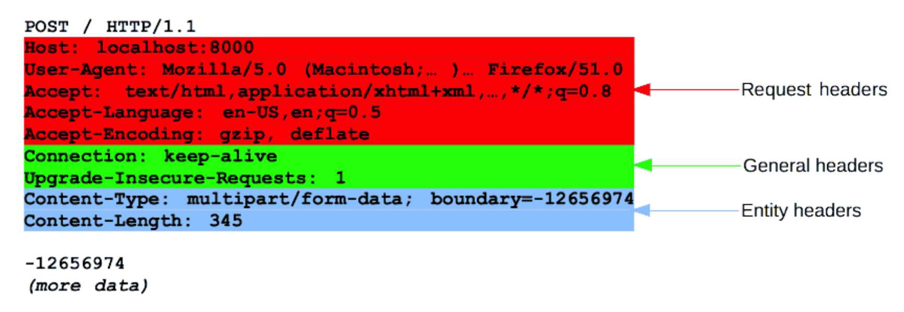
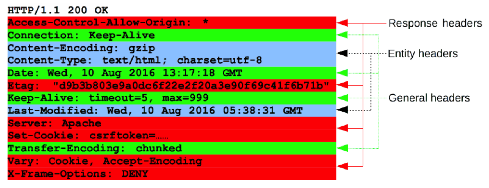

# HTTP 메시지

HTTP에서 교환하는 정보를 HTTP 메시지라고 부른다. 
메시지 타입은 클라이언트가 서버로 전달하는 요청(Request)과 요청에 대한 서버의 답변인 응답(Response)이 있다.
HTTP 메시지는 복수 행의 데이터로 구성된 텍스트 문자열이다. 세부적으로 **메시지 헤더**와 **메시지 바디**로 구분되어 있다. 메시지 바디가 항상 존재한다고 할 수 없다.

- 메시지 헤더 : 서버와 클라이언트가 꼭 처리해야 하는 리퀘스트와 리스폰스 내용과 속성 등
- 메시지 바디 : 꼭 전송되는 데이터 그 자체

HTTP 메시지의 시작 줄과 HTTP 헤더를 묶어서 요청 헤드(head)라고 한다.
이와 반대로 HTTP 메시지의 페이로드는 본문(body)이라고 한다.

## HTTP 메시지 세부 구조

출처 : https://developer.mozilla.org/ko/docs/Web/HTTP/Messages

## HTTP 요청
---
**시작 줄**  

위 이미지에서 빨간 네모 안의 메시지는 HTTP 요청(Request)이다. 요청은 클라이언트가 서버에 특정 동작을 요청하는 메시지이다.
요청 메시지의 시작줄은 세 가지 요소로 이루어져 있다.
- HTTP 메서드(GET, PUT, POST, DELETE ... ETC)
- URL 또는 프로토콜, 포트, 도메인의 절대경로
- HTTP 버전

**헤더**

대소문자 구분없이 문자열 다음에 콜론( : )이 붙으며, 그 뒤에 오는 값은 헤더에 따라 달라진다.
헤더의 세부 구조는 다음과 같다.
- General headers : 요청과 응답 모두에 적용되지만 바디에서 최종적으로 전송되는 데이터와는 관련이 없는 헤더.
- Request headers : 페치될 리소스나 클라이언트 자체에 대한 자세한 정보를 포함하는 헤더.
- Entity headers : 컨텐츠 길이나 MIME 타입과 같이 엔티티 바디에 대한 자세한 정보를 포함하는 헤더.

출처 : https://developer.mozilla.org/ko/docs/Web/HTTP/Messages

**본문**

요청의 마지막 부분에 들어간다. 모든 요청에 본문이 들어가지는 않는다.(GET, HEAD, DELETE , OPTIONS처럼 리소스를 가져오는 요청은 보통 본문이 필요없다)

## HTTP 응답
---

**상태 줄**

HTTP 응답의 시작 줄을 상태 줄(status line)이라고 한다. 다음과 같은 정보를 가지고 있다.
- 프로토콜 버전
- 상태 코드 : 요청의 성공 여부를 표시한다.(200, 400, 302)
- 상태 텍스트

**헤더**

대소문자 구분없이 문자열 다음에 콜론( : )이 붙으며, 그 뒤에 오는 값은 헤더에 따라 달라진다.
헤더의 세부 구조는 다음과 같다.
- General headers : 요청과 응답 모두에 적용되지만 바디에서 최종적으로 전송되는 데이터와는 관련이 없는 헤더.
- Response headers : 위치 또는 서버 자체에 대한 정보(이름, 버전 등)와 같이 응답에 대한 부가적인 정보를 갖는 헤더.
- Entity headers : 컨텐츠 길이나 MIME 타입과 같이 엔티티 바디에 대한 자세한 정보를 포함하는 헤더.

출처 : https://developer.mozilla.org/ko/docs/Web/HTTP/Messages

**본문**

응답의 마지막 부분에 들어간다. 모든 요청에 본문이 들어가지는 않는다.

# 출처
* [MDN Web Docs](https://developer.mozilla.org/ko/docs/Web/HTTP/Messages)

