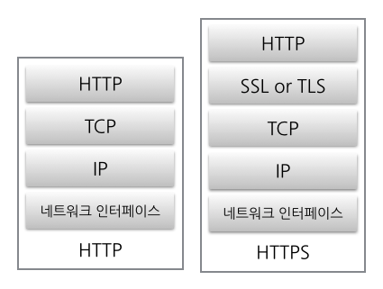
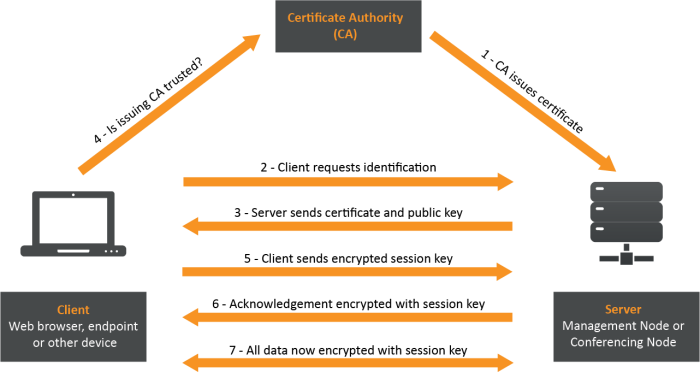

# HTTPS

## HTTP의 문제점

- **평문이기 때문에 도청 가능**

HTTP를 사용한 리퀘스트/리스폰스 통신 내용은 암호화 기능이 없기 때문에 통신 전체가 암호화 되지 않는다. 평문(암호화 되지 않은 메시지)으로 HTTP를 메시지를 보내게 되는 것이다.  

- **통신 상대를 확인하지 않기 때문에 위장 가능**

HTTP를 사용한 리퀘스트/리스폰스는 통신 상대를 확인하지 않는다.  
리퀘스트를 보낸 서버가 정말로 URI에서 지정된 호스트인지, 리스폰스를 반환한 클라이언트가 정말로 리퀘스트를 출력한 클라이언트인지 모른다.

HTTP를 사용한 통신은 상대가 누구인지 확인하는 처리가 없다. 누구든지 리퀘스트를 보낼 수 있다. 또한 리퀘스트가 오면 상대가 누구든지 무언가의 리스폰스를 반환한다. 따라서 HTTP 통신으로는 특정 상대에게만 통신을 허가하는 등의 작업을 수행할 수 없다.  

HTTP에서는 통신 상대를 확인할 수 없지만, SSL(Secure Socket Layer)로 상대를 확인할 수 있다. SSL은 상대를 확인하는 증명서를 제공하는데, 증명서는 신뢰할 수 있는 제3자 기관에 의해 발행된다.(인정된 조직 또는 기업) 

- **완전성(정보의 정확성)을 증명할 수 없기 때문에 변조 가능**

HTTP를 사용한 리퀘스트/리스폰스 과정에서 전달되고 전달 받는 정보가 중간에 변조되었다 하더라도 알 수 있는 방법이 없다. 특정 웹 사이트에서 콘텐츠를 다운로드 했는데 클라이언트에 다운로드한 파일과 실제 서버 상에 있는 파일이 같은 것인지 아닌지 알 수 없다. 이는 공격자가 리퀘스트/리스폰스 작업 중간에 끼어들어 변조하는 **중간자 공격_Man in the Middle)** 에 대응할 수 없다는 뜻이다.

## HTTPS

HTTP통신은 암호화되지 않고, 통신 상대의 서버나 클라이언트를 인증하는 수단이 없다. 또한 주고 받는 메시지가 도중에 변조될 위험이 있다. 이런 HTTP의 문제점을 보완한 것이 HTTPS(HTTP Secure)이다. HTTPS는 HTTP에 암호화나 인증 등의 구조를 더한 것이다.

*(이미지 출처: https://dailyscat.gitbook.io/twis/network/https)*

HTTP는 직접 TCP와 통신하지만, SSL을 사용하면 HTTP는 SSL과 통신하고 SSL이 TCP와 통신하게 된다. SSL이라는 껍질을 덮어쓴 HTTP가 HTTPS이다.  

HTTP는 SSL 사용을 통해 HTTPS로서 암호화, 증명서, 완전성 보호를 이용할 수 있다.  

## SSL은 공개키 암호화 방식

SSL은 공개키 암호화 방식을 이용한다. 

**대칭 키 암호(symmetric-key algorithm) 또는 공통키 암호** 방식은 암호화와 복호화에 하나의 키를 같이 사용하는 방식이다. 따라서 외부에 키가 노출되면 암호화의 의미가 없어진다. 공통키 암호 방식에서 키를 안전하게 보관하기 위한 노력이 필수적으로 수반된다.  

**공개키 암호(public-key cryptography)** 방식은 암호화와 복호화에 이용하는 키가 다른 방식이다. 서로 다른 두 개의 키 페어(쌍), 비밀키(private key)와 공개키(public key)를 사용한다.  

공개키 암호화에서는 암호를 보내는 측이 상대의 공개키를 사용해서 암호화를 한다. 그리고 암호화된 정보를 받아들인 상대는 자신의 비밀키를 사용해 복호화를 실시한다. 암호 해독을 위해 비밀키를 보낼 필요가 없기 때문에 키를 빼앗길 걱정은 없다.

*(이미지 출처: https://www.preveil.com/blog/public-and-private-key/)*

공통키 암호 방식은 기밀성을 유지한 통신이 가능하지만 키 배송 문제가 있다. 그리고 공개키 암호 방식은 키 배송 문제가 해결되지만 공통키 암호 방식에 비해 느린 처리 속도와 중간자 공격(man-in-the-middle)에 취약하다는 문제가 있다.

따라서 두 개의 방식을 조합해서 통신한다. 키를 교환하는 곳에서는 공개키 암호를 사용하고, 그 후의 통신에서 메시지를 교환하는 곳에서는 공통키 암호를 사용한다.  

## 공개키를 증명하는 증명서

공개키 암호 방식에서 공개키가 진짜인지 아닌지를 증명할 수 없다. 수신한 공개키를 누군가 중간에서 바꿔치기 했을 수도 있다. 이 문제를 해결하기 위해 인증 기관(CA_Certificate Authority)과 그 기관이 발행하는 공개키 증명서가 이용된다. 인증 기관은 신뢰받는 제3자 기관으로, VeriSign 등이 있다.  

*(이미지 출처: https://www.preveil.com/blog/public-and-private-key/)*

1. 서버의 공개키를 인증 기관에 등록
2. 인증 기관의 비밀키로 서버의 공개키에 디지털 서명으로 공개키 증명서를 작성
3. 클라이언트는 서버의 공개키 증명서를 입수하고, 디지털 서명을 인증 기관의 공개키로 검증한다.
4. 서버의 공개키로 암호화해서 메시지를 송신 기관에 등록
5. 서버의 비밀키로 메시지를 복호화 한다.

## SSL 통신의 단점

HTTPS는 서버, 클라이언트 모두 암호화/복호화 처리가 필요하기 때문에 CPU나 메모리 등의 하드웨어 리소스 소비가 크다. 구체적인 이유는 아래와 같다.

- HTTP의 리퀘스트/리스폰스 이외에 SSL에 필요한 통신이 추가되기 때문에 전체적으로 처리해야 할 통신이 증가하기 때문이다.
- SSL은 반드시 암호화 처리를 하기 때문에 서버나 클라이언트에서는 암호화.복호화를 위한 계산이 필요하고, 이는 많은 리소스를 소비하는 결과로 이어진다.

## HTTP를 사용할까? HTTPS를 사용할까?

모든 웹 사이트가 HTTPS를 사용하지 않는다. 그 이유는 바로 위의 **SSL 통신의 단점**에서 설명하고 있다. 따라서 민감한 정보를 포함하지 않는 통신에서는 HTTP를, 개인 정보 등 민감한 정보를 처리할 때는 HTTPS에 의한 암호화 통신을 사용한다.

액세스가 많은 웹 사이트에서 암호화 통신을 하면 많은 부하가 발생한다. 이 경우 숨겨야 할 정보만 암호화하여 리소스를 절약한다.

# 출처
* [그림으로 배우는 HTTP & Network](http://www.yes24.com/Product/Goods/15894097)