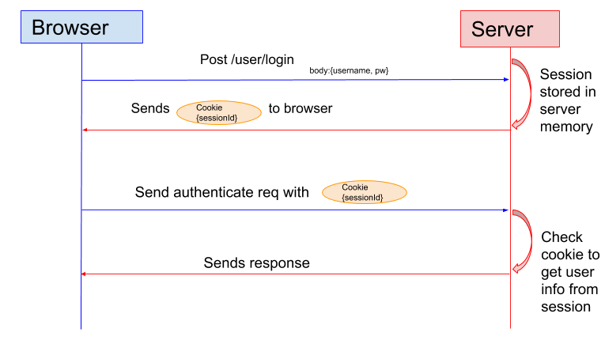

# 인증의 구조

HTTP의 인증 방법은 BASIC 인증, DIGEST 인증, SSL 클라이언즈 인증 등 여러 방법이 있다.  
인증의 대부분은 폼 베이스 인증으로 구현된다.

## 폼 베이스 인증

폼 베이스 인증(Form-based authentication)은 클라이언트가 서버 상의 웹 애플리케이션에 자격 정보(Credentials)를 송신하여 그 자격 정보의 검증 결과에 따라 인증을 하는 방식이다. 
웹 애플리케이션에 따라 제공되는 인터페이스나 인증 방법이 다양하다. 

인증 방식은 서버 측의 웹 애플리케이션 등에 의해서 클라이언트가 송신한 유저 ID와 패스워드가 사전에 등록되어 있는 것과 일치하는지 검증하면서 이루어진다. 

HTTP는 Stateless, 즉 이전 작업 내용을 유지할 수 없기 때문에 각기 다른 유저의 액세스를 구분하지 못한다. 그래서 세션 관리와 쿠키를 사용하여 HTTP에 없는 상태 관리 기능을 보충한다.  

*(이미지 출처: https://sherryhsu.medium.com/session-vs-token-based-authentication-11a6c5ac45e4)*

1. 클라이언트가 서버에 유저 ID나 패스워드 등의 자격 정보를 포함한 리퀘스트를 송신한다. 일반적으로 POST 메소드가 사용되며 엔티티 바디에 자격 정보를 저장한다. 이때 HTML 폼 화면 표시, 그리고 입력 데이터 송신에는 HTTPS 통신을 이용한다.
2. 서버 측에서 유저 식별을 위해 세션 ID를 발행한다. 클라이언트에서 수신한 자격 정보를 검증하는 것으로 인증을 하고, 그 유저의 인증 상태를 세션 ID와 연고나지어 서버에 기록한다. 클라이언트로 송신할 때는 **Set-Cookie** 헤더 필드에 세션 ID를 저장해서 리스폰스를 반환한다.
3. 클라이언트는 서버에서 세션 ID를 받고 쿠키(Cookie)에 저장한다. 이후 유저가 로그인 되어 있는 동안에는 서버에 리퀘스트를 송신할 때 브라우저가 자동으로 쿠키를 송출하기 때문에 세션 ID가 서버에 송신된다.
4. 서버에서는 클라이언트에게 전달 받은 쿠키의 세션 ID와 메모리에 저장된 세션 ID를 비교하여 올바른 유저가 맞는지 확인한 후 요청 내용에 대한 리스폰스를 반환한다.

상기 설명된 인증 절차는 예시일 뿐 작업 환경에 따라 다른 방법이 사용될 수 있다.  

# 출처
* [그림으로 배우는 HTTP & Network](http://www.yes24.com/Product/Goods/15894097)
* [Medium](https://sherryhsu.medium.com/session-vs-token-based-authentication-11a6c5ac45e4)