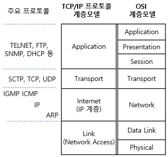
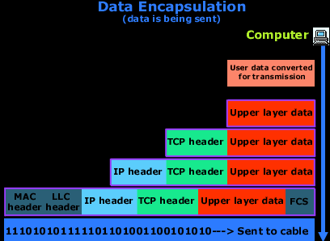
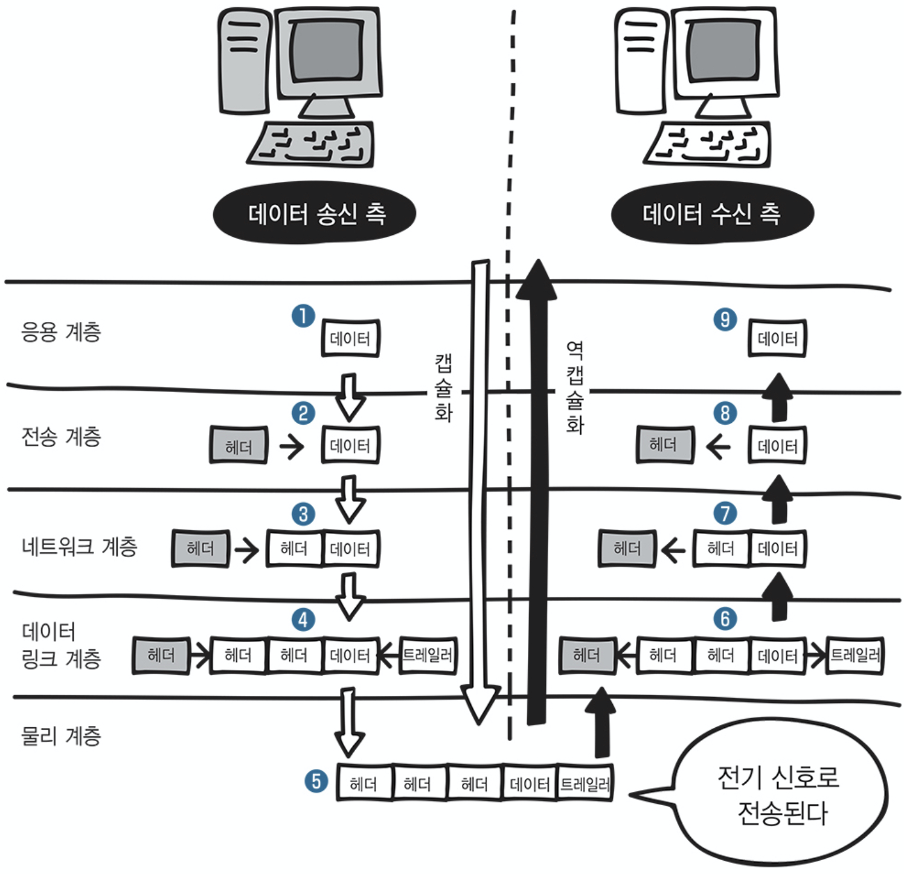
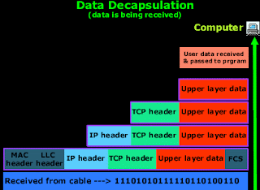
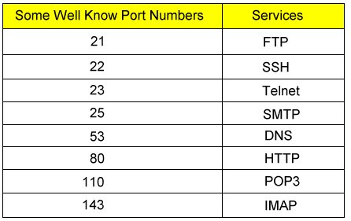

# TCP/IP

TCP/IP는 TCP와 IP를 중심으로 하는 프로토콜의 집합이자 네트워크의 공통 언어.  

## TCP/IP 계층구조

TCP/IP 에서는 네트워크를 통해 통신하기 위한 기능을 계층화하고 복수의 프로토콜을 조합하였다.  
총 4계층으로 구성되어 있고 각 계층에 포함된 프로토콜을 조합하여 애플리케이션이 통신한다. 4개 계층의 프로토콜이 모두 정상적으로 제 기능을 해야 통신이 이루어진다.  

*이미지 출처: [정보통신기술용어해설](http://www.ktword.co.kr/word/abbr_view.php?nav=2&m_temp1=205&id=861)*

## 네트워크 인터페이스층

- **같은 네트워크 내 인터페이스 간 데이터를 전송하는 역할.**
- 프로토콜: 유선(이더넷)이나 무선 LAN(Wi-Fi), PPP 등이 있다.
- 네트워크 인터페이스층의 프로토콜이 통신 상대와 같아야 할 필요는 없다.

## 인터넷층

- **원격지 네트워크 사이에서 데이터를 전송하는 역할.**
- 프로토콜: IP(엔드투엔드 통신에 이용), ICMP(IP를 도와주는 프로토콜), ART(IP를 도와주는 프로토콜) 등이 있다.

네트워크끼리 연결하고 데이터를 전송하는 기기가 [라우터(router)](https://ko.wikipedia.org/wiki/%EB%9D%BC%EC%9A%B0%ED%84%B0) 이다. 네트워크를 서로 연결한 라우터에서 이루어지는 전송 작업을 [라우팅(routing)](https://ko.wikipedia.org/wiki/%EB%9D%BC%EC%9A%B0%ED%8C%85) 이라고 한다.  

원격지 네트워크에 연결된 PC 간의 통신을 **엔드투엔드(end-to-end) 통신**이라고 한다.

## 트랜스포트층

- 데이터를 적절한 애플리케이션에 배분하는 역할.
- 프로토콜: TCP, UDP 등

여러 애플리케이션의 데이터가 다양한 타이밍에 들어오는데, 트랜스포트층에서는 데이터를 적절한 애플리케이션으로 배분한다.  
최하층(네트워크 인터페이스층)부터 트랜스포트층까지 올바르게 동작하면 출발지와 목적지 애플리케이션 간에 데이터를 송수신할 수 있게 된다.  

## 애플리케이션층

- 애플리케이션의 기능을 실행하기 위한 데이터의 형식과 처리 절차 등을 결정.
- 프로토콜: HTTP, SMTP, POP3, DHCP, DNS 등

사용자가 요청한 문자, 음성, 영상 등의 데이터는 0과 1로 이루어진 디지털 데이터이다. 애플리케이션층은 이 데이터를 인간이 이해할 수 있는 표현 형식으로 바꾸기 위해 데이터 형식과 처리 순서 등을 결정한다.

---

## 데이터 송수신 규칙

애플리케이션이 데이터를 주고받게 하려면 복수의 프로토콜을 조합해야 한다. TCP/IP에서는 네 개의 프로토콜을 조합한다.  
각 프로토콜에는 각각의 기능을 실행하기 위한 제어 정보(헤더)가 필요하다. 각 프로토콜은 데이터를 전송할 때 헤더를 추가한다. 헤더를 추가하는 처리를 캡슐화(Encapsulation)라고 한다. 헤더로 데이터를 포장한다는 의미를 가진다.  

프로토콜이 데이터를 받으면 각 프로토콜 헤더를 바탕으로 적절하게 처리하여 헤더를 벗겨내고 다시 다른 프로토콜로 처리를 넘긴다.(역캡슐화)
이처럼 네트워크를 통해 데이터를 보낼 때는 캡슐화와 역캡슐화의 과정을 거친다. 데이터 송신측은 TCP/IP 계층을 위에서 아래로 따라가며 각 프로토콜 헤더를 추가한다.  

아래 이미지는 웹브라우저에서 웹서버 애플리케이션으로 데이터를 보내는 모습이다.  
상위 계층 프로토콜 -> 하위 계층 프로토콜로 이동하면서 헤더가 점차 캡슐화되고, 네트워크로 내보내는 데이터에는 여러 프로토콜의 헤더가 추가된다.  
마지막 계층에 FCS(Frame Check Sequence) 추가되는데, 데이터 링크 계층에서 데이터의 오류 여부를 확인하기 위한 필드이다.

모든 절차가 끝나고 마지막에는 이용하는 이더넷 규격에 대응하는 물리적인 신호로 변환해 전송 매체로 내보낸다.

*이미지 출처: [spiceupyourknowledge](http://www.spiceupyourknowledge.net/2010/09/data-encapsulation-decapsulation-in-osi.html)*

*이미지 출처: [velog](https://velog.io/@ej_shin/2%EC%9E%A5-%EB%84%A4%ED%8A%B8%EC%9B%8C%ED%81%AC%EC%9D%98-%EA%B8%B0%EB%B3%B8-%EA%B7%9C%EC%B9%99)*

전송 매체로 내보낸 물리적인 신호는 목적지 웹서버까지 다양한 네트워크 기기(라우터, 레이어2 스위치, 레이어3 스위치)를 거쳐 전송된다.  
네트워크 기기는 수신한 물리적인 신호를 일단 0과 1의 데이터로 되돌린다. 그리고 각각의 네트워크 기기의 동작에 대응하는 헤더를 참조하여 데이터를 전송해 간다.

아래 이미지는 웹브라우저로부터 송신받은 내용을 웹서버 애플리케이션이 수신하는 모습이다.(역캡슐화) 순서는 아래와 같다.  
- 받은 데이터를 0과 1의 데이터로 변환한다.
- 이더넷 헤더를 참조해 자기 앞으로 온 데이터인지 확인한다.
- FCS로 데이터에 오류가 없는지 확인한다.
- 위 조건을 만족한다면 이더넷 헤더와 FCS를 제거하고 IP 헤더 처리를 넘긴다.
- IP에서는 IP 헤더를 참조해 자기 앞으로 온 데이터인지 확인한다.
- 확인 후 IP 헤더를 제거하고 TCP로 데이터 처리를 넘긴다.
- TCP 헤더를 참조해 어느 애플리케이션의 데이터인지 확인한다.
- 확인 후 TCP 헤더를 제거하고 웹서버 애플리케이션으로 데이터 처리를 넘긴다.
- 웹서버 애플리케이션까지 데이터가 도착하면 HTTP 헤더와 그 뒤의 데이터 부분을 처리한다.

이처럼 데이터를 수신하는 쪽은 TCP/IP 계층을 아래에서 위로 따라가며 헤더를 해석하고 헤더를 제거해서 상위 프로토콜로 데이터 처리를 넘겨준다.  

*이미지 출처: [spiceupyourknowledge](http://www.spiceupyourknowledge.net/2010/09/data-encapsulation-decapsulation-in-osi.html)*

---

## IP

IP는 TCP/IP의 다양한 프로토콜 중에서 중요한 역할을 한다.  
IP의 역할은 네트워크 상의 어떤 PC에서 다른 PC까지 데이터를 전송하는 엔드투엔드 통신이다.  

IP로 데이터를 전송하려면 전송하고 싶은 데이터에 IP 헤더를 추가해 IP 패킷으로 만들어야 한다. IP 헤더에는 여러 정보가 포함되어 있고, 가장 중요한 것은 데이터의 출발지와 목적지를 나타내는 **IP 주소**이다.  

목적지가 다른 네트워크에 있을 때는 경로 상에 있는 라우터가 IP 패킷을 라우팅하여 최종 목적지 호스트까지 도달시킨다.  

## IP 주소

TCP/IP 통신에서 통신 상대인 호스트를 식별하는 IP 주소를 반드시 지정해야 한다.  
IP 주소는 32비트이며, 0과 1이 32개로 나열된다. 이를 한 눈에 알아보기 위해 8비트씩 10진수로 변환하고 점(**.**)으로 구분하여 표기한다.  
8비트 10진수는 0~255 이므로 0~255 사이의 숫자를 점으로 구분해 4개 나열하는 형태를 가진다. 따라서 256 이상의 숫자가 포함된 IP 주소는 잘못된 IP 주소이다.

*이미지 출처: [위키백과](https://ko.wikipedia.org/wiki/%ED%8C%8C%EC%9D%BC:Ipv4_address.svg)*

## 서브넷 마스크

IP 주소는 네트워크를 식별하는 네트워크부, 네트워크 내 호스트를 섹별하는 호스트부로 나뉘어져 있다. 32비트의 IP 주소의 어디까지가 네트워크부인지 명시한 것이 서브넷 마스크이다.  

- 32비트로 비트 1이 네트워크부, 비트 0이 호스트부를 나타낸다.
- IP 주소처럼 8비트씩 10진수로 변환하고 점(**.**)으로 구분한다.
- 192.168.1.1 255.255.255.0 를 192.168.1.1/24 처럼 / 뒤에 연속한 1의 개수로 표기하여 네트워크부와 호스트부를 명확하게 구분한다.

---

## ARP

TCP/IP 에서는 IP 주소를 지정해서 데이터(IP패킷)을 전송한다. IP 패킷은 PC나 서버 등의 인터페이스까지 전송된다. PC나 서버 등의 인터페이스는 MAC 주소로 식별한다. **ARP의 역할은 TCP/IP의 IP 주소와 인터페이스를 식별하기 위한 MAC 주소를 대응시키는 것이다.**

이더넷 인터페이스에서 IP 패킷을 내보낼 때 이더넷 헤더를 덧붙인다. 이더넷 헤더에는 목적지 MAC 주소를 지정해야 한다. 목적지 IP 주소에 대응하는 MAC 주소를 구하기 위해 ARP를 이용한다.

## 포트 번호(Port Number)

포트 번호는 애플리케이션을 식별하여 데이터를 적절한 애플리케이션으로 보내기 위해 사용된다.  

well-known port라는 미리 정해져 있는 포트 번호가 있다. 

*이미지 출처: [well-known port](https://www.gobiznow.com/blog/computer-internet/udp-some-well-known-computer-port-number/)*

이 외에도 자주 사용되는 서버 애플리케이션을 식별하기 위한 registered port(포트 범위: 1024 ~ 49151), 클라이언트 애플리케이션을 식별하기 위한 동적/사설 포트 번호(포트 범위: 49152 ~ 65535)가 있다.

---

## TCP

TCP(Transmission Control Protocol_전송 제어 프로토콜)는 애플리케이션 간의 신뢰성 있는 데이터 전송을 위한 프로토콜이다.  

TCP에 의한 애플리케이션 간의 데이터 전송 절차는 아래와 같다.

1. TCP 커넥션 맺기
  - 데이터를 송수신하는 애플리케이션 간의 통신이 정상적으로 이루어질 수 있는 확인한다. 이 프로세스를 **3웨이 핸드쉐이크**라고 한다.
2. 애플리케이션 간 데이터 송수신
3. TCP 커넥션 끊기

## TCP 헤더 형식

전송하고 싶은 애플리케이션의 데이터에 TCP 헤더를 추가해 TCP 세그먼트로서 전송한다.  
- TCP 헤더에서 가장 중요한 것은 포트 번호이며, 포트 번호로 적절한 애플리케이션 프로토콜에 데이터를 전달할 수 있다.  
또한 신뢰성 있는 데이터 전송을 위해 시퀀스 번호와 ACK 번호를 사용한다.
- 시퀀스 번호: TCP로 전송하는 데이터 순서를 나타낸다.
- ACK 번호: 데이터를 바르게 수신했음을 확인하기 위해 이용한다. Acknowledgement Number의 약자.

---

## UDP

UDP(User Datagram Protocol)는 PC나 서버 등에 도달한 데이터를 적절한 애플리케이션에 전달하는 기능만 있는 프로토콜.  

- UDP는 상대 애플리케이션이 동작하는지 확인하지 않고 무조건 애플리케이션의 데이터를 송신한다.  
- 데이터 전송 효율은 좋지만 신뢰성이 높지 않다.  
- IP 전화의 음성 데이터와 같이 실시간 데이터 전송을 할 때 UDP를 이용한다.

---

## DNS

DNS(Domain Name System)는 호스트의 도메인 이름을 호스트의 네트워크 주소로 바꾸거나 그 반대의 변환을 수행할 수 있도록 하기 위해 개발되었다. 특정 컴퓨터의 주소를 찾기 위해, 사람이 이해하기 쉬운 도메인 이름을 숫자로 된 식별 번호로 변환해 준다.  

TCP/IP 통신에는 반드시 IP헤더에 IP주소를 지정해야만 하는데, 애플리케이션을 이용하는 사용자가 IP주소를 외우고 사용하기는 어렵다. 그래서 애플리케이션이 동작하는 서버는 클라이언트 PC등의 호스트에 사용자가 이해하기 쉬운 이름인 호스트명을 붙인다.  

사용자는 웹사이트 접속 시 웹사이트 주소인 URL을 사용하는데, URL 등으로 애플리케이션 주소를 지정하면 DNS에서 호스트 이름에 대응하는 IP 주소를 자동으로 구한다.  

사용자가 웹 브라우저에 호스트 이름인 www.naver.com을 입력하면 DNS 서버에서 www.naver.com에 대응하는 IP주소를 전달하고, 이를 통해 웹서버에 접속한다.  

위 내용처럼 DNS가 작동하려면 DNS 서버에 미리 호스트명과 IP주소의 대응 관계를 등록해야 한다.

DNS 동작 방식에 대한 설명은 아래 링크를 참고하자.  
[DNS 동작 방식](https://www.netmanias.com/ko/?m=view&id=blog&tag=76&page=2&no=5353)

# 참고

* [그림으로 배우는 네트워크 원리](http://www.yes24.com/Product/Goods/88244509)
* [기술사 공부 토픽](https://wikidocs.net/132957)

