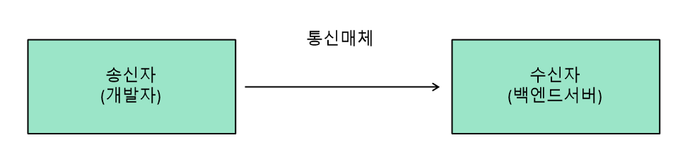

# 네트워크 기본 개념

## 통신 3요소

- 송신자
  - 데이터를 전송하고 결과를 기다림
  - 수신자 정보가 필요(**수신자를 찾아갈 수 있는 정보**)
    - MAC, IP, PORT

- 수신자
  - 데이터를 받고 결과를 전송함
  - 송신자에게서 받은 데이터가 형식에 맞게 전송되었는지 검증
    - 프로토콜(데이터 검증 용도)

- 통신매체
  - 유선(LAN), 무선(WIFI)
  - 계속 신호를 주고 받음

송신자, 수신자, 통신매체 3요소를 통해 데이터를 주고받는다.  
송신자는 MAC, IP, PORT를 통해 수신자 정보를 가져오고, 이를 통해 수신자에게 정보(데이터)를 보낸다.  
수신자는 프로토콜을 통해 송신자에게 받은 정보가 올바른, 형식에 맞는 정보인지 판단한다. 형식에 밪는 올바른 정보라면 이를 잘 처리해서 송신자에게 응답을 보낸다.(경우에 따라 응답이 있거나 없을 수 있다.)

## MAC(Media Access Control Address)

- 호스트(수신자)를 구분할 수 있는 물리적 식별 값(네트워크 카드에 유일하게 할당된, 식별할 수 있는 값)
- 스위치에 연결된 모든 호스트에 데이터 전송
  - 데이터그램: 송신자MAC 주소 + 수신자MAC 주소 + 데이터
  - 호스트는 필요한 데이터만 선택 사용
    - 자신의 MAC 정보와 똑같지 않을 경우 버린다.
- 스위치를 사용할 수 없는 호스트
  - IP를 사용해 데이터 전송
  - MAC 정보는 전달되지 않음

MAC을 사용해서 데이터를 송수신 할 때는 데이터그램을 사용한다. 데이터그램은 송신자MAC 주소 + 수신자MAC 주소 + 데이터가 하나로 결합되어 있다. 

송신자가 MAC을 통해 다른 개발자와 데이터를 주고받는 경우는 다음과 같다.  
- 송수신을 할 때 먼저 데이터그램을 넘겨준다.
- 이후 내부 네트워크를 하나로 연결해주는 장비인 스위치에서 데이터그램을 받아서 스위치에 연결된 모든 장비에게 송신자로부터 받은 데이터그램을 전송한다.(브로드캐스트) 
- 자신의 MAC 주소가 아니면 파기하고, 자신의 MAC 주소라면 데이터그램을 사용한다.

이렇게 개발자가 다른 개발자와 데이터를 주고받는 작업은 MAC 주소만 있어도 가능하다. 같은 네트워크 안에서 움직이기 때문이다.  
하지만 내부 네트워크 밖의 백엔드서버와 통신하려면 IP가 필요하다. 개발자는 백엔드서버의 IP를 가지고 데이터를 보낸다.  

## IP(Internet Protocol)

- IP 주소 : 인터넷을 통해 특정 호스트를 찾아 갈 수 있는 논리적 식별값
- 백엔드서버에 여러개의 수신자(프로세스)가 있을 경우 : PORT 사용

개발자와 백엔드서버간에 라우터가 연결되어 있다. 인터넷은 세상의 모든 라우터가 서로 연결된 네트워크이다. 백엔드서버의 위치에 상관없이 논리적 식별 값인 IP 주소를 통해 백엔드서버의 올바른 위치를 파악할 수 있다.  
라우터를 통해 보내는 데이터를 패킷이라고 한다. 패킷은 송신자IP + 수신자IP + 데이터그램으로 구성되어 있다.  

IP 주소와 연결된 라우터를 통해 백엔드서버로 이동한다.  
백엔드서버에는 여러 프로그램이 있다.(HTTP, TELNET, TCP/IP 서버 등) IP를 가지고 전달한 데이터를 백엔드서버의 여러 프로그램 중 어느 쪽으로 가야 하는지 모호해진다. 이 때 사용하는 것이 PORT이다.

## PORT

- 프로그램(프로세스)을 구분 할 수 있는 유일한 정보
- 일반적으로 운영체제에서 PORT 정보를 관리하며 하나의 PORT로 두 개 이상의 프로그램이 실행될 수 없도록 제어한다. Java의 경우 이미 사용되고 있는 PORT를 사용해 프로그램이 실행되면 java.net.BindException 발생한다.

수신자의 정보(IP/PORT)를 가지고 데이터를 보낸 후 송신자는 프로토콜이 맞는지 확인하는 작업이 필요하다.  

## 프로토콜

- 송신자와 수신자가 데이터를 주고 받을때 필요한 약속(흐름제어, 오류제어, 혼잡제어 등)
- TCP
  - 연결지향, 데이터 송수신에 필요한 부가 기능을 제공한다.
  - SQL 실행
- UDP
  - 전송지향, 어플리케이션에서 부가 기능을 구현해야 한다.
  - 동영상 재생
- HTTP
  - TCP의 연결지향 장점과 UDP의 전송지향 장점을 가지고 있다.
  - 비연결성, 송신자의 IP가 변경될 수 있다.

## Q&A

#### 웹 브라우저의 MAC 주소를 알 수 있는 방법

- 사용자의 MAC 주소를 알 수 있는 방법은 없다. MAC을 사용한 데이터 전송은 같은 네트워크 내의 스위치에 연결된 호스트에 한정되어 있다.
- 별도의 프로그램으로 수집할 수 있지만 개인정보수집 이슈가 발생할 수 있다.

#### IP를 사용자 식별자로 사용할 수 있는 방법

- 논리적 IP는 환경에 따라 유동적으로 바뀔 수 있다. 따라서 식별자로 사용 불가능하다.
- IP가 고정된 사내 네트워크의 경우 가능하다.

#### 80 PORT를 사용하는 톰캣을 여러 개 실행할 수 있는 방법

- PORT는 운영체제에서 실행되는 프로세스를 식별할 수 있는 키(Key)이다. 동시에 여러 개 실행은 불가능하다.
- 하나의 컴퓨터에 여러 개 가상화 화

# 참고
* [백엔드 프레임워크 만들기](https://www.inflearn.com/course/%ED%94%84%EB%A0%88%EC%9E%84%EC%9B%8C%ED%81%AC-%EB%A7%8C%EB%93%A4%EA%B8%B0-%EA%B0%9C%EC%A0%95%ED%8C%90#)
