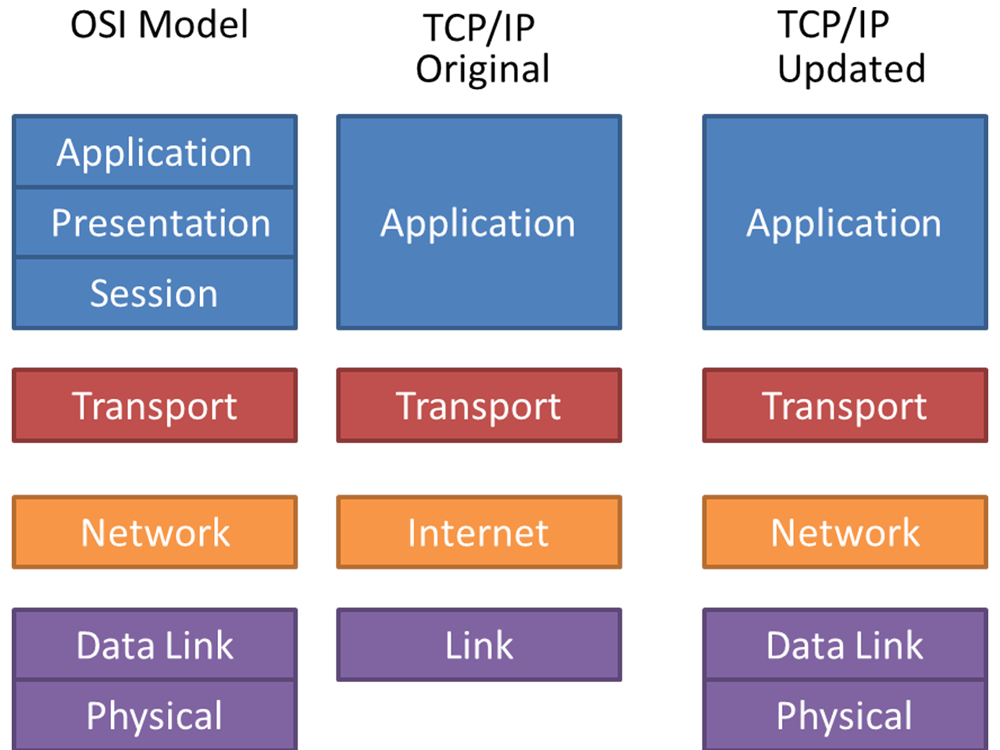

# OSI model

서로 다른 네트워크끼리 통신하려면 데이터 패킷을 전송하는 법, 받는 법에 대한 공통 규칙(common rules)이 필요합니다. 이 규칙을 프로토콜(Protocol) 이라고 부르는데, TCP(Transmission Control Protocol / 전송 제어 프로토콜), IP(Internet Protocol / 인터넷 프로토콜)가 가장 널리 사용되는 프로토콜 중의 하나입니다. 참고로 그 이름에서 알 수 있듯이 TCP/IP 프로토콜은 인터넷 환경에서 컴퓨터들이 서로 정보를 주고받기 위해 사용되는 프로토콜 입니다. 그리고 TCP/IP는 OSI 7 Layer 중에서 Layer 3, 4를 다루는 프로토콜입니다.

**OSI model은 네트워크 통신에서 하드웨어/소프트웨어 요소들이 각각 어떤 역할을 분담하고 있으며, 어떻게 상호작용 하는지를 개념화/표준화한 것으로 7개의 레이어로 구성되어 있습니다.**

출처: https://community.fs.com/blog/tcpip-vs-osi-whats-the-difference-between-the-two-models.html

## Physical Layer

c물리 계층에서는 주로 전기적, 기계적, 기능적인 방법으로 통신 케이블을 통해 데이터를 전송합니다.

- 물리 계층에서는 PHY칩에서 데이터를 전기적인 신호로 변환해서  전송(encoding - 0과 1의 데이터를 아날로그 신호), 수신(아날로그 신호를 0과 1의 데이터)하는 역할만 합니다.
- 데이터가 무엇인지 어떤 에러가 있는지 신경쓰지 않습니다.
- 이 계층에서의 대표적인 장비는 통신 케이블, 리피터, 허브가 있습니다.
- 전송 단위 : Bit

## Data Link Layer

- 같은 네트워크에 있는 여러 대의 컴퓨터들이 데이터를 주고받기 위해서 필요한 모듈입니다.

- 물리 계층에서 송신/수신되는 데이터의 오류와 흐름을 관리하여 안전한 정보의 전달을 수행(데이터의 앞 뒤에 특정한 비트열을 붙임)할 수 있도록 도와주는 역할을 합니다. 
- 통신에서의 오류도 찾아주고 재전송하는 기능도 있습니다.
- MAC 주소를 가지고 통신합니다.
- 이 계층에서의 전송단위는 프레임이라고 하고, 대표적인 장비로는 스위치(우리가 잘 아는 공유기가 여기에 해당), 브리지 등이 있습니다. (여기서 MAC 주소 사용)
- 브리지나 스위치를 통해 MAC 주소를 가지고 물리 계층에서 전송받은 데이터를 전달합니다.
- 포인트 투 포인트(point to point) 간 신뢰성 있는 전송을 보장하기 위한 계층으로 CRC기반의 오류 제어와 흐름제어가 필요합니다.
- 네트워크 위의 개체들 간 데이터를 전달하고, 물리 계층에서 발생할 수 있는 오류들을 찾아내고 수정하는데 필요한 기능적 수단을 제공합니다.
- 전송 단위: Frame

## Network Layer

- 수많은 네트워크들의 연결로 이루어져 있는 inter-network 속에서 목적지로 패킷을 전송하는 역할을 담당합니다. 이 과정에서 고유 주소인 IP 주소를 가지고 라우팅 작업을 통해 목적지 컴퓨터를 찾아내서 패킷을 전송합니다.

- 네트워크 계층에서 가장 중요한 기능은 데이터를 목적지까지 가장 안전하고 빠르게 전달하는 기능(라우팅)입니다. 여기에 사용되는 프로토콜의 종류도 다양하고, 라우팅하는 기술도 다양합니다.
- 경로를 선택하고 주소를 정하고 경로에 따라 패킷을 목적지까지 전달해주는 것이 네트워크 계층의 역할입니다.
- 대표적인 장비는 라우터이며, 요즘은 2 계층 장비 중 스위치에 라우팅 기능을 장착한 Layer 3 스위치도 있습니다. (여기서 IP를 사용)
- 여러개의 노드를 거칠 때마다 경로를 찾아주는 역할을 하는 계층으로 데이터를 네트워크들을 통해 전달하고, 그 과정에서 상위 계층인 전송 계층이 요구하는 서비스 품질(Qos)를 제공하기 위한 절차적/기능적 수단을 제공합니다.
- 네트워크 계층은 라우팅, 세그맨테이션, 오류제어, 흐름제어, 인터네트워킹등을 수행합니다.
- 데이터를 다른 네트워크를 통해 전달함으로써 인터넷이 가능하게 만드는 계층입니다.
- 전송 단위 : Datagram (Packet)

## Transport Layer

- 데이터 전송을 담당하는 계층으로 데이터 용량, 속도, 목적지 등을 처리합니다.

- Port 번호를 사용해서 목적지 컴퓨터의 최종 목적지인 프로세스까지 패킷이 도달하도록 하는 모듈입니다.
- 이전 계층인 네트워크 계층이 IP 주소를 통해 원하는 목적지 컴퓨터로 패킷을 전송했습니다. 하지만 이 패킷이 어느 프로세스로 이동해야 하는지 알 수 없습니다. 이를 해결하기 위해 TCP에서 패킷을 어떤 프로세스가 받아야 하는지에 대한 정보(Port 정보)를 추가합니다. 통신을 해야하는 프로세스는 각자 자신의 Port 번호를 가지고 있고, 해당 Port를 통해 데이터를 받습니다. 수신된 메시지의 Port 번호를 통해 어떤 프로세스가 해당 메시지를 받아야 하는지 알 수 있습니다.
- 통신을 활성화하기 위한 계층입니다. 보통 TCP를 사용하며, 포트를 열어 응용프로그램들이 전송할 수 있게 합니다.
- 만약 데이터가 왔다면, 해당 계층에서 데이터를 하나로 합쳐서 세션 계층으로 전송합니다.
- 전송 계층은 양끝단(end to end) 사용자들이 신뢰성있는 데이터를 주고 받을 수 있도록 도와주고, 상위 계층들이 데이터 전달의 유효성이나 효율성을 생각하지 않도록 해줍니다.
- 시퀀스 넘버기반의 오류 제어 방식을 사용합니다.
- 전송 계층은 특정 연결의 유효성을 제어하고, 일부 프로토콜은 상태 개념이 있고(stateful), 연결 기반(connection oriented)입니다. 이는 전송 계층이 패킷들의 전송이 유효한지 확인하고 전송에 실패한 패킷들을 재전송한다는 것을 뜻합니다.
- 종단간 통신을 다루는 최하위 계층으로 기능은 오류검출 및 복구와 흐름제어, 중복 검사등을 수행합니다.
- 전송 단위 : Segment

## Session Layer

- 통신을 할 때 호스트간 최초 연결을 하고, 연결이 끊어지지 않도록 유지하는 역할을 수행합니다.

- 데이터 통신을 위한 논리적 연결을 수행합니다. 
- 세션 설정 생성, 유지, 종료 등의 기능이 있습니다.
- 세션 계층은 양 끝단 프로세스가 통신을 관리하기 위한 방법을 제공합니다.
- TCP/IP 세션을 만들고, 제거하는 역할을 담당합니다.
- 그밖에 전송 중단 시 복구하는 기능이 있는데, 체크포인트를 통한 동기화 작업을 통해 이를 실현합니다. 이 기능을 통해 웹 컨퍼런스와 같은 서로 다른 네트워크 환경에서 통신할 때 컨퍼런스 시청자 입장에서 영상과 음성의 싱크가 어긋나거나 하는 일이 발생하지 않습니다.

## Presentation Layer

- 프로그램이나 네트워크를 통해 데이터를 표현하는 계층입니다. 입출력되는 데이터를 표현합니다.

- 송신할때는 컴퓨터 관리하는 방식으로 데이터를 변환, 수신받을때는 사용자가 볼 수 있는 방식으로 데이터를 변환시키는 작업을 수행합니다. 이 과정을 번역(Translation) 이라고 부릅니다. 예를 들면 EBCDIC로 인코딩된 문서 파일을 ASCII로 인코딩된 파일로 바꾸어 주는 것, 해당 데이터가 TEXT인지, GIF인지, JPG인지 구분하는 것입니다.

## Application Layer

- OSI model 최상위 계층입니다.

- 사용자에게 노출되는 부분으로 사용자가 네트워크에 접속할 수 있는 서비스를 제공합니다. 예를 들어 메신저 서비스, 인터넷 브라우저, 전자우편, 데이터베이스 관리 서비스 등이 있습니다.
- 대표 프로토콜은 Telnet, FTP, SMTP, HTTP 등이 있습니다.

현대의 인터넷은 OSI 모델이 아니라 TCP/IP 모델을 따르고 있습니다.

아래 이미지를 통해 두 모델을 비교해 보면 TCP/IP 모델이 OSI 모델과 동일한 계층을 가지지만 개수가 적다는 것을 확인할 수 있습니다. 그리고 TCP/IP 모델이 시간이 지나면서 새롭게 updated 되었다는 것 또한 알 수 있습니다.

출처: https://dtechsmag.com/similarities-and-differences-between-the-osi-and-tcp-ip-models/

## 참고
https://byul91oh.tistory.com/297  
https://community.fs.com/blog/tcpip-vs-osi-whats-the-difference-between-the-two-models.html  
https://www.geeksforgeeks.org/layers-of-osi-model/  
https://qazyj.tistory.com/291  
https://www.youtube.com/watch?v=1pfTxp25MA8  
https://dtechsmag.com/similarities-and-differences-between-the-osi-and-tcp-ip-models/