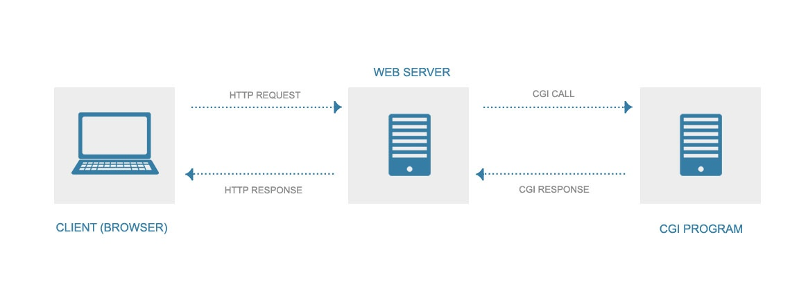
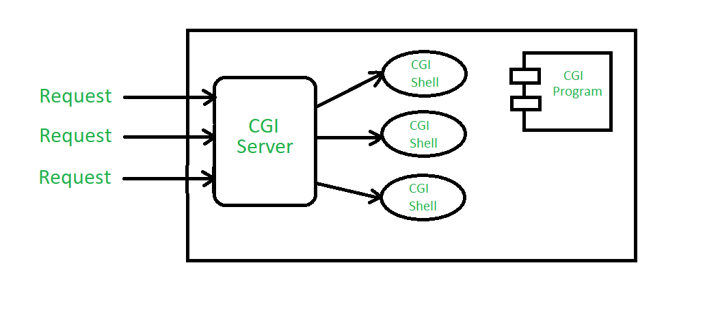
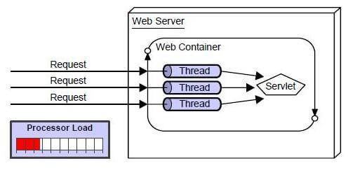

# 웹의 발전

위에서 아래 방향으로 웹이 발전되었습니다.

## 웹 서버와 웹 클라이언트

사용자가 인터넷 환경에서 웹 콘텐츠를 열람하려면 사용자의 PC를 웹 클라이언트로 이용한다. 사용자가 직접 콘텐츠가 보관된 웹 서버에 접근할 수 없기 때문이다.  
따라서 인터넷 환경에서는 웹 서버와 웹 클라이언트 구조를 통해 웹 콘텐츠를 요청(request), 응답(response)한다.  

## URL

방대한 인터넷 환경에서 원하는 자원만 선택 하려면 해당 자원의 정확한 위치를 찾아서 호출해야 한다. 이 작업을 위해 URL(Uniform Resource Locator)이 등장했다. 

## HTTP

URL을 통해 원하는 리소스의 위치를 호출할 수 있게 되었다. 이제 리소스를 어떻게 주고받을 것인가에 대해서 웹 서버와 웹 클라이언트 사이의 합의점을 찾아야 한다. 웹 서버와 웹 클라이언트가 리소스를 주고 받는 방식이 서로 다르면 문제가 발생하기 때문이다. 그래서 파일 전송을 위한 프로토콜(FTP), 이메일 송신을 위한 프로토콜(SMTP) 등이 등장했다. 이후 HTML 전송에 적합한 프로토콜인 HTTP(Hyper Text Markup Language)가 등장했고, 다른 프로토콜에 비해 사용이 간단했기 때문에 널리 이용되었다.  

## CGI

웹 서버의 역할은 준비되어 있는(웹 서버에 저장되어 있는) 콘텐츠를 클라이언트의 요청(request)에 따라 보내주는 일을 한다. 즉 웹 서버는 정적 콘텐츠만 제공한다.

인터넷의 대중화에 따라 사용자 요청 및 응답에 따른 동적 콘텐츠 제공 기술이 필요해졌다. 하지만 서버에 저장된 콘텐츠만 제공할 수 있는 웹 서버로 동적 콘텐츠 제공 기술을 구현하기 어려웠다. 이 때 등장한 것이 CGI(Common Gateway Interface)이다.  

CGI는 웹 서버가 클라이언트로부터 받은 요청을 웹 서버상에서 작동하는 프로그램에 보낸다. 프로그램은 요청을 참조해 HTML을 생성한 다음 웹 서버에 돌려보낸다. 그러면 웹 서버는 프로그램으로부터 받은 HTML을 마치 미리 준비되어 있었다는 듯이 웹 클라이언트에게 보내는 것이다. 

CGI를 통해 사용자 입력에 따라 다양한 처리를 하는 애플리케이션을 제작할 수 있게 되었다. 게시판 및 쇼핑몰 시스템 구현이 가능해진 것이다. 이것이 웹 애플리케이션의 시작이다.  

CGI를 이용한 웹 애플리케이션은 문제가 있었다.  
요청을 받을 때마다 프로그램을 실행한다.(CGI는 사용자 요청에 따라 별도의 프로세스를 생성한다) 즉 한 번에 하나씩만 요청을 처리할 수 있었다. 사용자의 요청이 증가할수록 웹 서버의 부하가 증가하기 때문에 웹 페이지에 접속했는데도 화면에 표시되지 않는 등의 사태가 벌어질 수 있다.

## Servlet

Servlet은 Java로 만들어진 HTML 등의 웹 콘텐츠를 생성하기 위한 프로그램이다. 

Servlet은 기본적으로 CGI와 같은 개념이지만 콘텐츠를 생성하는 언어가 Java이며 객체지향을 지원하기 때문에 대규모 애플리케이션 개발에 적합하다. 그리고 웹 서버와 동일한 프로세스 속에서 콘텐츠를 생성하는 프로그램이 작동하기 때문에 CGI처럼 매번 새로운 프로세스를 기동할 필요가 없어 비교적 고속으로 작동한다. 

**CGI**

**Servlet**

## Servlet의 문제점

Servlet은 Java의 출력 명령을 사용해서 HTML의 문자열을 출력하는 방식을 사용한다.  
이 방식은 프로그램 디자인 수정 등과 같은 HTML 유지보수가 어렵다. Java를 통한 구현과 HTML을 통한 출력을 동시에 신경써야 하기 때문이다.
이 문제를 조금이라도 개선하기 위해 JSP(Java Server Pages)가 등장했다.

## JSP

JSP는 HTML 내부에서 동적으로 출력하고 싶은 부분을 Java 언어를 사용한 스크립틀릿(Scriptlet)을 통해 표현한다.  

규모가 큰 웹 사이트의 경우 외부 디자인을 담당하는 사람(HTML을 작성)과 내부 동작을 구현하는 사람(Java를 사용하는 사람)으로 나뉘는 경우가 있는데, JSP를 사용하면 디자이너는 HTML에, 내부 구현을 하는 사람은 Java 작성에만 집중할 수 있다.  

## Servlet, JSP의 한계점

대규모의 복잡한 웹 애플리케이션을 개발하는데 Servlet, JSP는 명확한 한계점을 가진다. 코딩 분량이 많고, 그렇기 때문에 개발 시간이 오래 걸리고, 개발 이후에 새로운 기능을 추가하는 등의 유지보수 작업도 쉽지 않기 때문이다.  

## 프레임워크의 등장

대규모 애플리케이션을 효율적으로 개발하기 위해 프레임워크가 등장했다.  
프레임워크는 애플리케이션 구현 시 반복되는 작업에 대한 기본 틀을 제시하고, 자주 이용되는 코드를 라이브러리 형태로 제공한다. 개발자는 이를 바탕으로 자신이 원하는 방향으로 애플리케이션을 개발하면 된다. 

# 참고
* [프로가 되기 위한 웹 기술 입문](http://www.yes24.com/Product/Goods/6721651)