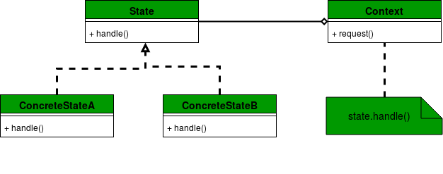

# State 패턴

상태(State) 패턴은 객체가 내부 상태에 따라 동작을 변경해야 할 때 사용한다.  
객체의 특정 상태를 클래스로 선언하고, 클래스에서는 해당 상태에서 할 수 있는 행위들을 메소드로 정의한다.



- Context : 클라이언트가 상호작용하는 로직을 정의한다. 객체의 현재 상태를 정의하는데 사용되는 구체적인 상태 객체(ConcreteState)에 대한 참조를 유지한다.
- State : 각각의 구체적인 상태 객체의 행위를 선언하는(구현하는) 인터페이스를 정의한다.
- ConcreteState : State에서 정의된 메소드 구현 제공.

객체의 상태 변경은 일반적으로 if-else 조건문을 통해 수행된다.  
State 패턴을 사용하면 좀 더 구조화되고, 결합도가 낮은 구문을 작성할 수 있다.  

# 예시

알람(alert) 상태에 따라 휴대폰 모드를 진동(vibration) 또는 무음(silent)로 바꾸는 코드를 구현한다.  

## State

```
public interface MobileAlertState {
    public void alert(AlertStateContext ctx);
}

```

## Context

```
public class AlertStateContext {
    private MobileAlertState currentState;

    public AlertStateContext() {
        currentState = new Vibration();
    }

    public void setState(MobileAlertState state) {
        currentState = state;
    }

    public void alert() {
        currentState.alert(this);
    }
}
```

## ConcreteState

```
public class Vibration implements MobileAlertState{

    @Override
    public void alert(AlertStateContext ctx) {
        System.out.println("vibration");
        
    }
    
}

public class Silent implements MobileAlertState{

    @Override
    public void alert(AlertStateContext ctx) {
        System.out.println("silent");
        
    }
    
}
```

## 실행

```
public class Client {
    public static void main(String[] args) {
        AlertStateContext stateContext = new AlertStateContext();
        stateContext.alert();
        stateContext.setState(new Silent());
        stateContext.alert();
        stateContext.setState(new Vibration());
        stateContext.alert();
    }
}

결과)
vibration
silent
vibration
```

# State 패턴 사용의 이점

- 다형적(polymorphic) 동작을 쉽게 구현할 수 있으며, 원하는 동작을 쉽게 추가할 수 있다.
- State 패턴에서 객체의 행위는 그 상태의 기능의 결과이며, 행위는 상태에 따라 런타임에서 변경된다. 따라서 if-else, switch-case와 같은 조건문에 대한 종속되지 않는다.
- State 패턴은 상태에 대한 세부 행위를 구체적인 상태 객체(ConcreteState)에서 구현한다. 즉 상태별 동작이 한 위치에서 구현되기 때문에 각 모듈이 독립적인 기능을 수행하는 정도를 나타내는 응집도(cohesion)가 높다고 할 수 있다.

# 출처
* [GeeksforGeeks](https://www.geeksforgeeks.org/state-design-pattern/)